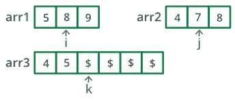
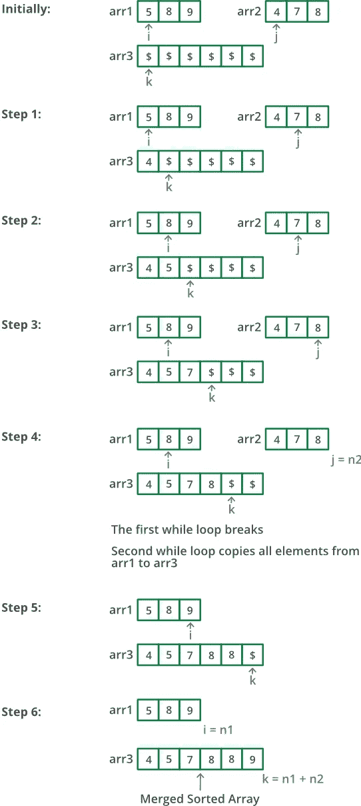

# 在 Python 中合并两个排序后的数组

> 原文：<https://levelup.gitconnected.com/merge-two-sorted-arrays-in-python-a6851f8ff2e2>



# 问题

给定两个排序的数组，将它们合并成一个排序的数组。

## 例子

*   示例 01

```
Input: arr1 = [3, 5, 6, 10], arr2 = [1, 2, 7, 8, 11, 12]
Output: arr3 = [1, 2, 3, 5, 6, 7, 8, 10, 11, 12]
```

*   示例 02

```
Input: arr1 = [1, 3, 4, 5], arr2 = [2, 4, 6, 8]
Output: arr3 = [1, 2, 3, 4, 4, 5, 6, 8]
```

*   示例 03

```
Input: arr1 = [5, 8, 9], arr2 = [4, 7, 8]
Output: arr3 = [4, 5, 7, 8, 8, 9]
```

# 解决方案 01

## 伪代码

1.  通过连接`arr1`和`arr2`创建一个数组`arr3`。
2.  排序`arr3`。

## 源代码

```
def merge(num1, num2):
    arr3 = num1+num2
    arr3.sort()
    return arr3

arr1 = [3, 5, 6, 10]
arr2 = [1, 2, 7, 8, 11, 12]
assert merge(arr1, arr2) == [1, 2, 3, 5, 6, 7, 8, 10, 11, 12]
arr1 = [1, 3, 4, 5]
arr2 = [2, 4, 6, 8]
assert merge(arr1, arr2) == [1, 2, 3, 4, 4, 5, 6, 8]
arr1 = [5, 8, 9]
arr2 = [4, 7, 8]
assert merge(arr1, arr2) == [4, 5, 7, 8, 8, 9]
```

## 时间和空间复杂性

*   **时间复杂度** : O((N+M)log(N+M))。给定 N 是`arr1`中的元素数，M 是`arr2`中的元素数。
*   **空间复杂度** : O(N+M)

# 解决方案 02

## 伪代码



致谢:GeeksForGeeks

1.  创建一个长度/大小为`arr1` + `arr2`的数组`arr3`。
2.  同时移动`arr1`和`arr2`。

*   在`arr1`和`arr2`中选取较小的当前元素，将这个较小的元素复制到`arr3`中的下一个位置，并在`arr3`和被选取元素的数组中向前移动。

3.如果`arr1`或`arr2`中有剩余元素，将其复制到`arr3`中。

## 源代码

```
def merge(num1, num2):
    arr3 = [None]*(len(num1)+len(num2))
    i, j, k = 0, 0, 0

    while i < len(arr1) and j < len(arr2):
        if arr1[i] < arr2[j]:
            arr3[k] = arr1[i]
            k += 1
            i += 1
        else:
            arr3[k] = arr2[j]
            k += 1
            j += 1

    while i < len(num1):
        arr3[k] = arr1[i];
        k += 1
        i += 1

    while j < len(num2):
        arr3[k] = arr2[j];
        k += 1
        j += 1

    return arr3

arr1 = [3, 5, 6, 10]
arr2 = [1, 2, 7, 8, 11, 12]
assert merge(arr1, arr2) == [1, 2, 3, 5, 6, 7, 8, 10, 11, 12]
arr1 = [1, 3, 4, 5]
arr2 = [2, 4, 6, 8]
assert merge(arr1, arr2) == [1, 2, 3, 4, 4, 5, 6, 8]
arr1 = [5, 8, 9]
arr2 = [4, 7, 8]
assert merge(arr1, arr2) == [4, 5, 7, 8, 8, 9]
```

## 时间和空间复杂性

*   **时间复杂度** : O(N+M)。给定 N 是`arr1`中的元素数，M 是`arr2`中的元素数。
*   **空间复杂度** : O(N+M)

# 外卖食品

感谢您阅读这个简短的解题问题。如果有人知道更好或更快的时间复杂度来解决这个问题，请随意评论和反馈。和平！✌️