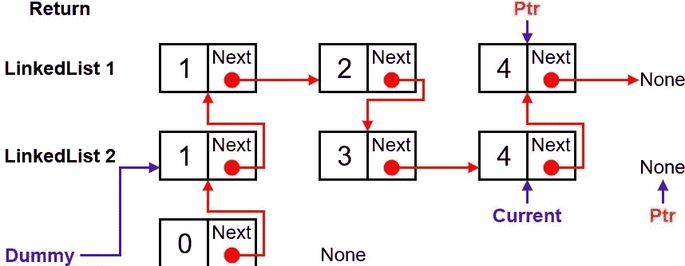
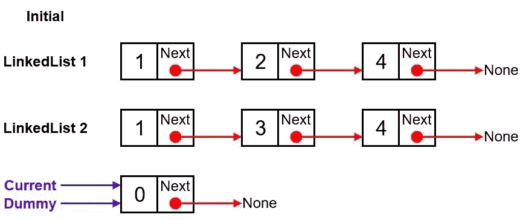
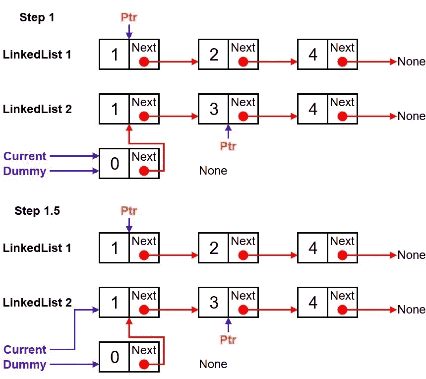
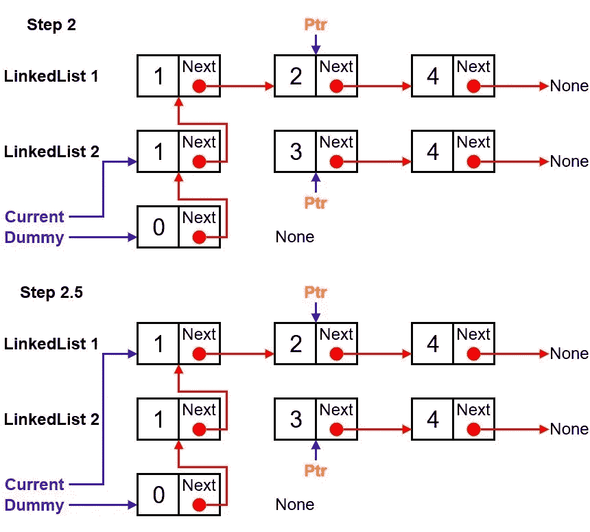
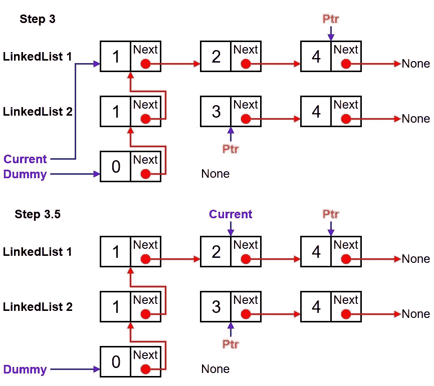
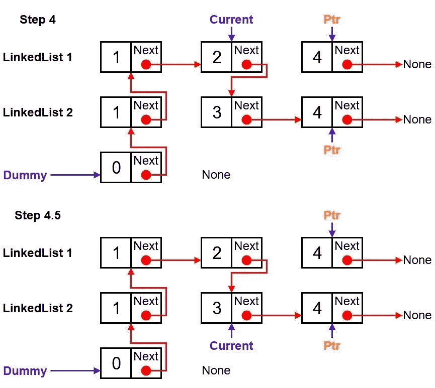
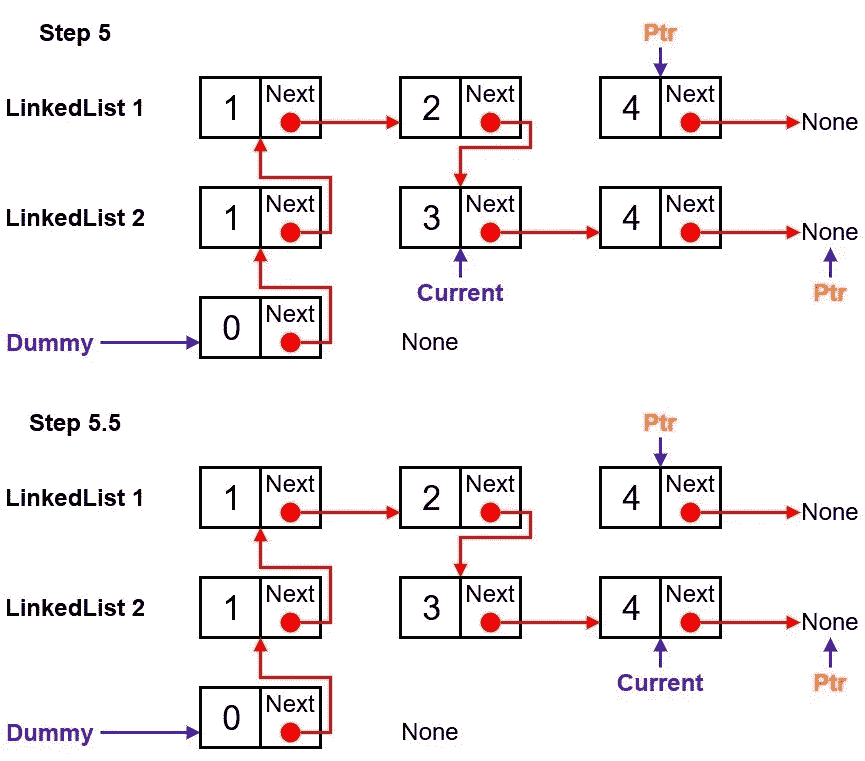
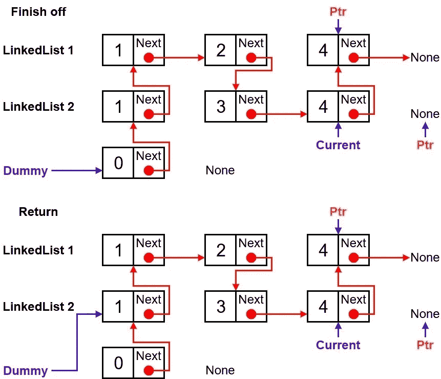

# 合并两个排序链表— Leetcode

> 原文：<https://levelup.gitconnected.com/merge-two-sorted-linked-lists-leetcode-7dd56db5c35a>



# 问题

## 例子

*   **例 01**

```
**Input:** list1 = [1,2,4], list2 = [1,3,4]
**Output:** [1,1,2,3,4,4]
```

*   **例 02**

```
**Input:** list1 = [], list2 = []
**Output:** []
```

*   **例 03**

```
**Input:** list1 = [], list2 = [0]
**Output:** [0]
```

# 算法走查

## 最初的

```
current = dummy = Node()
```

执行源代码后，链表的状态如下所示:



## 迭代 01

```
if ll1.val >= ll2.val:
    current.next = ll2
    ll2 = ll2.next
current = current.next
```

执行源代码后，链表的状态如下所示:



## 迭代 02

```
if ll1.val < ll2.val:
    current.next = ll1
    ll1 = ll1.next
current = current.next
```

执行源代码后，链表的状态如下所示:



## 迭代 03

```
if ll1.val >= ll2.val:
    current.next = ll2
    ll2 = ll2.next
current = current.next
```

执行源代码后，链表的状态如下所示:



## 迭代 04

```
if ll1.val >= ll2.val:
    current.next = ll2
    ll2 = ll2.next
current = current.next
```

执行源代码后，链表的状态如下所示:



## 迭代 05

```
if ll1.val >= ll2.val:
    current.next = ll2
    ll2 = ll2.next
current = current.next
```

执行源代码后，链表的状态如下所示:



## 完成迭代，完成链表的最后一部分并返回

```
if ll1 or ll2:
    current.next = ll1 if ll1 else ll2

return dummy.next
```

执行源代码后，链表的状态如下所示:



# 解决办法

```
class Node:
  def __init__(self, val = 0, next=None): 
    self.val = val
    self.next = next

def MergeTwoLists(ll1, ll2):
    current = dummy = Node()
    while ll1 and ll2:
        if ll1.val < ll2.val:
            current.next = ll1
            ll1 = ll1.next
        else:
            current.next = ll2
            ll2 = ll2.next
        current = current.next

    if ll1 or ll2:
        current.next = ll1 if ll1 else ll2

    return dummy.nextLL1 = Node(1, Node(2, Node(4)))
LL2 = Node(1, Node(3, Node(4)))
ll3 = MergeTwoLists(LL1, LL2)
```

## 时间和空间复杂性

*   时间复杂度:O(N)
*   空间复杂度:O(1)

# 外卖食品

感谢您阅读这个简短的解题问题。如果有人知道更好或更快的时间复杂度来解决这个问题，请随意评论和反馈。和平！✌️