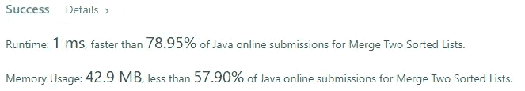

# 合并两个排序列表盲 75 LeetCode 问题

> 原文：<https://levelup.gitconnected.com/merge-two-sorted-lists-blind-75-leetcode-questions-31866b61b31f>


Joshua Hoehne 在 [Unsplash](https://unsplash.com?utm_source=medium&utm_medium=referral) 上拍摄的照片

## 任务描述:

给你两个排序链表的头`list1`和`list2`。

将两个列表合并成一个**排序的**列表。应该通过将前两个列表的节点拼接在一起来制作列表。

返回*合并链表的头*。

**例 1:**


```
**Input:** list1 = [1,2,4], list2 = [1,3,4]
**Output:** [1,1,2,3,4,4]
```

**例 2:**

```
**Input:** list1 = [], list2 = []
**Output:** []
```

**例 3:**

```
**Input:** list1 = [], list2 = [0]
**Output:** [0]
```

**约束:**

*   两个列表中的节点数量都在`[0, 50]`范围内。
*   `-100 <= Node.val <= 100`
*   `list1`和`list2`均按**非降序**排序。

## 推理:

LinkedList 是另一种广泛使用的数据结构。它可以是单键或双键的。


单向链表


双向链表

对于这个特殊的任务，我们可以假设我们使用的是单链表。正如你所看到的，每个链表都由称为链接或节点的小块组成。

链接节点

从上面的图片和代码可以看出，每个链接的节点都存储了到下一个链接节点的链接。第一个连接的节点通常称为头，最后一个称为尾。对于单向链接的版本，我们只能从列表的头到尾遍历，一旦向前，就没有办法返回到前一个节点。双重链接版本允许我们双向遍历，因为每个 ListNode 都存储指向下一个和上一个 list node 的指针。

## 解决方案:

这一次我提供了解决方案的完整代码，我们将讨论它

我们要做的第一件事是创建一个虚拟节点来存储链接到合并链表的头部，正如我前面说过的每个链表都有头部。

我们还需要一个当前节点来存储当前节点的链接，这样我们就可以用它来连接下一个节点

我们遍历这两个列表，直到指向下一个节点的指针不为空。在每一个这样的步骤中，我们都在寻找一个存储了最小值的节点。我们将指针移动到具有最小值的当前节点的 LinkedList 的下一个。最终两者的一个指针都为空。

我们需要做的最后一件事是将 LinkedList 的剩余部分(仍然有一些值)附加到我们当前的指针上，并返回一个新创建的 LinkedList 的头。

上述解决方案具有线性时间复杂度，并且不使用额外的内存(就大 O 符号而言，可以省略额外的指针)



下次 article✌️✌️✌️✌️✌️✌️✌️再见

# 分级编码

感谢您成为我们社区的一员！在你离开之前:

*   👏为故事鼓掌，跟着作者走👉
*   📰查看[级编码出版物](https://levelup.gitconnected.com/?utm_source=pub&utm_medium=post)中的更多内容
*   🔔关注我们:[推特](https://twitter.com/gitconnected) | [LinkedIn](https://www.linkedin.com/company/gitconnected) | [时事通讯](https://newsletter.levelup.dev)

🚀👉 [**软件工程师的顶级工作**](https://jobs.levelup.dev/jobs?utm_source=pub&utm_medium=post)