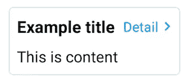
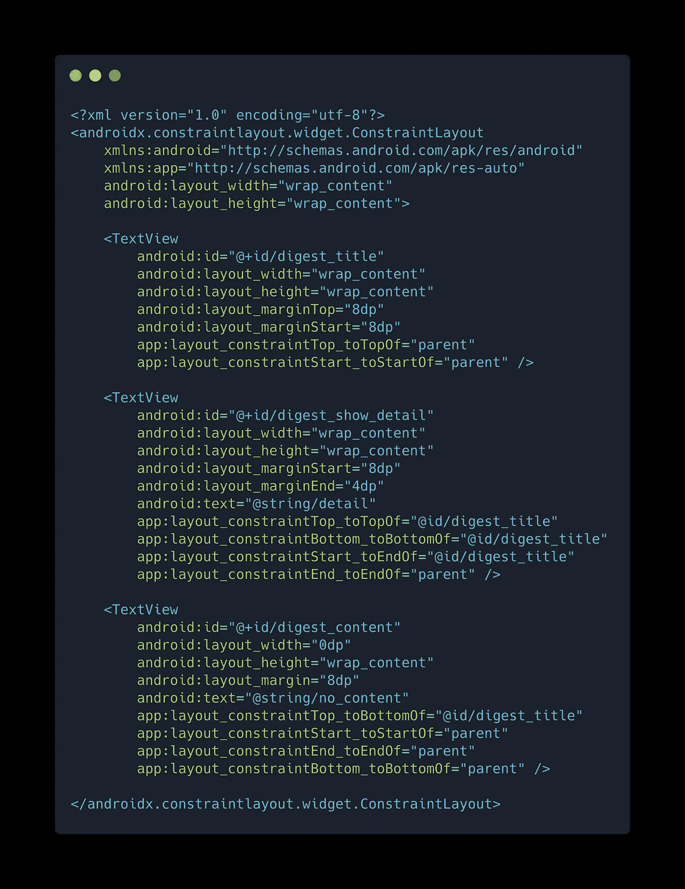
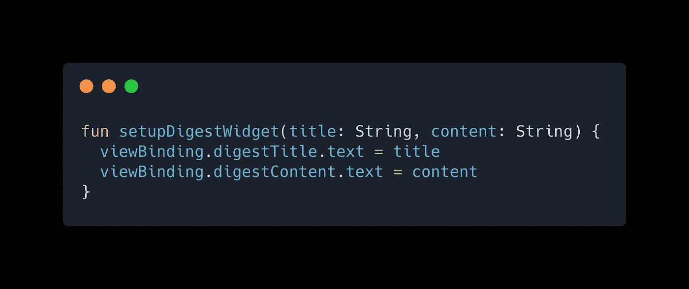
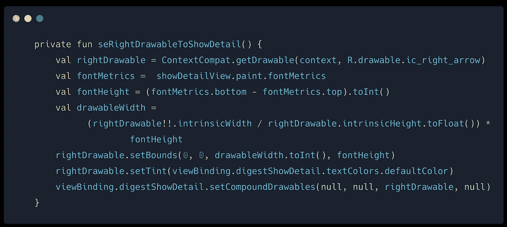
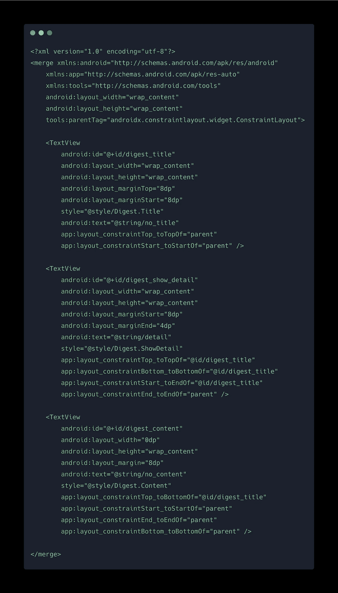
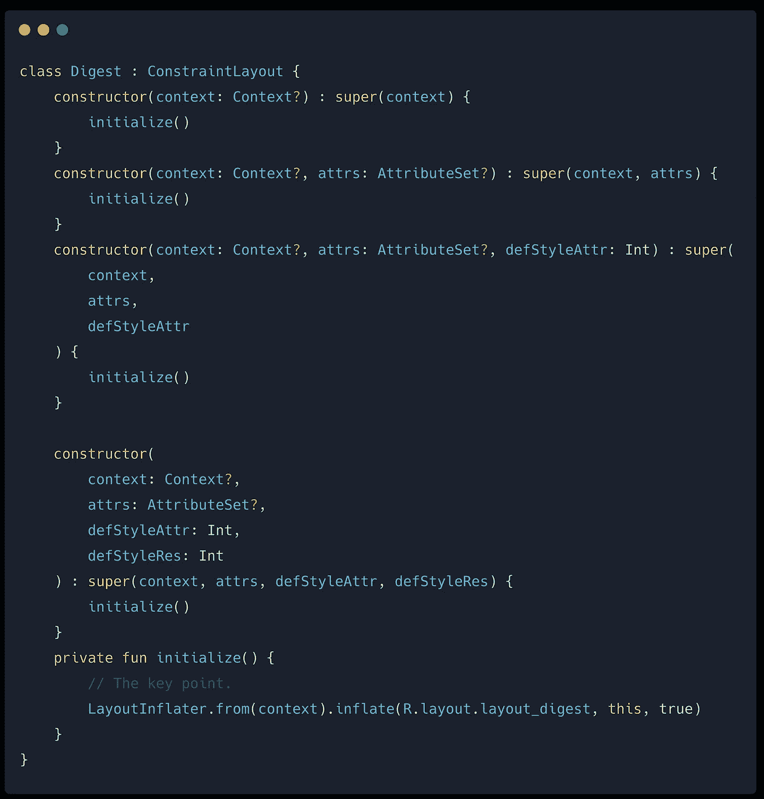
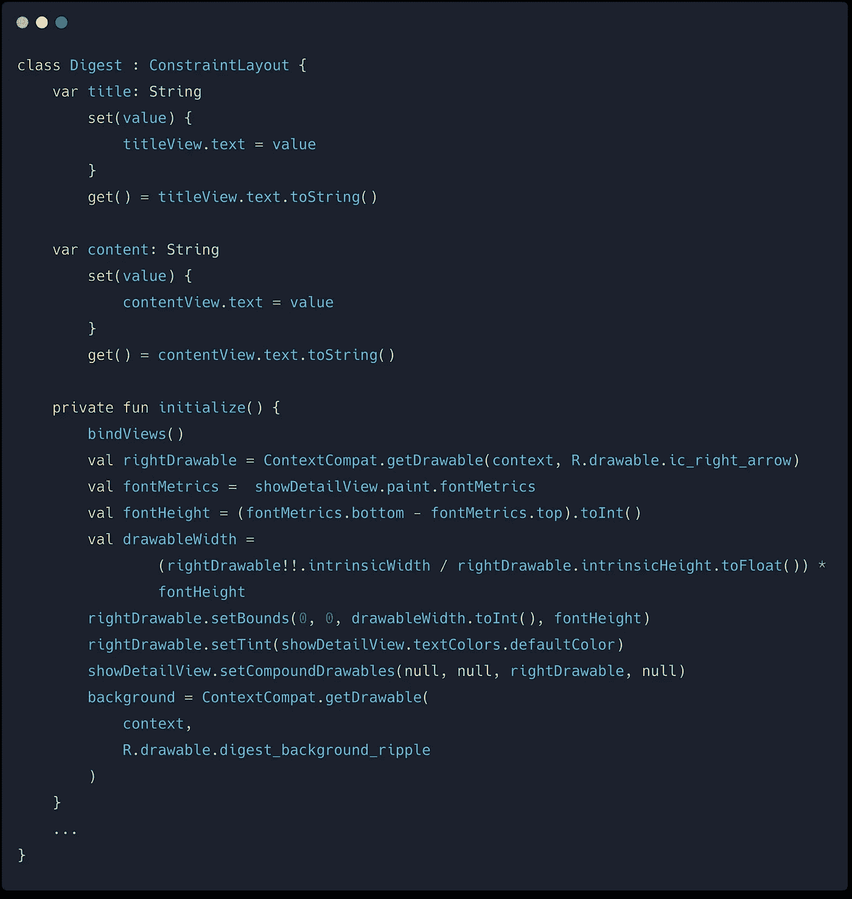

# 使用<merge>和自定义视图组</merge>重构您的活动或片段

> 原文：<https://levelup.gitconnected.com/refactoring-your-activity-or-fragment-by-using-merge-and-custom-viewgroup-4c7de7c2be71>

在 Android 应用程序中，`Activity`或`Fragment`将是单个页面的基本组件。您可以将其他 UI 控件放入一个布局 xml 中，并将其扩展到一个`Activity`或`Fragment`中。其中一个问题是，如果用户界面很复杂，`Activity`或`Fragment`也可能包含复杂的用户界面逻辑。一般情况下，一个页面由许多基本的 UI 控件组成，如`TextView`、`Button`、`ImageView`等。你需要在`Activity`或`Fragment`中实现演示逻辑，甚至在*控制器*、*演示器*或*视图模型*中。

# 简单的例子

假设我们想要实现这样一个简单的用户界面



一个简单的摘要用户界面

这个小部件在一个视图组中包含 3 个文本视图。所以我们可以像这样用 xml 声明 UI 布局。



摘要小部件的布局 xml

然后我们可以在`Fragment`中添加 UI 设置功能



感谢新的[视图绑定](https://developer.android.com/topic/libraries/view-binding)，我们不需要自己使用`findViewById`。然后我们想在`Detail`文本视图的右边添加右箭头图标，并分配相同的颜色和调整尺寸。所以我们增加了一个函数来做这件事。



将右边的 drawable 设置为 TextView

如您所见，这在 Android 开发中并不罕见。如果 UI 包含很多小部件，片段会变得更大，因为它包含了很多表示逻辑。此外，如果我们想在另一个片段中重用 UI 小部件，这将是困难的。

我们能有更好的解决方案吗？其中之一是我们可以创建一个定制的视图组，并使用带有`<merge>`标签的布局文件。因此，我们可以将表示逻辑移到自定义视图组中。

# <merge>诡计</merge>

根据[公文](https://developer.android.com/training/improving-layouts/reusing-layouts#Merge)，`<merge>`通常与`<include>`标签一起使用。`<merge>`的目的是消除视图层次中多余的视图组。实际上，我们还可以创建一个自定义视图组，并用`<merge>`扩展布局 xml。我们来看看怎么做。

首先，我们将原始 xml 的根标签改为`<merge>`，如下所示。



将约束布局替换为

然后我们创建一个类来扩展`ConstraintLayout`



关键是我们膨胀 xml 并附加到根视图组。

```
LayoutInflater
    .from(*context*)
    .inflate(R.layout.*layout_digest*, this, true)
```

然后我们有一个复合 UI 小部件，我们也可以直接使用它的另一个 xml 布局！

```
<Digest 
    android:id="@+id/digest"
    android:layout_width="wrap_content"
    android:layout_height="wrap_content" />
```

接下来，我们将提供的函数移到新类中，并创建 2 个字符串属性



最后，我们可以将所有呈现的代码移动到自定义视图组中，并直接在`Fragment`或`Activity`中使用。

```
// In Fragment
viewBinding.digest.title = "This is title"
viewBinding.digest.content = "This is content"
```

# 利弊

通过在 xml 中使用`<merge>`可以帮助我们从`Fragment`或`Activity`中提取呈现的代码。我们可以更加关注业务逻辑。当然这不是一个完美的解决方案。这是我所知道的利弊。

## 赞成的意见

*   我们可以将属于**【视图】**的展示逻辑移动到适当的位置
*   降低`Fragment`或`Activity`的复杂度
*   UI 可以在其他地方重用。
*   如果不喜欢用`Fragment`，可以用这一招替换`Fragment`。

## 骗局

*   您可以创建许多自定义小部件
*   在 xml 中分配的某些属性可能不起作用。这取决于你现在如何初始化`ViewGroup`

就是这样！如果您有任何反馈，请不要犹豫留下您的评论。