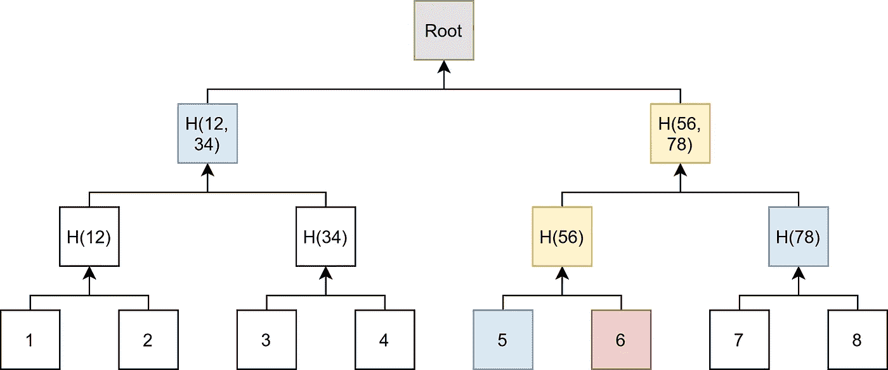

# Merkle 树

> 原文：<https://levelup.gitconnected.com/merkle-trees-e4fdaeaa3094>

## 概念和应用-简单明了！



Merkle 树是一种二叉树，数据位于叶节点。所有内部节点都是散列。图片由马丁·托马斯提供。

Merkle 树是在对等网络中使用的数据结构。它是一棵二叉树，其中内部节点的值是其叶节点的散列。该树的根节点被称为“Merkle 根”或“根散列”。

关于定义就说这么多。对我来说，知道技术解决的问题对真正理解它总是有帮助的。

# 比特流

如何通过随机引入错误的网络发送大量数据？当你只是发送一个数据流时，你不能保证它的完整性。

第一个改进是添加散列函数的值:

[](/the-3-applications-of-hash-functions-fab1a75f4d3d) [## 哈希函数的 3 个应用

### 它们是什么，有哪些选择，以及它们为什么重要

levelup.gitconnected.com](/the-3-applications-of-hash-functions-fab1a75f4d3d) 

如果下载文件的哈希值不等于预期的哈希值，您只需再次下载文件。

很明显，这是低效的，因为错误很少发生。很有可能，文件的大部分都是完全没问题的。也许只有一个比特改变了它的值。你想下载的越少越好，只修复坏掉的部分。


一个分成 8 块的大文件。2 号块坏了，其余的都好。图片由马丁·托马斯提供。

下一个想法是搭积木。你存储每个块的散列。当你下载文件时，你首先下载一个文件头。报头包含元信息，例如块的总数、每个块的散列和元数据本身的散列。如果元数据块损坏，您需要重新下载它。然后你下载每个块并验证它。如果一个块被破坏，该块将被再次下载。

现在的问题是哪种块大小最有意义。块越小，出错时下载的数据就越少。但是块越多，需要存储的元数据就越多。举个最极端的例子:每一位都有自己的哈希值。典型散列值有 256 位。这意味着总大小将增加 257 倍！换句话说:你可以下载文件 257 次。

假设我们要下载的文件大小为 4 GiB。然后，下表给出了块的数量和您必须下载的额外大小。如果您为一个 32 字节的散列创建 32 字节大小的块，您需要下载双倍的数据。这还意味着 100%:

```
block size     :       blocks  additional download size
-------------------------------------------------------
        32 Byte:  134,217,728  100.00%
       128 Byte:   33,554,432   25.00%
       512 Byte:    8,388,608    6.25%
         1 KiB :    4,194,304    3.12%
       256 KiB :       16,384    0.01%
         1 MiB :        4,096    0.00%
```

BitTorrent 的 torrent 文件本质上是包含以下信息的字典:

```
{
 "announce": "tracker url",
 "info": {
  "length": "file size in bytes",
  "name": "suggested file name",
  "piece length": "typically 256 KiB",
  "pices": [
   "sha-1 hash of block #1",
   "sha-1 hash of block #2",
   "sha-1 hash of block #3"
  ]
 }
}
```

总结:块的哈希值列表可以大大加快通过不可靠网络下载文件的速度。

# 包含证明

假设您想要显示一段数据是您的数据结构的一部分。这对于 Merkle 树来说很容易。


爱丽丝想向鲍勃证明红色方块“6”包含在 Merkle 树中。鲍勃知道绿色的根节点。Alice 提供了 3 个蓝色节点 H(12，34)、H(78)、“5”和红色节点“6”。然后，鲍勃计算了两个黄色节点。鲍勃永远不必看到白色的节点。马丁·托马斯的形象。

Merkle 树允许它证明交易被包括在内。假设爱丽丝想向鲍勃证明交易 T 发生了。为此，她提供:

*   交易本身，鲍勃可以很容易地为其创建一个散列。
*   计算根散列所缺少的所有散列

然后，Bob 必须验证 Merkle 根是否等于他的根。他还需要对事务进行哈希处理，并将所有哈希构建到 Merkle 根。由于加密哈希函数使得不可能找到哈希函数来伪造图像([碰撞-抗攻击性](/the-3-applications-of-hash-functions-fab1a75f4d3d))，所以 Bob 不必拥有所有数据。知道使用哪个根就足够了。

提供的哈希(蓝色节点)被称为 **Merkle 证明**。您证明了数据属于 Merkle 树。如果你想看另一个例子，看看[贝拉瓦迪·普拉哈拉德](https://medium.com/u/a4280b6f29b4?source=post_page-----e4fdaeaa3094--------------------------------)文章[墨克尔校样解释](https://medium.com/crypto-0-nite/merkle-proofs-explained-6dd429623dc5)。

在比特币的上下文中，这被称为**简化支付验证(SPV)** 。这是第八章的[比特币纸](https://bitcoin.org/bitcoin.pdf)，或者 [SVP 校样解释](https://medium.com/coinmonks/spv-proofs-explained-f38f8bb8f580)由[阿尔伯特·阿塞布龙](https://medium.com/u/eee428731f69?source=post_page-----e4fdaeaa3094--------------------------------)。

# 比特币如何使用默克莱树？

每个块都包含一个 Merkle 事务树。由于各种原因，比特币块的大小限制为 4 MB。只有 Merkle Trees 根哈希用于哈希块。这意味着比特币节点可以丢弃相当多的数据，但仍然可以计算相同的哈希。

# Merkle 树的应用

*   **Git** 使用哈希树来存储它的数据([来源](https://git-scm.com/book/en/v2/Git-Internals-Git-Objects))。如果你想理解为什么要阅读《T4 走向再现性》:马丁·卡瓦拉的《git》
*   **数据库系统** : Apache Cassandra 使用 Merkle 树来检测副本中的不一致性([来源](https://docs.datastax.com/en/archived/cassandra/3.0/cassandra/operations/opsRepairNodesManualRepair.html)，[视频](https://www.youtube.com/watch?v=1Sz_K8UID6E))
*   **比特币& IPFS，以及** [**Storj**](https://storj.io/storj2014.pdf) :存储数据的核心数据结构
*   以太坊也使用 Merkle 树，但与比特币的类型不同。以太坊用的是 Merkle Patricia Trie。

# 下一步是什么

本文是我关于区块链系列的一部分:

*   第一部分:[区块链介绍](https://medium.com/coinmonks/the-blockchain-473aac352e5)
*   第二部分:[哈希函数的 3 个应用](/the-3-applications-of-hash-functions-fab1a75f4d3d)
*   第 3 部分:Merkle 树

我接下来要考虑的主题:

*   默克尔帕特里夏试图
*   公钥加密和 RSA:公钥和私钥，数字签名，陷门函数。它是什么，为什么如此重要
*   工作证明:如何工作，难度如何，比特币/以太/恒星有什么用途。
*   智能合约:它们是什么以及它们如何工作；例如以以太为例
*   [首次发行硬币](https://en.wikipedia.org/wiki/Initial_coin_offering) (ICO)
*   比特币共识算法
*   比特币和网络:人们如何联系？
*   比特币钱包
*   点对点的东西:八卦协议是如何工作的

让我知道你对什么感兴趣！

# 请参见

*   Tara Vancil:[Merkle Trees 如何实现分散式网络！](https://www.youtube.com/watch?v=YIc6MNfv5iQ)，YouTube 上 2017。
*   [gaur av Sen](https://medium.com/u/5874217ef543?source=post_page-----e4fdaeaa3094--------------------------------):[Merkle Tree with real-world examples](https://www.youtube.com/watch?v=qHMLy5JjbjQ)，YouTube 上 2019。