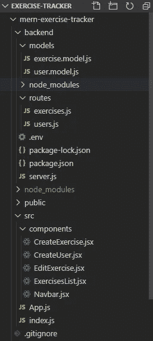
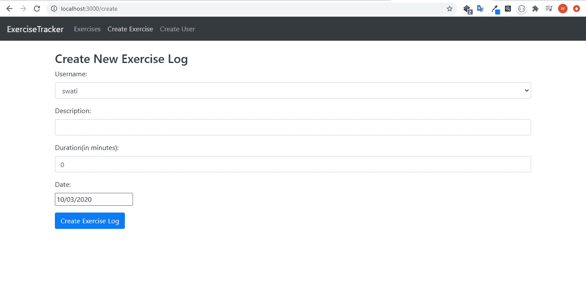
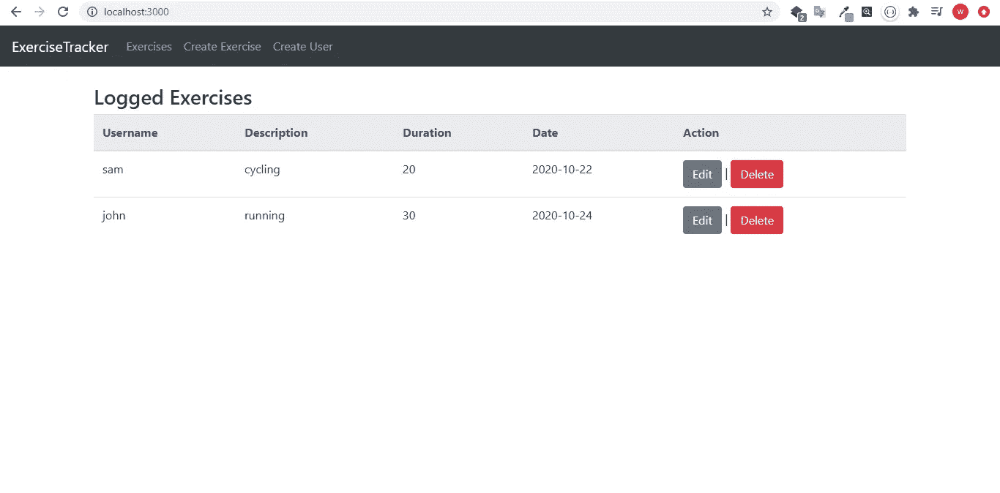

# MERN 堆栈积垢操作

> 原文：<https://levelup.gitconnected.com/mern-stack-crud-operations-2a95448de78c>

github:-[https://github.com/swati1707/MERN-stack-CRUD-operations](https://github.com/swati1707/MERN-stack-CRUD-operations)

这个博客解释了如何在 MERN 堆栈中执行基本的 CRUD 操作。

*   **MongoDB** :面向文档的非 SQL 数据库，用于存储应用程序数据。
*   **NodeJS** :它是一个开源、跨平台、后端的 JavaScript 运行时环境，在 web 浏览器之外执行 JavaScript 代码
*   express js:node . js 的后端 web 应用框架
*   **ReactJS** :用于构建 UI 组件，创建单页面 web 应用程序的用户界面。

让我们开始吧…

第一步:-创建一个帐户并登录到 mongoDB Atlas:-[https://www.mongodb.com/cloud/atlas](https://www.mongodb.com/cloud/atlas)。然后构建一个集群，你会得到一个连接字符串。我们的应用程序将有两个集合，即**练习**和**用户**。

**步骤 2:-创建一个 react 应用**

运行以下命令:

```
npx create-react-app mern-exercise-tracker
```

首先，让我们创建后端，然后我们再回到前端。

**步骤 3:-创建后端。**

为后端创建新目录，并运行以下命令:

```
mkdir backend
cd backend
npm init -y
```

这将是文件夹结构:



现在安装以下依赖项:

```
npm install express cors mongoose dotenv nodemon
```

步骤 4:-创建服务器

创建文件 server.js 并添加以下代码:

```
const express = require('express');const cors = require('cors');const mongoose = require('mongoose');require('dotenv').config();const app = express();const port = process.env.PORT || 5000;app.use(cors());app.use(express.json());const uri = process.env.ATLAS_URI;mongoose.connect(uri, { useNewUrlParser: true, useCreateIndex: true, useUnifiedTopology: true });const connection= mongoose.connection;connection.once('open', () => {console.log("Mongodb database connection established successfully !!");})const exercisesRouter = require('./routes/exercises');const usersRouter = require('./routes/users');app.use('/exercises', exercisesRouter);app.use('/users', usersRouter);app.listen(port, () => {console.log(`Server is running on port: ${port}`);});
```

现在运行命令:

```
nodemon server
```

接下来创建一个名为。env 并添加您将从 mongoDB Atlas 中获得的连接字符串。

这将创建一个服务器并建立与 mongoDB 的连接。

**步骤 5:-创建模式**

创建一个名为 models 的新目录，其中包含两个文件，即:- exercise.model.js 和 user.model.js，用于练习和用户实体。

**exercise.model.js**

```
const mongoose = require('mongoose');const Schema = mongoose.Schema; const exerciseSchema = new Schema({username: {type: String, required: true},description: {type: String, required: true},duration: {type: Number, required: true},date: {type: Date,required: true}}, {timestamps: true});const Exercise = mongoose.model('Exercise', exerciseSchema);module.exports = Exercise;
```

练习模式将有四个字段以及如上所述的变量。

**user.model.js**

```
const mongoose = require('mongoose');const Schema = mongoose.Schema;const userSchema = new Schema({username: {type: String,required: true,unique: true,trim: true,minlwngth: 3},}, {timestamps: true});const User = mongoose.model('User', userSchema);module.exports = User;
```

正如您在上面的代码中看到的那样，用户模式将只有带一些验证的字段。

**步骤 6:-积垢操作逻辑**

创建一个名为 routes 的新目录。它将包含两个文件

**users.js**

```
const router = require('express').Router();let User = require('../models/user.model');router.route('/').get((req,res) => {User.find().then(users => res.json(users)).catch(err => res.status(400).json('Error: ' +err));});router.route('/add').post((req,res) => {const username = req.body.username;const newUser = new User({username});newUser.save().then(() => res.json('User added!')).catch(err => res.status(400).json('Error: '+err));});module.exports = router;
```

该文件将包含检索用户列表和添加新用户的逻辑。

**exercises.js**

```
const router = require('express').Router();let Exercise = require('../models/exercise.model');router.route('/').get((req,res) => {Exercise.find().then(exercises => res.json(exercises)).catch(err => res.status(400).json('Error: ' +err));});router.route('/add').post((req,res) => {const username = req.body.username;const description = req.body.description;const duration = Number(req.body.duration);const date = Date.parse(req.body.date);const newExercise = new Exercise({username, description, duration, date});newExercise.save().then(() => res.json('Exercise added!')).catch(err => res.status(400).json('Error: '+err));});router.route('/:id').get((req,res) => {Exercise.findById(req.params.id).then(exercise => res.json(exercise)).catch(err => res.status(400).json('Error: '+err));});router.route('/:id').delete((req,res) => {Exercise.findByIdAndDelete(req.params.id).then(exercise => res.json('Exercise deleted')).catch(err => res.status(400).json('Error: '+err));});router.route('/update/:id').post((req,res) => {Exercise.findById(req.params.id).then(exercise => {exercise.username = req.body.username;exercise.description = req.body.description;exercise.duration = Number(req.body.duration);exercise.date = Date.parse(req.body.date);exercise.save().then(() => res.json('Exercise updated !')).catch(err => res.status(400).json('Error: '+err));}).catch(err => res.status(400).json('Error: '+err));});module.exports = router;
```

该文件包含用于检索练习列表以及创建新练习、更新和删除练习的逻辑。

**第 7 步:-创建前端。**

先说 App.js 文件。

**App.js**

```
import React from 'react';import { BrowserRouter, Route } from "react-router-dom";import Navbar from "./components/Navbar";import ExercisesList from "./components/ExercisesList";import EditExercise from "./components/EditExercise";import CreateExercise from "./components/CreateExercise";import CreateUser from "./components/CreateUser";function App() {return (<BrowserRouter><Navbar /><br /><Route exact path="/" component={ExercisesList} /><Route path="/edit/:id" component={EditExercise} /><Route path="/create" component={CreateExercise} /><Route path="/user" component={CreateUser} /></BrowserRouter>);}export default App;
```

这个应用程序将导入所有需要的组件。

首先让我们创建导航条组件。

**Navbar.js**

```
import React, { Component } from "react";import { Link } from "react-router-dom";class Navbar extends Component { render() {return (<nav className="navbar navbar-dark bg-dark navbar-expand-lg"><Link to="/" className="navbar-brand">ExerciseTracker</Link><div className="collapse navbar-collapse"><ul className="navbar-nav"><li className="navbar-item"><Link to="/" className="nav-link">Exercises</Link></li><li className="navbar-item"><Link to="/create" className="nav-link">Create Exercise</Link></li><li className="navbar-item"><Link to="/user" className="nav-link">Create User</Link></li></ul></div></nav>);}}export default Navbar;
```

有四个主要组成部分，即:-创建练习，创建用户，编辑练习，练习列表。

**CreateExercise.jsx**

```
import React, { Component } from 'react';import axios from "axios";import DatePicker from "react-datepicker";import "react-datepicker/dist/react-datepicker.css";class CreateExercise extends Component {constructor(props){super();this.state = {username: "",description: "",duration: 0,date: new Date(),users: []}this.onChangeUsername = this.onChangeUsername.bind(this);this.onChangeDescription = this.onChangeDescription.bind(this);this.onChangeDuration = this.onChangeDuration.bind(this);this.onChangeDate = this.onChangeDate.bind(this);this.onSubmit = this.onSubmit.bind(this);}componentDidMount() {axios.get('http://localhost:5000/users/').then(response => {if(response.data.length > 0) {this.setState({users: response.data.map(user => user.username),username: response.data[0].username});}})}onChangeUsername(e) {this.setState({ username: e.target.value})}onChangeDescription(e) {this.setState({ description: e.target.value})}onChangeDuration(e) {this.setState({ duration: e.target.value})}onChangeDate(date) {this.setState({ date: date})}onSubmit(e) {e.preventDefault();const exercise = {username: this.state.username,description: this.state.description,duration: this.state.duration,date: this.state.date}console.log(exercise);axios.post('http://localhost:5000/exercises/add', exercise).then(res => console.log(res.data));window.location = "/";}render() {return (<div className="container"><h3>Create New Exercise Log</h3><form onSubmit={this.onSubmit}><div className="form-group"><label>Username: </label><select ref="userInput"requiredclassName="form-control"value={this.state.username}onChange={this.onChangeUsername} >{this.state.users.map(function(user) {return <option key={user} value={user}>{user}</option>;})}</select></div><div className="form-group"><label>Description: </label><inputtype="text" requiredclassName="form-control"value={this.state.description}onChange={this.onChangeDescription}/></div><div className="form-group"><label>Duration(in minutes): </label><inputtype="text"className="form-control"value={this.state.duration}onChange={this.onChangeDuration}/></div><div className="form-group"><label>Date: </label><div><DatePickerselected={this.state.date}onChange={this.onChangeDate}/></div></div><div className="form-group"><input type="submit" value="Create Exercise Log" className="btn btn-primary" /></div></form></div>);}}export default CreateExercise;
```

**CreateUser.jsx**

```
import React, { Component } from 'react';import axios from "axios";class CreateUser extends Component {constructor(props){super();this.state = {username: ""}this.onChangeUsername = this.onChangeUsername.bind(this);this.onSubmit = this.onSubmit.bind(this);}onChangeUsername(e) {this.setState({ username: e.target.value})}onSubmit(e) {e.preventDefault();const user = {username: this.state.username,}console.log(user);axios.post('http://localhost:5000/users/add', user).then(res => console.log(res.data));this.setState({username: ''})} render() {return (<div className="container"><h3>Create New User</h3><form onSubmit={this.onSubmit}><div className="form-group"><label>Username: </label><inputtype="text" requiredclassName="form-control"value={this.state.username}onChange={this.onChangeUsername}/></div><div className="form-group"><input type="submit" value="Create User" className="btn btn-primary" /></div></form></div>);}}export default CreateUser;
```

**edit execution . jsx**

```
import React, { Component } from 'react';import axios from "axios";import DatePicker from "react-datepicker";import "react-datepicker/dist/react-datepicker.css";class EditExercise extends Component {constructor(props){super();this.state = {username: "",description: "",duration: 0,date: new Date(),users: []}this.onChangeUsername = this.onChangeUsername.bind(this);this.onChangeDescription = this.onChangeDescription.bind(this);this.onChangeDuration = this.onChangeDuration.bind(this);this.onChangeDate = this.onChangeDate.bind(this);this.onSubmit = this.onSubmit.bind(this);}componentDidMount() {axios.get('http://localhost:5000/exercises/'+this.props.match.params.id).then(res => {this.setState({username: res.data.username,description: res.data.description,duration: res.data.duration,date: new Date(res.data.date),})}).catch(function (error){console.log(error);})axios.get('http://localhost:5000/users/') .then(response => {if(response.data.length > 0) {this.setState({users: response.data.map(user => user.username)});}})}onChangeUsername(e) {this.setState({ username: e.target.value})}onChangeDescription(e) {this.setState({ description: e.target.value})}onChangeDuration(e) {this.setState({ duration: e.target.value})}onChangeDate(date) {this.setState({ date: date})}onSubmit(e) {e.preventDefault();const exercise = {username: this.state.username,description: this.state.description,duration: this.state.duration,date: this.state.date}console.log(exercise);axios.post('http://localhost:5000/exercises/update/'+this.props.match.params.id, exercise).then(res => console.log(res.data));window.location = "/";}render() {return (<div className="container"><h3>Edit Exercise Log</h3><form onSubmit={this.onSubmit}><div className="form-group"><label>Username: </label><selectrequiredclassName="form-control"value={this.state.username}onChange={this.onChangeUsername} >{this.state.users.map(function(user) {return <option key={user} value={user}>{user}</option>;})}</select></div><div className="form-group"><label>Description: </label><inputtype="text" requiredclassName="form-control"value={this.state.description}onChange={this.onChangeDescription}/></div><div className="form-group"><label>Duration(in minutes): </label><inputtype="text"className="form-control"value={this.state.duration}onChange={this.onChangeDuration}/></div><div className="form-group"><label>Date: </label><div><DatePickerselected={this.state.date}onChange={this.onChangeDate}/></div></div><div className="form-group"><input type="submit" value="Edit Exercise Log" className="btn btn-primary" /></div></form></div>);}}export default EditExercise;
```

**exercise list . jsx**

```
import React, { Component } from 'react';import { Link } from "react-router-dom";import axios from "axios";const Exercise = props => (<tr><td>{props.exercise.username}</td><td>{props.exercise.description}</td><td>{props.exercise.duration}</td><td>{props.exercise.date.substring(0,10)}</td><td><button className="btn btn-secondary"><Link to={"/edit/"+props.exercise._id} style={{color:"white"}}>Edit</Link></button> | <button className="btn btn-danger" onClick={() => {props.deleteExercise(props.exercise._id) }}>Delete</button></td></tr>)class ExercisesList extends Component {constructor(props) {super(props);this.state = {exercises: []}this.deleteExercise = this.deleteExercise.bind(this);}componentDidMount() {axios.get('http://localhost:5000/exercises/').then(res => {this.setState({ exercises: res.data })}).catch(error => console.log(error));}deleteExercise(id) {axios.delete('http://localhost:5000/exercises/' +id).then(res => console.log(res.data));this.setState({ exercises: this.state.exercises.filter(el => el._id !== id)})}exercisesList() {return this.state.exercises.map(currentexercise => {return <Exercise exercise={currentexercise} deleteExercise={this.deleteExercise} key={currentexercise._id} />})}render() {return (<div className="container"><h3>Logged Exercises</h3><table className="table"><thead className="thead-light"><tr><th>Username</th><th>Description</th><th>Duration</th><th>Date</th><th>Action</th></tr></thead><tbody>{this.exercisesList()}</tbody></table></div>);}}export default ExercisesList;
```



就这样…我们已经成功地用 MERN 堆栈创建了一个演示 CRUD 操作的应用程序。