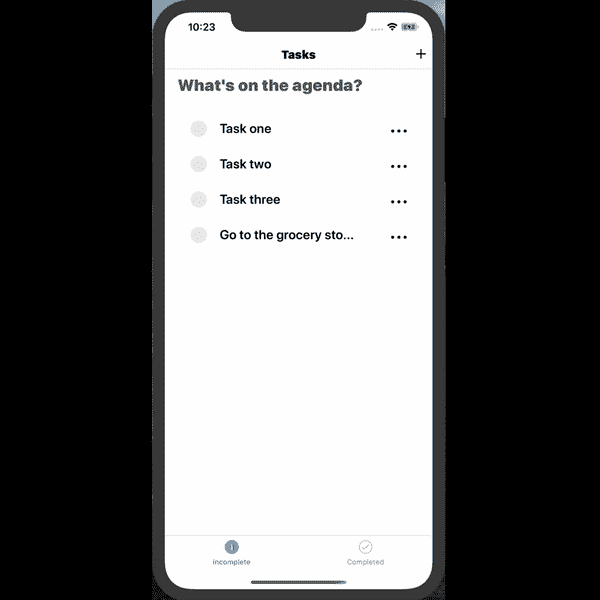
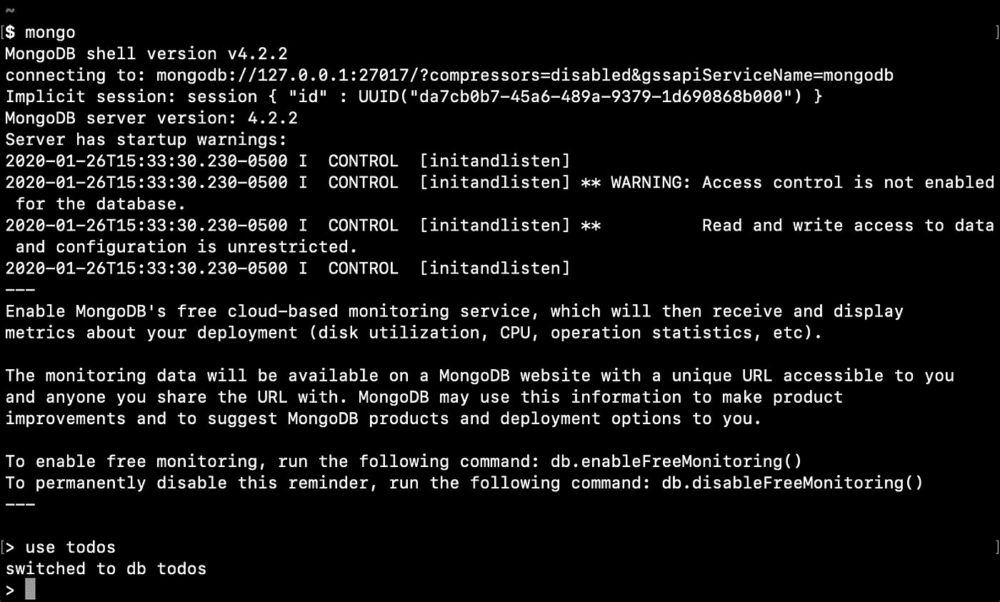
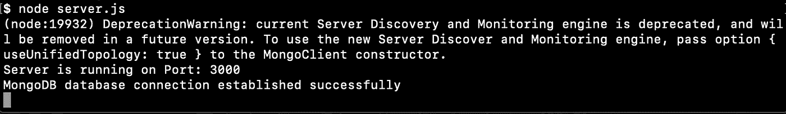
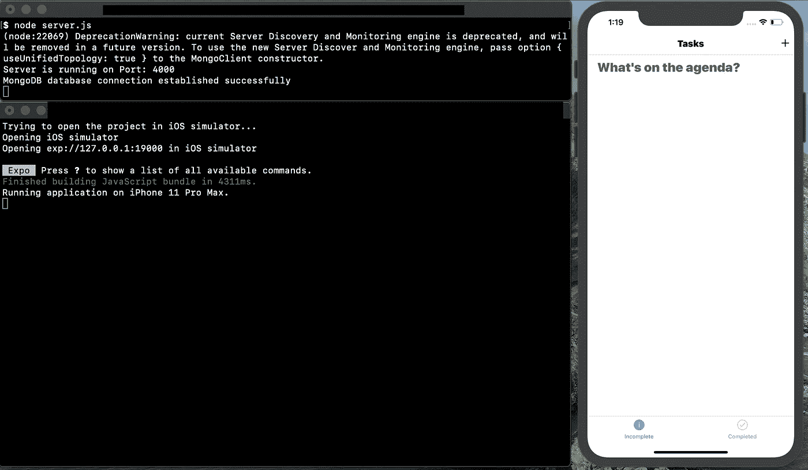
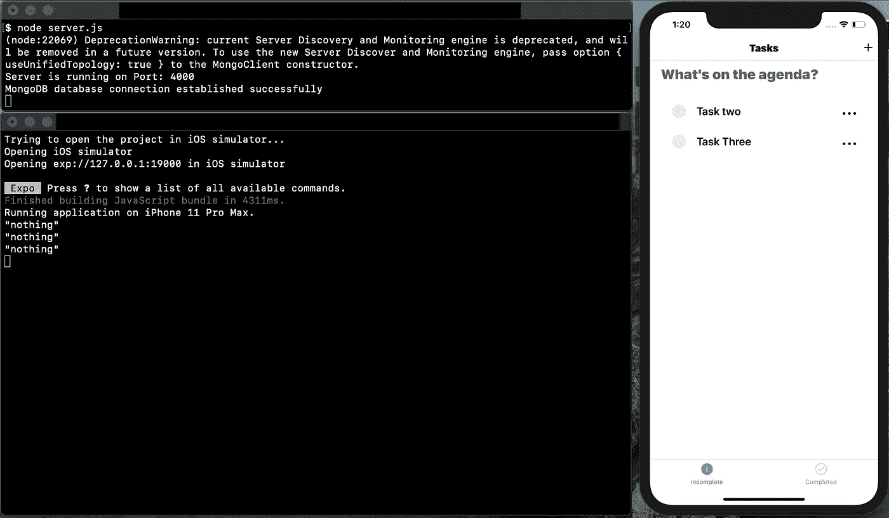
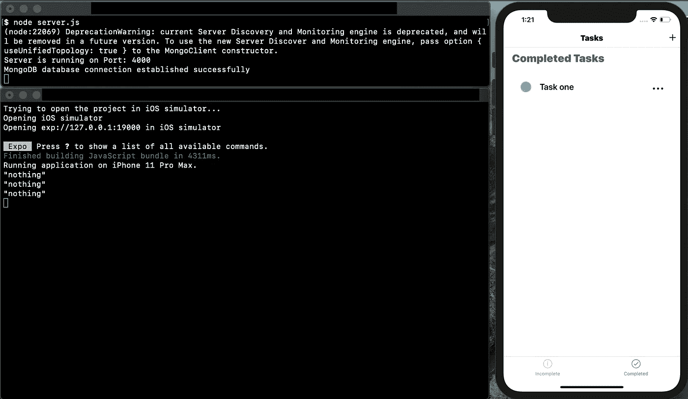

# MERNN:待办事项应用

> 原文：<https://levelup.gitconnected.com/mernn-to-do-app-dab1e3173493>



MongoDB，Express.js，React Native + Node.js

在我上一篇关于 Express.js 的文章[的基础上，我们将通过创建一个待办事项应用程序并使用 MongoDB 在本地保存数据来扩展我们的应用程序的功能。](/introduction-to-express-js-a-node-js-framework-fa3dcbba3a98)

这个例子更多的是针对 Express + MongoDB，而不是 React Native。我已经提供了带有工作前端的样板代码来帮助您开始:

[](https://github.com/TylerKnvpp/mernn-todo-boilerplate.git) [## TylerKnvpp/mernn-todo-boilerplate

### 此时您不能执行该操作。您已使用另一个标签页或窗口登录。您已在另一个选项卡中注销，或者…

github.com](https://github.com/TylerKnvpp/mernn-todo-boilerplate.git) 

分叉 repo，然后打开两个终端，导航到项目目录并输入以下命令:

*端子 1 = >* `/client`

```
cd client
yarn
```

*端子 1 = >* `/backend`

```
cd backend
yarn
```

让我们回顾一下后端的依赖性。如果打开 package.json，您会看到以下内容:

```
**{
  "name": "mernn-todo-boilerplate",
  "version": "1.0.0",
    "scripts": {
      "client": "cd client && yarn start",
      "server": "nodemon server.js",
      "dev": "concurrently --kill-others-on-fail \"yarn server\" \"yarn client\""
     },
  "dependencies": {
    "body-parser": "^1.18.3",
    "cors": "^2.8.5",
    "dotenv": "^8.2.0",
    "express": "^4.16.4",
    "mongoose": "^5.8.9",
    "morgan": "^1.9.1",
    "nodemon": "^2.0.2"
   },
  "devDependencies": {
    "concurrently": "^4.0.1"
     }
   }**
```

我们的快递依赖关系是`express`、`body-parser`、`morgan`。`mongoose`是用于 **MongoDB** 和 Node 的对象数据建模(ODM)库。它管理数据之间的关系，提供模式验证，并用于在代码中的对象和那些对象在 **MongoDB** 中的表示之间进行转换。`nodemon`是一个实用程序，它将监视源代码中的任何变化，并自动重启服务器。`dotenv`是一个零依赖模块，将环境变量从`.env`文件加载到`process`。

现在让我们看看后端目录的设置。我们有一个`server.js`文件，我们所有的服务器/ Express 应用程序逻辑都将存在其中。我们有一个数据模型的目录，在那里我们将创建并定义什么构成了“待办事项”然后我们有了一个路由目录和`todos.routes.js`文件，所有的路由逻辑都将在这里实现。node——Express 是在其上构建的——与 CommonJS 配合得非常好，所以我们将在需要时使用 require 语句和第三方模块

让我们从旋转我们的 MongoDB 数据库开始。要做到这一点，请确保您的机器上已经下载了 mongo。

[](https://docs.mongodb.com/manual/tutorial/install-mongodb-on-os-x/) [## 在 macOS 上安装 MongoDB 社区版- MongoDB 手册

### MongoDB Atlas MongoDB Atlas 是云中托管的 MongoDB 服务，可以在几分钟内启动并运行。获得…

docs.mongodb.com](https://docs.mongodb.com/manual/tutorial/install-mongodb-on-os-x/) 

先决条件:

1.  你需要安装自制软件
2.  您需要安装 xCode

在您的终端中，在您机器的根目录下运行以下命令:

```
brew tap mongodb/brew
brew install mongodb-community@4.2
```

现在已经安装了 MongoDB，运行以下命令创建一个 DB:

```
mongo
use todos
```



使用 mongo cli 创建本地数据库

让我们按代码。

打开`server.js`，让我们与新的本地数据库建立连接。

*server.js*

```
...
app.use(bodyParser.json());**mongoose.connect("mongodb://127.0.0.1:27017/tasks", { useNewUrlParser: true });****const connection = mongoose.connection;****connection.once("open", function() {
    console.log("MongoDB database connection established successfully");
});**...
```

太好了。现在，让我们通过启动服务器来检查连接。打开终端，导航到后端目录并运行以下命令:

```
node server.js
```

您应该会在终端上看到以下输出:



MongoDB 数据库连接成功

现在让我们建立我们的待办事项数据模型。打开`/models/todos.model.js`我们将使用`mongoose`的模式模块来构建我们的数据模型。

*/models/todos.model.js*

```
const mongoose = require("mongoose");
const Schema = mongoose.Schema;let Todo = new Schema(
{ **todo_description: {
   type: String
  },
 todo_responsible: {
   type: String
  },
 todo_priority: {
   type: String
  },
 todo_completed: {
   type: Boolean
  }** },
  { timestamps: true }
 );module.exports = mongoose.model("ToDo", Todo);
```

在新的模式中，我们定义了数据库的键以及接受什么值。Mongo 将生成 id 和时间戳。现在让我们设置我们的路由逻辑。打开`routes/routes.js`即可上手。

我们将使用该文件中的快速路由器模块来设置逻辑。我们还将导入我们刚刚创建的 Todo 模型。我已经添加了一些路线来开始，所以我们所要做的就是添加逻辑。让我们从我们的`GET`请求开始。因此，当我们的前端向`[http://localhost:3000/todos/](http://localhost:3000/todos/)`发出请求时，我们将发回一个包含所有待办事项的响应。

```
router.route("/").get((req, res) => { **Todo.find(function(err, todos) {
    if (err) {
     console.log(err);
    } else {
     res.json(todos);
    }
  });** });
```

够简单！但是，假设我们希望能够独立于已完成的任务呈现未完成的任务，而不必在前端实现任何复杂的逻辑。为了节省一些麻烦，让我们为已完成和未完成的任务创建一个自定义路线。

```
router.route("/completed").get((req, res) => { **Todo.find(function(err, todos) {
   if (err) {
    console.log(err);
   } else {
    let completedTodos = todos.filter(todo => todo.todo_completed);
    res.json(completedTodos);
   }
  });** });router.route("/incomplete").get((req, res) => {
 **Todo.find(function(err, todos) {
    if (err) {
     console.log(err);
    } else {
    let incompleteTodos = todos.filter(todo => !todo.todo_completed);    
    res.json(incompleteTodos);
    }
  });** });
```

现在，我们可以向这些自定义路由发出一个`GET`请求来获取我们需要渲染的数据，而不是循环遍历我们在前端接收到的数据。接下来，我们需要通过将 id 作为参数传递来覆盖返回单个 todo 的路由。

```
router.route("/:id").get((req, res) => { **let id = req.params.id;
    Todo.findById(id, (err, todo) => {
   res.json(todo);
  });** });
```

如果我们的前端向`[http://localhost:3000/1234](http://localhost:3000/1234)`发出一个请求，我们的服务器将发送回这个任务。这涵盖了我们的`GET`请求，让我们继续下一条 RESTful 路线。要添加 todo，我们需要从前端发出一个`POST`请求。

```
router.route("/add").post((req, res) => { **const todo = new Todo(req.body);** **todo**
    **.save()
    .then(todo => {
        res
         .status(200)
         .json({ addedTodo: todo, todos: "Task added successfully." });
     })
     .catch(err => {
         res.status(400).json({ todos: "ERROR: Task could not be added." });
     });
** });
```

对于我们的最终路线，让我们覆盖一个`PATCH`的逻辑，这样我们就可以更新任务(将它们标记为完成)。

```
router.route("/update/:id").post(function(req, res) { **Todo.findById(req.params.id, function(err, todo) {
     if (!todo) res.status(404).send("data is not found");
     else todo.todo_description = req.body.todo_description;
          todo.todo_responsible = req.body.todo_responsible;
          todo.todo_priority = req.body.todo_priority;
          todo.todo_completed = req.body.todo_completed;** todo
      **.save()
      .then(todo => {
        res.json("Task Updated!");
       })
      .catch(err => {
        res.status(400).send("Cannot update task");
       });
   });
** });
```

回到你的`server.js`文件，这样我们就可以把所有的东西联系起来。这种将路由从服务器文件中分离出来的惯例是不必要的，但它有助于代码更加简洁。您可以将所有的路由逻辑放在`server.js`中，但是这个文件很快就会变得非常冗长和复杂。接下来，我们需要做的就是告诉我们的 Express 应用程序使用 todos 路由器。我们可以通过向`server.js`添加以下代码来实现这一点:

```
**...****const todosRouter = require("./routes/todos");
app.use("/todos", todosRouter);**app.listen(PORT, function() {
   console.log("Server is running on Port: " + PORT);
});
```

就是这样！我们的后端逻辑是为一个简单的应用程序设置的。我们可以把两个都旋转起来测试一下。打开单独的终端并输入以下内容:

终端 1 = >/客户端

```
cd client
yarn start
```

终端 2 = >/后端

```
cd backend
node server.js
```

可以走了！如果所有内容都已正确添加(或者如果我没有出错)，您应该会看到以下内容:



首次运行该应用程序

添加一些任务:



添加了一些任务

完成一两项任务:



已完成的任务

给你。您创建了一个 Express 服务器，并用 MongoDB 提供的本地数据库持久化数据。没那么难，对吧？从来都不是。

继续磨！