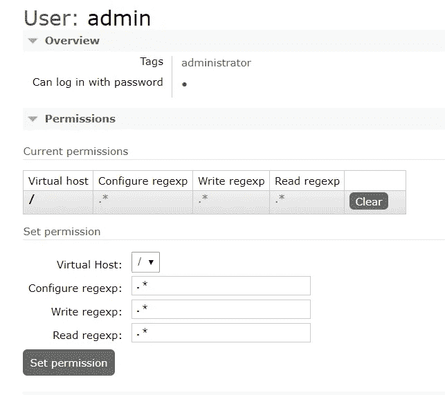
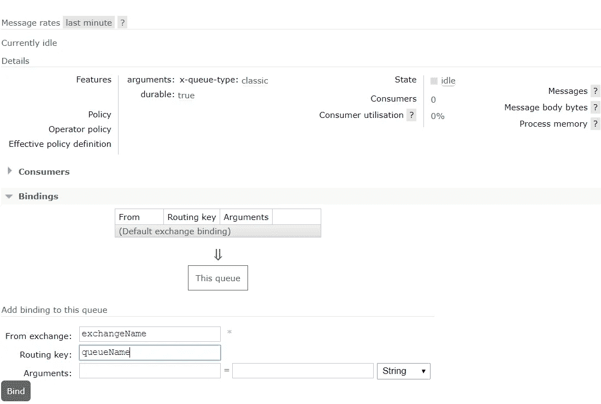

# 使用 RabbitMQ 的消息队列

> 原文：<https://levelup.gitconnected.com/message-queuing-with-rabbitmq-7e4682146e39>


abbitMQ 是一个开源的消息代理软件，最初实现了高级消息队列协议(AMQP)。正如他们的官方网站**中提到的，RabbitMQ 是部署最广泛的开源消息代理。**在深入 RabbitMQ 之前，让我们试着理解什么是消息代理，以及我们为什么需要它们。

# 什么是消息代理

**消息代理**是一种通信技术，用于应用程序之间的通信。在处理两个或多个应用程序之间的通信时，它们充当中间平台。那么什么时候我们需要在我们的软件系统中使用消息代理呢？我们可以在许多用例中使用消息代理。我在下面列出了一些常见的用例。

*   将单个应用程序解耦，这样，通过消息代理进行通信，可以在多个应用程序中执行功能，而不是在单个应用程序中执行功能。
*   处理异步任务，这可能需要更多的 CPU 时间，以便主应用程序不会被阻塞或获得更少的资源。
*   通过控制正在处理的请求数量来处理流量高峰，并确保即使在应用程序离线时请求最终也能得到处理。
*   事务排序，保证事务执行，并确保事务执行只发生一次。

上面提到的用例只是您可以在系统中使用消息代理的一小部分用例。现在我们对在哪些场景中需要使用消息代理有了基本的了解。但是 RabbitMQ 是我们唯一可以使用的消息代理吗？答案是**否**。下面是社区中其他一些广泛使用的消息代理。

*   ActiveMQ
*   卡夫卡
*   AWS SQS
*   ZeroMQ
*   RocketMQ

正如您所看到的，目前社区中有如此多的消息代理，每一个都有自己的优点和缺点。在这篇文章中，我不打算对它们进行比较。我选择写 RabbitMQ 是因为它是最常用的消息代理之一，如果您是消息代理的初学者，使用 RabbitMQ 很容易理解消息队列概念。

好了，既然现在我们知道我们要谈论什么，让我们深入研究 RabbitMQ。

## RabbitMQ 安装

关于如何安装 RabbitMQ 的详细文档可以在 https://www.rabbitmq.com/download.html 的官方网站上找到。他们提供了许多不同的方法，可以在不同的环境中下载和安装 rabbit-mq。

下面是他们提供的最常见的安装选项。

*   使用安装文件安装(windows\Linux 或 mac)
*   使用 Docker 安装
*   作为云服务提供商提供的服务使用

在这篇文章中，让我们试着用 docker 安装 rabbit-mq，因为如果你有一台安装了 docker 的机器，这是最简单的方法。rabbit-mq 的 Docker 图像可从 https://registry.hub.docker.com/_/rabbitmq/获得。

首先，我们需要从 docker hub 中提取图像，并在容器中运行它。下面是运行 rabbit-mq 映像的命令。(该命令不会启动 rabbit-mq 仪表板，如果您不想手动启动仪表板，我将在下面提供自动启动仪表板的命令)。

```
docker run -d --hostname rabbit-server --name rabbit-                                                                                                             service rabbitmq:3
```

确保提供一个**主机名**，因为 RabbitMQ 根据它所谓的**节点名**存储数据，默认为主机名。如果我们不提供主机名，docker 将自动创建一个随机字符的主机名。

好了，现在我们有了一个运行在 docker 容器中的 rabbit-mq 实例。rabbit-mq 将映射到的默认端口是 5672。RabbitMQ 使用 amqp 协议进行通信，而不是 TCP。我们需要做的第一件事是启用 rabbit-mq 仪表板。为此，我们需要进入容器并启用 rabbitmq_management 插件

```
docker exec -it rabbit-service bash
```

上面的命令将带我们进入与 rabbit-mq 容器的交互会话。要启用仪表板插件，请发出以下命令。

```
rabbitmq-plugins enable rabbitmq_management
```

这将启用管理插件，并为仪表板显示端口 15672。不用进入容器，我们也可以使用 docker run 命令来启用插件。

```
docker run -d --hostname rabbit-server --name rabbit-                                                                                                             service rabbitmq:3-management
```

现在转到 localhost:15672，仪表板应该是可用的。


默认用户名和密码应该是 **guest** 和 **guest** 。登录仪表板时，请确保创建新用户和密码。


您可以从**管理**选项卡创建新帐户。创建新用户后，默认用户将没有任何权限。


我们需要确保用户可以访问虚拟主机。为此，单击用户，然后单击**设置权限**。这将设置新用户的权限。



我想让你们进入容器内部的原因是为了大致了解容器内部发生了什么，因为将来我们可能需要进行一些配置。docker 镜像安装 rabbitmq 的默认位置是 **/opt/rabbitmq** 。在那里，如果你去 **sbin** 文件夹，我们可以找到一些可执行文件，我们可以用它们来配置 rabbit-mq。他们是

*   rabbit MQ-默认值
*   rabbitmq 诊断
*   rabbitmq-env
*   rabbit MQ-插件
*   rabbitmq 队列
*   rabbit MQ-服务器
*   rabbit MQ-升级
*   rabbitmqctl

由此我们已经使用了 **rabbitmq-plugins** 来启用我们的仪表板插件。如果你进入

```
rabbitmq-plugins list
```

它将列出所有可用的插件以及当前启用的插件。 **rabbitmq-server** 是启动 rabbit-mq 服务器的可执行文件。从 **rabbitmqctl** 我们可以进行各种配置，比如创建队列、删除队列等..

现在让我们看看如何在我们的应用程序中使用 rabbit-mq。下面我使用 Node.js，但是你可以使用任何你想要的语言。rabbit-mq 已经支持大多数广泛使用的语言。

## 连接到 RabbitMQ 服务器

在连接到 rabbit-mq 之前，我们需要在我们的项目中添加 amqplib。

```
npm i amqplib --save
```

现在，为了连接到服务器，我们需要提供用户凭证。让我们首先创建一个配置文件来存储我们的 rabbit 配置细节。

```
module.exports = env {
   rabbitmq : {
        domain : 'amqp://localhost',
        user : 'admin',
        password : 'pwd'
   }
}
```

创建一个 rabbitmqConnection 文件，并在那里编写连接 rabbit-mq 的代码。

```
const amqp = require('amqplib/callback_api')
const {env} = require('./env')const {domain, user, password} = env.rabbitmq
const opt = {credentials: require('amqplib').credentials.plain(user, password)amqp.connect(domain, opt, (err, connection) => {
 if (error) {
    throw error;
  } //use connection})
```

这就是连接到我们的 rabbit-mq 服务器的方法。现在我们有了一个连接，以后可以用它来对 rabbit-mq 进行其他配置。下一步是创建一个通道，以便与我们的 rabbit-mq 服务器进行通信。

```
connection.createChannel((err, channel) => {
  if (err) {
    throw err;
  } //use channel})
```

现在我们有了可以与 rabbit-mq 服务器通信的通道。建议每个客户端只打开一个通道。现在我们要做的是创建队列。在创建队列之前，让我们先看看 rabbit-mq 提供了什么样的队列路由。为此，让我们看看 rabbit-mq 如何将消息发布到队列中。

在 rabbit-mq 中，消息不直接发布到队列中。相反，它们首先被送到一个叫做**交易所**的地方。Exchange 负责哪个队列将获得哪个邮件。那么这个交换如何知道我们的队列呢？为了做到这一点，我们需要将我们的队列绑定到这个交换。Exchange 为我们提供了 4 种将邮件发布到队列的方法，称为路由选项。

*   直接汇兑
*   扇出交换机
*   话题交流
*   标题交换

**直接交换**

直接交换根据邮件路由关键字将邮件传递到队列。路由关键字是由生产者添加到消息头的消息属性。在本文中，我们将使用这个路由选项，我们的关键字是队列名称。

**扇出交换**

扇出交换将接收到的消息复制并路由到与其绑定的所有队列，而不考虑路由关键字或模式匹配。当相同的消息需要被发送到多个队列以得到不同的处理时，这种类型的路由非常有用。

**话题交流**

主题交换根据路由关键字和路由模式之间的通配符匹配将邮件路由到队列。这些模式是在我们绑定队列时在交换中定义的

**割台交换**

头交换基于包含头和可选值的参数来路由邮件。头交换与主题交换非常相似，但是基于头值而不是路由关键字来路由消息

## 正在创建 Exchange

下面的代码在直接模式下创建我们的交换。我们将 durable 指定为 true，以便在交换之外保持。我将在后面更多地谈论这种耐久性。assertExchange 方法所做的是检查是否存在具有我们提供的名称的交换，如果不存在，它将创建这个交换。

```
let exchange = 'exchange name'channel.assertExchange=(exchange, 'direct'{
  durable : true
})
```

上面完成的相同配置也可以使用仪表板来完成。要从仪表板创建交易所，请转到**交易所**选项卡，并在那里添加交易所。一定要把耐久性做的经久耐用。


## 创建队列

现在，我们已经创建了我们的交换，让我们现在创建我们的队列。就像上面一样，我们使用 assertQueue 方法来创建我们的队列，传递一个队列名称和选项 durable 为 true，它告诉使队列持久。下一步是将我们创建的队列绑定到我们之前创建的交换。这里，在 bindQueue 方法中，第三个参数应该是路由键，我们在这里指定队列名。

```
let queueName = 'queueName'channel.assertQueue(queueName, {durable: true}, (err, q) => {
    channel.bindQueue(q.queue, exchange, queueName) //use q.queue})
```

同样，我们从代码中进行的相同配置也可以使用仪表板来完成。从仪表板添加队列，并转到**队列**选项卡。在那里，我们可以提供一个名称，使持久性成为持久的，并创建一个队列。


下一个任务是将这个队列绑定到我们的 exchange。为此，单击队列并选择树项目上的绑定。在这里，我们需要提供交换名称和路由密钥。



现在，我们的队列被绑定到 exchange，路由关键字为 queueName。


## 创造消费者

我们现在已经创建了我们的队列。现在，下一个任务是为这个队列创建消费者。消费者将接受这条消息，并执行我们在应用程序中定义的所需功能。

```
let queueName = 'queue-name'channel.assertQueue(queueName, {durable: true}, (err, q) => { channel.consume(q.queue, (msg) => {
       let message = JSON.parse(msg.content.toString())
       //process message
       channel.ack(msg, false) //channel.nack(msg, false)
    })})
```

现在，我们有了一个与我们的交换绑定的队列和一个将使用我们队列中的消息的消费者。但是谁将向我们的队列发布消息呢？这些将是生产者。

```
connection.createChannel((err, channel) => {
  if (err) {
    throw err;
  } let message= 'message we want to send'  channel.publish(exchangeName, queueName, Buffer.from(JSON.stringify(message), {persistent : true} )})
```

上面的代码展示了生产者如何将消息发布到队列中。记得我说过生产者不是直接向队列发布消息，而是向交换发布消息。这就是为什么我们把 exchange 作为上面的第一个参数传递。第二个参数是路由键，在我们的例子中是队列名。第三个参数是消息本身。

对于生产者发布消息和消费者使用消息的整个生命周期来说，这基本上就是队列。但是在结束这篇文章之前，我想讨论几个概念。

## 消息确认

默认情况下，当消息从队列发送到消费者时，rabbit-mq 会将其标记为已消费的消息，并从队列中删除。但是通过使用消息确认，我们可以延迟它，直到消费者将 msg.ack 发送回队列。这有助于在使用者中处理错误，并在失败时重试消息。我们可以通过将否定确认(msg.nack)发送回队列来实现这一点，这使得消息被发送回队列。

```
channel.consume(q.queue, (msg) => {
       let message = JSON.parse(msg.content.toString())
       //process message
       if(sucess)
          channel.ack(msg, false)
       else
          channel.nack(msg, false)})
```

通过将第二个参数设为 true，我们可以选择同时发送多个确认。到那时，它会将到那时为止所有未确认的消息都确认为已确认。

## 消息预取

预取是限制消费者在给定时间可以使用的消息数量的方法。使用来自该消费者的未确认消息的数量来标识当前正在处理的消息的数量。当我们想限制消费者不要使用太多资源和崩溃时，这就很有用了。预取是根据通道设置的。因此，如果多个用户使用一个通道，预取将在全局范围内对所有用户进行设置。在这种情况下，如果我们希望每个消费者的每个预取在下面的代码中为第二个参数设置 false 值。

```
channel.prefetch(limit, true)
```

## 坚持

我们需要坚持，因为这样我们才能处理失败和恢复。当我们考虑失败时，我们需要考虑两种类型的失败场景。

*   Rabbit-mq 服务器失败
*   我们的消费者(应用程序)失败

首先我们来谈谈 rabbit-mq 服务器故障。如果 rabbit 服务器出现故障，我们将丢失所有的交换和队列配置。但幸运的是，我们可以在创建这些组件时通过给出{durable: true}选项来使它们持久。通过使它们持久，rabbit-mq 将把配置写到磁盘上。因此，在失败的情况下，当 rabbit-mq 服务器重启时，它将从存储中获取所有的配置细节，并创建我们的交换和队列。

第二个失败场景是我们的应用程序失败。在这种情况下，在我们的应用程序重新启动后，应该使用已经使用的任何消息(这意味着它们还没有被确认)。为此，当我们向队列发布消息时，我们使消息持久化。

```
channel.publish(exchangeName, queueName, Buffer.from(JSON.stringify(message), {persistent : true} )
```

但是为了使消息持久，我们还必须确保队列也被创建为持久的。因此，在创建需要持久保存消息的队列时，请确保使队列像上面所示的那样持久。

这个帖子到此为止。在使用消息代理制作企业应用程序之前，我们还应该了解很多其他的概念。但我想这已经给了你基本的概念。感谢您阅读这篇文章，我们将在下一篇文章中再见。