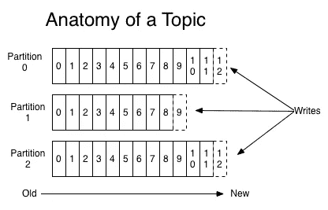

# 消息队列比较:NSQ 和阿帕奇卡夫卡

> 原文：<https://levelup.gitconnected.com/messaging-platform-comparison-nsq-and-apache-kafka-60f96f7466b1>

随着系统变得越来越大，为了避免任何单点故障，我们经常从旧的整体架构切换到微服务架构。通过将应用程序划分为更小的独立单元，每个单元之间的交互次数将显著增加。

消息队列提供了另一种异步通信和协调的方式，尤其是在这个解耦的单元中，同时提高了性能、可靠性和可伸缩性。将消息添加到队列中的组件称为生产者，而检索和处理消息的组件称为消费者。消费者和生产者不直接交互，通常使用代理来管理队列。

阿帕奇卡夫卡和 NSQ 是我目前真正感兴趣的消息队列的例子。那么让我们开始吧。

# 1.神经过敏症量表问卷调查

NSQ 拓扑学

NSQ 是一个实时分布式消息平台，它是简单队列 T2 的继承者。

NSQ 的核心组件包括:

*   *nsqd* 是一个守护进程，负责接收、排队和向客户端发送消息。
*   *nsqlookupd* 是管理拓扑信息的守护进程。
    客户端查询 *nsqlookupd* 以发现特定主题的 nsqd 生产者，并且 *nsqd* 节点广播主题和频道信息。
*   *nsqadmin* 是一个 Web UI，用于实时查看聚合的集群统计信息，并执行各种管理任务。

NSQ 提供:

*   将 SPOF 降至最低的高可用性拓扑。
    通过为 *nsqd* 和 *nsqlookupd 设置多个实例来提高可用性。*
*   保证消息至少传递一次。
*   一定程度的坚持。该消息被存储，直到消费者发送结束信号。
*   易于配置

单个 *nsqd* 实例被设计成一次处理多个数据流。流被称为“主题”，一个主题有一个或多个“通道”。每个通道接收一个主题的所有消息的副本。

主题和频道都不是预先配置的。主题是在命名主题首次发布时创建的，或者是通过订阅命名主题的频道创建的。频道是在第一次使用订阅命名频道时创建的。
并且两者相互独立地缓冲数据。

一个通道通常有多个连接的客户端，每个消息将被传递给一个随机的客户端

NSQ 需要重新考虑一些事情，例如:

*   您正在使用的拓扑将始终影响可靠性
    仅使用单个实例将使其更容易出现单点故障。NSQ 设计用于多个实例。
*   当服务器 NSQD 意外崩溃时，可能会丢失数据。因为没有内置的复制。
*   无序消息
    由于所有 nsqd 实例彼此之间不通信，无序消息可能会出现。
*   重复的消息。任何消费者超时的情况下，NSQ 都会为消息做重新排队，造成重复消息的可能性。

# 2.阿帕奇卡夫卡

将 Kafka 流媒体平台与 NSQ 等消息系统进行比较，并不是苹果与苹果之间的比较。所以我们要经历的只是卡夫卡式的信息系统。

Kafka 说，与其他消息队列相比，它们具有更好的吞吐量。内置分区和复制还支持容错，使其成为可靠的消息传递系统之一。

主题是记录发布到的类别或提要名称。卡夫卡的主题总是多订户的；也就是说，一个主题可以有零个、一个或多个消费者订阅写入其中的数据。

对于每个主题，Kafka 集群维护一个如下所示的分区日志:

卡夫卡的主题剖析

每个分区都是一个有序的、不可变的记录序列，它不断地追加到结构化提交日志中。分区中的每个记录都被分配一个称为*偏移量*的顺序 id 号，该 id 号唯一地标识分区中的每个记录。

Kafka 集群使用可配置的保留期来持久保存所有记录，无论它们是否已被使用。例如，如果我们将保留期设置为五天，那么消息在发布后仍将保留五天，并且仍可供使用。

与由生产者和消费者组成的其他消息传递系统相同。卡夫卡对这两种作品都有独特的方式:

*   生产者

将数据发布到他们选择的主题。生产者负责选择将哪个记录分配给主题中的哪个分区。这可以通过简单的循环方式来平衡负载，也可以根据某种语义分区函数来完成(比如基于记录中的某个键)。

*   消费者

消费者用一个*消费者组*名称来标记他们自己，并且发布到一个主题的每个记录被交付到每个订阅消费者组中的一个消费者实例。消费者实例可以在不同的进程中，也可以在不同的机器上。

如果所有的消费者实例都有相同的消费者组，那么记录将有效地在消费者实例之间进行负载平衡。

如果所有的消费者实例都有不同的消费者组，那么每个记录都将被广播给所有的消费者进程。

# 3.比较

这两个消息队列都有一种独特方式来定义它们的体系结构以及它们的代理如何工作，但是在几个方面，这可能是您选择哪个平台的一个考虑因素:

*   有效性

如果 NSQD 服务器意外崩溃，可能会丢失数据。
Kafka 内置复制和分区功能，使其具有更高的可用性和可靠性。使用复制因子 N，Kafka 可以容忍 N-1 个服务器故障，而不会丢失任何记录。

为了解决这种问题，我们可以在单独的主机上创建冗余的 NSQD 对，以接收完全相同的消息副本。

*   坚持

如果用户已经发送该消息的结束信号，NSQ 将删除该消息。

Kafka 有另一个规则，通过设置保留时间(无论是基于时间还是基于大小),但是消息在从它们被发布的时刻起的特定时间/大小之后仍然保持。

*   可重放的消息

由于卡夫卡有记录的持久存储系统，他们提供了一遍又一遍重放信息的能力，只要它仍然被存储。

*   消息的顺序

由于 NSQD 的多个实例不能相互通信，因此总是有可能出现无序的消息。虽然 Kafka 将它们的每个分区维护为有序的记录序列，但是 Kafka 将总是在一个分区中提供消息的精确顺序。

# 4.类似

NSQ 和卡夫卡都是传统信息经纪人中的佼佼者，因为他们都使用发布/订阅模式，而且卡夫卡的消费群体与 NSQ 的渠道系统有相似之处。

尽管如此，这两种方法在各自的程度上都提供了更高的可靠性、可伸缩性和持久性。

# 5.管见所及

对于一个开源消息队列，NSQ 提供了一个相当宏伟的架构和用例，而另一方面，Kafka 从持久性、可靠性和可用性方面提供了一个更加健壮的平台。

在这种情况下，你选择哪个平台只基于这一个问题。

> 你能接受数据丢失吗？

如果答案是否定的，那么卡夫卡就是答案。

我的另一个观点是，如果你的系统已经是 Java 的，并且可能有兴趣实现 Kafka，那么 Kafka 的流媒体平台可能是一个值得考虑的因素。

是的，流媒体平台比消息系统贵多了。但是看到它是如何工作的，让我真的想到通过将一切实现为一个流，而不仅仅是一个单一的消息记录，未来会有多少可能性。

像往常一样，我们在东京有一个空缺。我们是一家印度尼西亚科技公司，以通过技术实现商业民主化为使命，帮助每个人实现更大成就。
在 Tokopedia 和我们一起寻找你梦想的工作！https://www.tokopedia.com/careers/
T3

[https://kafka.apache.org/](https://kafka.apache.org/)T7[https://nsq.io/](https://nsq.io/)