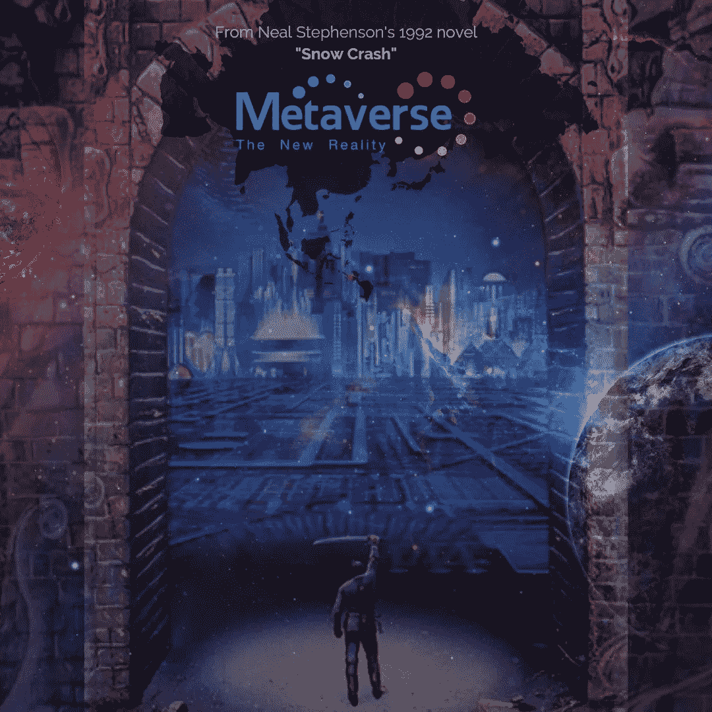
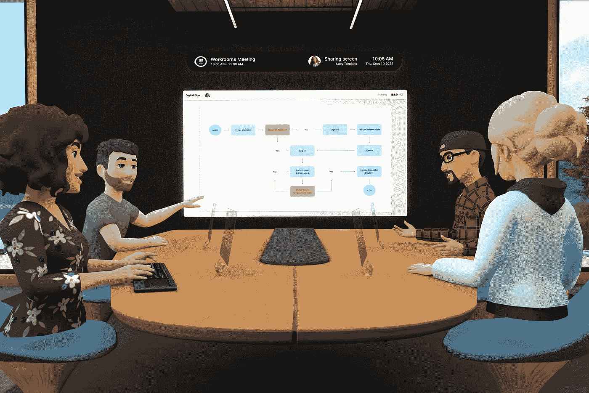
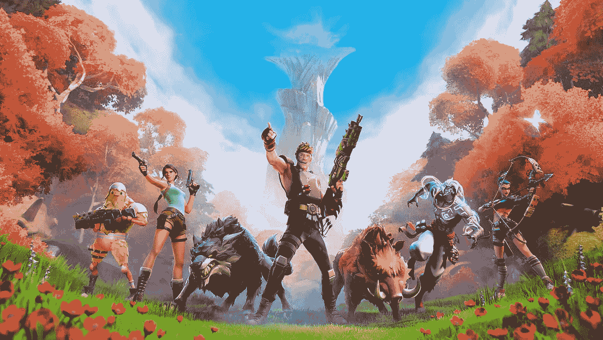
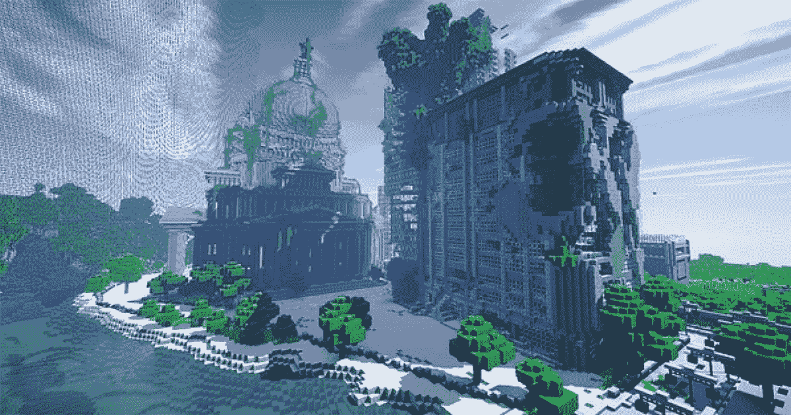
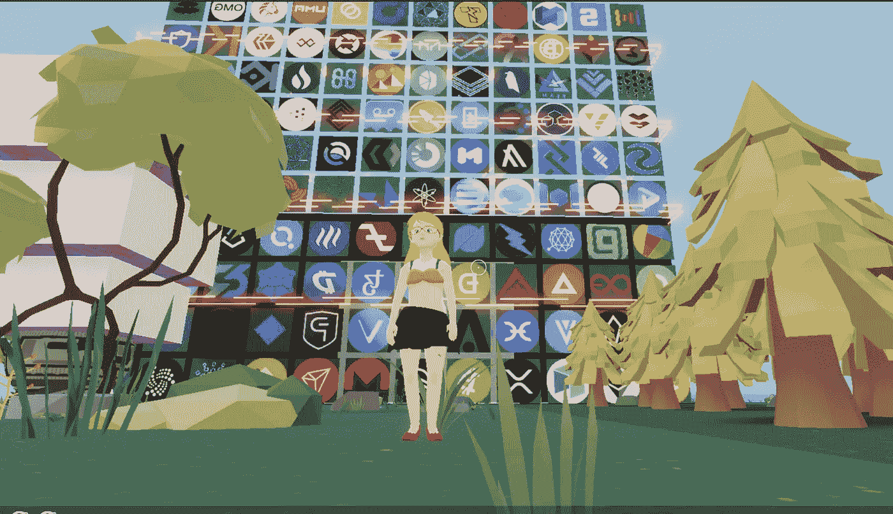

# 元宇宙:这是什么，会是什么

> 原文：<https://levelup.gitconnected.com/metaverse-what-is-it-and-what-can-it-be-1173a0e65d73>

这是科技世界最近痴迷的元宇宙系列的第一部分。

*第二部分着重于元宇宙的框架和积木，把它想象成一个堆栈。*

 [## 元宇宙:框架、构件和市场地图

### 这是科技世界最近痴迷的元宇宙系列的第二部分。

medium.com](https://medium.com/@swatib16/the-metaverse-framework-building-blocks-and-market-map-3bb2ccf0241c) 

科技领域的伟大想法总是以看似行话的形式开始。理解行话来揭示这个想法首先需要创建自己的个人翻译手册。然后你一个接一个地构建它，直到抽象最终消失。

对于商业和工业来说，要发挥新技术带来的潜力，翻译鸿沟是真实存在的。然而，一些术语确实存在，并普遍存在于普通词典中。就像食物、空气和水一样多——互联网，有人知道吗？

上周刮起了一阵新行话旋风。元宇宙从早期采纳者词汇阶段转移到更广泛的“那是元”参考——几乎每一次讨论，从我的影响力教授谈论社会结构到我今天与我一起玩早午餐琐事的团队，都将它编织成对话。这当然是由[马克·扎克伯格反复声明建立一个虚拟世界是他的公司的下一个大野心](https://www.theverge.com/22588022/mark-zuckerberg-facebook-ceo-metaverse-interview)引发的，当然，还有上周将脸书更名为 [Meta](https://about.facebook.com/meta?utm_source=Google&utm_medium=paid-search&utm_campaign=metaverse&utm_content=post-launch) 。

那么，元宇宙目前的形式是什么，它会变成什么，它会把我们引向何方。

## 生活最终会模仿科幻小说

元宇宙的概念是由科幻作家尼尔·斯蒂芬森在 1992 年提出的，从那以后，技术专家们一直在断断续续地撰写关于它的文章。

> 这个术语指的是共享在线空间中物理、增强和虚拟现实的融合——很像游戏？

元宇宙的全景很难定义，而且看起来很不切实际。然而，在最近的过去，这些作品开始感觉非常真实。

脸书已经通过几个无机和有机项目投资这个想法有一段时间了——Oculus VR、 [Horizon 虚拟会议空间](https://www.oculus.com/facebook-horizon/)、AR 眼镜和许多其他项目。然而，它并不是唯一一家宣称要建造元宇宙的大公司。巨作游戏[堡垒之夜](https://www.epicgames.com/fortnite/en-US/home)和虚幻引擎的制造商 Epic Games 一直致力于此。投入云游戏投资的数百亿美元背后有一个线上线下虚拟未来的基本原理。

在过去的一年半时间里，新冠肺炎强迫我们所有人进行变焦和远程工作。游戏公司 Roblox 进行了一次大型 IPO。在其 S-1 文件中，首席执行官 David Baszucki 将其产品描述为“共享的在线体验，人们可以在 3D 模拟虚拟环境中互动，有时被称为元宇宙”。

随着计算能力、网络带宽和人机界面技术的改进，Metaverses 将变得越来越普遍。

## 什么是元宇宙？

元宇宙可以被最好地理解为下一代互联网:它将建立在互联网之上，并不断地对其进行改造。在我们使用互联网的演变过程中，我们经历了两个大的阶段:

*第一阶段:*20 世纪 90 年代和 21 世纪初的固定线路互联网激励我们购买个人电脑，但提供从固定点断续接入互联网

*第二阶段:*移动互联网让全球大多数人购买了自己的个人电脑和互联网服务，这意味着几乎每个人都可以持续使用计算和连接

> 元宇宙可以理解为第三阶段——它将“访问”互联网转变为“在”互联网之内。一个物理世界的“数字”现实，将每个人置于一个几乎无止境的“虚拟”或“3D”版本的互联网中，即，我们的身份、历史、通信和支付等。

简而言之，它将实现基于活动的互联沉浸式体验——其中一些我们已经开始体验了:工作(协作、学习、培训)；社交网络(社区生活、社交互动、创造性表达)；游戏(沉浸式体验游戏)

一些活动将包括我们现在很难想象的沉浸式体验，如电子商务(元宇宙可能会导致我们定义全渠道商务的新方式)、文化体验(例如虚拟参观艺术博物馆)、虚拟城市或购买一块数字土地。

> 总的来说，元宇宙将大大拓宽日常生活中使用的虚拟体验的数量(即超越视频游戏)，进而扩大参与其中的人数。

## 塑造元宇宙的趋势

已经在全球范围内发生的指数变化将塑造元宇宙的未来。这将是一个反复的过程，很难确定元宇宙实际上会是什么样子。

技术驱动的转型是一个有机的、不可预测的过程，在这种情况下，它取决于几个潜在的趋势，每个趋势都有自己的发展曲线。我在这里列出了我认为驱动元宇宙未来的五个最大的驱动因素。

***虚拟的“真实”化:*** 我们越来越多地用虚拟来补充、越来越多地取代现实世界的物体和体验。随着社交网络、加密资产、NFT 和虚拟物品、智能合同和实时在线体验的出现，虚拟领域的信任度不断提高。新冠肺炎加速了这一进程，将全球范围内的办公室物理空间转换为在线工作领域。*所有即将上线的体验和活动将增加元宇宙和支持它的行业的可扩展性。*

***VR 和 AR 的崛起:*** 在其核心，这将推动元宇宙的沉浸式元素，将人类的感官和运动系统与计算机相结合。现有的例子利用了游戏输入/输出设备、可穿戴设备和 VR 头戴设备。在未来，我们甚至可能拥有功能性的智能隐形眼镜。未来光场技术的创新可能会带来真正的全息体验。*因此，元宇宙将在我们周围无处不在。*

***区块链采用:*** 区块链——一种分布式账本技术——允许去中心化的权限(即，你不需要信任任何一个权限；信任是在区块链本身)，历史的记录，当分散，允许无许可的参与。根据里德定律，这会导致网络效应。可以参与网络的节点越多，网络的价值就越高，并且可以围绕某些活动(游戏、金融乐高玩具等)形成群体。)，网络的价值进一步增加。从本质上说，更多的个人、更多的应用程序和更多的组件组装起来就意味着更智能的契约和更分散的应用程序。

*区块链计算的出现可能会取代云计算的某些方面；NFT 的兴起将成为新一代游戏和其他元宇宙体验中虚拟商品的基础。*

***低代码平台:*** 元宇宙将越来越多地由更广泛的创作者群体构建，并由更深入的插件应用程序和逻辑目录支持。低代码和无代码应用程序平台提供了更高级别的抽象(如脚手架和拖放工具)，以取代流程、逻辑和应用程序的手工编码。*其结果将是创建应用程序所需的工作量大幅减少，使这一过程民主化，同时也增加了元宇宙网络的力量。*

***万物互联:*** 这涉及机器内的现实模拟，以创建虚拟机、物体、环境和人的世界。数据输入将包括地理空间数据和交通数据；[物理对象的数字双胞胎](https://en.wikipedia.org/wiki/Digital_twin),用于报告其所有属性，以及关于人员和流程的实时数据。*这些创新将使元宇宙能够覆盖并预测现实世界。*

所有这一切当然都将基于加速的分销网络，以及伴随的网络效应和机器智能(深度学习、ML 和 AI)作为底层，为从微芯片到手势识别到基于高级 AI 的偏好和建议的一切提供动力。

尽管这些技术正在融合创造元宇宙，但它才刚刚开始崭露头角。但是未来的前景是值得等待的。

*感谢阅读！我错过了什么？我很想收到你的来信——你可以通过*[*LinkedIn*](https://www.linkedin.com/in/swatibhatia/)*和*[*Twitter*](https://twitter.com/swati1606)*联系到我。*

我写科技、投资和行为方面的文章，在科技、投资和咨询领域拥有非常丰富的全球经验。(莫斐斯风险投资公司，优步，波士顿咨询集团)。