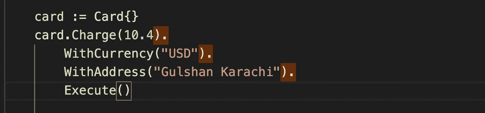

# Golang 的方法链接

> 原文：<https://levelup.gitconnected.com/method-chaining-in-golang-1de7cd9efa74>



**方法链接**是在单个表达式中调用不同的方法，而不是分别调用具有相同对象引用的不同方法的做法。如下所述

```
dialogue := AlrtDilagoue{}
dialogue.SetTitle(" Warning ").
        SetMessage("Do you really want to delete this ?").
        Show();
```

**为什么首选方法链接？** 我要说这也取决于开发者，我们经常在 java、c#、php 等其他语言中看到这种情况。在 Go 中，像 [GORM](https://github.com/jinzhu/gorm) 这样的库依靠方法链来构建更复杂的 SQL 查询。

一些开发人员将方法链作为一种提高源代码可读性的良好实践来推广。冗余的临时变量和代码重复被消除，表达式变得像自然语言文本一样易于从左向右阅读。

对于其他一些方法来说，方法链接通常被认为是一种不好的实践。在 *StackOverflow 的线程中，即* [*方法链接——为什么这是一个好的实践，或者不是？*](https://stackoverflow.com/questions/1103985/method-chaining-why-is-it-a-good-practice-or-not) 很多帖子声称方法链接恶化了可读性。

但是方法链接仍然在 ORM 中被大量使用。

**在 Golang 中实现方法链接**
让我们试着实现它，因为我喜欢在一些情况下使用它，比如在 API 上写一个包装器。

```
package mainimport "fmt"type Card struct {
    amount   float64
    currency string
    address  string
}func (c *Card) Charge(amount float64) *Card { c.amount = amount
    return c
}func (c *Card) WithCurrency(currency string) *Card { c.currency = currency
    return c
}func (c *Card) WithAddress(address string) *Card { c.address = address
    return c
}func (c *Card) Execute() { fmt.Printf("Dear Customer, \n%s %v is Debited from your account ", c.currency, c.amount)}
```

在 Golang 中，要使一个方法成为可链接的，你所要做的就是返回一个接收者。没有必要像代码中的 Execute()方法一样，在链中使用的最后一个方法上返回任何东西

```
func main() {card := Card{}
    card.Charge(10.4).
        WithCurrency("USD").
        WithAddress("Gulshan Karachi").
        Execute()// you can write it as below as well in a single linecard.Charge(10.4).WithCurrency("PKR").WithAddress("Gulshan Karachi").Execute()}
```

它在 Golang 有一些缺点吗？

像 Java、Python 这样的语言能够侥幸成功，是因为它们习惯性地通过异常传递错误，而异常会立即停止方法链，并跳转到相关的异常处理程序。

## 如果这篇文章有帮助，请点击拍手👏按钮下面几下，以示你对作者的支持！⬇