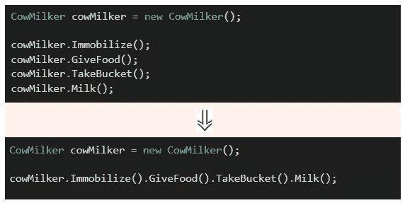
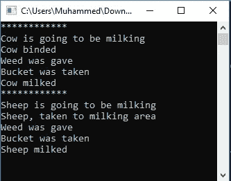
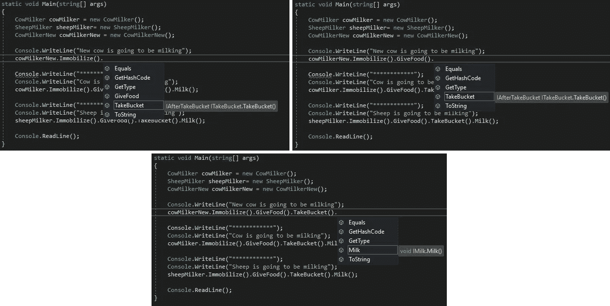
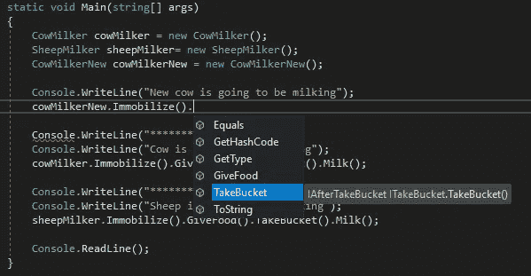
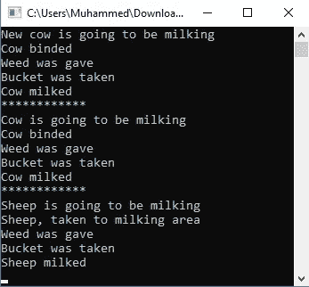

# 像 LINQ 那样用流畅的接口模式链接方法

> 原文：<https://levelup.gitconnected.com/method-chaining-with-fluent-interface-pattern-d01e75d4bb3d>

***注*** *:这是我第一篇英文文章(* [*土耳其版*](https://medium.com/bili%C5%9Fim-hareketi/fluent-interface-pattern-ve-ger%C3%A7ek-hayat-%C3%B6rne%C4%9Fi-abd0f72a854f) *)。因此，请原谅我所犯的错误。*

**如果你确实没有中级会员，你可以使用** [**的好友链接**](https://mhkoca.medium.com/method-chaining-with-fluent-interface-pattern-d01e75d4bb3d?sk=dd73c82a140662b01dceaa7149d46d72) **来阅读这篇文章。**


照片由[海梅·丹塔斯](https://unsplash.com/@jaimedantas?utm_source=medium&utm_medium=referral)在 [Unsplash](https://unsplash.com?utm_source=medium&utm_medium=referral) 上拍摄

在本文中，您将获得一条关于 Fluent 接口模式的知识信息。这种模式为开发人员提供了编写链式方法的能力，因为这在**实体框架**或 **LINQ** 上很常见。此外，我们只能让他们被称为我们想要的。比如第一种方法是 A，然后 B，然后 C 或者 D，然后 E，等等。

***注*** *:在我们的例子中，有一种方法链接。然而，* [*Martin Fowler 提到 fluent 接口时首先说:*](https://martinfowler.com/bliki/FluentInterface.html) *“我还注意到一个常见的误解——许多人似乎将 fluent 接口等同于方法链接。当然，链接是流畅界面的常用技术，但真正的流畅远不止于此。”*

挤奶过程可能是最有趣的例子，每当我们谈到连锁过程时，就会想到这个例子。

我们假设有一个农民:约翰。他每天晚上挤牛奶。这个过程有四个步骤:

*   捆住牛
*   给它食物
*   拿一个桶
*   挤牛奶

***注*** *:脚本是 C#代码。但是我认为你可以在 Java 或其他 OOP 语言上应用这种模式。*

所以:

我们可以开始挤奶过程了:

但是现在，我想在一行中处理它，而不是调用许多方法。我的想象是:



为此，我将 void 方法的返回类型更改为 CowMilker，并添加一行“ ***return this*** ”:

这似乎是我的想象:

看起来很美，是吧？

现在，我们可以进入第二关了。我们假设农民种植工作，他买了羊。在给羊挤奶的时候，他会把羊带到挤奶区，而不是把羊捆起来。很可能，会发生另一个时间差。因此，我创建了一个接口，并从中实现了挤奶工类。



一个 ll 没错。没关系。但是有一个主题:我们假设开发人员以错误顺序调用方法并说

```
cowMilker.Immobilize().GiveFood().Milk().TakeBucket();
```

于是，挤奶工还没拿桶就开始挤奶了，牛奶浪费了。或者他/她尝试捆绑，但牛被捆绑。

```
cowMilker.Immobilize().Immobilize().GiveFood().TakeBucket().Milk();
```

这就是为什么我们可以设置一个规则，按照一定的顺序调用 chain。为了解决这个问题，我们将在代码中修改和添加一些有趣的东西。

我创建如下界面:

我们的新挤奶工:

**制动**包含**制动**类型中的**制动**方法。并且**iafterimmenification**接口实现 **IGiveFood** 。

因此，我调用的返回对象是 implement **IGiveFood** 并包含 **GiveFood** 方法。同样， **GiveFood** 方法的类型是 **IAfterGiveFood** ，它实现了 **IAfterTakeBucket** 。该调用的返回类型只包含 **TakeBucket** 。这样，就像链条一样。

正如你看到的，每个方法的返回类型是不同的接口。所以这个 **CowMilkerNew** 必须实现所有的接口( **IAfterTakeBucket，IAfterImmobilize，IAfterGiveFood，IMilk** )来返回带有`***return this;***` 语句的 **CowMilkerNew** 。

它可以像我们想的那样称呼它。这就是结果(单击图像进行缩放):



我们假设你把动物固定住了，给食物是可选的。我们应该只认为 **ITakeBucket** 实现了**iafterimobilize。**



现在，让我们称新的奶牛挤奶工为:

这就是结果:



希望这个信息解释清楚。请不要犹豫与我联系。您的反馈很有价值。

完整项目:

[](https://github.com/mhkoca/fluent-interface-EN) [## mhkoca/fluent-interface-EN

### 流畅界面模式的示例项目。为 mhkoca/fluent-interface-EN 的开发做出贡献

github.com](https://github.com/mhkoca/fluent-interface-EN) 

*最后感谢* [*奥马尔*](https://medium.com/u/3415ad85795e?source=post_page-----d01e75d4bb3d--------------------------------) *对他的支持。*

*联系人:* [*领英*](https://www.linkedin.com/in/muhammed-hilmi-koca-60a06152/?ppe=1&utm_campaign=Yaz%C4%B1l%C4%B1mc%C4%B1lar%20%C4%B0%C3%A7in%20Haftasonu%20Okumalar%C4%B1&utm_medium=email&utm_source=Revue%20newsletter) *，* [*推特*](https://twitter.com/mhk_developer?utm_campaign=Yaz%C4%B1l%C4%B1mc%C4%B1lar%20%C4%B0%C3%A7in%20Haftasonu%20Okumalar%C4%B1&utm_medium=email&utm_source=Revue%20newsletter)