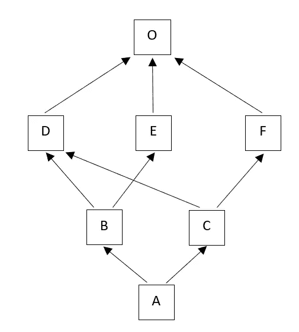
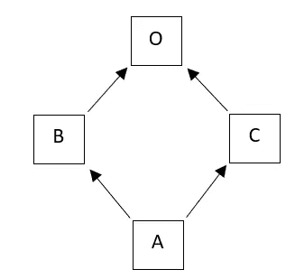

# Python 中的方法解析顺序

> 原文：<https://levelup.gitconnected.com/method-resolution-order-in-python-5afbaecc25e0>

## Python 如何使用 C3 线性化支持多重继承，以及为什么基类的顺序至关重要。

安德烈·泰森在 [Unsplash](https://unsplash.com?utm_source=medium&utm_medium=referral) 上拍摄的照片

致命的死亡钻石——最广为人知的多重继承问题，当类`A`从两个类`B`和`C`继承时出现，这两个类都从基类`D`继承。对于类`D`中的方法`foo()`，类`A`将继承它的两个副本——每个父类一个。那么当一个人调用`a.foo()`时，将为类`A`的对象`a`调用哪个副本呢？答案取决于线性化算法。

方法解析顺序(MRO)是一种用于构建线性化的算法——一个类的所有祖先的列表，包括该类本身，从最近到最远排序。这是查找方法和属性的顺序。虽然线性化对于单一继承来说是微不足道的，但是对于多重继承来说就变得复杂了。

MRO 的一个关键要求是单调性:如果在类`A`的线性化中类`B`出现在类`C`之前，那么在从`A`派生的任何类的线性化中`B`应该出现在`C`之前。否则，创建子类可能会改变解析顺序，并引入令人讨厌的错误。在 2.3 版本之前，Python 使用了一种原生算法，但是发现它并不单调。在 Python 2.3 中，本地算法被忽略了，取而代之的是学术上发展起来的 C3 线性化，它转移到了 Python 3。

获取类`A`的对象`a`的 MRO 就像调用`a.mro()`一样简单，但是，如果您对计算实际上是如何执行的感兴趣，请继续阅读。

C3 应用分治法以如下方式计算线性化:让`A`成为从基类`B1`、`B2`、… `Bn`继承的类。`A`的线性化是`A`加上双亲的线性化和双亲列表的合并的和:

L[*A*(*B1*…*Bn*)]=*A*+merge(L[*B1*]…L[*Bn*]， *B1* … *Bn* )

要执行合并，请执行以下操作:

*   看第一个列表的头:L[ *B1* ][0]
*   如果这个头是一个“好头”，意味着它没有出现在任何其他列表的尾部——将其添加到 *A* 的线性化中，并将其从合并的所有列表中移除。
*   否则，查看下一个列表的头，如果它是一个“好头”，将其添加到线性化中
*   重复，直到所有的类都被删除或没有好的头了。在后一种情况下，构造失败。

听起来晦涩难懂？让我们用下面的例子来澄清一下:

使用 C3 算法对此等级进行的线性化计算如下所示:

L[*A*]=*A*+merge(L[*B*]，L[ *C* ， *BC* )

为了计算 L[*A*，我们首先要计算它的分量:L[*B*和 L[*C*]:

L[C]的计算类似:

现在可以计算 L[A]:

在这种情况下，就像在大多数情况下一样，线性化“有意义”:在层次结构中，较低的、更专门化的类比较高的、更普通的类出现得更早。然而，情况并非总是如此。为了说明这一点，让我们在前面的例子中引入一个微小的变化，并将基类的顺序换成类`B`:

让我们计算修改后的层次结构的 L[A]，从重新计算 L[B]开始:

不仅整个层次结构的顺序发生了变化，现在一个更一般的类`E`出现在一个更具体的类`C`之前！这强调了在设计复杂的多重继承层次结构时应该特别注意。

那么，致命的死亡钻石呢？在 Python 中，这种结构是不可避免的，并且出现在每个多重继承层次中，因为所有的类都从 object 类继承。

幸运的是，C3 协助巧妙地解决了这个问题:

然而，并不是每个可能的层次都可以线性化，同时保持单调性:

这将导致:`TypeError: Cannot create a consistent method resolution order (MRO) for bases X, Y`。这是因为类别`C`的方法解析顺序不明确:在`C`的线性化中`X` 和`Y`的顺序不明确。C3 算法无法线性化层次，Python 阻止了它的创建。这是基类顺序重要性的另一个例子。

## 资源:

1.  Michele Simionato 撰写的一篇详细文章成为 Python 2.3 文档的一部分，详细解释了过渡到 C3 的原因以及算法:

 [## Python 2.3 方法解析顺序

### 米歇尔·西米奥纳托。摘要:这篇文档是为想理解 C3 方法的 Python 程序员而写的…

www.python.org](https://www.python.org/download/releases/2.3/mro/) 

2.吉多·范·罗苏姆在《Python 的历史》中的帖子:

 [## 方法解析顺序

### 在使用多重继承的语言中，查找方法时基类的搜索顺序是…

python-history.blogspot.com](https://python-history.blogspot.com/2010/06/method-resolution-order.html)