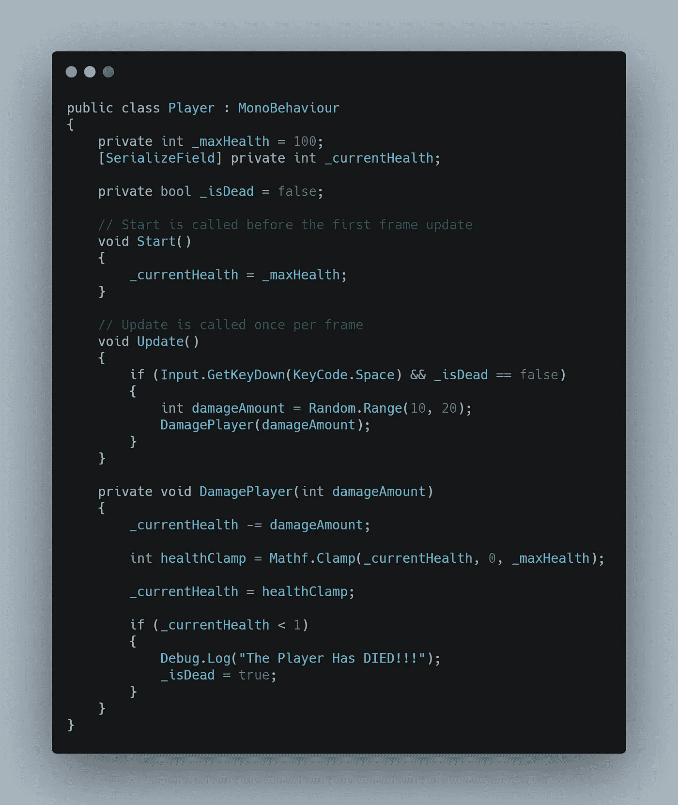

# 方法

> 原文：<https://levelup.gitconnected.com/methods-f31edbc52963>

什么是方法？*方法*和*函数*可以互换使用，只有方法是 C#特有的。方法就像是指令的子集，可以被注入到脚本中以增加整洁性和功能性。像脚本一样，方法从上到下运行。当您从脚本中调用一个方法时，该方法将在从它被调用的地方继续之前完整地运行。

方法也可以带*参数*。当调用带有所需参数的方法时，调用必须包含一个与要传递的数据类型相匹配的*值*。一个方法可以要求尽可能多的参数来完成手头的任务。

作为一个挑战，我的任务是通过由*空格键*触发的一些方法*参数*来传递一个*对象*和一个*颜色*。

创建一个普通的 3D 立方体，并通过*检查器*将其分配给主摄像机的 *ChangeColor* 类组件中的 *cubePrimitive3D* 变量。一个*新的* *颜色*变量被声明并分配给*蓝色*。

在 void *更新*中，检查*空格*键。按下时，调用 *ChangeObjectColor* 方法，使用 *cubePrimitive3D* 和 *newColor* 变量满足两个必需的*参数*。

*ChangeObjectColor* 方法接受两个*参数*然后开始工作。被质疑的对象是 *null* 检查终身。如果对象是活动的，使用 *GetComponent* 抓取 *MeshRenderer* ，然后颜色被赋予 *newColor* 值*(蓝色)*。

这是一个当空格键被按下时立方体变成蓝色的片段。

对于另一个挑战，玩家必须受到*随机*数量的伤害，玩家*生命值*不能低于*零，*并且在玩家生命值达到零后不能再次调用该方法。我从两个 *int* 值开始。第一个保存 *maxHealth* 值 *100* ，第二个保存 *currentHealth* 的未赋值。引入一个数据类型为 *bool* 的变量来检查玩家*是否死了*。

在 void *Start* 中，我将 *currentHealth* 赋值为 *maxHealth* 值。

在 void *Update* 中，检查空格键并添加*is dead*bool is*false*作为通过条件。引入了一个名为 *damageAmount* 的局部 *int* 变量，并赋予了一个在 10 到 20 之间的*随机*范围。然后调用*player image*方法，这需要传递一个强制的 *int* 值。在 10 到 20 之间随机产生的*伤害量*是玩家每次按空格键时通过的。

*DamagePlayer* 方法获取 damageAmount，并立即从*当前生命值*中减去该值。一个名为 *healthClamp* 的本地 *int* 变量被声明，并被赋予 *Mathf 的值。夹具*，用于将*当前健康*值保持在规定的最小*值*和最大*值*之间。

在将*当前健康*值指定为新的箝位值后，我会检查*当前健康*是否小于 1。如果玩家的生命值小于 1，控制台会收到一条消息，表明*玩家已经死亡*，并且*是死亡*布尔翻转到*真*以防止空格键再次触发方法。

这里你可以看到*当前健康*值在*检查器*中减少。

控制台告诉我*玩家*已经死亡！

对于一个额外的挑战，我的任务是存储一个包含 *5 个位置*的*数组*。然后我必须使用一种方法*随机化*返回位置，另一种方法*将位置分配给*游戏对象。与其在 void *Start* 中做这一次，我决定在 void *update* 中添加我的空格键检查。

我从一个名为*rand composition*的 *int* 变量开始，它将简单地存储一个随机的*索引值*供数组返回。声明一个名为*位置*的*向量 3* 数组，分配 *5* 个不同的位置。

*randomPosition* 变量被赋予 *RandomPositionIndex* 方法的值，该方法返回一个介于零和数组中任意多个位置之间的公共 *int* 值。既然已经通过 Index 方法运行了 randomPosition 变量以获得适当的存储值，那么就可以通过 *NewRandomPosition* 方法使用它来分配最终的位置值。该方法从*位置索引*、中获取一个 *int* 值，该数字将引用哪个位置被分配给对象的变换！

这是按下空格键时立方体改变位置的剪辑。

当谈到编写清晰和功能性的代码时，方法和方法参数确实打开了强大的大门。感谢您的阅读！