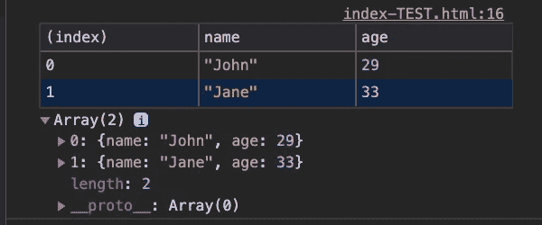

# 您不知道可以在控制台对象上使用的方法

> 原文：<https://levelup.gitconnected.com/methods-you-didnt-know-you-could-use-on-the-console-object-ecb6e1f4d941>


[Kelly Sikkema](https://unsplash.com/@kellysikkema?utm_source=medium&utm_medium=referral) 在 [Unsplash](https://unsplash.com?utm_source=medium&utm_medium=referral) 上拍摄的照片

# 控制台的简要介绍

控制台可能是开发人员最信任的工具。开发人员知道使用控制台可以帮助他们调试代码。当你的代码没有被正确编译时，它会抛出错误信息，并且可以打印你通过使用`console`对象明确告诉它的任何内容。

来自 MDN 官方网站文档:

> `console`对象提供对浏览器调试控制台的访问。…`console`对象可以从任何全局对象中访问。……暴露为`Window.console`，可以简称为`console`。例如:

```
console.log("Hello World")
```

上面的例子使用`console`对象将字符串`Hello World` 打印到调试控制台。我们能够通过使用`console`对象访问调试控制台，并使用内置方法`.log()`将我们想要的任何内容打印到控制台——在本例中，是字符串“Hello World”。

# 方法

`console.log()`是开发人员常用的调试工具。然而，因为`console`仅仅是一个对象，而`.log()`是一个用于该对象的方法，所以可能有一些其他方法可以用于该对象。

根据 Mozilla 官方文档(MDN web docs)，有*二十三个*方法可以在`console`上使用。是的，你没看错——二十三！有些方法是结合使用的，但我还是不知道有这么多。

下面是一些我喜欢并觉得有趣的方法。如果你想看全部 23 个，请访问 MDN 网络文档[这里](https://developer.mozilla.org/en-US/docs/Web/API/console)。

## 1.console.log

好吧，我们已经讨论过这个了。但我想看看你能用它做些什么。

*   **打印多个项目**。您可以在一行中打印相同或不同数据类型的多个项目。请用逗号分隔各项。

```
console.log("Hello", 1, true, null)
```


多种数据类型打印在同一行

*   **使用插值打印变量**。您可以用反斜杠(```)将要打印的字符串换行，并使用`${}`来打印您想要的任何变量。当您试图调试并且不确定变量的值是什么时，这种方法特别方便。

```
const name = "Andy";console.log(`Hello, ${name}!`);
```


使用插值法打印的字符串

*   **使用格式说明符** `**%c**` **用 CSS** 来样式化你的文本。这是一个大多数人不知道的有趣的控制台技巧。在这种情况下，`console.log()`将接受两个参数。第一个是打印到控制台的内容，第二个是您希望使用 CSS 应用的样式。`%c`之后的任何东西都将被样式化。要获得可以与`%c`语法一起使用的属性列表，请点击这里查看 MDN web 文档[。](https://developer.mozilla.org/en-US/docs/Web/API/console)

```
console.log("I am some %cstyled text","background: white; color:black; font-style:italic");
```


应用了 CSS 的字符串

## 2.控制台.警告&控制台.错误

接下来的两个方法`.warn`和`.error`的作用与`.log`相似。它们都用于向控制台输出文本和其他数据。但是，每种方法都会导致日志中的输出样式不同。

```
console.warn("I am a warning.");
```


使用 console.warn 的警告消息

```
console.error("ERROR! Something went wrong.");
```


使用控制台的错误消息。错误

## 3.控制台.目录

如果您想查看 DOM 元素的属性，这个选项特别有用。假设我们有一个想要查看的段落元素(`p`)。我们可以`querySelector`在文档中寻找一个段落元素，并把它赋给一个变量。然后我们可以将该变量传递给`console.dir`并查看与该段落相关的所有属性(即`innerText`)。

```
const p = document.querySelector("p");console.dir(p);
```


链接到 p 的属性的折叠列表


链接到 p 的属性的长开放列表


与 p 关联的 innerText 的值

## 4.console.group & console.groupEnd

当您想要打印数组的属性时，将数据分组在一起特别有用。根据 MDN web docs，你可以创建一个小组，通过可视化地梳理相关材料来帮助组织你的输出。要创建组或块，请调用`console.group()`。要退出群组，只需调用`console.groupEnd()`。例如:

```
const people = [
    { name: "John", age: 29 }, 
    { name: "Jane", age: 33 }
];people.forEach((person) => {
    console.group(`${person.name}`);
    console.log(`This is ${person.name}`);
    console.log(`${person.name} is ${person.age} years old`);
    console.groupEnd(`${person.name}`)
});
```


按姓名分组的人的有组织的输出

## 5.console.time & console.timeEnd

这些方法可用于计时浏览器执行一项任务(即请求数据)所需的时间。每个方法都有一个连接两者的名称。结合使用，它将记录自启动以来经过的时间(秒)。下面是一个来自[韦斯·博斯](https://github.com/wesbos)的例子，他是一名开发人员讲师，开设了#JavaScript30 等课程。名字`“fetching data”`用于连接两种方法，其中`console.time`启动定时器，`console.timeEnd`停止定时器。

> 有趣的事实:一个给定的页面上可以同时运行多达 10，000 个计时器。

```
console.time("fetching data");
fetch("https://api.github.com/users/wesbos")
    .then((res) => res.json())
    .then((data) => {
        console.timeEnd("fetching data");
        console.log(data);
});
```


打印出获取数据所用的时间(18.73095703125 毫秒)

## 6.控制台.表格

table 方法将表格数据显示为表格。举个例子，我们把人们的输出按名字分组。我们可以看到该阵列的全部数据，并以表格形式查看它们

```
const people = [
    { name: "John", age: 29 }, 
    { name: "Jane", age: 33 }
];console.table(people);
```



以表格格式打印的人员数组

这些只是您可以在`console`对象上使用的许多方法中的几个。你对这些感到惊讶吗？如果你对学习更酷的方法感兴趣，我建议你查看 Mozilla 文档，并尝试你感兴趣的方法。

快乐编码😄