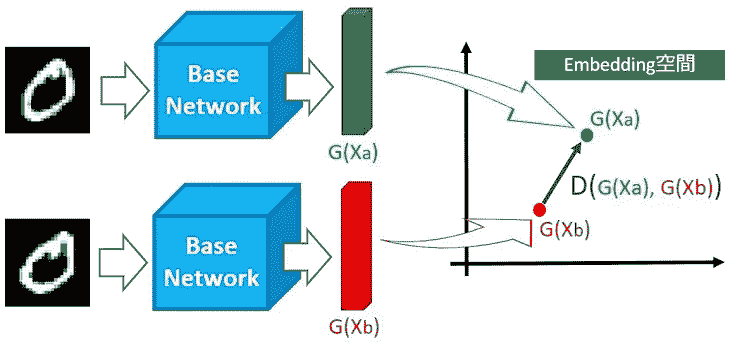
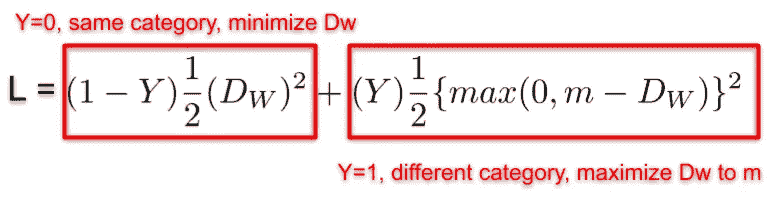
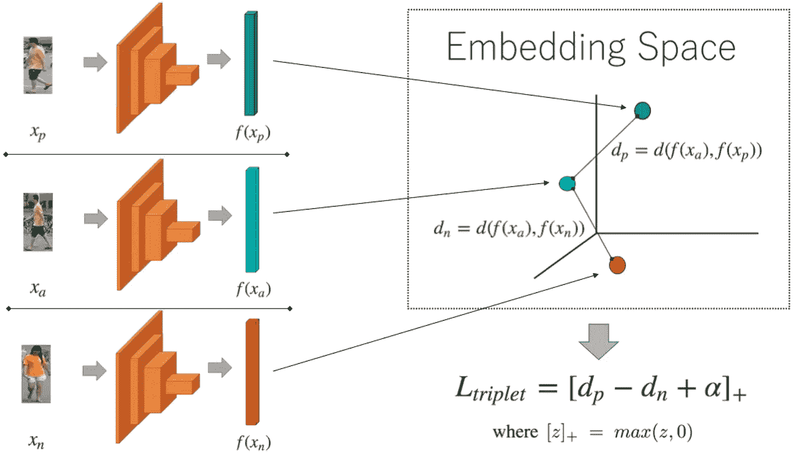
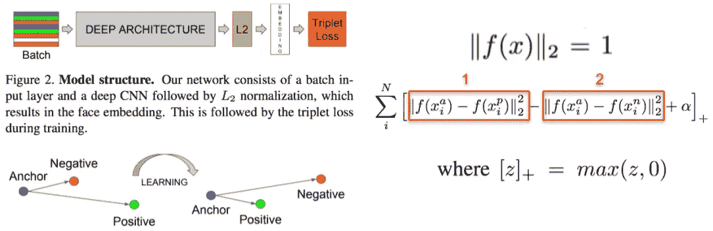

# 使用连体和三重卷积神经网络的度量学习

> 原文：<https://levelup.gitconnected.com/metric-learning-using-siamese-and-triplet-convolutional-neural-networks-ed5b01d83be3>

## 理解概念、方法和在线培训数据挖掘在度量学习中的重要性

马科斯·曼特在 [Unsplash](https://unsplash.com?utm_source=medium&utm_medium=referral) 上拍摄的照片

假设您有一个包含 1000 个人面部图像的数据库，其中只有少数图像代表同一个人。现在你想基于这个数据集建立一个人脸识别系统。你会怎么做？

要建立分类模型？不要！因为每个人只有少量的代表性人脸图像，远远不足以进行分类训练。

实际上，在深度学习和计算机视觉中，这样的任务在过去 15 年中已经得到了很好的研究，这就是所谓的度量学习。

度量学习，顾名思义，就是将图像映射到一个度量空间的技术，在这个度量空间中，同一类的图像靠得很近，而不同类的图像则靠得很远。例如，在上面讨论的人脸识别任务中，模型可以学习对同一个人的人脸图像进行聚类，同时区分不同人的聚类。在推断过程中，测试人脸图像被映射到学习的度量空间，并且它在该空间中最近的聚类正好代表预测的人。

## 与图像分类的区别

如上所述，图像分类模型不能应用于人脸识别任务，因为仅存在同一个人(类)的少量图像，这对于分类任务是远远不够的。再者，如果数据库中增加了一个新人，那么分类模型就要从头重新学习，这在时间和 GPU 资源上代价太大。然而，这些问题根本不是度量学习的问题。

## 通过度量学习的一次性(少量)学习

一次性学习是一种从每个类别的一个或几个样本中学习对象类别的技术。因此，度量学习是一次性学习的良好实现，因为每个类别的样本数量仍然很少。

## 基本概念

由于度量学习是学习一个潜在空间，其中不同类别的样本可以被区分，潜在空间内样本的表示是非常重要的。如下面所示的技术，表示将是 1D 潜在向量，并且欧几里德距离用于计算潜在空间中两个潜在向量之间的距离。

那么我们如何从训练样本图像中得到潜在向量呢？卷积神经网络(CNN)就是答案。然而，与分类或语义分割等其他任务(其中一个输入样本足以获得一个估计输出)不同，用于度量学习的 CNN 模型需要至少两个输入样本来获得估计输出。这是因为该模型需要知道两个输入样本是否属于同一类别，以便该模型可以学习对两个潜在向量进行聚类，或者将它们保持在预定义的距离。本着这种精神，度量学习通常使用两种网络:连体网络和三联体网络。

## 暹罗网络与对比损失

图 1:暹罗网络

暹罗网络，顾名思义，需要一对输入样本图像来得到一对潜在向量。如图 1 所示，两个样本图像 Xa 和 Xb 被一个接一个地馈送到基网络中，以获得潜在向量 G(Xa)和 G(Xb)。这里，仅存在一个基本网络，并且其权重由两个输入样本图像共享。然后在潜在嵌入空间中，计算两个潜在向量之间的距离 D。最后，将计算出的距离 D 代入损失函数(图 2 ),并通过反向传播来调整基网络，以便更好地嵌入潜在向量。

图 2:对比损失

为了根据两个输入样本是否属于同一类别的标签来计算损失，Hadsell 等人在 15 年前提出了对比损失。损失函数如图 2 所示，其中 Y 是二进制标记，Y=0 表示两个输入样本属于同一类别，否则 Y=1。再仔细看，Y=0 时，只存在第一项，Dw 最小化；当 Y=1 时，仅存在第二项，Dw 最大化为 m，这是用户定义的超参数。从概念上讲，当两个输入样本属于同一类别时，它们尽可能接近地被聚类；否则，它们之间的距离为 m。如果来自不同类别的两个潜在向量之间的距离已经大于 m，则损失为零，并且根本学不到任何东西。

对比损失的 pytorch 实现如下:

## 三线态网络和三线态损耗

图 3:三联体网络

三联网络是连体网络的改进。顾名思义，需要三个输入样本图像，称为锚样本、正样本和负样本。首先，选取锚样本，然后从与锚样本相同的类别中选取正样本，从与锚样本不同的类别中选取负样本。三重网络优于连体网络，因为它可以同时学习正距离和负距离，并且训练数据的组合数量增加，以防止过度拟合。

图 4:三重态损失

三重损失用于计算三个输入样本的估计结果的损失。在概念上，如图 4 所示，三元组网络学习减少锚和正之间的距离，同时增加锚和负之间的距离(图 4 左侧)，使得两个距离的差将达到α，这是用户定义的超参数(图 4 右侧)。在图 4 的损失函数中，第一项是锚和正之间的距离，第二项是锚和负之间的距离。第一项的值被学习为较小，而第二项的值被学习为较大。如果它们的差小于负α，损耗将变为零，网络参数将根本不会更新。

在三重丢失的一些社会实现应用中，标签数据的产生是具有挑战性的。实际上，训练三元组有两个部分:锚正对和锚负对。同样，三重态损耗也有两部分:锚正对贡献的损耗和锚负对贡献的损耗。此外，锚负对训练数据容易获得，而锚正对训练数据很难获得。因此，锚负对的总数远远多于锚正对，这将导致锚正对上的过度拟合。解决这一问题的方法是控制两种配对数据之间的比例，如 1:3 等。这种思想类似于异常标记数据数量太少的异常检测任务。

三重态损失的 pytorch 实现如下:

## 在线三元组挖掘

三元组网络很难快速有效地训练。一个主要原因是在网上选择训练三胞胎的随机性。如上所述，如果输入三元组已经是可预测的，其中两个距离的差已经达到α，损耗为零。因此，如果许多训练三元组已经是可预测的，则网络参数根本不会被更新，并且浪费了太多的时间和计算资源。为了解决这个问题，人们选择难以预测的硬样本进行训练。例如，使用大批量，并且在批量内，计算锚和阳性/阴性样品之间的所有距离。然后根据计算的距离选择训练三元组[Schroff 等人]。

## 参考

一次性学习，维基百科

通过学习不变映射进行降维，Hadsell 等人，CVPR 2006 年

FaceNet:人脸识别和聚类的统一嵌入，Schroff 等人，CVPR 2015 年

 [## 加入我的介绍链接-陈数杜媒体

### 阅读陈数·杜(以及媒体上成千上万的其他作家)的每一个故事。您的会员费直接支持…

dushuchen.medium.com](https://dushuchen.medium.com/membership)