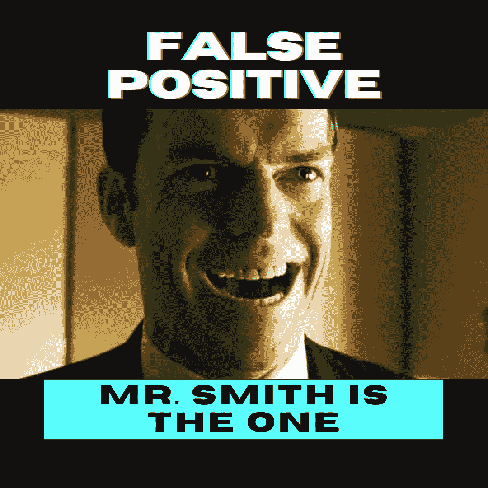
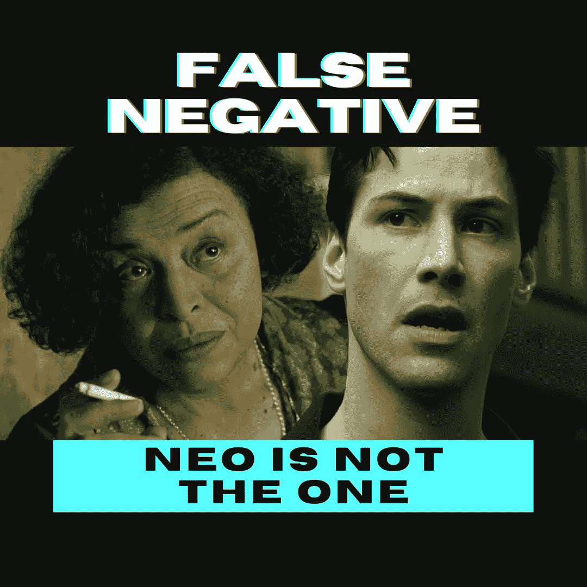
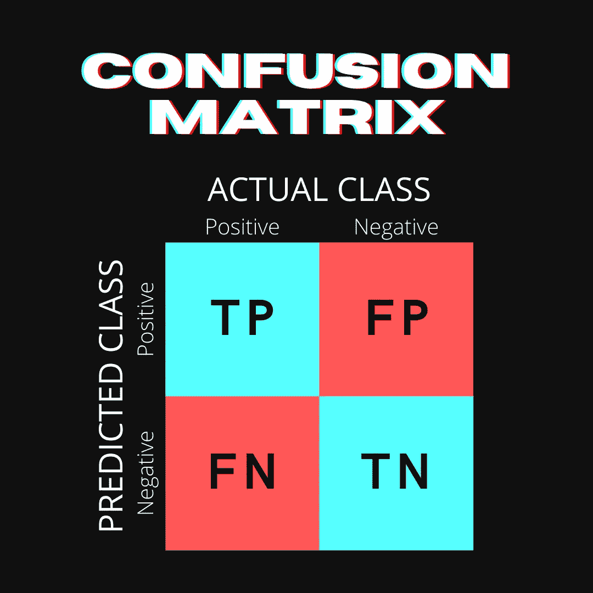
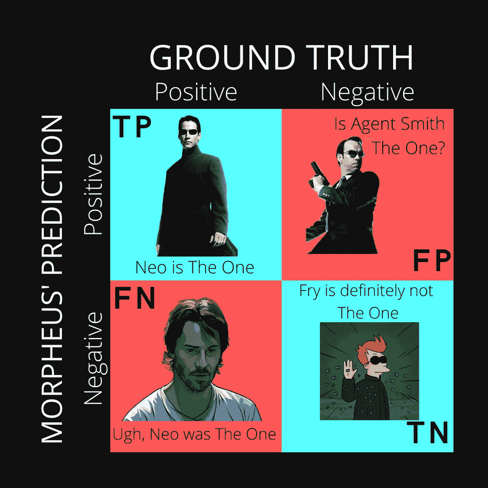
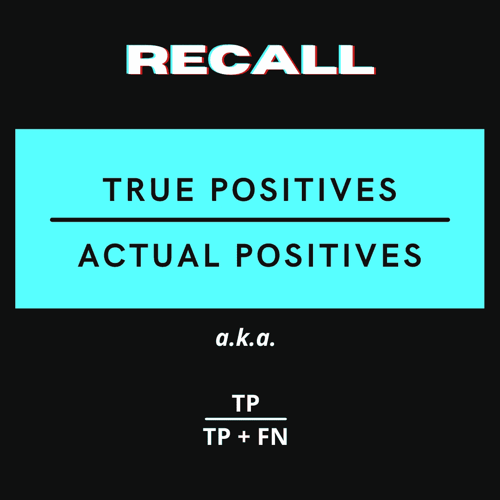
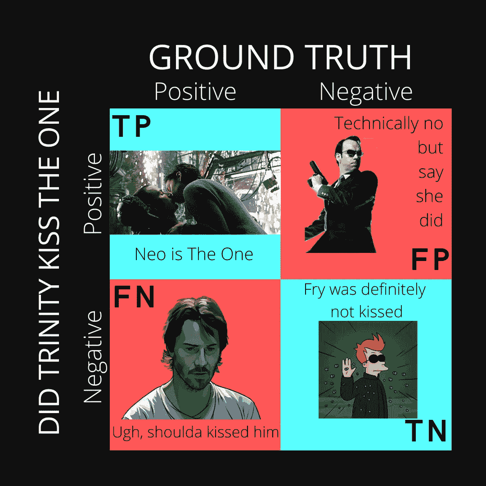
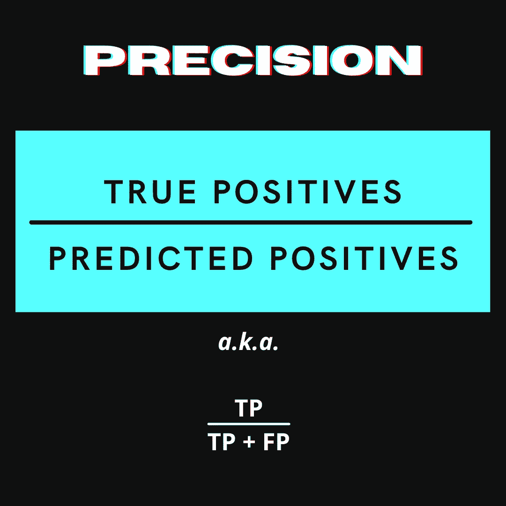
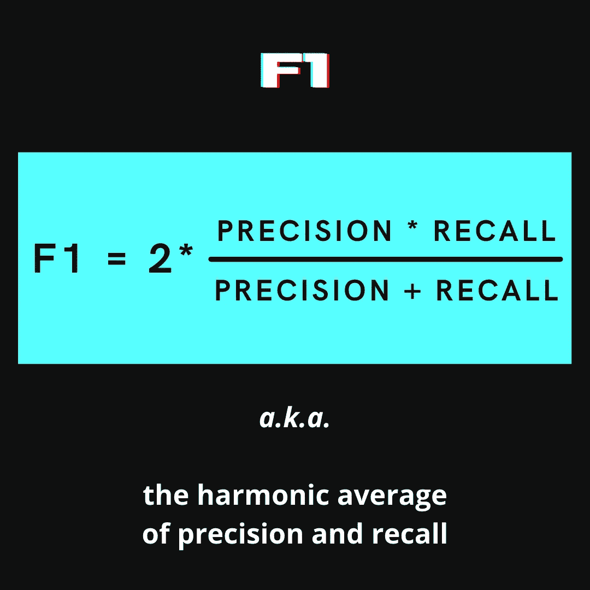

# 矩阵中的指标

> 原文：<https://levelup.gitconnected.com/metrics-in-the-matrix-95800fe93254>

## 机器学习中度量标准的简单介绍(有来自*《黑客帝国》电影的有趣类比)*

虽然这篇博客文章并不支持《T2》《黑客帝国》《T3》是有史以来最伟大的科幻电影之一《T4》《T5》，但如果你最终有这种感觉，我不会失望。需要澄清的是，对于三部曲剩余部分的粉丝来说，类似的情绪可能并不普遍，尤其是最近重启的 [*《黑客帝国》复活*](https://www.looper.com/284930/why-the-matrix-is-the-best-sci-fi-movie-ever) *。*

我将分解基本的机器学习指标，包括**准确度**、**召回率、**和**精确度**以及**混淆矩阵、第一类错误和第二类错误。**所有这些都伴随着通过*矩阵*的小小心灵旅行，希望能建立你的直觉。

*(*

# 准确度不够吗？

机器学习中的一个基本过程是二分类。这仅仅意味着决定某样东西是否应该有一个标签。在监督学习模型中，初始数据将教会我们的模型什么是正确的标签。基于此，模型将学习预测新数据的标签。我们如何判断我们的模型做得有多好？自然地，我们的大脑会考虑准确性——模型的所有预测中有多少是正确的？

在评估模型时，准确性无疑是非常重要的。但是，不一定总是最好的！假设我们试图标记信用卡上的欺诈交易。如果 99%的交易是合法的，只有 1%是欺诈性的，一个模型可以说所有的交易都是合法的，而且 99%准确！然而，这对于抓住罪犯没有太大的帮助。根据您的目标，还有其他可能更有用的指标选项。

在我们进入其他指标和混淆矩阵之前，上面公式中的缩写 TP、TN、FP、FN 是什么意思？首先，我们需要解决一个经常让人们困惑的问题:第一类和第二类错误(也称为假阳性和假阴性)。

# 第一类和第二类错误

好吧，回到我们的电影参考。你知道吗，有一个非常有趣的理论[认为特工史密斯实际上是‘那个人’？对于大多数不相信这是真的粉丝来说，声称史密斯先生是“唯一”将是一类错误——或假阳性(FP)。](https://www.thewrap.com/the-matrix-the-one-agent-smith-neo-keanu-reeves-hugo-weaving/)

在故事的早期引入的主要紧张之一是尼奥试图弄清楚他是否真的是“那个人”。当神谕(显然是一个非常明智的先知)告诉他，他不是“那一位”时，这变得尤其困难。如果我们假设他确实是‘那个人’(即使在那个时候)，那么先知告诉他的话将被认为是第二类错误——或者假阴性(FN)。

# 带来(混乱)矩阵！

因此，随着假阳性(FP)和假阴性(FN)的解决，理解混淆矩阵变得容易多了。让我们开始吧，让我先问一个问题——什么是矩阵？

> 在数学中，矩阵(复数矩阵)是按行和列排列的数字、符号或表达式的矩形阵列或表格。([维基百科](https://en.wikipedia.org/wiki/Matrix_(mathematics)))

在我从事数据科学研究的早期，我遇到了一个重要的版本，叫做混淆矩阵。诚然，我最初试图快速理解这一重要工具的尝试让我感到困惑(因为没有更好的词)。(补充说明,“混乱”是指模型在做出正确预测时有多混乱。)让我们来看看混淆矩阵所传达的信息:

# 回忆

好吧，没有电影参考这没什么用，对吧？让我们以墨菲斯为例。神谕告诉他，他会找到“那个人”。本质上，他是一个二元分类算法，应该能够根据一组给定的人类特征来标记“那个人”。

对莫斐斯来说什么会更糟？认为某人是“唯一”，但随后发现他们实际上不是(FP)或者认为某人是*而不是*“唯一”，然后因为他错了而使人类彻底灭亡(FN)？在这种情况下，因为只有一个“唯一”，所以 FN 的成本更高。这就是我们需要关心是否有更高的回忆分数的时候了。公式如下:

上面的欺诈交易示例是我们需要高召回分数时的真实示例。将欺诈交易标记为非欺诈(FN)的成本远远高于将非欺诈交易标记为欺诈(FP)的成本。高召回分数与较少的假阴性相关。

# 精确

让我们看看另一个人，他收到了神谕的预言。崔妮蒂被告知她会爱上“那个人”。她确定尼奥一定是“那个人”，因为她对他产生了强烈的感情。然而，当尼奥告诉她他认为(关键词:认为)神谕告诉他他不是“那个人”时，这一切变得非常混乱。有一个史诗般的场景，尼欧在《黑客帝国》中死去，也即将在现实世界中死去。在现实世界中，崔妮蒂冒着极大的风险和他在一起，并以一个吻来表达她对尼奥的爱。

冒着过于简单化的风险，如果我们把这个吻看作是一个二元分类器，它要么将接收者标记为真正的“那个人”，要么不是，那么对三一来说什么是重要的呢？目标是减少 FP 的机会。在这种情况下，吻是精确的；拯救尼欧，崔妮蒂，大概还有全人类。这里是精度的公式:

需要高精度分数的一个真实例子是垃圾邮件标签。如果您的垃圾邮件过滤器的精确度分数较低，则更有可能将非垃圾邮件标记为垃圾邮件(FP)。**高精度分数与较少的假阳性相关**。

# 子一代

如果查全率和查准率都很重要怎么办？这就是 F1 分数发挥作用的地方！它平衡了模型的查全率和查准率，并将惩罚上述两个分数的不平衡。公式如下:

因此，具有完美回忆和精确度的模型将得到 1 分的 F1 值。然而，具有完美回忆或精确的模型，然后在另一个中得分为 0，则 F1 得分为 0。因此，像本博客前面描述的那个模型，猜测所有信用卡交易都不是欺诈性的，其准确率为 99%，但 F1 值只有 50%！

# 结论

有很多方法可以衡量你的机器学习模型在精确度之外做得有多好。我希望这些(诚然错综复杂的)矩阵电影类比能有助于你对精度、回忆和 F1 工作等分数的直观理解，以及何时使用它们会有好处。

# 附言

## 医学诊断测试怎么样(比如 Covid 测试)？

很棒的问题！这是我问自己的一个问题，当我写这篇文章的时候。医学测试使用略有不同的指标术语，即灵敏度和特异性。**灵敏度**与回忆完全重叠，如上所述——一项测试在检测阳性方面有多好？**特异性，**虽然在最小化假阳性方面类似于精度，但提出了新的公式:TN / (TN + FP)。简单地说— [测试在避免错误警报方面有多好](https://uberpython.wordpress.com/2012/01/01/precision-recall-sensitivity-and-specificity/)(阅读最后一个链接以获得更深入的解释)。

所以我把这个问题抛给你——*对于 Covid 测试来说，灵敏度和特异性哪个更重要？*