# 度量:用 Docker 可靠地配置 Prometheus 和 Grafana。

> 原文：<https://levelup.gitconnected.com/metrics-reliably-configuring-prometheus-and-grafana-with-docker-2077541c8e6d>

## 技术堆栈:普罗米修斯，格拉夫纳，码头工人，码头工人-组成。

关于如何将指标集成到您的应用程序中，有很多很好的指南，因此您可以在 Prometheus 中使用它们，例如，有一个优秀的 [Java 客户端](https://github.com/prometheus/client_java)和来自流行 web 框架的一级支持，如 [Spring](https://docs.spring.io/spring-metrics/docs/current/public/prometheus) 。然而，我很难找到如何收集这些指标的信息，以及一旦设置好仪表板，您将如何可靠地进行版本控制和部署。

因此，本指南将带您了解 Prometheus 如何收集指标，然后再用 Grafana 可视化它们。随着事情的进展，我们将关注如何存储和版本化这个配置，这样它就可以用 Docker 可靠地部署。

# 步骤 1:了解如何收集指标

> 本指南将运行一个显示主机和端口指标的应用程序:**http://yak-server:9001/metrics**。

假设您的应用程序正在运行，并且您已经将一些指标集成到其中，首先要理解的是 Prometheus 是如何访问这些信息的。

当你运行普罗米修斯，你配置它“刮”某些目的地。这意味着普罗米修斯，比方说每 15 秒，将调用您的指标端点，然后存储结果；这就是所谓的拉式架构(Prometheus 正在将指标拉向它)。因此，您的应用程序只需要提供一个获取指标的位置，剩下的工作 Prometheus 会完成(图 1)。

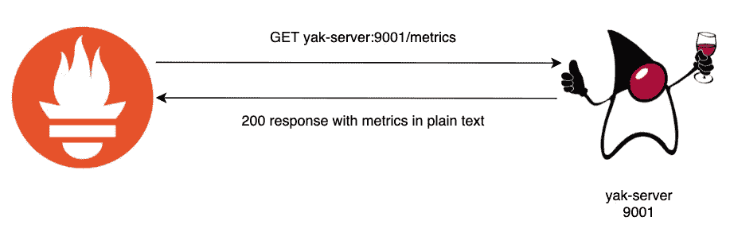

图 1: Prom 每隔 15 秒查询您的应用程序，以获取新的指标。

一旦 Prometheus 收集了您的指标，它会将它们存储在一个时间序列数据库中，以供查询。为了查询它们，Prometheus 提供了一种强大的查询语言，您可以通过 API 或在 Prometheus UI 中使用。这些查询就是您随后在 Grafana 中配置以在仪表板中显示图形和信息的内容(图 2)。

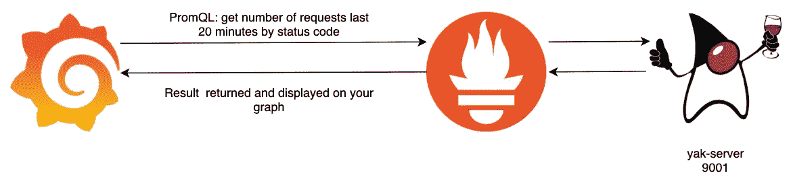

图 2: Grafana 根据您在仪表板中的设置查询 PromQL。

因此，对于这种架构，为了可靠地部署它，我们需要:

*   配置 Prometheus scrape 配置，告诉它我们的应用程序位于何处，以及从它那里获取指标的频率。
*   将指标存储在持久卷中，这样，如果 Prometheus Docker 映像停止，我们就不会丢失它们。
*   配置 Grafana 以找到 Prometheus 实例，这样我们就可以可视化我们正在收集的指标。
*   用我们想要显示的查询/图形配置 Grafana 仪表板。
*   存储这些仪表板，以便我们可以在 Grafana Docker 映像停止时再次部署它们。

# 步骤 2:使用 Docker Compose 部署度量管道

获得该架构的可靠部署的第一步是简单地获得我们需要在本地运行的映像。创建以下文件夹结构:

```
your-folder-location/
┣ grafana/
┃ ┣ dashboards/
┃ ┃ ┗ my-dashboard.json
┃ ┗ provisioning/
┃   ┣ dashboards/
┃ ┃ ┃ ┗ all.yml
┃   ┣ datasources/
┃ ┃ ┃ ┗ all.yml
┃   ┗ config.ini
┣ prom/
┃ ┣ prometheus.yml
┃ ┗ rules.yml
┗ docker-compose.yml
```

这个结构包含了我们在本文中需要的所有东西，当我们将它合并到我们的部署中时，我们将仔细检查每个文件。如果您想跳过这篇文章，只看一个示例部署，请访问这里的。

打开 **docker-compose.yml** 复制启动配置:

```
version: '3.7'

services:

  yak-server:
    image: guardiandevelopment/yak-server:1.0.0.SNAPSHOT
    ports:
      - 9000:9000
      - 9001:9001
    deploy:
      resources:
        limits:
          cpus: '1'
          memory: 250M

  prom:
    image: prom/prometheus:v2.27.1
    ports:
      - 9090:9090

  grafana:
    image: grafana/grafana:7.5.7
    ports:
      - 3000:3000

volumes:
  *# store prom metrics between runs* prometheus_data: {}

networks:
  default:
    name: metrics-network
```

有了这个存储，您应该能够运行以下命令:

```
docker-compose up
```

然后访问以下链接:

*   普罗米修斯:[T5 http://localhost:9090/graph](http://localhost:9090/graph)
*   grafana:[**http://localhost:3000/**](http://localhost:3000/)**登录默认为 admin:admin。登录后，只需跳过设置另一个用户，因为这超出了本指南的范围。**
*   **来自应用程序的指标:[**http://localhost:9001/metrics**](http://localhost:9001/metrics)这将是我们告诉 Prometheus 要收集的内容，但它会让您了解本指南中可用的指标的格式和类型。**

**现在我们已经完成了，我们将从第一步开始合并每个配置文件来构建我们的架构。现在，您可以运行以下命令来停止一切:**

```
# turn off all images and volumes, remove the -v 
# if you want volumes persisted between between runs
docker-compose down -v
```

## **配置普罗米修斯刮擦目标**

**为了让 Prometheus 从我们的应用程序中收集指标，我们需要配置它的抓取目标。这将告诉 Prometheus 收集指标的频率，以及在哪里找到我们应用程序的端点。将以下配置添加到**。/prom/prometheus.yml:****

```
global:
  scrape_interval: 15s
  evaluation_interval: 15s
  external_labels:
    monitor: 'yak-monitor'

*# extra: include rules for alerting* rule_files:
  - rules.yml

*# IMPORTANT BIT HERE: targets for scraping metrics from* **scrape_configs**:

  - job_name: 'prometheus'
    scrape_interval: 5s
    static_configs:
      - targets: [ 'prom:9090' ]

  - job_name: 'yak-server'
    scrape_interval: 5s
    static_configs:
      - targets: [ 'yak-server:9001' ]
```

**这个配置的重要部分是 **scrape_configs** 部分。这将配置 2 个目标:**

1.  **它从**自身**中寻找度量标准。这是非常标准的，允许您查看 Prometheus 实例的性能和健康指标。**
2.  **我们设置了 **yak-server:9001** ，它抓取我们的应用程序。由于这是在 docker-compose 中运行的，yak-server DNS 条目将对 Prometheus 可用。如果你已经运行了你自己的应用程序，确保更新它以与之匹配。**

**有了这个配置，将以下内容添加到 docker-compose 中的 Prometheus 映像:**

```
prom:
  image: prom/prometheus:v2.27.1
  ports:
    - 9090:9090
  volumes:
    - **./prom/prometheus.yml:/etc/prometheus/prometheus.yml**
    - **./prom/rules.yml:/etc/prometheus/rules.yml**
```

**这将把我们刚刚配置的 **prometheus.yml** 文件挂载到容器中的一个位置，在启动时可以在这个位置找到它。如果您想添加警报，这还会挂载 **rules.yml** 文件(如果您对此感兴趣，请参见本文底部的附加部分)。**

**要对此进行测试，请运行以下命令并导航到 Prometheus UI。**

```
docker-compose up
```

**如果您随后运行以下查询，您应该看到 Prom 已经成功地从应用程序获得了 JVM 信息，表明它已经成功地收集了指标:**

**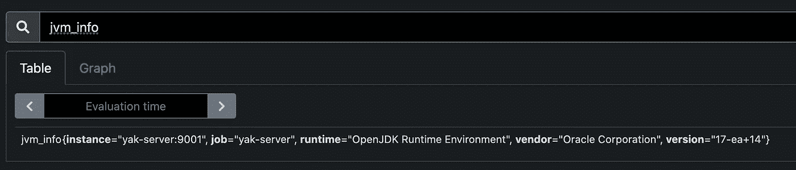**

**图 3:显示了一个 PromQL 查询来获取由 yak-server metrics 端点发布的 jvm_info。**

**就是这样！现在，您已经有了从应用程序中提取到 Prometheus 的指标。**

## **将普罗米修斯度量存储在持久卷中**

**在大多数设置中，最好将指标保持在 Prometheus 容器生命周期之外。幸运的是，Prometheus 将其所有时间序列数据放在一个已知的文件夹中，这意味着我们可以将其作为一个卷来装载，并在应用程序运行之间保存指标。将以下内容添加到 docker-compose 文件中:**

```
prom:
  image: prom/prometheus:v2.27.1
  ports:
    - 9090:9090
  volumes:
    - ./prom/prometheus.yml:/etc/prometheus/prometheus.yml
    - ./prom/rules.yml:/etc/prometheus/rules.yml
    - **prometheus_data:/prometheus**
```

**你可以看到它引用了 compose 文件中的卷，并将它挂载在**/普罗米修斯。**这保持了 docker-compose down/up 操作之间的度量。但是，如果您想从头开始，只需运行:**

```
docker-compose down -v
```

**该命令不仅会关闭容器，还会删除所有卷。**

**这样，我们现在有了指标收集和存储，是时候使用它们在 Grafana 中绘制图表了！**

## **配置格拉夫纳寻找普罗米修斯**

**现在，让我们使用新的指标来创建一个控制面板。为此，我们需要告诉 Grafana 如何找到普罗米修斯服务。转到**。/grafana/provisioning/data sources/all . yml**并添加以下配置:**

```
apiVersion: 1

*# tells grafana where to find the prom connection* datasources:
  - name: 'prometheus'
    type: 'prometheus'
    access: 'proxy'
    url: '**http://prom:9090**'
```

**这告诉 Grafana 我们的 Prometheus 实例的确切位置，它等于 docker-compose 文件中的容器名。为了让 Grafana 选择这个配置，您需要将以下内容添加到**。/grafana/config.ini****

```
# place to find startup config
[paths]
provisioning = **/etc/grafana/provisioning**

[server]
enable_gzip = true
```

**最后，我们需要通过用以下内容更新 docker-compose 文件来使这个配置对 Grafana docker 映像可用:**

```
grafana:
  image: grafana/grafana:7.5.7
  ports:
    - 3000:3000
  volumes:
    - **./grafana/provisioning/datasources:/etc/grafana/provisioning/datasources
    - ./grafana/config.ini:/etc/grafana/config.ini**
```

**准备就绪后，重启您的应用程序:**

```
docker-compose down -v
docker-compose up
```

**然后转到 Grafana UI。登录后，您应该能够执行以下操作:**

**转到管理仪表板:**

**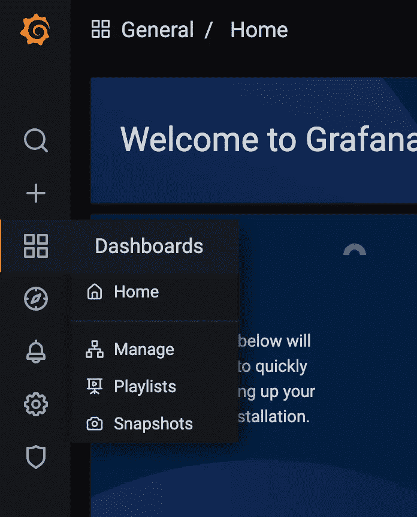**

**然后点击“新仪表板”:**

**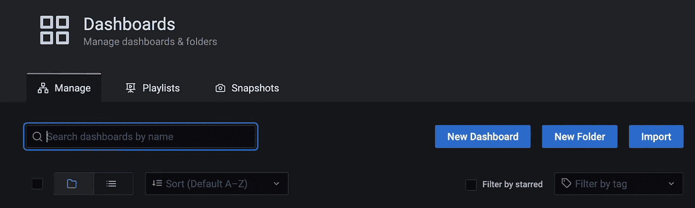**

**接下来，选择添加一个空面板:**

**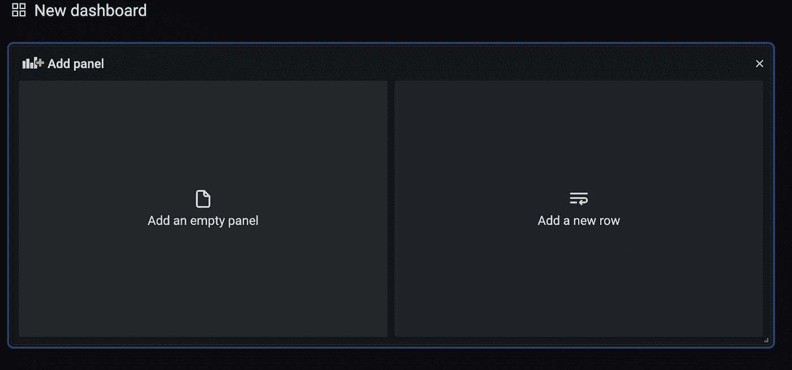**

**选择 Prometheus 数据源，它现在连接到我们的 Prometheus docker 容器:**

**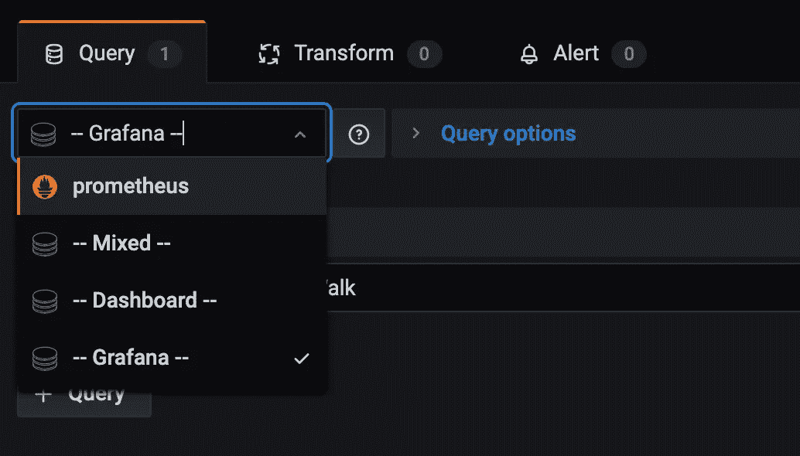**

**然后为 **jvm_info** 添加与之前相同的测试查询。确保在查询文本输入之外单击，您应该看到以下内容:**

**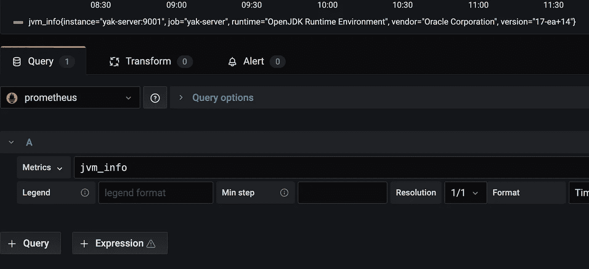**

**这并不是一个非常有用的面板，但是它显示了 Grafana 正在查询 Prometheus，它正在从我们的应用程序中抓取信息！本指南的最后一部分将向您展示如何创建一个简单的仪表板，并保存它以便您可以将其签入到版本控制中。**

## **创建 Grafana 仪表板**

**继续上一节，让我们将一个有用的面板添加到我们的仪表板中。输入以下查询，而不是 jvm_info:**

```
sum(rate(thread_heartbeat_total[$__rate_interval])) by (thread_name)
```

**在图例框中添加以下内容:**

```
{{ thread_name }}
```

**这个指标直接来自我们的应用程序。这是应用程序运行的每个线程的计数器，显示它完成所有必须做的工作的时间。这个指标可以让你看到每个线程的速度，以及它们在应用程序中完成工作的速度。点击右上角的“应用”保存面板，给它一个标题，比如“线程心跳率”。**

**您现在将进入一个类似于以下内容的页面:**

**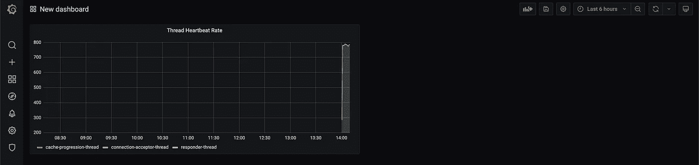**

**现在我们有了一个仪表板，让我们保存它，这样它在启动时总是可以在我们的 Grafana 容器中使用。**

## **存储 Grafana 仪表板**

**在“dashboard”页面上，转到右上角并单击“save”按钮。**

**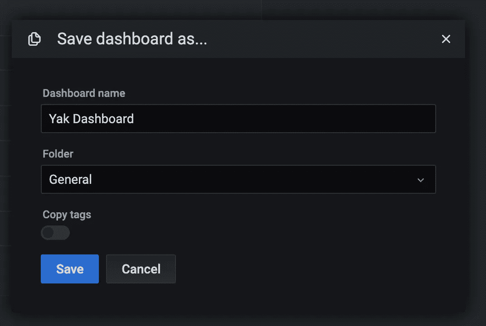**

**给它起一个好名字，然后点击保存。不要担心文件夹，因为它会自动控制仪表板的下一个位置。保存后，转到右上角的设置轮。**

****

**然后转到 JSON 模型:**

**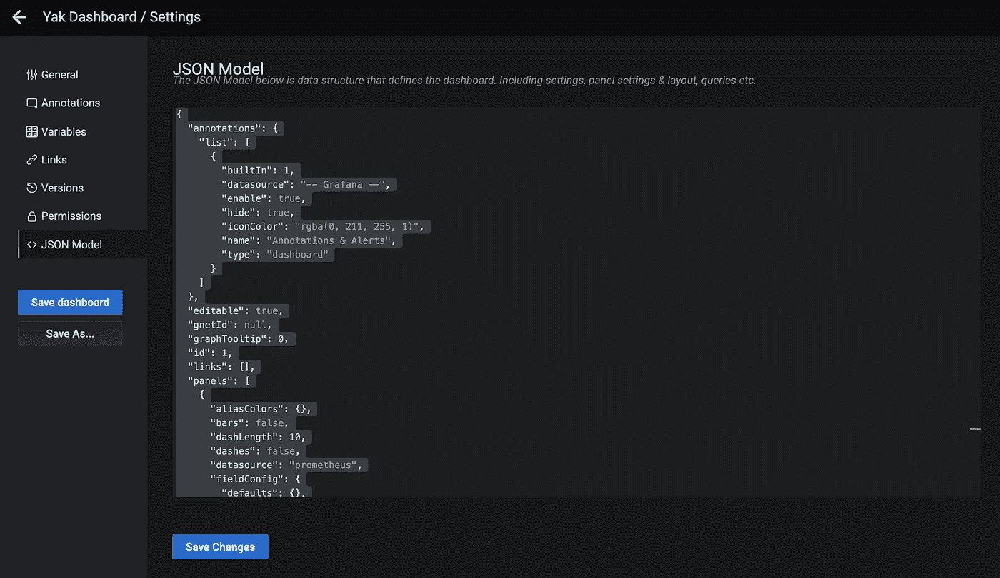**

**这个模型代表我们已经创建的仪表板，并且是我们需要存储以便再次创建它的内容。将这个 JSON 模型的内容复制到文件**中。/grafana/dashboards/my-dashboard . JSON**文件。现在你有了你的仪表板，让我们告诉 Grafana 如何在启动时加载它，这样我们就不需要重新制作了。**

**转到。**/grafana/provisioning/dashboards/all . yml**，并添加以下配置:**

```
apiVersion: 1

*# tells grafana where to find the pre-created dashboards* providers:
  - name: 'default'
    folder: 'yak-dashboards'
    type: 'file'
    options:
      path: '/var/lib/grafana/dashboards'
```

**这告诉 Grafana 在启动时从哪里加载仪表板，以及要使用的文件夹的名称。我们现在需要在 docker 容器中提供这些文件夹。为此，请使用以下内容更新 docker-compose.yml 文件:**

```
grafana:
  image: grafana/grafana:7.5.7
  ports:
    - 3000:3000
  volumes:
    - **./grafana/provisioning/dashboards:/etc/grafana/provisioning/dashboards
    - ./grafana/provisioning/datasources:/etc/grafana/provisioning/datasources
    - ./grafana/config.ini:/etc/grafana/config.ini
    - ./grafana/dashboards:/var/lib/grafana/dashboards**
```

**您可以看到这将 dashboard JSON 文件映射到容器中我们在**中指定的位置。/grafana/provisioning/dashboards/all . YAML**。保存仪表板后，重新启动容器:**

```
docker-compose down -v 
docker-compose up
```

**如果您返回 Grafana UI，将会要求您再次登录。但是，这一次当您进入仪表板页面时，您应该会看到一个文件夹:**

**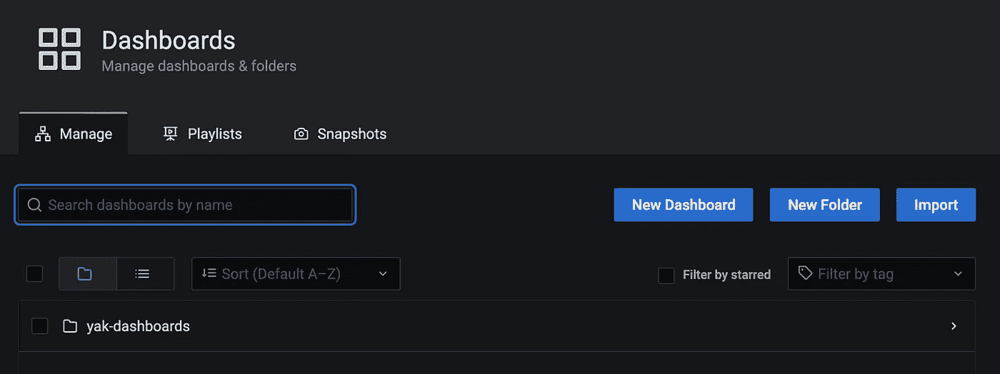**

**如果您单击它，然后在其中打开控制面板，您应该会看到您之前创建的控制面板:**

**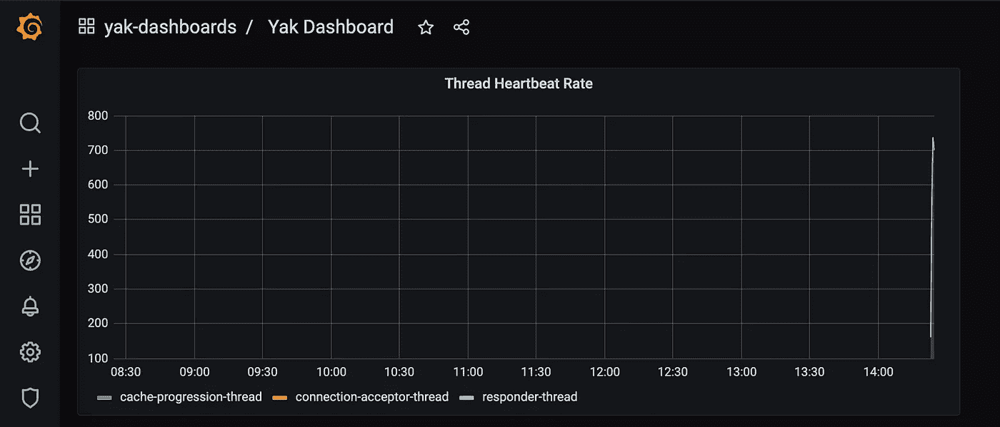**

**从这里开始，您现在有了端到端的指标、仪表板和一种可靠的方式来版本化和配置您的仪表板，以便您可以将它们部署到不同的环境中。**

**这是总结文章的一个很好的观点。我希望这已经向您展示了一些可用的现代度量工具的威力，以及它们的设置和可靠配置是多么简单。在现实世界中，您可以签入我们在某处创建的文件，并在它们发生变化时构建和发布它们；为您提供对仪表板和警报的版本控制和控制。如果您想查看集成在 yak-server 应用程序中的完整示例，请访问这里的。**

**现在，我们来总结最后一条信息。如果您以前使用过 Prometheus，您会知道它还可以提供警报和查询。如果您对警报感兴趣，这最后一节简单地完成了设置。**

# **附加信息:在 Prometheus 中配置警报**

**如果您转到 Prometheus UI，并单击“警报”选项卡:**

**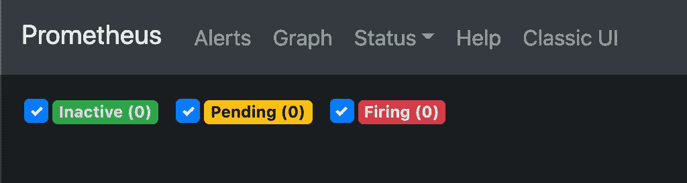**

**您将看到当前没有配置任何警报。然而，我们只需要添加一个文件来启用自动警报(我不会展示集成一个警报管理器来接收这些警报，因为这超出了本文的范围)。**

**转到**。/prom/rules.yml** 文件，并添加以下内容:**

```
groups:
  - name: Yak Server Health
    rules:
      - alert: unable to gather metrics
        expr: scrape_samples_scraped{instance=~"yak-server.*"} == 0
        for: 1m
        labels:
          severity: page
        annotations:
          summary: "{{ $labels.instance }} has not provided metrics in 1m"
          description: "{{ $labels.instance }} may be offline as prom has been unable to gather metrics from it in over 1m"
```

**这是一个警报，它使用 Prometheus 度量来检测我们在超过 1 分钟的时间内无法从任何带有“yak-server”标签的实例收集度量。如果应用程序没有运行，Prometheus 配置不正确，网络中断，就会触发此警报。有很多理由想知道这是什么时候发生的。**

**准备就绪后，重新启动 docker 实例:**

```
docker-compose down -v
docker-compose up
```

**返回到 Prometheus UI 中的 alerts 页面，您应该看到您的警报处于未触发状态。**

**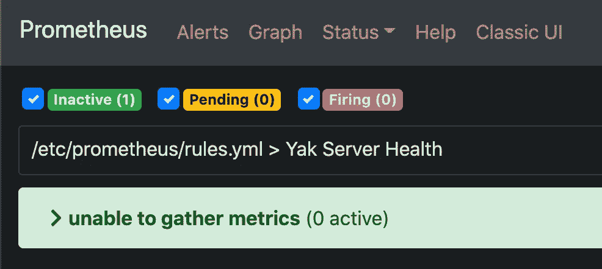**

**现在，如果您停止 yak-server docker 容器:**

```
docker ps # find the container for yak app
docker stop <container id>
```

**如果您等待大约 1 分钟，这是我们在警报配置中配置的，您应该会看到警报进入挂起状态，然后触发。这将通知您已配置的任何警报管理器，或者如果您想要手动检查警报，则直接显示在 Prom UI 中。**

**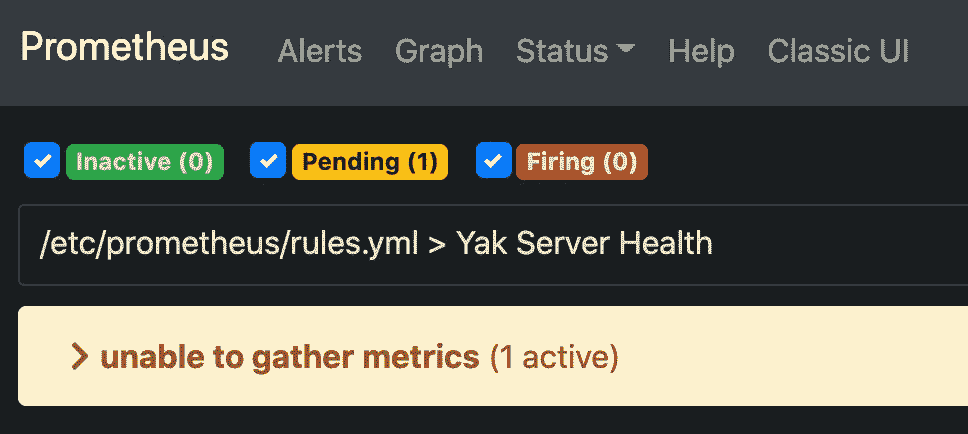****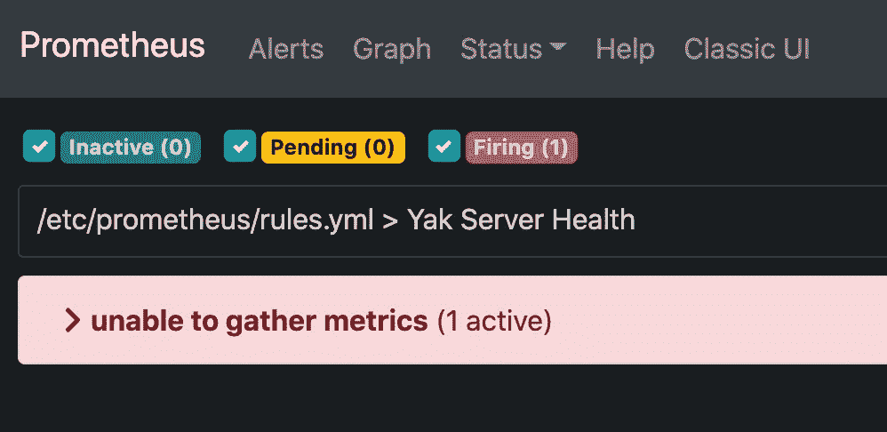**

**这应该包含了您需要了解的所有端到端指标和警报。**

**如果您有任何问题，请随时联系我:**

**[](https://www.linkedin.com/in/joe-honour-8693029a/) [## Joe Honour -高级软件工程师-和数字| LinkedIn

### 我是 AND Digital 公司的高级软件工程师。在我的职业生涯中，我曾在许多领域工作过，最近的工作是交付…

www.linkedin.com](https://www.linkedin.com/in/joe-honour-8693029a/)**