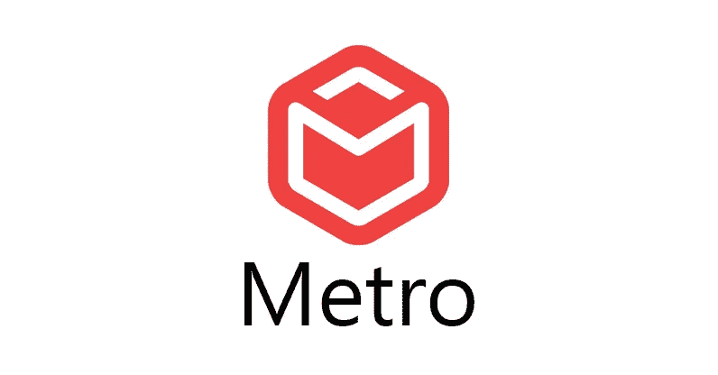

# 麦德龙·邦德勒:引擎盖下

> 原文：<https://levelup.gitconnected.com/metro-bundler-under-the-hood-ffa254b5ca9c>



我们先来试着了解一下什么是**捆绑**。

捆绑是**跟随导入的文件并将它们合并成一个文件**:一个“捆绑包”的过程。这个包可以用来一次加载整个应用程序。


现在来看看我们如何使用 Metro 为我们所有的 **react-native** 应用生成一个包？

Metro 是一个 JavaScript bundler。它接受一个入口文件和各种选项，并返回一个包含所有代码及其依赖项的 JavaScript 文件。

捆绑流程主要包括两个阶段:

# **构建依赖图—**

构建依赖关系图时执行的主要任务有:

1.  **转换模块**:这一步负责[将 JS](https://byby.dev/js-transpilers) 转换成另一种形式，以便任何 javascript 虚拟机都能轻松理解，Metro 使用 babel 来完成这一转换过程。
2.  **收集依赖关系**:在这一步中，Metro 试图通过查看不同模块使用的所需导入来识别模块依赖关系，并帮助构建图。metro 包含了捆绑包中需要的所有模块。
3.  **解析依赖关系**:在这一步中，Metro 试图解析前面步骤中收集的所有依赖关系(因为模块中的 require 语句只是指向 node_modules 中的相对路径或文件)。你可以在这里了解更多信息[。](https://facebook.github.io/metro/docs/resolution)

文件的转换是一项缓慢的任务，因为它涉及到从 Javascript 构建一个 AST(抽象语法树),并对其进行转换，然后从这些 AST 生成 JS 和 sourcemaps。

因此，为了快速完成这一过程，Metro 采用了多种策略:

*   **缓存系统** —这用于尽可能避免转换文件，metro 可以形成多个缓存并遍历它们以避免转换。你可以在这里了解更多。
*   **并行化** —用于并行化 CPU 之间的文件转换，以提高序列化过程的速度。Metro 使用包 [jest-worker](https://www.npmjs.com/package/jest-worker) 来做这件事。你可以在这里了解更多。
*   **Delta Bundler** —用于避免每次重新加载时重新生成依赖关系图，并且仅将更改/差异发送到设备。你可以在这里了解更多

# **图形系列化—**

一旦从上面的步骤中生成了图形，这个过程就会发生。Metro 有许多序列化器，可以执行不同的任务，例如可以用来创建包、sourcemaps*以及将资产存储到磁盘。

一些串行化器就是**普通 JS 包**和**索引 RAM 包**串行化器。

在普通 JS 包的情况下，包是通过简单地遍历依赖图并连接模块来创建的。在这种情况下，运行时和启动代码在启动时与模块一起传递给 JS 虚拟机。

在 RAM 包的情况下，所创建的包是二进制格式的，在这种情况下，只有运行时和启动代码在启动期间被注入到 JS 虚拟机中，并且模块被延迟加载，这就是它比普通 JS 包更快的原因。此外，您可以在这里阅读更多关于这个包如何以这种格式[存储的信息。](https://facebook.github.io/metro/docs/bundling#file-ram-bundle)

# 为捆绑服务—

metro 在运行时通过 http 请求向应用程序提供捆绑包，应用程序自动运行捆绑包中的 javascript。Metro 运行 https 服务器，默认监听端口 8081(这可以通过[配置](https://reactnative.dev/docs/troubleshooting))

当客户机在这种模式下需要一个包时，它会发出一个带有“包 URL”的 http 请求，这只是一个带有查询参数的 http 请求。典型的捆绑包 URL 如下所示:

```
[http://localhost:8081/index.bundle?
platform=android& 
dev=true&
hot=false&
inlineSourceMap=true](http://localhost:8081/index.bundle?platform=windows&dev=true&hot=false&inlineSourceMap=true)&
minify=true
```

这些参数的含义如下:

*   **平台**:需要一个字符串，为其构建一个包的原生平台(例如:android /ios/ windows)
*   **dev** :可选布尔型字段，表示是否必须在开发模式(__DEV__)下构建 bundle，默认值为 false
*   **热**:如果为真，则开启热重装
*   **inlineSourceMap** :它采用一个布尔值，并暗示 SourceMap 是否与 bundle 一起提供。默认值为 false
*   **minify** :取一个布尔值，暗示代码是否应该缩小。
*   **sourceMapUrl:** 它接受一个字符串，并提到可以找到 sourcemap*的 Url。(如果 inlineSourceMap 为 true，则忽略此操作)

**什么是****source map****？*

*A****source map****是生成/编译/缩小的 JavaScript 文件与一个或多个原始源文件之间的映射。sourcemaps 的主要目的是帮助调试。基本上，如果生成的代码文件中有错误，映射可以告诉您原始源文件的位置。*

你可以在这里阅读更多关于如何配置 metro [的内容。](https://facebook.github.io/metro/docs/configuration)

# **参考文献:**

*   [地铁文件](https://facebook.github.io/metro/)
*   [Metro Guide](https://github.com/microsoft/react-native-windows/wiki/Metro-Guide)by react native windows
*   [Rafael de Oleza —为 React Native 构建 JavaScript 包](https://www.youtube.com/watch?v=tX2lg59Wm7g)

# **结论**

本文主要总结 metro bundler 的内部工作方式，以及在 react native 应用程序中生成 bundle 所涉及的步骤。