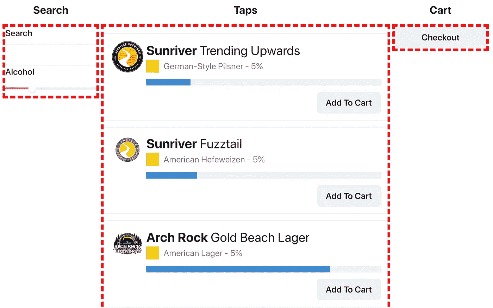
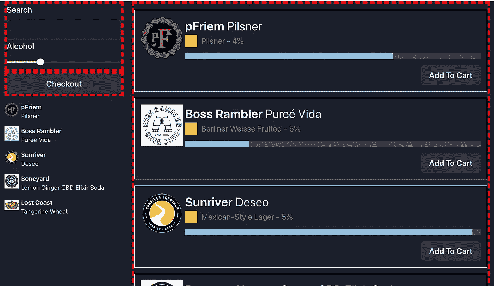

# 简化的微型 FEs

> 原文：<https://levelup.gitconnected.com/micro-fes-simplified-361dff983c27>

微前端有巨大的潜力，但实现它们的机制会阻碍实现这一价值。在这篇文章中，以及其附带的视频[中，我将介绍如何使用 Webpack 5 的内置模块联合特性来简化微前端代码的共享。](https://youtu.be/tFDvEITdJZ8)

事实上，模块联合使得共享组件变得如此容易，以至于我们开始考虑微 FEs 带来的两个后续问题:

1.  如何让 Micro-FEs 共享状态，而不需要宿主页面添加提供者或将状态混合到 Redux 存储中。
2.  如何使所有主机页面订阅或改变支持页面上实例化的微 FEs 的数据存储。

如果你想要一个完整的示例三应用程序 Micro-FE 演示设置，其中 React 组件与另一个 React 应用程序和一个普通 JS 应用程序共享，请查看相关视频。

微 FEs 简化版 YouTube 视频

这篇文章将更详细地解释视频中的三个核心概念。

# 一个小陷阱

已完成的[微型 FEs 简化项目](https://github.com/jherr/micro-fes-simplified-done)包含三个与销售咆哮者相关的不同应用。

> 咆哮者是 PNW 的传统。它们是可以重复灌装的大瓶子，我们可以往里面装啤酒、苏打水、咖啡、康普茶等。

有一个“咆哮者”应用程序，它有三个共享的微 FE 组件。有一个`Taps`组件显示了所有可以倒入咆哮者的不同饮料。有一个`Search`组件允许您对可用的饮料进行搜索，结果会立即显示在`Taps`组件中。然后有一个`Cart`组件显示用户按下`Add to Cart`按钮时选择的饮料列表。下面显示的是`growlers`应用程序:



Growlers 应用程序有三个微 FEs，用红色虚线表示

左边是`Search`组件，中间是`Taps`组件，右边是`Cart`组件。

然后，这些组件在两个不同的应用程序中使用；`host-react`使用 React，而`host-vanilla`只在页面上使用普通的 JS。下面显示的是`host-react`:



react-host 应用程序显示了 Micro-FEs 及其自己的连接组件

`host-react`应用程序以不同的布局显示了三个微型 FEs，并使用了不同的 [Chakra-UI](https://chakra-ui.com/) 黑暗主题。此外，在左侧还有一个额外的 UI，它写在连接到 Micro-FE 商店的`host-react`中，并显示与当前搜索参数匹配的饮料的更紧凑的表示。模块联合使主机页面和微 FEs 之间的这种更深层次的集成成为可能。

现在，我们对演示应用程序有了更好的理解，让我们深入了解一下其中的机制。

# 使用微 FEs 的模块联合

在模块联盟术语中，`growlers`应用程序是`exposing`模块。你可以在项目的 `[webpack.config.js](https://github.com/jherr/micro-fes-simplified-done/blob/master/growlers/webpack.config.js#L50-L75)` [文件](https://github.com/jherr/micro-fes-simplified-done/blob/master/growlers/webpack.config.js#L50-L75)中找到[机制。使用 Webpack 5，只需导入`ModuleFederationPlugin`并进行配置即可。](https://github.com/jherr/micro-fes-simplified-done/blob/master/growlers/webpack.config.js#L50-L75)

```
new ModuleFederationPlugin({
  name: "growlers",
  filename: "remoteEntry.js",
  remotes: {},
  exposes: {
    "./DataComponent": "./src/components/DataComponent",
 **"./Cart": "./src/components/Cart",
    "./Search": "./src/components/Search",
    "./Taps": "./src/components/Taps",**    "./store": "./src/store",
    "./VanillaCart": "./src/vanilla/VanillaCart",
    "./VanillaSearch": "./src/vanilla/VanillaSearch",
    "./VanillaTaps": "./src/vanilla/VanillaTaps",
  },
  ...
```

这里最重要的字段是联邦模块容器的`name`，我们将其指定为`growlers`。后面是暴露模块的列表。开始时，我们只暴露了`Cart`、`Search`和`Taps`组件，以及我们用来指定我们希望显示哪些客户端数据的`store`。

然后，演示应用程序继续公开一个`DataComponent`，基于 React 的主机可以使用它来显示商店的当前状态。以及普通版本的 Micro-FE 组件，它们管理将每个组件安装到指定的选择器上(这使得普通的 JS 应用程序可以轻松地使用看起来像函数的 React 组件。

在主机应用程序中，我们通过再次使用`[ModuleFederationPlugin](https://github.com/jherr/micro-fes-simplified-done/blob/master/host-react/webpack.config.js#L42-L60)`[使用`growlers`遥控器](https://github.com/jherr/micro-fes-simplified-done/blob/master/host-react/webpack.config.js#L42-L60):

```
new ModuleFederationPlugin({
  name: "hostreact",
  filename: "remoteEntry.js",
  remotes: {
 **growlers: "growlers@**[**http://localhost:8080/remoteEntry.js**](http://localhost:8080/remoteEntry.js)**",
**  },
  exposes: {},
  ...
```

在这种情况下，`host-react`应用程序指定在指定的 URL 上有一个名为`growlers`的遥控器。

从那以后，消费和使用组件就像使用进口产品一样简单:

```
import Search from "growlers/Search";
import Cart from "growlers/Cart";
import Taps from "growlers/Taps";
import DataComponent from "growlers/DataComponent";
import { load } from "growlers/store";load("hv-taplist");
```

在`host-react`的这段代码中，我们导入了 React 微 FE 组件，就像我们导入其他 React 组件一样。以及用我们的客户 ID 初始化商店，以便微型企业知道使用什么饮料数据。

所有这些都是可行的，因为模块联邦为您提供了真正的 Javascript React 代码来运行。不是用微铁容器包着的。模块联合适用于任何类型的可被 wepbacked 的代码；React、Vue、Angular、vanilla JS、JSON、transpiled Typescript 等。无论你想要什么。

这里的三个关键优势是:

1.  您的 Micro-FE 代码不需要从托管它的应用程序中单独提取和部署。
2.  您的微 FE 代码不需要以任何方式包装或捆绑。
3.  您可以公开任何类型的代码，而不仅仅是可视组件。

所有这些都伴随着一个很大的警告；模块联合不提供与视图平台无关的兼容层。它不会帮助您在 Vue 应用程序中嵌入 React 组件，反之亦然。如果你正在寻找，你会想看看类似于 [SingleSPA](https://single-spa.js.org/) (它也[推荐使用模块联合](https://single-spa.js.org/docs/recommended-setup/#module-federation)作为代码传输层。)但是，如果您的所有应用程序都是 React，或者您对本例中所示的超薄 JS 垫片之类的东西没有问题，那么您就可以开始了。

# 微 FEs 之间共享状态

由于使用模块联合在应用程序之间共享代码非常容易，所以我们的示例设置要考虑的下一件事是如何在不同的微 FEs 之间共享状态，即使它们位于主机页面的不同部分。

为了使它更有趣，我将坚持这样一个约束，即宿主页面不应该实现任何类型的全局状态提供者来使它工作。主机应用程序应该能够导入组件并将其按原样放在页面上，并且应该可以工作(一旦指定了客户端存储)。

为了实现这一点，我将使用一个名为 [Valtio](https://github.com/pmndrs/valtio) 的革命性的新微状态管理器，原因有二。首先，它非常容易使用。其次，因为它不需要提供商。

要在`growlers`应用程序中设置商店，我们只需[从 Valtio 导入](https://github.com/jherr/micro-fes-simplified-done/blob/master/growlers/src/store.ts#L1-L18) `[proxy](https://github.com/jherr/micro-fes-simplified-done/blob/master/growlers/src/store.ts#L1-L18)` [，然后用初始状态](https://github.com/jherr/micro-fes-simplified-done/blob/master/growlers/src/store.ts#L1-L18)创建一个商店。

```
import { proxy, ... } from "valtio";
import { Beverage } from "./types";export interface TapStore {
  taps: Beverage[];
  searchText: string;
  alcoholLimit: number;
  filteredTaps: Beverage[];
  cart: Beverage[];
}const store = proxy<TapStore>({
  taps: [],
  searchText: "",
  alcoholLimit: 5,
  filteredTaps: [],
  cart: [],
});
```

状态包含所有可用饮料的数组、搜索参数、匹配这些过滤器的饮料(或龙头)以及购物车。

为了消费商店，我们[在任何组件](https://github.com/jherr/micro-fes-simplified-done/blob/master/growlers/src/components/Cart.tsx)中使用 `[useProxy](https://github.com/jherr/micro-fes-simplified-done/blob/master/growlers/src/components/Cart.tsx)` [钩子。](https://github.com/jherr/micro-fes-simplified-done/blob/master/growlers/src/components/Cart.tsx)

```
import React from "react";
**import { useProxy } from "valtio";**import store from "../store";const Cart = () => {
 **const snapshot = useProxy(store);**  return (
    <Box border={MFE_BORDER}>
      {snapshot.cart.map((beverage) => (
        ...
      ))}
      ...
   </Box>
  );
};export default Cart;
```

您不需要在视图层次结构的顶部指定任何类型的提供者。您只需在共享文件中创建一个代理，然后使用`useProxy`消费它。

设置值也一样简单，我们可以回到`store`和[看看](https://github.com/jherr/micro-fes-simplified-done/blob/master/growlers/src/store.ts#L39-L42)和`[setSearchText](https://github.com/jherr/micro-fes-simplified-done/blob/master/growlers/src/store.ts#L39-L42)`的实现，简单来说就是:

```
export const setSearchText = (text: string) => {
 **store.searchText = text;**  store.filteredTaps = filter();
};
```

要设置商店的价值，您只需设置它。没有比这更干净的了。

# 将主页面与微 FEs 状态连接

因为 Valtio 是如此简单，所以我们可以做更酷的事情，推动微 FEs 的边界及其与主页的连接。例如，我们可以[创建一个新的 DataProvider 组件](https://github.com/jherr/micro-fes-simplified-done/blob/master/growlers/src/components/DataComponent.tsx)。

```
import React, { ReactElement } from "react";
import { useProxy } from "valtio";
import store, { TapStore } from "../store";const DataComponent: React.FC<{
  children: (state: TapStore) => ReactElement<any, any>;
}> = ({ children }) => {
 **const state = useProxy(store);
  return children(state);** };export default DataComponent;
```

其中，使用 React 的宿主页面可以提供一个子函数，以宿主页面想要的任何方式呈现存储状态。例如，`host-react`演示用它来展示小得多的饮料卡:

```
<DataComponent>
 **{({ filteredTaps }) =>
    filteredTaps.slice(0, 5).map((beverage) => (
      <SimpleGrid ...>
         ...
      </SimpleGrid>
     ))
  }** </DataComponent>
```

从微铁客户的角度来看，这很好。我不仅已经准备好使用可以放在页面上任何地方的微 FE 组件，而不需要使用提供者。而且，如果我不喜欢一个或多个微 FEs 提供的 UI，我有我需要的所有扩展点来创建我自己的组件，这些组件与微 FEs 使用的同一商店一起工作。

# 提供普通的 JS 兼容性

我们在视频中解决的另一个问题是在 VanillaJS 页面上显示这些组件的能力，这就像[围绕 React-DOM](https://github.com/jherr/micro-fes-simplified-done/blob/master/growlers/src/vanilla/VanillaCart.tsx) 提供函数包装一样简单:

```
import React from "react";
import ReactDOM from "react-dom";
import { ChakraProvider } from "[@chakra](http://twitter.com/chakra)-ui/react";import Cart from "../components/Cart";const App = () => (
  <ChakraProvider>
    <Cart />
  </ChakraProvider>
);**export default (selector: string): void => {
  ReactDOM.render(<App />, document.querySelector(selector));
};**
```

不要被`ChakraProvider`所迷惑，它只是为组件提供 CSS。

然后在 VanillaJS 端，我们可以简单地导入这些函数，然后在选择器上调用它们:

```
import "./index.css";**import createTaps from "growlers/VanillaTaps";
import createCart from "growlers/VanillaCart";
import createSearch from "growlers/VanillaSearch";** import { load, subscribe } from "growlers/store";// load("growlers-tap-station");
load("hv-taplist");...**createTaps(".taps");
createCart(".cart");
createSearch(".search");**
```

这些微 FEs 是如何实现的？谁说的？从普通 JS 应用程序的角度来看，这些是它们调用的函数，UI 出现在这些选择器上。

在这种情况下，模块联合不仅处理将微 FE 代码发送到页面，还处理`react`和`react-dom`以便代码可以运行。更好的是，如果你偷懒加载你的微 FEs，那也很好。模块联合将把`remoteEntry.js`文件带到页面上，但是如果您决定导入和调用它们，该文件只是对所需块的引用。所以这个系统天生就是可延迟加载的。

# 从这里去哪里

这个例子比我在这里介绍的要多得多，更广泛地说，模块联合也是如此。你可以在[我的 YouTube 频道](https://www.youtube.com/user/jherr2006)上查看我在模块联盟视频上的[播放列表。或者你可以看看](https://www.youtube.com/playlist?list=PLNqp92_EXZBLr7p7hn6IYa1YPNs4yJ1t1)[实用模块联盟](https://module-federation.myshopify.com/products/practical-module-federation)，这是我和 Zack Jackson 写的一本书，涵盖了这种令人着迷的共享代码的新技术的实际应用和内部机制。