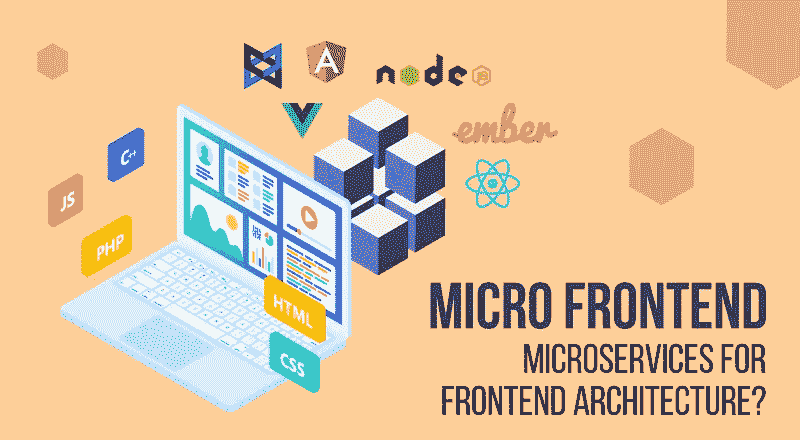
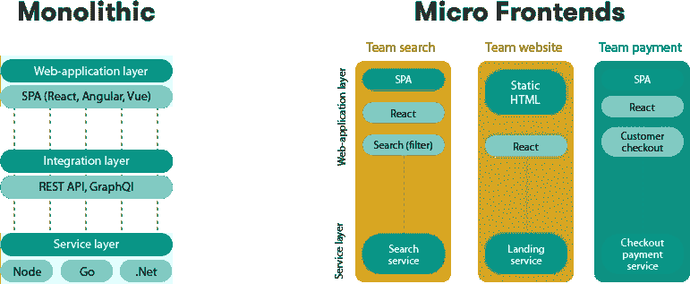

# 微前端架构

> 原文：<https://levelup.gitconnected.com/micro-frontend-architecture-794442e9b325>

在深入研究微前端技术之前，我们必须知道什么是微服务架构，因为微前端概念的灵感来源于微服务，并以微服务命名。

根据官方[文件](https://microservices.io/)，

微服务(也称为微服务架构)是一种架构风格，它将应用程序构建为一组服务，这些服务:

-高度可维护和可测试

-松散耦合

-可独立部署

-围绕业务能力组织

-由一个小团队拥有

微服务架构支持快速、频繁和可靠地交付大型复杂应用。

现在回到微前端部分，微前端基本上是微服务模式的**扩展，功能扩展到前端。因此，微前端带来了广泛的优势，包括部署独立性、更容易的特性测试等。**

微前端背后的想法是将 web 应用程序视为独立团队所拥有的功能的组合。每个团队都有自己关心和擅长的独特业务领域。一个团队是跨职能的，从数据库到用户界面，端到端地开发其功能。

# 微前端背后的核心概念:

## 技术独立

每个团队都应该在不与其他团队协调的情况下选择和升级堆栈。自定义元素有助于隐藏实现细节，同时为其他人提供中立的接口。

## 隔离团队代码

永远不要共享运行时，即使团队使用相同的框架。构建一个独立的应用程序。不要依赖共享状态或全局变量。

## 创建团队前缀

在还不可能隔离的地方使用命名约定。命名空间 CSS、本地存储、事件和 Cookies，以避免冲突并明确所有权。

## 偏好原生浏览器功能而非自定义 API

使用浏览器事件进行通信，而不是构建一个全局的 PubSub 系统。如果需要构建跨团队的 API，尽量保持简单。

## 构建有弹性的网页设计

这些特性应该是有用的，即使 [JavaScript](https://www.javascript.com/) 无法执行。要提高感知性能，请使用通用渲染和渐进式增强。

但是我们为什么需要微前端呢？让我们找出答案。

到了现代，有了新的 web apps，前端越来越大，后端越来越不重要。大部分代码都是微前端架构，整体式方法不适用于更大的 web 应用程序。需要有一种工具将它分解成独立工作的更小的模块。问题的解决方案是微前端。

为了总结这些好处，下面提到几点:

*   **更好的可扩展性。**
*   **发展更快**，因为团队可以独立工作。
*   你可以在你的应用中使用**多个框架**。然而，应该谨慎透明地进行，以避免混淆。
*   **部署独立性**。你的微前端的交付不会影响整个应用。这些变化将准确地影响它所覆盖的那部分业务流程。
*   有了微前端，你**可以比以前更顺利地升级，更新，甚至重写前端**的一部分。
*   更容易**确保应用程序的其余部分保持稳定**，因为它是独立的。有了微前端，你不再需要跟踪整个应用程序。
*   代码库更小，更易于管理。
*   **更容易聘请专家**。有了微前端，你就可以寻找专业人员来处理应用程序中使用特定技术堆栈的特定部分，因此你不需要他们了解其他团队使用的技术。
*   **测试更容易**，因为您只需测试单独的功能。

我还对这个概念进行了概念验证。随意看看 [GitHub](https://github.com/mansern/microfrontend-poc) 回购。

# 结论:

这很大程度上取决于你的商业案例，你是否应该使用微前端。如果你有一个小的项目和团队，微前端架构并不是必需的。同时，具有分布式团队和大量请求的大型项目从构建微前端应用中受益匪浅。这就是为什么今天，微前端架构被许多大公司广泛使用，这也是为什么你应该选择它。

学到了新东西？评论和反馈总能让作者开心。编码快乐！

# 分级编码

感谢您成为我们社区的一员！[订阅我们的 YouTube 频道](https://www.youtube.com/channel/UC3v9kBR_ab4UHXXdknz8Fbg?sub_confirmation=1)或者加入 [**Skilled.dev 编码面试课程**](https://skilled.dev/) 。

 [## 顶级编码面试课程| Skilled.dev

### 掌握编码面试的过程

技术开发](https://skilled.dev/)