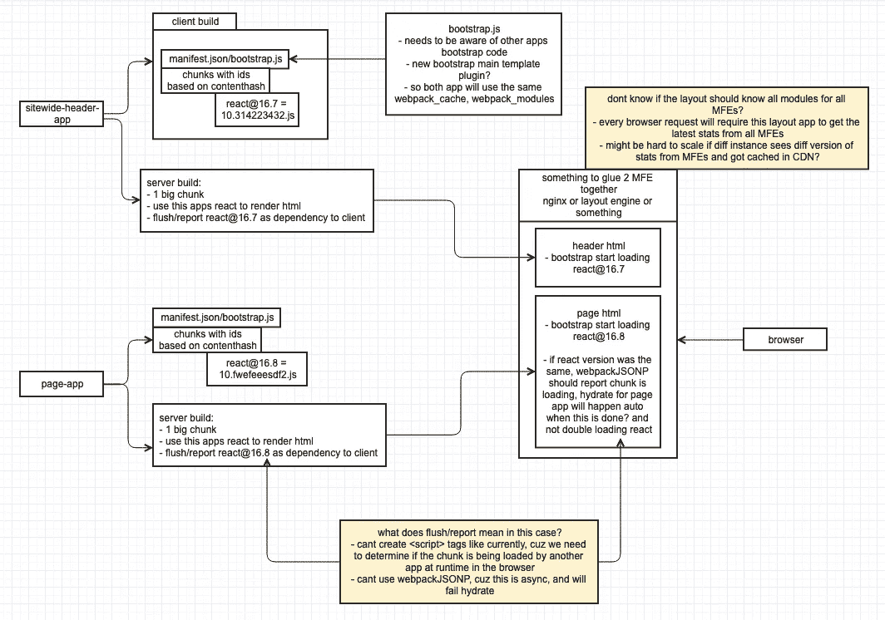

# 微前端架构:在运行时从另一个 Webpack 包导入块

> 原文：<https://levelup.gitconnected.com/micro-frontend-architecture-dynamic-import-chunks-from-another-webpack-bundle-at-runtime-1132d8cb6051>

## 在运行时从其他 Webpack 包导入块，使用它们，就好像它们一直存在一样——交叉应用程序

更新:这个项目正在重写，将被纳入 Webpack 5！

[](https://medium.com/@ScriptedAlchemy/webpack-5-module-federation-a-game-changer-to-javascript-architecture-bcdd30e02669) [## Webpack 5:模块联合。Javascript 架构的游戏改变者。解锁微前端

### 模块联合——相当于 Apollo 对 GraphQL 所做的 Javascript 工作。多个 Webpack 版本一起工作，就像…

medium.com](https://medium.com/@ScriptedAlchemy/webpack-5-module-federation-a-game-changer-to-javascript-architecture-bcdd30e02669) [](https://github.com/webpack/webpack/issues/10352) [## 合并提议:捆绑包之间的模块联合和代码共享。许多构建作为一个问题…

### 这是一个将我现有的工作合并到 Webpack 核心功能 request @sokra 的提议，应您的要求，我已经打开了一个…

github.com](https://github.com/webpack/webpack/issues/10352) 

本文描述了我如何编写一个 Webpack 插件，它在运行时从其他 Webpack 包导入块。It 是关于微前端应用和管理它们的技术的更大系列的一部分。

这篇文章在某些地方是低级的，它的目的是记录开发交错工具的旅程。我将撰写围绕使用该工具的更高层次的文章，提供代码示例和用例。

# 语境

构建现代分布式 JavaScript 应用程序是复杂的。管理多个存储库、构建和代码共享是一项具有挑战性的手工工作。我想建立独立的微前端应用程序，在浏览器中作为一个整体工作。

> https://github.com/webpack/webpack/issues/8524[](https://github.com/webpack/webpack/issues/8524)

**

*交叉存取的挑战*

> *许多 webpack 构建时在浏览器中作为一个整体运行，没有构建时的上下文*

*我一直在使用 LOSA 架构、monolith 绞杀和定制微前端设置——一直困扰这些平台设计的问题是管理宝贵的客户端运行时性能和软件包大小。在浏览器中，关注点的规模和分离有一些缺点。*

*[](/micro-frontend-architecture-replacing-a-monolith-from-the-inside-out-61f60d2e14c1) [## 微前端架构:从内到外取代整体架构

### 如何利用微前端技术实现遗留应用的现代化

levelup.gitconnected.com](/micro-frontend-architecture-replacing-a-monolith-from-the-inside-out-61f60d2e14c1) 

> ***Javascript 编排***
> 
> 通用微应用的可扩展管理。

# 交错运行时

简单地说，我想在运行时合并两个 Webpack 清单，让它们一起工作，就好像从一开始就被编译成一个 SPA。有点像 [DLLPlugin](https://webpack.js.org/plugins/dll-plugin/) ，但是不需要在构建时传递上下文——而是在运行时传递上下文

> *in(t)ərˈlēv—*动词
> 1)* 在书页之间插入书页，通常是空白页。2)通过交替混合(两个或多个数字信号)。*

**

*扎克·杰克逊*

*它将使微前端(或 MFE，我称之为微前端)无缝地协同工作。*

***构建之间的智能代码分割**。[**动态导入网址，无页面重载**](https://webpack.js.org/plugins/dll-plugin/)*

# *目标*

*交错需要实现以下目标*

*   *当路由到另一个 MFE 时没有页面刷新，多个应用应该像一个 SPA 一样路由*
*   *不要重新下载页面上另一个 Webpack 版本已经提供的供应商代码。(不要捆绑同一个依赖项的多个副本)*
*   *每个 MFE 应该是完全独立的，没有集中的依赖关系。我不想通过管理 Webpack externals 或 commons 供应商块来共享代码。*
*   *前端资源应该具有常青的能力，不需要消费者重新安装。*
*   *我不需要因为共享组件或其他团队管理的东西的变化而重新部署整个团队(比如导航，我不想在他们推出新的更新时重新部署我的全部)*
*   *编排应该完全由用户管理，允许根据页面上加载的 JavaScript 包进行动态调整。除了像包本身一样添加静态 JavaScript 之外，应该不需要任何远程逻辑或调用。** 

**为了防止事情变得太混乱，让我们假设你有两个微前端或两个独立的应用程序。他们有自己的 Webpack 版本，由自己的服务器驱动，完全独立。姑且称之为`**App1**`和`**App2**` **。我想用** `**Nav**` **从**`**App1**`**`**App2**`**里面。******

****你可以把 Nav 做成一个 npm 包，然后重新安装到`App1`和`App2`中，共享问题就解决了。但是每次更新 Nav 的时候还是要重新部署多个应用。****

## ****制定解决方案****

****利用内置的代码分割原理，我想从另一个构建中动态`import()`一个块，因为这是最合理的方式，Webpack 已经可以处理导入块。但是，您目前只能从它自己的构建中执行此操作。Webpack 并不真正知道如何处理*外部导入*或来自外部包的一大块。`App2`如何从`App1`导入`Nav.chunk.js`？****

# ****挑战 1:自动代码分割****

## ****魔法出口****

****我需要一种方法将文件标记为我打算在另一个应用程序中使用的文件。Webpack 需要确保任何 ***【外部化】*** 的东西都是代码分割的，不管`App1`实际上是否动态导入——为了使交错高效，我需要尽可能少地导入，而不是`main.bundle.js`或`vendor.chunk.js`。大多数没有进行代码分割的内容最终会变成一个巨大的块，因此需要一种方法来对文件进行代码分割，而不必强制动态导入文件，这可能会改变开发人员的流程并引入非常抽象的规则。我们该如何处理？****

****使用魔法出口，就是这样！我将放入`/*externalize:Nav*/`，我将在构建时用 Webpack 解析它，然后以不同的方式处理这些文件。****

****魔法输出可能会导致同一个建筑内的冲突。我正在考虑一个替代方案，它类似于 c 等其他语言中的接口。该定义将被实现到`package.json`中，并且将防止意外地调用两个块相同的东西****

```
****"interface": {
  './src/components/Menu.js': "Nav"
},****
```

## ****利用 splitChunks API****

****用`cacheGroups`自动化代码分割。无论同步还是异步导入，所有标记的文件都会自动代码分割到它们自己的缓存组中。****

****现在，标记的文件可以被识别，并自动分割成自己的块。`App2`能够`import("someUrl/js/Nav.chunk.js")`并且它会存在。****

# ****挑战 2:散列模块 id****

## ****默认情况下 Webpack 如何分配模块****

****默认情况下，Webpack 生成一个数字形式的模块 ID。`__webpack_modules__`包含一个大规模数组，每个模块 ID 是数组中的一个位置。****

****这将不会为交错工作，我需要知道模块是什么。****

## ****hashedModuleID 优化选项？****

****Webpack 有一个内部的`hashedModuleIDs`选项，但是，这个散列约定不起作用。Webpack 哈希模块*路径*交叉使用不同文件结构的应用程序会导致相同的模块具有不同的 id****

****`App2`使用 yarn 工作空间，是 monorepo 的一部分。`App1`是普通包装。****

****`App2`进口从 `../../node_modules`开始反应`App1`进口从`../node_modules`开始反应****

****不管版本是否相同，当交叉存取`Nav`时，Webpack 不会知道它已经有了`React (../node_modules/react)`，因为`Nav`会因为依赖于文件路径的散列而请求不同的散列模块。在这种情况下，`App2`将下载`App1`的包含`React (../../node_modules/react)`的块，以便为`Nav`提供它正在寻找的`module.id`。****

## ****`[contenthash]`对于模块 id****

****基于内容的散列模块确保了我可以获得跨任何 Webpack 构建的依赖项的匹配版本，而不管它的文件结构如何。没有代码重复，因为我有一个可靠的方法来检查是否有跨任何其他已经加载到页面上的 Webpack 构建所需的依赖关系`Nav`的精确副本。如果 Webpack 找不到它所需要的依赖项，它将从产生`Nav`的原始构建中获取依赖项。****

****虽然基于内容的散列模块适用于依赖关系，但是*外化的*模块需要一个可预测的、人为指定的名称，以便在交叉存取时可以在另一个应用程序中引用。就像神奇的导入注释一样，我通过神奇的导出注释来设置模块名称。****

****交错时，`App2`可以`__webpack_require__("Nav")`并且应该可以在`__webpack_modules__`内找到。重要的是我们知道它存储的密钥。如果我们无法在 Webpack 清单中找到交错导出，我们就无法调用它，即使它已经加载到清单中。****

> ****将外来块放入 webpack 清单只是成功的一半。你需要能够通过一个已知的引用来调用这个块****

******结合这两部分:******

****1)我现在能够在浏览器中检查所有应用程序，并依赖任何和所有依赖项，不管它们源自哪个版本****

****2)我可以找到注入到 Webpack 清单中的外部化块，并按名称调用它，就像 dynamic `import()`的工作方式一样****

****结合在一起，像这样的设施可以被建造。****

```
****const ExternalComponent = (props) => {
  const {
    src, module, export: exportName, cors, ...rest
  } = props;
  let Component = null;
  const [loaded, setLoaded] = useState(false);
  const importPromise = useCallback(
    () => {
      if (!src) return ***Promise***.reject();
      if (cors) {
        return ***require***("./corsImport").default(src);
      }
      return new ***Promise***((resolve) => {
        resolve(new ***Function***(`return import("${src}")`)());
      });
    },
    [src, cors]
  );

  useEffect(() => {
    ***require***("./polyfill");
    if (!src) {
      throw new ***Error***(`interleaving error: ${***JSON***.stringify(props, null, 2)}`);
    }

    importPromise(src).then(() => {
      const requiredComponent = __webpack_require__(module);
      Component = requiredComponent.default ? requiredComponent.default : requiredComponent[exportName];
      setLoaded(true);
    }).catch((e) => {
      throw new ***Error***(`dynamic-import: ${e.message}`);
    });
  }, []);

  if (!loaded) return null;
  return (
    <Component {...rest} />
  );
};****
```

****[](https://github.com/ScriptedAlchemy/webpack-external-import/blob/master/src/react.js) [## ScriptedAlchemy/web pack-外部-导入

### 此时您不能执行该操作。您已使用另一个标签页或窗口登录。您已在另一个选项卡中注销，或者…

github.com](https://github.com/ScriptedAlchemy/webpack-external-import/blob/master/src/react.js) 

# 挑战 3:缓存破坏

我们需要一种方法来加载缓存损坏的哈希文件。大多数构建都是通过散列捆绑包和块名来破坏缓存的，但是如果它的名字像`Nav.chunk.[contenthash].js`一样被散列，就很难加载`Nav.chunk.js`

我选择生成一个 Javascript 文件，它可以用一个查询字符串(每次)缓存。JavaScript 文件没有 CORS 问题，所以跨应用程序嵌入清单更容易。如果你使用 CSP ，你需要配置它。

每个都有一个名称空间。否则 app 之间碰撞的风险太高。

# 挑战 4:缺少依赖解析

如果一个程序块被插入到一个应用程序中，而这个应用程序没有这个程序块所需要的依赖项，会发生什么呢？如上所示，清单映射不能解决依赖关系跟踪。我需要知道在原始构建中最小的文件在哪里，包含缺失的依赖项

增强清单映射稍微改进了反向依赖查找和解析。

**在 Webpack 插件中查找模块所依赖的内容。**

可能有更好的方法来做到这一点。

在 emit 钩子中，我遍历 stats 图，跟踪任何外部化的文件，然后遍历该块中的所有模块，最后搜索依赖项被发送到的文件。

需要测试更复杂的依赖关系和嵌套依赖关系解析。像外部化组件加载其他外部化组件这样的情况仍然需要测试。

# 挑战 5:树摇动和死代码消除

团队给我指出了一些我还没有测试过的东西，范围提升、树抖动和缺少导出。

不幸的是，Webpack 在树抖动之前散列 module.ids *，所以我的`[contenthash]`模块不可靠。哈希基于安装的内容，而不是捆绑的内容。我需要一种方法来一个案例一个案例地管理树摇动*

选择是有限的，关闭摇树将会爆炸一捆的大小。

下面是一个示例场景，`App1`树抖动一个仅由`App2`使用的导出

如果我的依赖链可能有也可能没有它们的导出，交错就没有多大用处，除此之外*外化的*文件可能有也可能没有它们的导出。因为当散列发生时，我真的不能确定一个 bundle 是否拥有一个交错块所需的所有功能和输出。版本匹配，导出可能不匹配。

## 控制 Webpack 如何摇动树

Webpack DLL 插件使用了一个函数来标记一个正在以未知方式使用的模块。通过将这个函数应用于任何外部化的文件，也许还有它们的依赖项，树抖动不会危及稳定性。

我还发现了如何以更详细的方式来做这件事。当循环模块时，您可以将`module.buildMeta.usedExports`设置为与`module.providedExports`相同

> 想象一下，能够下载另一个应用程序供应商作为一个丢失的大块的后备！

# 未来状态

它要去哪里？

## 自愈

实现允许独立运行时之间的查询功能的通信总线。如果某个依赖项加载失败，或者由于某种原因某个构建中缺少依赖项块。如果可以在另一个交错构建中找到依赖关系，它应该尝试查询页面上可能存在的任何和所有其他 Webpack 构建。它可以从交叉下行链路下载数据块，并使用其供应商提供的数据块，而这些数据块实际上并未被供体使用。想象一下，可以下载其他应用程序供应商的软件作为退路！部署新的缓存损坏的文件不会破坏当前用户的下载。

## SSR 中间件

这个项目在客户端工作，但是服务器端更难。Eval 可能有用，但听起来非常危险。我想到了两个可以缓解这个问题的解决方案。可以编写一些中间件来与集群中的其他 MFE 通信，并中继它们的独立段。

**最终一致性:**适用于页眉或页脚。可能由一个工作流拥有，但需要在一组 MFE 之间共享的东西。团队可以将他们的 MFE 作为 npm 包发布。消费者 SSR 它，但是客户端，浏览器将直接从原点交错。其可能比消费者安装的 SSR 副本部署得更近。

这并不理想，但确实有效。

**分布式渲染:**消费者通过一个渲染 API 到达另一个 MFE，该 API 提供包含 HTML、CSS、JS、初始状态的 JSON。有了这个，Node 可以把它作为道具传递给`<App>`，并呈现其余的部分。有了 react-dom 中的片段缓存，渲染变得非常快。

还可以利用 HTTP2 流，并从分布式 MFE 渲染集群中实际传输 SSR。或者可以仅在服务器之间流式传输以获得低延迟。

交错可以解决许多问题，这些问题目前需要不正规的、非性能的或复杂的解决方法。

> 悬疑实现！到时候了

```
server.get(path, (req, res) =>
  serveFragment(
    req,
    res,
    fragmentID => require(`./components/${fragmentID}`).default) 
);
```

## 一个新的路由平台

路由仍然是一个需要改进的地方。与动态导入一样，交叉存取路由器对象也是必需的。添加一些实用程序和 JSX 将使它变得简单一些，并抽象掉许多复杂性。

## **可合并出口**

禁用树抖动对一个模块接一个模块起作用。但是这可能导致包的大小变大，特别是如果依赖链也被排除在树抖动之外的话。

合并导出的能力将允许`node_modules`的树摇动，一个外部块可以检查消费者构建在一个依赖内是否有*权限*导出。如果没有，它会将自己的树动摇版本的同一个依赖项与消费者构建中的导出合并。确保下载最少的代码，但所有功能都可用。

## 改进的效用函数和内在化清单

将所有部分，如导入清单和实用函数，移到`webpackJsonP`**** 

****回购链接:[https://github.com/ScriptedAlchemy/webpack-external-import](https://github.com/ScriptedAlchemy/webpack-external-import)****

****请随意打开一个 PR，或者如果您想合作，请在 Twitter 上给我发消息。和任何 OSS 项目一样，社区的投入是有价值的，有助于项目的繁荣****

******疑问？在推特上抓住我******

****[](https://twitter.com/ScriptedAlchemy) [## 扎克·杰克逊

### 扎克·杰克逊的最新推文(@ScriptedAlchemy)。首席工程师@lululemon。JavaScript 编排位于…

twitter.com](https://twitter.com/ScriptedAlchemy) 

**或 GitHub**

[](https://github.com/ScriptedAlchemy) [## ScriptedAlchemy -概述

### 在 GitHub 上注册您自己的个人资料，这是托管代码、管理项目和与 40…

github.com](https://github.com/ScriptedAlchemy) 

## 下一个

*   创建交叉应用程序外壳。
*   交错两个应用程序—实际例子
*   通过应用外壳同步和自定义挂钩，轻松管理多个微前端
*   交错 next.js 区域
*   交叉管理堆栈的完整示例— FOSA 体系结构
*   视频系列，解释了在一个更容易消化的媒体低水平

## 系列的前一篇文章

[https://level up . git connected . com/micro-frontend-architecture-replacing-a-monolith-from-inside-out-61f 60 D2 e14 c 1](/micro-frontend-architecture-replacing-a-monolith-from-the-inside-out-61f60d2e14c1)****