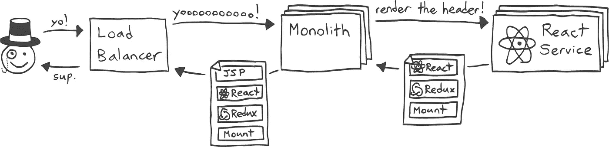
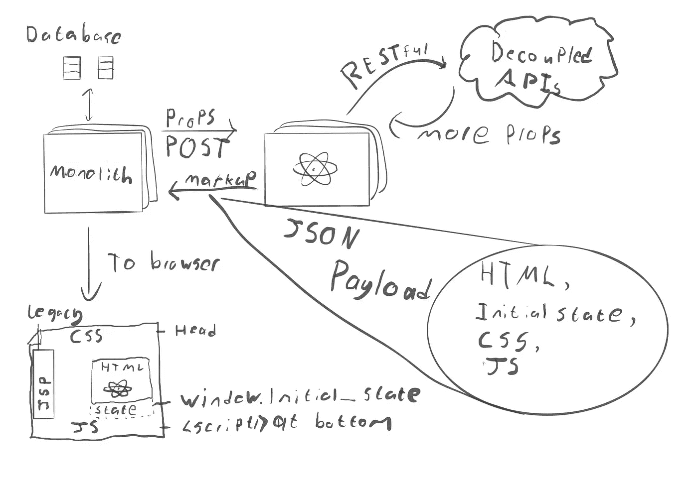
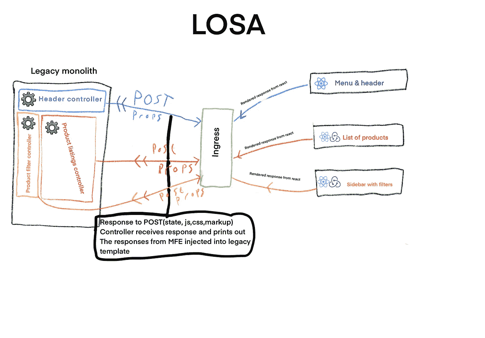
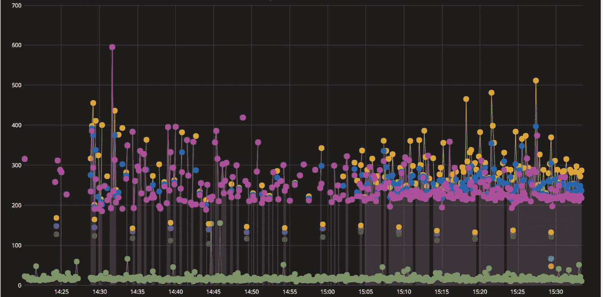
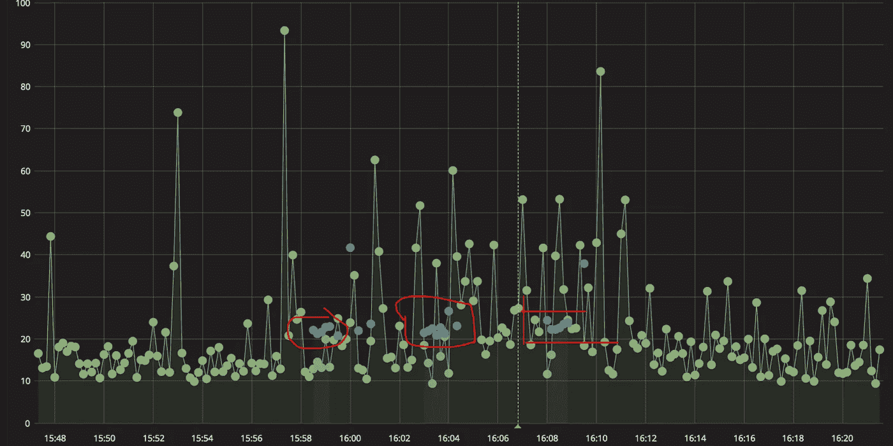

# 微前端架构:从内到外取代整体架构

> 原文：<https://levelup.gitconnected.com/micro-frontend-architecture-replacing-a-monolith-from-the-inside-out-61f60d2e14c1>

## 如何用微前端技术使遗留应用程序现代化？

本文是关于微前端应用和管理它们的技术的系列文章的一部分。

看下一个[这里](https://medium.com/@ScriptedAlchemy/micro-frontend-architecture-dynamic-import-chunks-from-another-webpack-bundle-at-runtime-1132d8cb6051)

我们正在对前端架构做一些大的改变。查看我们在 Webpack 模块联盟方面的进展:

[](https://medium.com/@ScriptedAlchemy/webpack-5-module-federation-a-game-changer-to-javascript-architecture-bcdd30e02669) [## Webpack 5:模块联合。Javascript 架构的游戏改变者。解锁微前端

### 模块联合——相当于 Apollo 对 GraphQL 所做的 Javascript 工作。多个 Webpack 版本一起工作，就像…

medium.com](https://medium.com/@ScriptedAlchemy/webpack-5-module-federation-a-game-changer-to-javascript-architecture-bcdd30e02669) [](https://github.com/webpack/webpack/issues/10352) [## 合并提议:捆绑包之间的模块联合和代码共享。许多构建作为一个问题…

### 这是一个将我现有的工作合并到 Webpack 核心的提议。基本概念是联合应用程序…

github.com](https://github.com/webpack/webpack/issues/10352) 

本教程将讨论如何将你的前端从 monolith 解耦，并立即开始迁移到微前端架构。这是我过去的项目之一

# 问题是

让我们假设有一个完整的代码库。这个整体使用一个后端模板引擎或系统(例如 [EJS](https://www.npmjs.com/package/ejs) 或 [ERB](https://ruby-doc.org/stdlib-2.6.5/libdoc/erb/rdoc/ERB.html) )，jQuery，并且它没有真正考虑前端——或者更糟，它来自于 spa 存在之前的时代。也许它像 Ruby on Rails 一样有一些资产管道。在这种情况下，javascript 文件中可能有后端变量——比如 *.js.erb* 文件或 AEM 片段。**一个耦合的、意大利面条式的代码库，感觉几乎不可能现代化。**

> 你想停止在这个庞然大物中编写前端代码，并转移到一个更加面向 JavaScript 的生态系统，但是怎么做呢？

大多数公司无法承受(或不会接受)一次“工具停机”重写的工程停工期。功能需要在积极的开发下进步。毫无疑问，这些功能越来越难以同样的速度发布。

> 整体需求应该以渐进、过渡的方式分解成更小的部分。它不能中断业务。

然而，解耦一个 monolith 可能是棘手的，主要是当支持 JavaScript 应用程序的新 API 需要经历规划或开发以支持前端迁移时。

迭代前端开发、微前端(MFE)实现和团队自治在等待必要的 API 经历开发或完成并进入发布周期时被阻塞。**假，可以并行解耦前端到后端。**


扎克·杰克逊——编剧

这里有一个解决方案，可以将前端解耦，并将其移植到一个独立的 MFE，并配有 SSR。这种方法允许团队这样做，而无需等待后端 API 被抽象和分离为微服务，甚至是 monolith 中的可消费 API。从里到外更换整块。

# 阻挡者

微前端通常具有这两个必要的依赖性。
1)认证
2)在浏览器和服务器端渲染(SSR)期间向应用程序提供数据

根据我的经验，无论遗留系统是 Rails、Java、.网等。

微前端架构还有其他具有挑战性的方面，这些将在以后的系列文章中详细阐述。敬请关注！

# 使用整块作为布局引擎

MFE 平台设计有几种不同的架构规范。本文将关注一个在后端微服务中流行的改编规范—**【LOSA(大量小应用)**。这种架构是“由内向外”迁移的好选择。



通过 monolith 的 LOSA 请求/响应流程。图像归功于罗伯特·阿克莱特

**LOSA** 应用程序(一般为微前端)是独立的 Node.js 服务，能够在服务器端呈现网页的一部分或片段。一个页面可以由多个 **LOSA** 服务组成。这些应用/微前端被构建并部署到独立的容器中，并以独立的方式运行


相同的网页，由三种不同的方式组成，展示了一个增量迁移路径。开始作为一个整体呈现页面，过渡到 LOSA 微前端，最后作为一个微前端垂直结束，完全取代了整体。图片来源:罗伯特·阿克莱特

monolith 仍然负责处理 HTTP 请求对象，向客户端发送最终响应。微前端可以留在集群中的防火墙后面，只有在 API 网关和用户身份验证可以分离(或者至少变成 API 端点)之前，才可以直接用于遗留系统。你不需要做太多的改变来为它们的后 monolith 生活做准备。

# 渲染流

下面是一个请求/响应可能结束的模型示例。

首先，提出一个请求:

```
GET/POST 'https://MFEwebsite.com/parts/header?format=json
```



呈现一个页面可能需要各种数据，任何还不能从解耦端点查询的“缺失”信息都可以在请求期间作为道具被**发送**到**MFE*(*微前端)**。以下是 MFE 在发出请求时所做的事情，请求通过一个负责呈现 React 应用程序的中间件传递，对任何必要的解耦 API 发出查询，其响应作为 props 发送回它。这些道具会组成`window.INITIAL_STATE`。****

# **代码**

**如果你需要一些如何实现这些模板函数或过滤器的灵感，那么 Hypernova 值得一看。我没有用过 Hypernova，总是选择自己构建。我已经在 Rails、Node 和 PHP 后端实现了类似的机制。由于各种后端平台的专有性质，我将使用 Hypernova 的例子来传达一个基本概念。**

**以下是 express 中 MFE 渲染端点的外观:**

****来自另一个系统的请求，在本例中为单块:****

```
**GET/POST 'https://MFEwebsite.com/parts/header?format=json
{
   html: '<div> ... </div>',
   css: '/static/header.3042u3298423.css',
   js: '/static/header.idhf93hf23iu.js',
   initial_state: {items:[...]}
}**
```

****处理响应的中间件:****

```
**export function exampleRenderAPIware(req, res) {
  const renderedMarkup = renderHTMLpage(
    req,
    this.index,
    intial_state,
  );
  asyncRender.then(() => {
    const responseObject = {
      html: renderedMarkup,
      initial_state,
      js: jsResource,
      css: cssResource,
    };
    res.status(200).end(JSON.stringify(responseObject));
  });
}**
```

**发出这些初始 POST 请求的控制器应该处理响应，将 JS 和 CSS 放入正确的位置，并最终将 React 应用程序呈现到遗留模板中的适当位置。这是一个遗留模板的例子。通常由 monolith 中的其他控制器处理的资产将负责将这些脚本和样式注入到遗留的 body 标签的头部和底部。请记住，整块仍然作为布局引擎。我们正在更换零件，并以 React SSR 的方式添加新功能。最终，这些 LOSA 应用程序可以在一个 MFE 下或与我正在开发的 Webpack black magic 一起缝合，称为[web pack-external-import](https://github.com/ScriptedAlchemy/webpack-external-import)。**

**[](https://medium.com/@ScriptedAlchemy/micro-frontend-architecture-dynamic-import-chunks-from-another-webpack-bundle-at-runtime-1132d8cb6051) [## 微前端架构:在运行时从另一个 Webpack 包动态导入块。

### 在运行时从其他 Webpack 包导入块的挑战和解决方案，使用它们就像有…

medium.com](https://medium.com/@ScriptedAlchemy/micro-frontend-architecture-dynamic-import-chunks-from-another-webpack-bundle-at-runtime-1132d8cb6051) 

## 从模板数据迁移到新的 API 怎么样？

当一个新的 API 被解耦并上线时，在迁移中可以期待什么？

当 monolith 向 MFE 提供数据时，Express.js 从 HTTP 请求体访问这些信息。现在，express 需要从 API 异步获取数据。数据格式可能已经改变，但是 React 仍然接收 props。令人印象深刻的直白。

# 表演

与旧的 monoliths 相比，新的 LOSA(许多小应用程序)架构性能不够，页面的一部分渲染需要 400-600 毫秒。我们使用异步工人结构，这意味着我们可以要求多个服务对应用程序的不同部分进行 SSR，而不是一个 SSR 应用程序。这使得离线生产变得非常困难，因为“生产失败”意味着可能会丢失 10 分钟的侧边栏或页脚，直到它被修复。最好的关注点分离。

这就是我所说的 LOSA 异步工人。有许多节点服务，每个负责呈现一个/多个组件。



支持遗留后端视图的控制器(灰色齿轮)可以将视图数据转移到 post 请求，而不是后端模板引擎。回收数据意味着后端不需要太多的工作来支持这些机制。避免大的修改将释放大部分后端工程，以专注于解耦数据提供者，而前端可以独立地进展。

由于视图数据被发送到外部 react 服务，对该发送的响应(包含标记)随后被传递到后端模板引擎，同时传递的还有样式表、初始状态和 CSS URLs。模板引擎现在只呈现来自 POST 请求的响应，从而将您的视图或部分视图从遗留的 monolith 中分离出来。

## 反应渲染时间

反应很慢！SSR 就是不够快，所以我们新的 react 解决方案 LOSA 架构的性能不够好，不可行。我们的解决方案:【react 内部的片段缓存。



*   黄色:无反应片段缓存—端到端(+-400 毫秒)
*   深紫色:带 React 片段缓存—端到端(+-150 毫秒)
*   橙色:完全优化的架构(+-20 毫秒)
*   绿色(在数据点的底部):来自后端的本机片段缓存

我将需要写另一篇文章来详细介绍创建一个完全优化的 react 服务器的整个过程(抱歉[安东·科尔祖诺夫](https://medium.com/u/742f2d568062?source=post_page-----61f60d2e14c1--------------------------------))。Graphana 的数据显示，我们至少将渲染性能提高了一倍，循环时间仍然非常慢。而在内部，React 能够非常快速地渲染——端到端时间不如我们希望的那样高。至少 150 毫秒。如您所见，我将在下一篇文章中详细阐述——我可以与片段后端片段缓存竞争。

## 渲染时间与循环时间

渲染时间是挑战的一部分，但即使在 React 内部实现了片段缓存之后。我失望地看到，虽然我们在 Node.js 中的内部渲染时间非常快(大约 20 毫秒)。整个首尾相连的行程**仍然**耗时 140-200 毫秒。

## 瓶颈是什么

1.  JSON 大小，特别是初始应用程序状态。发送呈现页面所需的最低状态。不要把太多的字符串化状态转储到初始渲染中。发送足够的状态，以便 React 能够重新水合，并且可能发送一些额外的状态，以便使折叠组件立即交互。
2.  要呈现的 DOM 节点的数量——不要再把代码包装在无用的 div 中，只是为了在上面放一个类。利用 HTML 的语义特性和 CSS 的层叠效果。您最终会编写更少的标记，从而导致生成更少的`React.createComponent`函数。
3.  垃圾收集——更多细节将在后续文章系列中介绍。
4.  只有和数据提供者一样快。—利用中间层的 Redis 缓存。如果你向我抛出“缓存失效很难”的论点，那么看看事件源。更好的是，用 CQRS 和异步工人来解决读写问题。
5.  monolith 和 MFE 之间的 HTTP 开销— gRPC、CQRS、UDP 和 Protobuf。独石和你的 MFE 之间的通信应该通过 Kubernetes 网络在内部进行。开机自检很慢，但很有效。当你碰到问题时，就相应地处理它。

## 我如何胜过后端渲染

模板化、片段缓存和 gRPC/CQRS，消除了初始状态 JSON 的膨胀。在服务器上反应很慢。很容易忘记，没有抽象更快，只有更慢。

# 规模呢？

任何好的解决方案都需要在规模上具有成本效益。运营成本增长到天文数字。有钱能使鬼推磨，糟糕的业绩成本。我大规模构建廉价的解决方案。以下是 perf 让你付出代价的方式:

1)支付昂贵的第三方服务来承担负载

2)为更多/更大的容器付费

3)由于业绩不佳而错过收入

monolith 通常会导致发布周期或部署交通堵塞，因为两个分支不能同时进入 master。

5)开发人员可以在风险较低的环境中更快地行动，企业能够向市场提供新的想法，并回滚有问题的领域——能够快速高效地行动的团队是经济高效的企业推动者。

# 结果呢

**流量**:1000 万(渲染)/天

**资源分配:**

*   实例:5
*   内存:100 英里(100 兆内存)
*   CPU: 100(单核)
*   最大 CPU 使用率阈值:65%
*   响应时间:20–25 毫秒
*   DOM 复杂性:高
*   响应时间缩短 95%。



*   绿色:后端渲染时间
*   蓝色:对片段缓存和状态优化做出反应。

> 我的单线程 Javascript 应用程序比具有成熟片段缓存的多线程后端系统更快。

在推特上关注我

如果你需要更多信息或咨询，请联系我。

在下一个系列中——我将详细阐述在本文末尾简要提到的性能方面。**