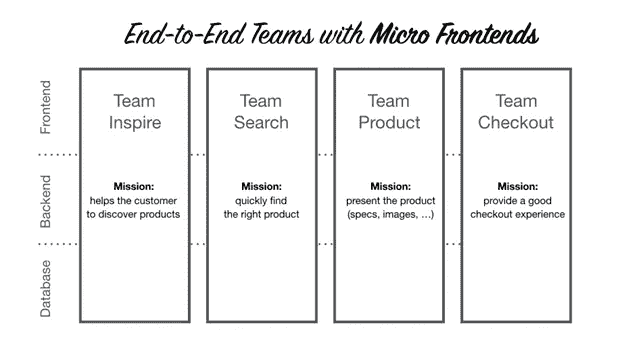
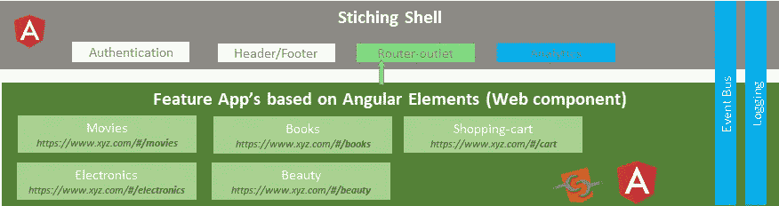
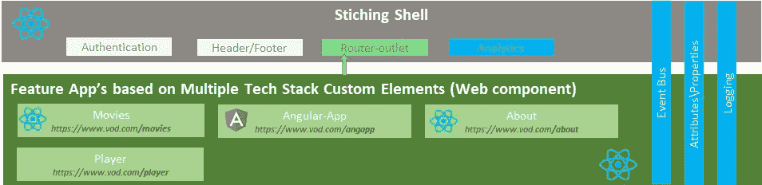

# 微前端咖喱

> 原文：<https://levelup.gitconnected.com/micro-frontend-curry-506b98a4cfc0>

## 什么，为什么，怎么做？

弗拉德·希利塔努在 [Unsplash](https://unsplash.com?utm_source=medium&utm_medium=referral) 上拍摄的照片

在这篇文章中，我们将阅读如何制作**菠萝咖喱…啊…** 听起来不一样，你是来做微前端的但是在阅读菠萝咖喱，这到底是什么？不要担心，这只是在阅读关于微前端的内容之前，让你的大脑更加活跃的一个心法:)好了让我们跳转到我们的主要话题，微前端。

Git 回购可以在这里找到:[https://github.com/nitin15j/microfrontend-webcomponent](https://github.com/nitin15j/microfrontend-webcomponent)

试玩可以看这里:[https://microfrontend.netlify.com](https://microfrontend.netlify.com/)和单个微 app 这里:[https://microfrontend-team-movies.netlify.com/](https://microfrontend-team-movies.netlify.com/)

## ***什么是微前端？***

“在这种方法中，web 应用程序被**分解**成它的**特性**，每个特性由不同的团队**从前端到后端拥有**。这确保了每项功能都是从 **【其他** **功能】“** *ThoughtWorks 技术雷达*”中独立开发**、**测试**、**部署****

************

******微前端团队视图******

## ******为什么我们称它为“咖喱”？******

******类似地，咖喱是各种各样的菜肴，使用香料或香草的组合来使菜肴美味可口。我们的**微前端库里是一种方法，使用框架或库的组合来使前端应用程序更美味，即更可伸缩、可测试和可管理**。******

## *******为什么我们需要微前端？*******

****微前端独立于任何框架。这意味着我们可以将它与任何流行的前端库一起使用，比如 Angular、React 或 Vue。我们可以把它归类为**使用可用的 UI 框架解决一些前端设计问题的解决方案**。让我们来了解一下这些设计问题是什么:****

1.  ****前端升级/更换成本高昂。我们生活在一个“新”时代，在这个时代，每隔六个月，我们就会获得一些新的技术/框架来解决一个大的行业问题。但是升级应用技术堆栈并不像看起来那么简单，也不像看起来那么划算。使用微前端方法，我们可以将应用程序分解成功能，然后独立开发和部署这些功能。现在，在未来，如果需要，我们可以更改/升级一个小的独立可部署功能，而不是集中于整个应用程序的升级。此外，这是“*很容易得到商业利益相关者的批准”:)*****
2.  ******微服务之上的 Monolith:**我们已经看到了后端系统中微服务设计的优势。它带来了选择不同技术堆栈的灵活性，更加关注业务需求，并且易于开发和维护。将所有这些优势带到前端需要一种类似的设计方法，这种方法可以分解大型整体前端，因此我们将“**前端微服务**”称为“**微前端**”。****
3.  ******跨职能跨技术团队**:我们大多数人都在敏捷管理的项目交付过程中工作，该过程提倡跨职能跨技术团队(Angular/React 团队、Java 团队、DB 团队等)。).如果我们跨职能合作，在客户期望匹配和最终产品交付方面的好处是巨大的。微前端提供了灵活性，让跨职能团队专注于端到端交付。****

## *******怎样才能实现微前端？*******

****众所周知，制作“菠萝咖喱”有不同的食谱。类似地，为了实现微前端，有不同的配方可用。有些食谱很容易执行，有些则需要很大的努力。人们可以根据业务需求选择配方/解决方案。让我在这里列出一些解决方案:****

1.  ******使用 iframe:** 实现微前端的解决方案之一是使用 iframe 方法。这在某种程度上是最适合的，但不限于那些企业最不关心技术升级来实现单点登录等功能的场景。使用 iframes，我们可以在一个父窗口下托管多个应用程序。**应用程序间的通信**可以使用 **HTML5 自定义事件**解决。对于应用程序捆绑和部署，可以编写一个自定义的 NPM 脚本。****
2.  ******使用 web 组件:**我们可以通过很多方式使用 Web 组件来构建微前端。在 **Angular、**中，我们可以创建[子应用](https://angular.io/guide/file-structure)来在一个外壳应用下开发不同的应用。在这种方法中，有两个重要的项目。首先，您需要一个缝合外壳来组合所有子应用程序，其次，需要一个消息通道来帮助应用程序间的通信。我将很快写一篇关于构建微前端的角度方法的详细博客。****

********

****逻辑视图****

****同样的方法也可以用于**反应**。这里我们还需要一个缝合外壳，它在运行时聚集所有子应用程序。****

********

****使用 react 的微前端****

******3。现成的框架:**市场上有一些框架可以处理拼接和应用程序间的通信任务，并帮助您更专注于业务特性的实现。 [**Single SPA**](https://single-spa.js.org/) 是一种流行的框架，它集成了客户端的子应用程序，并为子应用程序通信提供了开箱即用的通信层。 [**ARA 框架**](https://ara-framework.github.io/website/) 是这个列表中的新成员，它内部使用 [Airbnb 的 Hypernova](https://github.com/airbnb/hypernova) 来使微前端运行。 [**Tailor.js**](https://github.com/zalando/tailor) 也帮助工程师轻松搭建微前端。这是一个布局服务，它使用流从片段服务组成一个网页。它的部分灵感来自脸书的 BigPipe，但它是在电子商务环境下开发的。****

****市场上有许多其他选项可以帮助您使用不同的方法构建微前端。如果你想看扩展列表，我推荐你去访问[**awesome-micro frontends**](https://github.com/ChristianUlbrich/awesome-microfrontends)。还有一本同样主题的书出版了，你可以在这里 找到它 [**。**](https://www.manning.com/books/micro-frontends-in-action)****

****在下一篇文章中，我将深入探讨其中一种方法，以了解我们如何实际构建它。在那之前，享受你的菠萝咖喱:)****