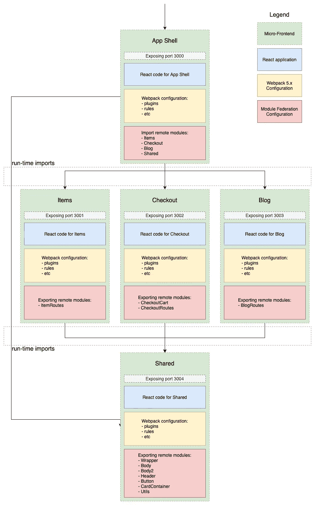

# 大规模微前端(第二部分)

> 原文：<https://levelup.gitconnected.com/micro-frontends-at-scale-part-2-d10994f09f18>

## 如何通过模块联合利用微前端

继[系列的第一篇文章](https://medium.com/xgeeks/micro-frontends-at-scale-part-1-a8ab67bfb773)详细描述了架构选择之后，这一篇文章将重点关注使用**模块联合**实现基于**微前端** (MFEs)的架构。到本文结束时，我们将已经创建并讨论了一个开源解决方案，它保持了客户对**单页应用**的 UX 感觉，同时让独立团队开发不同的产品。

Photo by [贝莉儿 DANIST](https://unsplash.com/@danist07?utm_source=medium&utm_medium=referral) on [Unsplash](https://unsplash.com?utm_source=medium&utm_medium=referral)

# 概述👀

我们要模拟的业务是一个服装市场。它有你通常能在电子商务商店里找到的东西:物品清单、物品细节、结帐和博客(博客不是很常见，但它符合主题)。

这是我们服装店的样子:

我们将跟随[这个 GitHub 库](https://github.com/comoser/clothes-store-micro-frontends)和一些 gists，所以我们有代表实现步骤的小代码片段。

该项目没有配置 CI/CD，也没有部署到任何地方。我们将在本系列的另一篇文章中讨论部署和所需的更改。

现在，我们可以在本地运行解决方案，包括在`development`和`production`环境中。

该项目也没有适当的状态管理解决方案。这将在以后的文章中讨论。

## 体系结构

该解决方案的架构选择和讨论在本系列的第一篇文章中有介绍，所以请务必查看。总之，这是我们在本文中要实现的图表:

应用架构

如果这张图带来了任何疑问或问题，请阅读系列文章的[第一篇文章，其中深入讨论了解决方案的架构细节。](https://medium.com/xgeeks/micro-frontends-at-scale-part-1-a8ab67bfb773)

# 履行💡

## 初始设置

在根文件夹中，我们有我们的主`package.json`文件，它将负责运行我们的编排命令并保存`yarn workspaces`的配置。

根级别 package.json

基本上，我们告诉 yarn，我们的工作空间将是文件夹`products`中的所有文件夹，在本例中是:

*   `app_shell`
*   `items`
*   `checkout`
*   `shared`
*   `blog`

> **注意** : yarn 工作空间将要求您在根级别 package.json 上拥有一个`private: true`属性，以便正确管理不同的 MFEs 依赖项。

**Pro 提示:** *yarn 工作空间*将尝试将 mfe 的依赖项提升到根依赖项(如果可能的话)。这适用于大多数 npm 包，但也有不适用的情况。在这些情况下，你可以明确地告诉 yarn 不要提升它们，例如:

这样，`[full-icu](https://www.npmjs.com/package/full-icu)` npm 包将保留在每个 MFE `node_modules`文件夹中。

我们还利用了`[concurrently](https://www.npmjs.com/package/concurrently)`和`[wsrun](https://www.npmjs.com/package/wsrun)`包，这样我们可以并行运行我们的 mfe。在开发时，`start:live`脚本将是 goto 命令，为了在生产中测试解决方案，`build:serve:all`将是我们的选择。

然后，在每个 MFE 根文件夹中，我们将有一个带有命令的`package.json`，这些命令将响应根级别`package.json`中的命令。

产品/app_shell/package.json

请注意，为每个 MFE 定义的端口是不同的，从`3000`开始，到`3004`结束。您可以在各自的`webpack.config.js`文件中找到这些用于**开发**目的的端口，并在各自的`serve`命令中找到这些用于**生产**的端口。

现在已经介绍了初始设置，让我们检查不同的 MFE 配置。

## 应用程序外壳 MFE

每个 MFE 的 webpack 配置文件都有一个包含名为`[ModuleFederationPlugin](https://webpack.js.org/concepts/module-federation/)`的插件的部分。这是让我们利用这个新的 **webpack** 特性的配置。

app_shell 的 webpack.config.js

从`line 3`开始，`name`属性是联邦模块的惟一标识符(在我们的上下文中，联邦模块总是 MFE)。当另一个 MFE 需要引用这个 MFE 时，它需要指定这个唯一的`name`。

第 4 至 9 行

在上面的代码片段(关于 webpack.config.js)中，定义了`remotes`属性。这个属性决定当前 MFE 需要什么 MFE。当前 MFE 需要的所有依赖项将在运行时**从定义的远程设备**导入。在这种情况下，就像“架构”一节中的架构图一样，我们可以验证**应用程序外壳**正在从**项目**、**结账**、**共享**和**博客**导入代码。

> **注意**:如果我们以第 5 行的例子为例，remotes 对象中的**键**在这个 MFE 中是对遥控器的引用。那个键的字符串**值**将启用与另一个 MFE 的连接。
> 
> 在这种情况下，“@”前的“项目”是该 MFE 的`name`属性。“@”后面的 URL 与 MFE 部署的位置相匹配。

在上面的代码中，定义了`shared`属性。这种配置非常重要，如果配置不当，会导致很多问题。让我们来探讨一下这个话题。

## 共享模块联合属性

gist 中给出的配置包含一些有趣的选项。

`...deps`对象扩展提取`package.json`中的所有`dependencies`，这将自动共享其中定义的所有库。这样做是为了更好地管理依赖性。

Webpack 将能够验证应用程序是否已经有了依赖项，如果有，它将不会再次加载它。这些验证在**运行时**导入代码时发生。注意依赖关系的**版本**，因为如果不匹配，webpack 会加载两个版本。

需要注意的还有`singleton`属性定义。每当依赖项具有内部状态时，都会使用它。因为，例如，React 和 React-dom 有内部状态，通过将它们定义为 singletons，我们告诉 webpack 我们永远不想加载这种依赖的两个版本。

该共享对象配置在解决方案的每个 MFE 中都是相同的。根据不同的项目，这个对象可能会有很大的不同，所以总是要努力微调`shared`属性。

## MFE 项目

在此 MFE 中，模块联合配置发生了一些变化。它具有两个 App Shell MFE 中没有的新属性。

项目的 webpack.config.js

`filename`定义了作为其他 mfe 的**清单**的文件名。它包含描述公开代码位置的信息和一些其他配置。当一个 MFE 公开代码供其他 MFE 使用时，`filename`属性是强制的。

`exposes`键定义了当前 MFE 公开的组件或通用代码。可以被 webpack 解析的一切也可以在模块联邦中公开(原语、函数、对象、react 组件等)。

## 远程导入

在运行时导入 MFE 的主要机制是导入该 MFE 的路由。这允许应用外壳充当平台的单一入口点，并从其他 mfe 动态导入用户需要的内容。也有这样的情况，需要一个来自远程的组件并直接导入，而不是使用路由。收银台就是一个例子。它公开了它的路线，同时也公开了一个`CheckoutCart`，允许应用程序外壳中的`navbar`有一个小的结帐组件。

这种单一入口点模式使应用程序对我们的客户来说就像一个常规的 SPA，因为当用户导航到属于特定 MFE(例如，项目)的路由时，它会在运行时异步加载这些路由。在提取它们时，它会显示一条正在加载的消息。加载后，它们被 webpack 缓存。从这一点开始，这些路线下的用户交互(例如/项目)由远程导入的 MFE 处理。

在下面的代码片段中，我们可以看到如何在运行时安全地导入 react 组件。

app_shell/src/App.jsx

在这种情况下，我们正在分析 App Shell MFE 的`App.jsx`文件，安全导入路线需要两件主要事情:

*   用 React.lazy 导入组件
*   用 React 包装组件调用。焦虑

这两个东西都是来自[React suspension API](https://reactjs.org/docs/concurrent-mode-suspense.html)的组件。

远程组件的导入按如下方式完成:

为了调用这些组件，我们使用`AsyncLoader`。这是一个简单地将`children`包装在`React.Suspense`和`ErrorBoundary`组件中的组件。通过使用它，我们保证在组件仍在导入时有一个后备，并且在加载代码时触发的任何错误都将被错误边界捕获，从而允许应用程序保持正常工作，尽管存在任何严重的 javascript 错误。

`AsyncLoader`如下:

这当然更适合生产应用程序。当失败时，我们希望显示一个好看的页面，为我们的客户提供一些有用的信息。我们可能希望将这个错误记录到 Sentry 或任何类似的工具中。这是做这件事的最佳地点。

然后，我们简单地使用`AsyncLoader`来呈现我们的 MFE 特定路线:

请注意，MFE 路由的远程导入位于带有每个 MFE 的 URL 的库`Route`中(例如/items)。通过这样做，我们确保了只有当用户真正需要时，才导入与 MFE 相关的内容。

## 独立模式

出于开发目的，能够独立运行 MFE 是非常重要的。它减少了启动应用程序的时间，并在进行小的调整时总体上改善了开发体验。当然，在开发的某个阶段，您必须在所有 mfe 运行的情况下运行整个编排，以测试集成(这些测试应该是手动和自动的)。

为了实现这一点，我们的 MFE 基本上有两个入口点:

*   `App.jsx`将成为独立应用程序的入口点(正常的 react 应用程序入口点)
*   `routes.js`将是 MFE 在整个流程编排中运行时的入口点

`routes.js`组件拥有与 MFE 完全一样的路由。对于 MFE 项目:

items/src/components/routes/index . js

对于作为独立入口点的`App.jsx`,有一个额外的步骤:

由于在 App Shell MFE 中，我们为每个 MFE 都设置了一个基本路由，因此在独立模式下运行时，也更容易设置这个基本路由。这将允许我们直接重用`routes.js`组件。

通过这种设置，您现在可以独立运行解决方案中的任何 MFE。

# 结果呢🌆

最终结果可以在[这个 GitHub 库](https://github.com/comoser/clothes-store-micro-frontends)中查看👈。

为了预览服装店并进行测试，您可以在`package.json`下使用几个命令:

*   `start:live`这将在**开发**模式下启动所有 mfe，并开启热重装
*   `build:serve:all`将在**生产**模式下构建所有 mfe，并与`[serve](https://www.npmjs.com/package/serve)` npm 包一起提供服务

如果您想自动打开每个 MFE 各自的浏览器标签，那么您也可以在`start:live`脚本中添加`--open`参数。

# ⚠️常见错误

## 模块”。容器中不存在/Routes

在这种情况下，您很可能弄错了 exposes 语法:

## 未捕获的类型错误:fn 不是函数

发生此错误的原因有几个:

*   您忘了提及 remotes reference 中条目`filename`的名称:

*   在更改`chunks`的 webpack 配置时，我也遇到了这个错误。默认情况下，这种配置通常是您所需要的一切，所以如果您出于某种原因更改了它，请仔细检查是否是这个原因。
*   也可能是为远程 MFE 定义的 url 是错误的。

## 找不到模块:错误:无法解析“…/button”中的“shared/Button”

基本上，配置中 MFE 的密钥引用与导入语句中使用的密钥不同:

## 意外的标记“

发生此错误的原因有很多，并且通常最难调试:

*   `output.publicPath`未配置到 MFE 或`auto`的 URL。模块联合需要这些定义良好的值来正确导入代码。
*   `output.chunkFilename`被覆盖，这可能会导致模块联合出现问题。
*   加载了库的多个版本(例如 React 或 react-router-dom ),这可能会导致不稳定的行为(请参考共享对象配置)。

# 结论

到目前为止，我希望您已经很好地掌握了 webpacks 的模块联合特性，并且发现服装店项目是您下一个企业项目的良好起点，或者只是改进现有项目。

这只是一个开始，有了这个代码库，就有可能扩展更多的主题，如 mfe 之间的通信、数据存储等等。我将在以后更多地讨论这些话题。

模块联盟仍然是最近才出现的，它的创建者定义了一些建议和伪标准，但是定义真正可靠的标准还为时过早。这里的内容可能很快就会过时，但我会尽量让回购与 webpack 的最新变化保持同步。

我希望你喜欢！👐请在下面留下你的评论来激起讨论！

如果你觉得这篇文章很有趣，请分享出来，因为你知道——分享就是关爱！

如果你喜欢在具有全球影响力的大规模项目中工作，如果你喜欢真正的挑战，请随时通过 [**xgeeks**](https://xgeeks.io/) **联系我们！我们正在壮大我们的团队，你可能是下一个** [**加入这个人才群体的人**](https://grnh.se/3f6ef9fa2us) **😉**