# 微前端使用 React、Webpack 5 和模块联合逐步部署到 AWS

> 原文：<https://levelup.gitconnected.com/micro-frontends-step-by-step-using-react-webpack-5-and-module-federation-e4b9d840ec71>


在本文中，我将一步一步地创建两个微前端 React 组件，并将一个按钮组件从一个渲染到另一个。

在本文的最后，您将能够实现一个微前端组件，并将其呈现到一个微前端容器中，然后将其部署到具有安全域的 AWS。最终结果可以在[https://mfe1.microfrontends.info/](https://mfe1.microfrontends.info/)看到

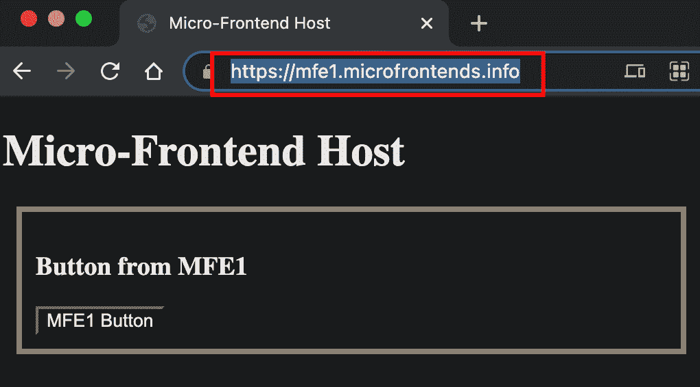

如果您是 Microfrontend 的新手，可以从下面的文章开始:

[](https://www.linkedin.com/pulse/micro-frontends-what-why-how-rany-elhousieny-phd%E1%B4%AC%E1%B4%AE%E1%B4%B0) [## 微前端:什么、为什么和如何

### 在我以前的文章(本文末尾和这里的链接)中，我亲自展示了什么是微前端以及如何…

www.linkedin.com](https://www.linkedin.com/pulse/micro-frontends-what-why-how-rany-elhousieny-phd%E1%B4%AC%E1%B4%AE%E1%B4%B0) 

这个实际操作的例子是后面两篇文章的继续，在那两篇文章中，我解释了微前端如何与 Webpack5 和模块联邦一起工作。我想给出 React 组件的清晰步骤，而不做任何解释。请参考这些文章的解释

[](https://medium.com/nerd-for-tech/micro-front-ends-hands-on-project-63bd3327e162) [## 微前端:动手项目

### 准备好您的机器并安装 nodejs，如果需要，请按照下面的文章/视频操作:

medium.com](https://medium.com/nerd-for-tech/micro-front-ends-hands-on-project-63bd3327e162) [](https://medium.com/nerd-for-tech/micro-frontends-hands-on-example-using-react-webpack-5-and-module-federation-adding-a-third-2fe8c61a73f) [## 使用 React、Webpack 5 和模块联合的微前端实践示例:添加第三个…

### 这篇文章是上一篇文章的延续

medium.com](https://medium.com/nerd-for-tech/micro-frontends-hands-on-example-using-react-webpack-5-and-module-federation-adding-a-third-2fe8c61a73f) 

最终项目可以在 https://github.com/ranyelhousieny/react-microfrontends[找到](https://github.com/ranyelhousieny/react-microfrontends)

如果您不熟悉微前端，可以从下面的文章开始:

[](https://www.linkedin.com/pulse/micro-frontends-what-why-how-rany-elhousieny-phd%E1%B4%AC%E1%B4%AE%E1%B4%B0) [## 微前端:什么、为什么和如何

### 在我以前的文章(本文末尾和这里的链接)中，我亲自展示了什么是微前端以及如何…

www.linkedin.com](https://www.linkedin.com/pulse/micro-frontends-what-why-how-rany-elhousieny-phd%E1%B4%AC%E1%B4%AE%E1%B4%B0) 

# 目录:

*   [在当地创建微型企业项目](#829c)
*   [步骤说明](#135a)
*   [将微前端部署到 AWS](#ca1b)
*   [添加 AWS CloudFront](#56cb)
*   [购买并添加域名](#407c)

==================

# 在本地创建微前端项目

# 1.创建两个 React 应用程序并安装依赖项

```
npx create-react-app mfe1cd mfe1yarn add webpack webpack-cli webpack-server html-webpack-plugin babel-loader webpack-dev-server **npx create-react-app mfe2****cd mfe2** **yarn add** webpack webpack-cli webpack-server html-webpack-plugin babel-loader webpack-dev-server css-loader
```

我喜欢《纱》的好处是结尾的报道。检查并确保它安装了 Webpack 5 或更高版本(您可以在这里了解如何安装节点和线程

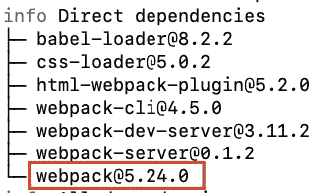

我在这个例子中使用了 yarn，因为 npm 在最新的 React 版本中出现了错误。

注:虽然我在这里使用 create-react-app 是为了更容易地进行演练，但我完全不会依赖它，我们将创建自己的 webpack.config.js。在本文中，您可以学习如何在没有 CRA 的情况下设置 react 项目

[](https://www.linkedin.com/pulse/create-react-app-without-create-react-app-cra-elhousieny-phd%E1%B4%AC%E1%B4%AE%E1%B4%B0) [## 创建 react 应用程序而不创建 React 应用程序(CRA)

### 这篇文章将展示如何在不使用 create-react-app (CRA)的情况下创建 React 应用程序。有关我们为什么的更多详细信息…

www.linkedin.com](https://www.linkedin.com/pulse/create-react-app-without-create-react-app-cra-elhousieny-phd%E1%B4%AC%E1%B4%AE%E1%B4%B0) 

完成此步骤后，您需要打开 visual studio 代码来完成其余步骤。

# 2.在这两个应用程序中，将 index.js 重命名为 bootstrap.js

在 *bootstrap.js* 中，删除 index.css 和 reportWebVitals 的导入，保留文件，如下所示:

```
import React from 'react';
import ReactDOM from 'react-dom';
import App from './App'; ReactDOM.render(
  <App />,
  document.getElementById(
    'root'
  )
);
```

这是 Github 上的文件

[https://github . com/ranyelhousieny/react-micro frontends/blob/main/mfe 1/src/bootstrap . js](https://github.com/ranyelhousieny/react-microfrontends/blob/main/mfe1/src/bootstrap.js)

我们这样做是为了让引导异步加载。MFE2 需要等待 Webpack 从 MFE1 获取组件。

# 3.在这两个应用程序中，创建一个只有一行的新 index.js

```
import('./bootstrap');
```

这是 Github 上的文件

[](https://github.com/ranyelhousieny/react-microfrontends/blob/main/mfe1/src/index.js) [## ranyelhousieny/react-微前端

### 通过在 GitHub 上创建一个帐户来为 ranyelhousieny/react-micro frontends 开发做贡献。

github.com](https://github.com/ranyelhousieny/react-microfrontends/blob/main/mfe1/src/index.js) 

# 4.在 MFE1 中，创建。按钮组件

创建一个文件 src/Button.js

在里面复制这段代码(这是一个非常简单的组件)

```
import React from 'react'; const Button = () => (
  <button>MFE1 Button</button>
); export default Button;
```

代码可在以下位置找到

[](https://github.com/ranyelhousieny/react-microfrontends/blob/main/mfe1/src/Button.js) [## ranyelhousieny/react-微前端

### 通过在 GitHub 上创建一个帐户来为 ranyelhousieny/react-micro frontends 开发做贡献。

github.com](https://github.com/ranyelhousieny/react-microfrontends/blob/main/mfe1/src/Button.js) 

# 4.1.在 MFE1 中，按如下方式更新 App.js

代码可以在[https://github . com/ranyelhousieny/react-micro frontends/blob/main/mfe 1/src/app . js](https://github.com/ranyelhousieny/react-microfrontends/blob/main/mfe1/src/App.js)找到

# 5.在 MFE1 中，在根目录下创建一个 Webpack.config.js，并将以下内容放入其中

(关于这个文件的详细信息和一步一步的构建可以在这里找到[https://www . LinkedIn . com/pulse/understanding-micro-frontends-web pack 5-configurations-rany/](https://www.linkedin.com/pulse/understanding-micro-frontends-webpack5-configurations-rany/)和视频[https://youtu.be/AZDDIgJSKU0](https://youtu.be/AZDDIgJSKU0)

```
const HtmlWebpackPlugin = require('html-webpack-plugin');
const ModuleFederationPlugin = require('webpack/lib/container/ModuleFederationPlugin'); module.exports = {
  mode: 'development',
  devServer: {
    port: 8083,
  },
  module: {
    rules: [
      {
        /* The following line to ask babel 
             to compile any file with extension
             .js */
        test: /\.js?$/,
 /* exclude node_modules directory from babel. 
            Babel will not compile any files in this directory*/
        exclude: /node_modules/, // To Use babel Loader
        loader:
          'babel-loader',
        options: {
          presets: [
            '@babel/preset-env' /* to transfer any advansed ES to ES5 */,
            '@babel/preset-react',
          ], // to compile react to ES5
        },
      },
    ],
  }, plugins: [
    new ModuleFederationPlugin(
      {
        name: 'MFE1',
        filename:
          'remoteEntry.js', exposes: {
          './Button':
            './src/Button',
        },
      }
    ),
    new HtmlWebpackPlugin({
      template:
        './public/index.html',
    }),
  ],
};
```

[https://github . com/ranyelhousieny/react-micro frontends/blob/main/mfe 1/web pack . config . js](https://github.com/ranyelhousieny/react-microfrontends/blob/main/mfe1/webpack.config.js)

这里我们创建了 MFE1，并让它通过[*http://localhost:8083/remote entry . js*公开按钮组件。](http://localhost:8083/remoteEntry.js.) Webpack 在 [http://localhost:8083 上渲染这个。](http://localhost:8083.)

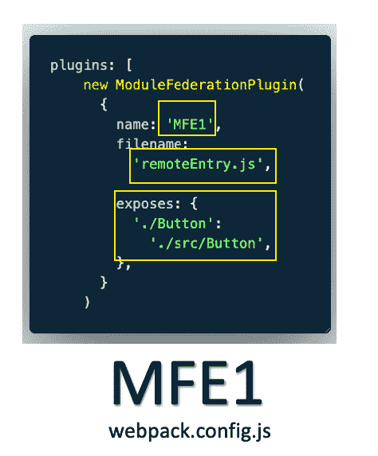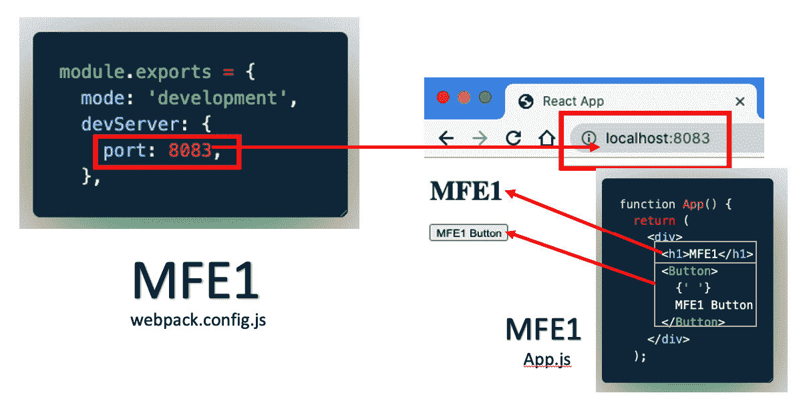[](https://www.linkedin.com/pulse/understanding-micro-frontends-webpack5-configurations-rany/) [## 逐步了解微前端 Webpack5 配置

### 在前两篇文章中，我演示了如何构建微前端并将它们部署到 AWS。在这个过程中，我…

www.linkedin.com](https://www.linkedin.com/pulse/understanding-micro-frontends-webpack5-configurations-rany/) 

# 6.在 MFE2 中，在根目录下创建一个 Webpack.config.js，并将以下内容放入其中

关于这个文件的更多细节在这里[https://www . LinkedIn . com/pulse/understanding-micro-frontends-web pack 5-module-step-rany](https://www.linkedin.com/pulse/understanding-micro-frontends-webpack5-module-step-rany)

```
const HtmlWebpackPlugin = require('html-webpack-plugin');
const ModuleFederationPlugin = require('webpack/lib/container/ModuleFederationPlugin'); module.exports = {
  mode: 'development',
  devServer: {
    port: 8082,
  },
  module: {
    rules: [
      {
        /* The following line to ask babel 
             to compile any file with extension
             .js */
        test: /\.js?$/,
 /* exclude node_modules directory from babel. 
            Babel will not compile any files in this directory*/
        exclude: /node_modules/, // To Use babel Loader
        loader:
          'babel-loader',
        options: {
          presets: [
            '@babel/preset-env' /* to transfer any advansed ES to ES5 */,
            '@babel/preset-react',
          ], // to compile react to ES5
        },
      },
    ],
  }, plugins: [
    new ModuleFederationPlugin(
      {
        name: 'MFE2',
        filename:
          'remoteEntry.js',
        remotes: {
          MFE1:
            'MFE1@http://localhost:8083/remoteEntry.js',
        },
      }
    ),
    new HtmlWebpackPlugin({
      template:
        './public/index.html',
    }),
  ],
};
```

[https://github . com/ranyelhousieny/react-micro frontends/blob/main/mfe 2/web pack . config . js](https://github.com/ranyelhousieny/react-microfrontends/blob/main/mfe2/webpack.config.js)

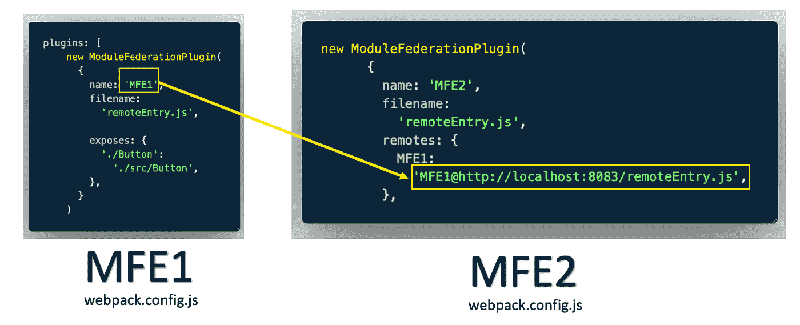

这里我们只是说 MFE1 公开的组件可以通过[http://localhost:8083/remote entry . js](http://localhost:8083/remoteEntry.js)在 MFE2 中远程可用

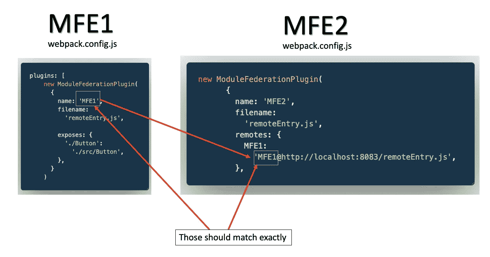

# 7.MFE2 中的 src/App.js 导入按钮(惰性导入)

```
const MFE1_Button = React.lazy(
  () => import('MFE1/Button')
);
```

将其添加到应用程序中，如下所示

```
function App() {
  return (
    <div>
      <h1>MFE2</h1>
      <div>
        <React.Suspense fallback='Loading Button'>
          <MFE1_Button />
        </React.Suspense>
      </div>
      <h2>MFE2</h2>
    </div>
  );
}
```

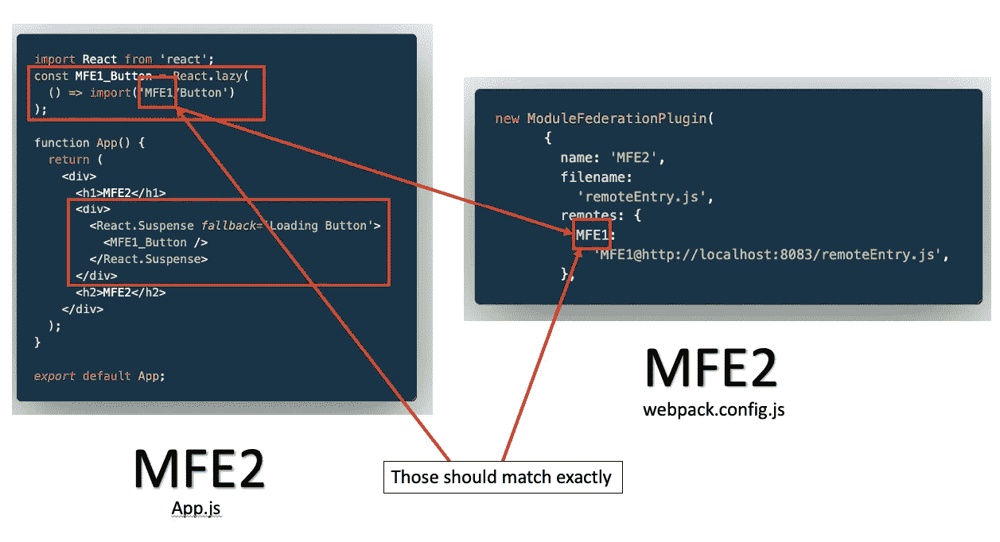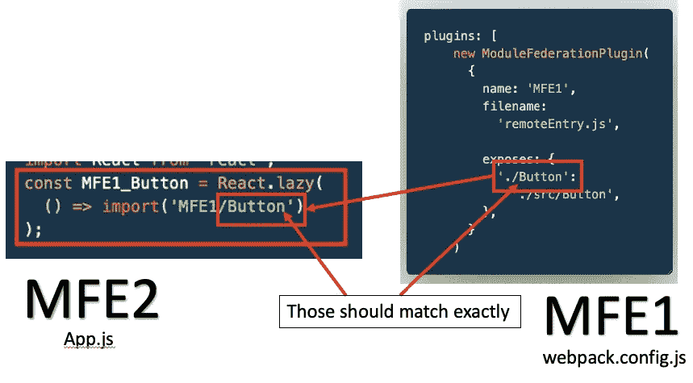

# 8.让我们运行这两个应用程序

在 MFE1 目录中打开一个终端并运行

```
yarn webpack serve
```

对 MFE2 目录执行相同的操作

现在打开浏览器并导航到

[http://localhost:8082/](http://localhost:8082/)

您应该会看到以下内容

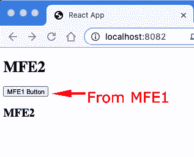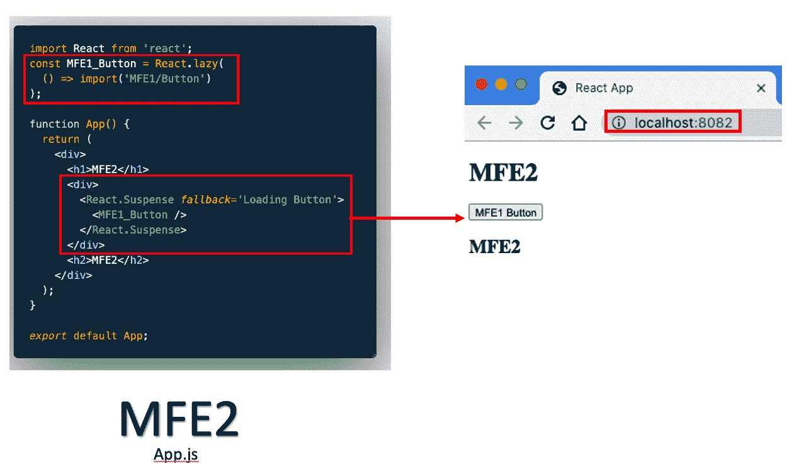

==============================

# 解释:

现在，让我们退一步，理解我们做了什么。

# 首先:Webpack 为我们创建了两台服务器

1.  mfe 1 on[http://localhost:8083/](http://localhost:8083/)【我们在配置中决定了这个端口】

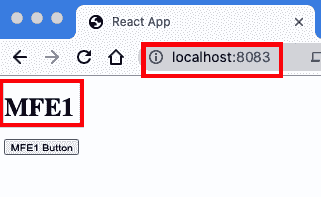

1.  mfe 2 on[http://localhost:8082/](http://localhost:8082/)

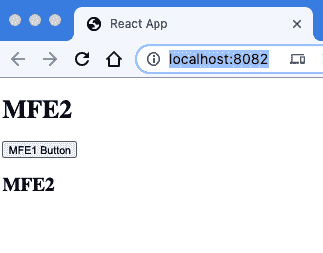

# 第二:使用模块联合插件，我们从 MFE1 站点(http://localhost:8083/)公开了按钮组件，并将其导入 MFE2


这是实现这一点的配置

1.  我们在 MFE2 中为 MFE1 添加了一个遥控器

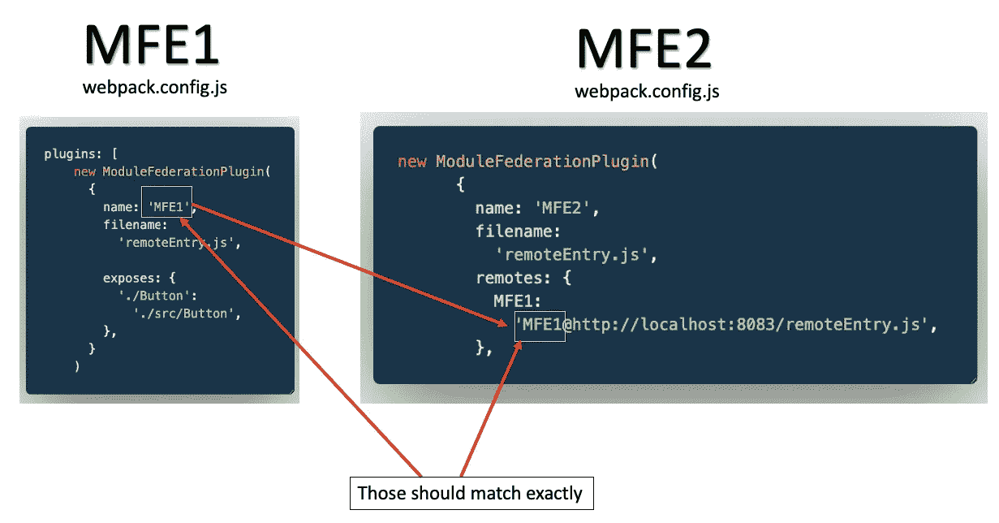

2.我们将 MFE1 中的公开组件导入到 MFE2 中的 App.js 中

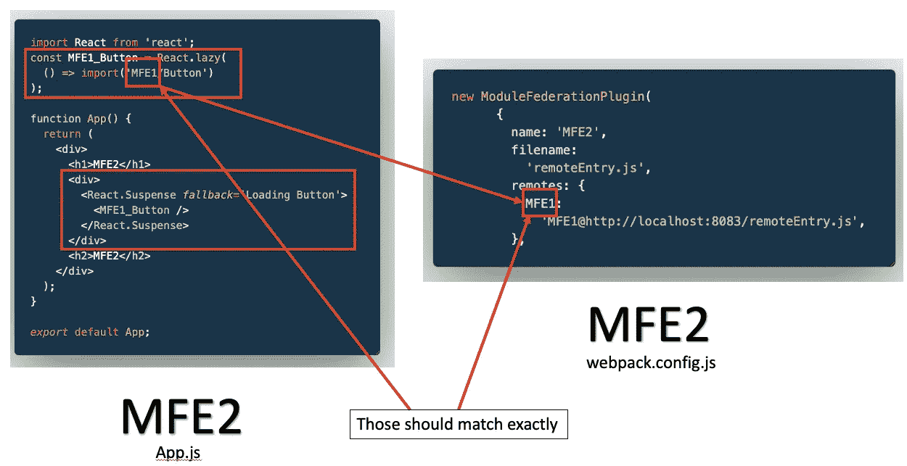

3.最后，我们在 MFE1 中懒惰地渲染了按钮

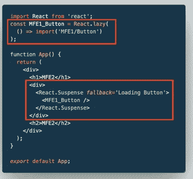

现在，既然我们已经测试并理解了 Webpack 如何在本地工作，那么让我们在下面的文章中将我们的应用程序部署到 AWS:

[](https://www.linkedin.com/pulse/deploying-micro-frontends-aws-step-using-gitlab-react-rany/) [## 使用 Gitlab、React、Webpack 5 和模块联盟逐步将微前端部署到 AWS

### 在我之前的文章(https://levelup.gitconnected。

www.linkedin.com](https://www.linkedin.com/pulse/deploying-micro-frontends-aws-step-using-gitlab-react-rany/) 

=======================

# 部署微前端

在本地实现和测试微前端之后，让我们将它们部署到 AWS。按照以下文章中的步骤部署到 AWS:

[](https://www.linkedin.com/pulse/deploying-micro-frontends-aws-step-using-gitlab-react-rany) [## 使用 React、Webpack 5 和模块联合逐步将微前端部署到 AWS

### 在我之前的文章(https://levelup.gitconnected。

www.linkedin.com](https://www.linkedin.com/pulse/deploying-micro-frontends-aws-step-using-gitlab-react-rany) 

您可以在[http://mfe1.s3-website-us-east-1.amazonaws.com/](http://mfe1.s3-website-us-east-1.amazonaws.com/)浏览部署的版本

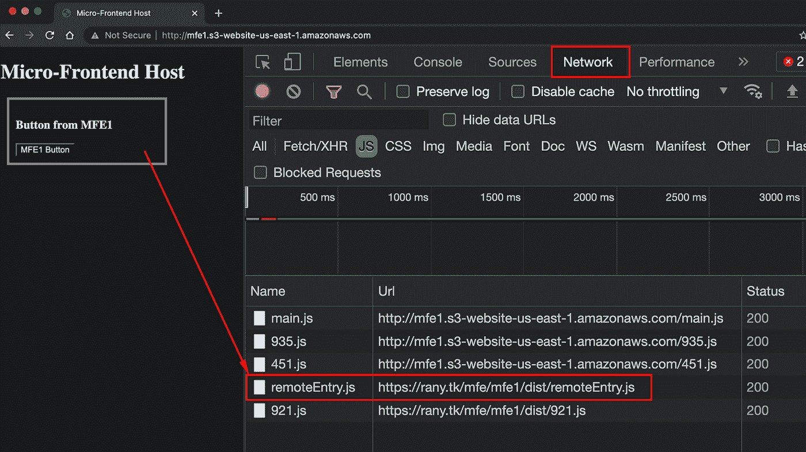

如果你点击检查，然后如上图所示的网络，你可以看到呼叫得到【https://rany.tk/mfe/mfe1/dist/remoteEntry.js】T2

现在，我们创建了一个主机，并在其中添加了一个微前端，然后部署到 AWS。

========================================

# 添加 AWS CloudFront

部署到 S3 之后，让我们添加 CloudFront 来实现缓存、安全性，并添加一个域名。这是部署网站时非常重要的一步。按照下面的文章添加 CloudFront

[](https://www.linkedin.com/pulse/adding-cloudfront-web-enabled-aws-s3-bucket-rany-elhousieny-phd%E1%B4%AC%E1%B4%AE%E1%B4%B0) [## 将 CloudFront 添加到支持 Web 的 AWS S3 Bucket

### 本文建立在前一篇文章(https://www.linkedin。

www.linkedin.com](https://www.linkedin.com/pulse/adding-cloudfront-web-enabled-aws-s3-bucket-rany-elhousieny-phd%E1%B4%AC%E1%B4%AE%E1%B4%B0) 

# 现在，您可以通过以下链接访问 mfe 2:http://d1tsn16diydefl.cloudfront.net/

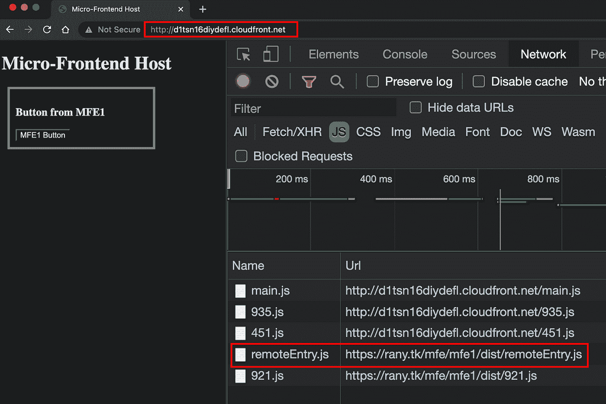

=====================================

# 购买和添加域名:

现在，很难记住前面的链接[http://d1tsn16diydefl.cloudfront.net/](http://d1tsn16diydefl.cloudfront.net/)。在下面的文章中，我将一步一步地购买 microfrontends.info，并将该网站渲染到[https://mfe1.microfrontends.info/](https://mfe1.microfrontends.info/)

[https://www . LinkedIn . com/pulse/adding-domain-certificate-website-AWS-S3-we B- enabled-rany](https://www.linkedin.com/pulse/adding-domain-certificate-website-aws-s3-web-enabled-rany)

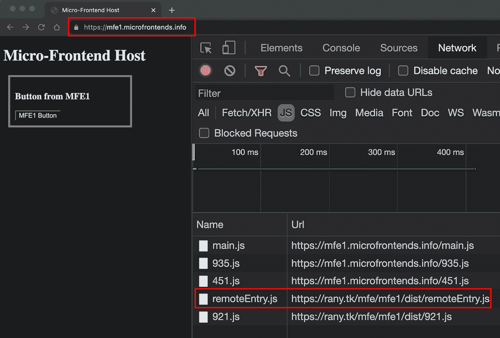

# 兰尼·埃尔豪斯尼的其他文章:

[](https://www.linkedin.com/in/ranyelhousieny/) [## 兰尼·埃尔豪斯尼，PhDᴬᴮᴰ -软件工程高级经理- Zulily | LinkedIn

### 𝙈𝙞𝙘𝙧𝙤𝙨𝙚𝙧𝙫𝙞𝙘𝙚𝙨解决方案架构师𝘼𝙒𝙎𝙎𝙤𝙡𝙪𝙩𝙞𝙤𝙣𝙨𝘼𝙧𝙘𝙝𝙞𝙩𝙚𝙘𝙩𝘾𝙚𝙧𝙩𝙞𝙛𝙞𝙚𝙙…

www.linkedin.com](https://www.linkedin.com/in/ranyelhousieny/) [](https://www.linkedin.com/newsletters/software-engineering-6892974463336501248/) [## 软件工程| LinkedIn

### Rany ElHousieny，PhDᴬᴮᴰ |分享我在不同领域的软件工程经验，前端、后端、云…

www.linkedin.com](https://www.linkedin.com/newsletters/software-engineering-6892974463336501248/) 

# 其他微前端文章和视频，请访问:

[](https://medium.com/nerd-for-tech/micro-front-ends-hands-on-project-63bd3327e162) [## 微前端:动手项目

### 准备好您的机器并安装 nodejs，如果需要，请按照下面的文章/视频操作:

medium.com](https://medium.com/nerd-for-tech/micro-front-ends-hands-on-project-63bd3327e162) [](https://medium.com/nerd-for-tech/micro-frontends-hands-on-example-using-react-webpack-5-and-module-federation-adding-a-third-2fe8c61a73f) [## 使用 React、Webpack 5 和模块联合的微前端实践示例:添加第三个…

### 这篇文章是上一篇文章的延续

medium.com](https://medium.com/nerd-for-tech/micro-frontends-hands-on-example-using-react-webpack-5-and-module-federation-adding-a-third-2fe8c61a73f) 

我最初发表在 LinkedIn 上

[](https://www.linkedin.com/pulse/micro-frontends-hands-on-example-using-react-webpack-rany/) [## 使用 React、Webpack 5 和模块联合逐步实现微前端

### 在这篇文章中，我将一步一步地创建两个微前端反应组件，并呈现一个按钮组件…

www.linkedin.com](https://www.linkedin.com/pulse/micro-frontends-hands-on-example-using-react-webpack-rany/)