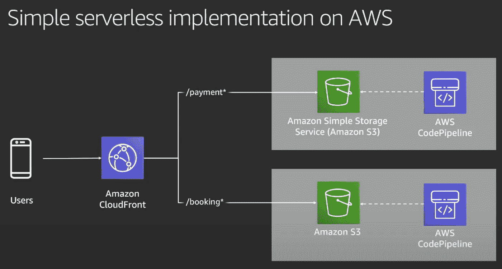

# 微前端:什么、为什么和如何

> 原文：<https://levelup.gitconnected.com/micro-frontends-what-why-and-how-bf61f1f0a729>

在我之前的[篇文章](https://www.linkedin.com/pulse/micro-frontends-from-begining-expert-rany-elhousieny-phd%E1%B4%AC%E1%B4%AE%E1%B4%B0/)(本文最后的[链接](https://www.linkedin.com/pulse/micro-frontends-from-begining-expert-rany-elhousieny-phd%E1%B4%AC%E1%B4%AE%E1%B4%B0/)和这里的)中，我亲自展示了什么是微前端以及如何创建它们。在本文中，我将后退一步解释微前端，为什么我们需要使用它们，以及实现它们的不同方法。这帮助我为我的公司写了一个架构改变的提议，我希望它能帮助读者为你的项目选择正确的架构。

========================================================

# 什么是微前端

Martin Fowler 将微前端架构定义为“一种架构风格，其中可独立交付的前端应用程序被组合成一个更大的整体。”简单来说，微前端就是网页的一部分(不是整个页面)。微前端架构页面中有一个“主机”或“容器”页面，可以托管一个或多个微前端。主机/容器页面也可以共享一些自己的微前端组件。

例如，正如我们在以前的[文章](https://www.linkedin.com/pulse/micro-frontends-hands-on-example-using-react-webpack-rany/)中实现的，我们将一个按钮组件从 mfe1 页面公开到 mfe2(主机/容器)中

或者在这篇[文章](https://www.linkedin.com/pulse/deploying-micro-frontends-aws-step-using-gitlab-react-rany/)中我们一起部署到 S3 的[http://mfe1.s3-website-us-east-1.amazonaws.com/](http://mfe1.s3-website-us-east-1.amazonaws.com/)的现场直播

而这里是[注册链接](https://mfe1.microfrontends.info/)当(【https://mfe1.microfrontends.info/】T2)我们在下面的[文章](https://www.linkedin.com/pulse/adding-domain-certificate-website-aws-s3-web-enabled-rany)[https://www . LinkedIn . com/pulse/adding-domain-certificate-website-AWS-S3-we B- enabled-rany](https://www.linkedin.com/pulse/adding-domain-certificate-website-aws-s3-web-enabled-rany)中注册了一个新的域名

# 微前端架构由 3 个主要组件组成:

1.  微前端(在前面的例子中，来自 MFE1 的按钮是微前端)
2.  主机/容器(在前面的示例中，mfe2 是主机)
3.  微前端框架:为此我们使用了 *Webpack 5 模块联合插件*

===============

# 微前端的历史

你有没有想过“微前端”这个术语是何时何地出现的？在下面的文章中，我将介绍微前端的发展。

 [## 兰尼·埃尔豪斯尼，PhDᴬᴮᴰ在 LinkedIn 上:微前端的历史

### 微前端的历史...

www.linkedin.com](https://www.linkedin.com/feed/update/urn:li:ugcPost:6842147008610996224?updateEntityUrn=urn%3Ali%3Afs_feedUpdate%3A%28*%2Curn%3Ali%3AugcPost%3A6842147008610996224%29) 

*   2020 年:2020 年底，[扎克·杰克逊](https://medium.com/u/9ef1379caffc?source=post_page-----bf61f1f0a729--------------------------------)在 Webpack 5 中发布了他的代表作“[模块联邦](https://webpack.js.org/concepts/module-federation/)”。模块联合插件将微前端的世界改变到了一个全新的水平。现在，您可以将一个远程组件包含到您的项目中，因为您已经在本地开发了它，而不需要依赖于构建或部署，甚至不需要 web 服务器来运行它。这是微波炉的未来。公司开始采用模块联合的方法从单一应用程序迁移到微前端。

=========================

# 为什么是微前端？

引入微前端架构是为了解决当前 SPA 前端开发中的多个问题。我经历了一个网站发展到极限的过程，它变得很难扩展，修改，甚至培训新的工程师成为它的一部分。有了这样一个单一的系统，开发者们将会因为应用一个小的改变而被彼此阻止。以下是微前端的一些优势:

*   团队可伸缩性:多个团队可以独立工作，为多个系统做出贡献。这使得我们可以划分工作，并通过多个团队进行扩展。
*   单一责任:这将允许每个团队用单一责任来构建组件。托管团队可以专注于分析和性能，每个功能团队可以专注于客户。两个团队都可以在他们的特定领域 100%地工作。主页团队可以 100%专注于创建一个伟大的主页。每个微前端团队将 100%专注于他们微前端的功能。
*   可重用性:我们将能够在多个地方使用代码。一个组件将被构建和部署，不同的团队可以重用它。
*   技术不可知论:微前端架构独立于技术。你可以使用不同技术的组件(JavaScript，React，Vue，Angular …)。您不必担心部署或构建它们。
*   学习曲线:对于加入团队的新工程师来说，学习较小的应用程序比理解一个有数千行代码的庞然大物更容易。

*   领域驱动架构:发明微前端和微服务的主要原因之一是允许垂直领域所有权。从整个公司拥有的整体架构转移到多个团队拥有的微服务，帮助公司在不同团队之间扩展开发，并促进后端的所有权。然而，前端仍然是一个庞大的整体，依赖于多个团队。借助微前端，每个垂直领域都拥有一个端到端的垂直组件。
*   对添加开放，对修改关闭:前端开发的一大挑战是技术的进步，这需要持续的重构。我见过一些公司花费巨资从一个框架重构到另一个框架(PHP、Angrular1、Angular2、React……)。Miccrofrontends 解决了这个问题。现在，您可以继续使用旧的框架，只重构或构建新的微前端。

==============

# 如何实现微前端？

微前端的主要关键是主机/容器和微前端之间的集成。有两种方法可以集成微前端

# 构建时集成

这就是今天大部分代码实现的内容。容器将组件安装为库，类似于从 npm 安装的库。这种方法的问题是同步不同版本的库和构建问题。此外，很难使用不同的技术。此外，最终包的大小会很大，因为它包含了所有的依赖项。此外，对于依赖关系的任何更改，您都必须重新部署。此外，容器和所有微前端之间存在紧密耦合。

# 运行时集成

运行时集成有三种类型的组合:

# 服务器端合成

在这种情况下，所有的功能将在后端，决定加载哪个微前端。服务器将决定将请求路由到哪个 URL。这是一个标准的服务器端组合。我已经使用 Nginx 使用简单的反向代理来完成这项任务。然而，还有许多其他实现。

# 边缘构图

在这种方法中，您可以使用 CDN(例如:AWS CloudFront)和 Lambda@Edge。编排将发生在 CDN 本身，而不是客户端或服务器端。更多信息请见[https://youtu.be/fT-5RHTtFNg](https://youtu.be/fT-5RHTtFNg)

# 客户端合成

这就是我在之前的[文章](https://www.linkedin.com/pulse/micro-frontends-from-begining-expert-rany-elhousieny-phd%E1%B4%AC%E1%B4%AE%E1%B4%B0/)中解释的。在这种情况下，容器是单独构建和部署的。每个微前端可以作为单独的包公开，容器/主机可以获取所需的微前端。关于这种方法的更多解释，请参考本文末尾的文章列表或此处的。在这种情况下，容器和微前端完全解耦。它们不共享构建或部署，可以使用不同的技术。容器可以决定要部署的微前端的版本。

最近使用的方法之一是 Webpack 5 模块联合插件。Webpack 5 Module Federation 插件的趋势非常高，并提供了非常成功的结果。如果你需要更多的细节，你可以关注我的其他视频和文章[这里](https://www.linkedin.com/pulse/micro-frontends-from-begining-expert-rany-elhousieny-phd%E1%B4%AC%E1%B4%AE%E1%B4%B0/):

 [## 具有模块联邦的微前端:什么、为什么和如何

### "模块联合给了我们一种在前端应用程序间共享代码的新方法. "前一句是…

ranyel.medium.com](https://ranyel.medium.com/microfrontends-with-module-federation-what-why-and-how-845f06020ee1) 

文章:[https://www . LinkedIn . com/pulse/micro-frontends-from-begining-expert-rany-elhousieny-PhD % E1 % B4 % AC % E1 % B4 % AE % E1 % B4 % B0/](https://www.linkedin.com/pulse/micro-frontends-from-begining-expert-rany-elhousieny-phd%E1%B4%AC%E1%B4%AE%E1%B4%B0/)

 [## 从初学者到专家的微前端

### 在这篇文章中，我将把之前所有的文章和视频以一种能帮助人们理解的方式进行整理…

www.linkedin.com](https://www.linkedin.com/pulse/micro-frontends-from-begining-expert-rany-elhousieny-phd%E1%B4%AC%E1%B4%AE%E1%B4%B0/) 

视频:[https://youtu.be/AZDDIgJSKU0](https://youtube.com/playlist?list=PLjzEd-em7iW_-cUUki8Zt15mGF6ZrOQPn)

===========

# 部署微前端

部署使用 Webpack 模块联合创建的客户端组合微前端非常容易、高效且廉价。大多数文章、课程和书籍在创建微前端后就停止了。我将展示部署微前端并向其添加公共域是多么容易。以下文章详细解释了如何将微前端部署到 AWS S3。

 [## 使用 React、Webpack 5 和模块联合逐步将微前端部署到 AWS

### 在我之前的文章(https://levelup.gitconnected。

www.linkedin.com](https://www.linkedin.com/pulse/deploying-micro-frontends-aws-step-using-gitlab-react-rany) 

最终结果可以在[http://mfe1.s3-website-us-east-1.amazonaws.com/](http://mfe1.s3-website-us-east-1.amazonaws.com/)找到

## 下面的文章将解释如何添加域名

[https://www . LinkedIn . com/pulse/adding-domain-certificate-website-AWS-S3-we B- enabled-rany](https://www.linkedin.com/pulse/adding-domain-certificate-website-aws-s3-web-enabled-rany)

在本文中，我们将购买一个域(microfrontends.info)并将其链接到我们在上一篇[文章](https://www.linkedin.com/pulse/adding-cloudfront-web-enabled-aws-s3-bucket-rany-elhousieny-phd%E1%B4%AC%E1%B4%AE%E1%B4%B0)中创建的 CloudFront(【http://d1tsn16diydefl.cloudfront.net/】的)

 [## 微前端

### Martin Fowler 将微前端架构定义为“一种可独立交付的架构风格…

microfrontends.info](https://microfrontends.info) 

============

# 微前端有哪些不同的框架

微前端是新的，框架也在发展。目前市场上有几种框架:

## [*Webpack 模块联盟插件*](https://webpack.js.org/concepts/module-federation/)

[*Webpack 模块联邦插件*](https://webpack.js.org/concepts/module-federation/) : Webpack 是多年来在前端广泛使用的知名框架。Webpack 为微前端添加了一个新插件，解决了以前框架的大部分问题。对于已经在使用 Webpack 的系统来说，它不需要额外的开销。Webpack 是一个开源的 JavaScript 模块捆绑器。简而言之，Webpack 获取具有依赖性的模块，并生成表示这些模块的静态资产，这些资产可以存储在支持 Web 的 AWS S3 存储中，从而拥有一个没有服务器的网站。它可以与 Nginx 一起使用，将 URL 路由到 S3 上适当的存储桶。它非常有效，因为它减少了对服务器的需求，并将包大小减少到只需要依赖项。在微前端架构中，Webpack 模块联合允许 JavaScript 应用程序在运行时从不同的 URL 从另一个应用程序动态导入代码。Webpack 提供构建时和运行时集成，而不需要服务器。它还通过支持依赖共享来解决代码依赖和增加包大小的问题。例如，如果您正在下载一个 React 组件，您的应用程序不会导入 React 代码两次。该模块将智能地使用您已经拥有的 React 源代码，并且只导入组件代码。最后，如果导入的代码由于某种原因失败，您可以使用 React.lazy 和 react . junction 来提供后备，确保用户体验不会因为构建失败而中断。我推荐使用这个框架进行运行时合成。您仍然可以使用其他框架在构建时或在服务器端集成更大的前端，但是模块联合将允许您更加细化到组件级别。

 [## 具有模块联邦的微前端:什么、为什么和如何

### "模块联合给了我们一种在前端应用程序间共享代码的新方法. "前一句是…

ranyel.medium.com](https://ranyel.medium.com/microfrontends-with-module-federation-what-why-and-how-845f06020ee1) 

下面的文章详细解释了如何使用模块联合实现微前端并公开部署到 AWS

 [## 使用 React、Webpack 5 和模块联合逐步实现微前端

### 在这篇文章中，我将一步一步地创建两个微前端反应组件，并呈现一个按钮组件…

www.linkedin.com](https://www.linkedin.com/pulse/micro-frontends-hands-on-example-using-react-webpack-rany) 

但是，create-react-app 和 webpack 5 有一个问题；请查看以下文章中可能的临时解决方案，直到它们发布修复程序:

 [## 微前端:集成一个创建-反应-应用程序(CRA)项目，没有弹出使用 CRACO…

### 什么是 CRACO: CRACO 代表创建-反应-应用程序配置覆盖。它被实现为一种简单的方法来覆盖…

www.linkedin.com](https://www.linkedin.com/pulse/microfrontends-integrating-create-react-app-cra-eject-rany)  [## 具有 create-react-app 的微前端，无需使用 CRACO 弹出

### 每次我谈到使用 Webpack 5 Modulefederation 插件的微前端，create-react-app 的问题…

www.linkedin.com](https://www.linkedin.com/pulse/microfrontends-create-react-app-without-eject-using-rany)  [## 如何一步步升级到 React 17 和 Webpack 5

### 为了能够在我的组织中使用微前端，我必须将传统应用升级到 React 17 和 Webpack 5。当然，就像…

www.linkedin.com](https://www.linkedin.com/pulse/how-upgrade-react-17-webpack-5-step-rany-elhousieny-phd%E1%B4%AC%E1%B4%AE%E1%B4%B0/)  [## 具有模块联合的微前端:使用 CRACO 创建-反应-应用而不弹出

### 每次我谈到使用 Webpack 5 Modulefederation 插件的微前端，create-react-app 的问题…

www.linkedin.com](https://www.linkedin.com/pulse/microfrontends-create-react-app-without-eject-using-rany) 

CRA 是为初学者学习 React 而创建的，它不是为生产而设计的。在这篇文章的最后，我有一些关于如何在没有 CRA 的情况下创建 React 应用程序的链接，这是对带有模块联合插件的微前端的推荐方式

 [## 从创建-反应-应用中解放出来(如何在没有 CRA 的情况下创建反应应用)

### 当我开始使用模块联盟迁移到微前端时，我面临着两个挑战

ranyel.medium.com](https://ranyel.medium.com/freedom-from-create-react-app-how-to-create-react-apps-without-cra-27fadeb79c82) 

========

## 其他框架包括:

1.  [**单 SPA**](https://single-spa.js.org/) :单 SPA 类似于模块联合。其实可以和模块联邦一起用。这是运行时集成。Single-SPA 的好处是它是一个现成的框架，类似于 create-react-app，但不是 create-single-spa。它将为您处理大部分 Webpack 配置。如果您不想深入研究 Webpack 配置，这是一个很好的解决方案。检查以下文章:

 [## 具有单 SPA 的微前端

### 本文将通过一个实际操作的例子来解释如何使用 Single-SPA CLI create-single-spa 创建微前端。

ranyel.medium.com](https://ranyel.medium.com/microfrontends-with-single-spa-8370f1396f3a)  [## 使用单 SPA CLI 创建单 SPA 微前端项目

### 在本文中，我将解释如何使用单 SPA CLI 创建微前端应用程序。什么是微前端？如果你…

www.linkedin.com](https://www.linkedin.com/pulse/microfrontends-single-spa-cli-rany-elhousieny-phd%E1%B4%AC%E1%B4%AE%E1%B4%B0)  [## 微前端单 SPA 迁移:使用…将 create-react-app 转换为微前端应用

### 在本文中，我将解释如何将一个用 create-react-app 创建的项目转换成一个单 SPA…

www.linkedin.com](https://www.linkedin.com/pulse/microfrontends-single-spa-migration-converting-app-rany/)  [## 使用 CRACO 的 CRA 单 SPA 微前端

### 在本文中，我将解释如何使用 Single-SPA 框架在一个 React 项目上构建微前端

www.linkedin.com](https://www.linkedin.com/pulse/microfrontends-single-spa-cra-using-craco-rany-elhousieny-phd%25E1%25B4%25AC%25E1%25B4%25AE%25E1%25B4%25B0) 

下面的文章将帮助您决定在模块联合和单 Spa 之间使用哪个运行时框架

 [## 微前端:使用哪个框架？

### 在过去的几年里，我一直在帮助许多客户和公司迁移到微前端。我们总是从…

levelup.gitconnected.com](/microfrontends-which-framework-to-use-457d5bed173e) 

=====

## 2.少量

[Bit](https://bit.dev/) : Bit 是一个构建时集成框架。Bit 提供了完整的框架，包括 CI/CD 管道。它采用独立的组件，并将它们构建到微前端中。Bit 与 Webpack 的相似之处在于它在构建时工作。然而，使用模块联合插件，Webpack 具有运行时集成的优势，这使得组件更加解耦。

## 边缘的 AWS 无服务器微前端

**AWS 无服务器微前端在边缘** : AWS 在这种方法中使用他们的 CDN (AWS CloudFront)和 Lambda@Edge。编排将发生在 CDN 本身，而不是客户端或服务器端。在 https://youtu.be/fT-5RHTtFNg 的[了解更多。](https://youtu.be/fT-5RHTtFNg)

3.[系统 JS](https://github.com/systemjs/systemjs)

4. [Piral](https://github.com/smapiot/piral)

5.[打开组件](https://github.com/opencomponents/oc)

6.[钱坤](https://github.com/umijs/qiankun)

7.[路易吉](https://luigi-project.io/)

8. [FrintJS](https://github.com/frintjs/frint)

9.[马赛克 9](https://github.com/zalando)

10.[困惑](https://github.com/puzzle-js/puzzle-js)

===========

# 使用哪个框架？

这是我们总是在开始前问的最重要的问题。在过去的几年里，我一直在帮助许多客户和公司迁移到微前端。我们总是从那个著名的问题开始，“ ***使用哪个框架？*** “嗯，这个过程我经历了那么多次，还是停顿到这个问题。挑战在于我们每隔几周就会得到新的框架。下面这篇文章将帮助你回答这个问题:

 [## 微前端:使用哪个框架？

### 在过去的几年里，我一直在帮助许多客户和公司迁移到微前端。我们总是从…

levelup.gitconnected.com](/microfrontends-which-framework-to-use-457d5bed173e) 

===========

# 从哪里开始？

如果您对具有模块联邦的微前端深信不疑，并且想要开始，那么可以从哪里开始呢？我创作了以下文章，帮助大家从头开始，这永远是最难的部分。

 [## 具有模块联邦的微前端:什么、为什么和如何

### "模块联合给了我们一种在前端应用程序间共享代码的新方法. "前一句是…

ranyel.medium.com](https://ranyel.medium.com/microfrontends-with-module-federation-what-why-and-how-845f06020ee1)  [## 使用 React、Webpack 5 和模块联合逐步实现微前端

### 在这篇文章中，我将一步一步地创建两个微前端反应组件，并呈现一个按钮组件…

www.linkedin.com](https://www.linkedin.com/pulse/micro-frontends-hands-on-example-using-react-webpack-rany) 

## 1.创建没有 CRA 的 React 应用程序

首先，如果你一直依赖于 CRA，这里有一种不用 CRA 构建 React 应用的方法，这对于用模块联合实现微前端很重要。

 [## 从创建-反应-应用中解放出来(如何在没有 CRA 的情况下创建反应应用)

### 当我开始使用模块联盟迁移到微前端时，我面临着两个挑战

ranyel.medium.com](https://ranyel.medium.com/freedom-from-create-react-app-how-to-create-react-apps-without-cra-27fadeb79c82) 

## 2.构建一个带有解释的简单项目

下面的文章将帮助你从头开始，我会详细解释每一步。如果你有任何问题，请在评论中提问。

 [## 使用 React、Webpack 5 和模块联合逐步实现微前端

### 在这篇文章中，我将一步一步地创建两个微前端反应组件，并呈现一个按钮组件…

www.linkedin.com](https://www.linkedin.com/pulse/micro-frontends-hands-on-example-using-react-webpack-rany)  [## 从初学者到专家的微前端

### 在这篇文章中，我将把之前所有的文章和视频以一种能帮助人们理解的方式进行整理…

www.linkedin.com](https://www.linkedin.com/pulse/micro-frontends-from-begining-expert-rany-elhousieny-phd%E1%B4%AC%E1%B4%AE%E1%B4%B0) 

===============

# 使用 CRA

如果您仍然坚持使用 CRA，这里有一些文章可以帮助您定制配置，而不弹出。但是，我不建议走这条路。创建 CRA 是为了帮助初学者学习反应，而不是为了生产。

 [## 微前端:集成一个创建-反应-应用程序(CRA)项目，没有弹出使用 CRACO…

### 什么是 CRACO: CRACO 代表创建-反应-应用程序配置覆盖。它被实现为一种简单的方法来覆盖…

www.linkedin.com](https://www.linkedin.com/pulse/microfrontends-integrating-create-react-app-cra-eject-rany)  [## 具有模块联合的微前端:使用 CRACO 创建-反应-应用而不弹出

### 每次我谈到使用 Webpack 5 Modulefederation 插件的微前端，create-react-app 的问题…

www.linkedin.com](https://www.linkedin.com/pulse/microfrontends-create-react-app-without-eject-using-rany)  [## 微前端单 SPA 迁移:使用…将 create-react-app 转换为微前端应用

### 在过去的一年中，将运行时微前端与 create-react-app (CRA)结合使用的挑战不断升级…

www.linkedin.com](https://www.linkedin.com/pulse/microfrontends-single-spa-migration-converting-app-rany)  [## 如何一步步升级到 React 17 和 Webpack 5

### 为了能够在我的组织中使用微前端，我必须将传统应用升级到 React 17 和 Webpack 5。当然，就像…

www.linkedin.com](https://www.linkedin.com/pulse/how-upgrade-react-17-webpack-5-step-rany-elhousieny-phd%E1%B4%AC%E1%B4%AE%E1%B4%B0)  [## 使用 CRACO 的 CRA 单 SPA 微前端

### 在本文中，我将解释如何使用 Single-SPA 框架在一个 React 项目上构建微前端

www.linkedin.com](https://www.linkedin.com/pulse/microfrontends-single-spa-cra-using-craco-rany-elhousieny-phd%25E1%25B4%25AC%25E1%25B4%25AE%25E1%25B4%25B0) 

=======================

订阅我的每日软件工程简讯，分享我在不同领域数十年的软件工程经验:前端、后端、云、AWS、无服务器、GraphQL、微服务、微前端、反应…

 [## 软件工程| LinkedIn

### Rany ElHousieny，PhDᴬᴮᴰ |分享我在不同领域的软件工程经验，前端、后端、云…

www.linkedin.com](https://www.linkedin.com/newsletters/software-engineering-6892974463336501248/) 

以下是我以前就同一主题发表的文章列表(如果你想先看看它们的效果):

 [## 具有模块联合的微前端实践项目—第 1 部分

### 本文将介绍架构、设计、实现和部署现实生活中的微前端项目。

levelup.gitconnected.com](/microfrontends-hands-on-project-with-module-federation-part-1-c4eda1ffcf10)  [## 具有模块联邦的微前端:什么、为什么和如何

### "模块联合给了我们一种在前端应用程序间共享代码的新方法. "前一句是…

ranyel.medium.com](https://ranyel.medium.com/microfrontends-with-module-federation-what-why-and-how-845f06020ee1)  [## 微前端:动手项目

### 准备好您的机器并安装节点，如果需要，请按照下面的文章/视频操作:

medium.com](https://medium.com/nerd-for-tech/micro-front-ends-hands-on-project-63bd3327e162)  [## 使用 React、Webpack 5 和模块联合的微前端实践示例:添加第三个…

### 这篇文章是上一篇文章的延续

medium.com](https://medium.com/nerd-for-tech/micro-frontends-hands-on-example-using-react-webpack-5-and-module-federation-adding-a-third-2fe8c61a73f)  [## 逐步了解微前端 Webpack5 模块联合配置

### 上一篇文章，https://www.linkedin。

www.linkedin.com](https://www.linkedin.com/pulse/understanding-micro-frontends-webpack5-module-step-rany)  [## 逐步了解微前端 Webpack5 配置

### 在前两篇文章中，我演示了如何构建微前端并将它们部署到 AWS。在这个过程中，我…

www.linkedin.com](https://www.linkedin.com/pulse/understanding-micro-frontends-webpack5-configurations-rany)  [## 使用 React、Webpack 5 和模块联合逐步将微前端部署到 AWS

### 在我之前的文章(https://levelup.gitconnected。

www.linkedin.com](https://www.linkedin.com/pulse/deploying-micro-frontends-aws-step-using-gitlab-react-rany)  [## 使用 React、Webpack 5 和模块联合逐步实现微前端

### 在这篇文章中，我将一步一步地创建两个微前端反应组件，并呈现一个按钮组件…

www.linkedin.com](https://www.linkedin.com/pulse/micro-frontends-hands-on-example-using-react-webpack-rany) 

# 参考:

 [## 微前端:什么、为什么和如何

### 在我以前的文章(本文末尾的链接)中，我亲自展示了什么是微前端以及如何…

www.linkedin.com](https://www.linkedin.com/pulse/micro-frontends-what-why-how-rany-elhousieny-phd%25E1%25B4%25AC%25E1%25B4%25AE%25E1%25B4%25B0/)  [## 微前端

### Martin Fowler 将微前端架构定义为“一种可独立交付的架构风格…

microfrontends.info](https://microfrontends.info)