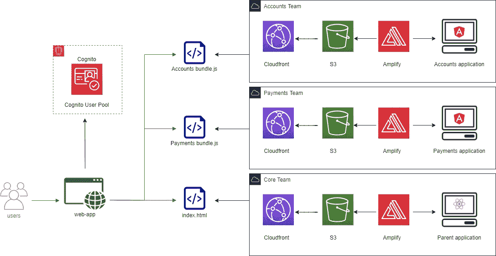
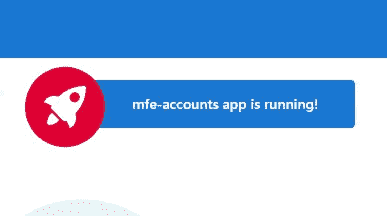
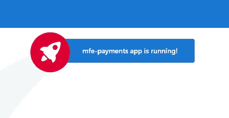
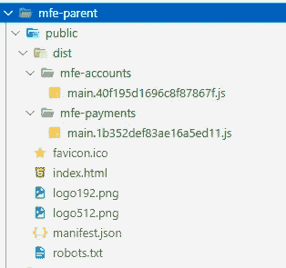
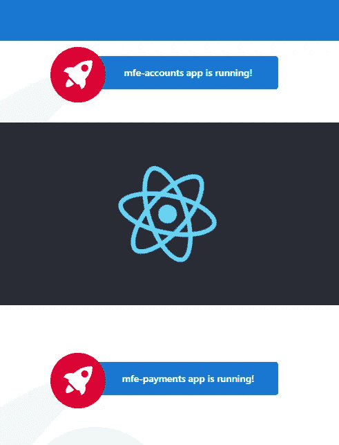

# 带 AWS 放大器的微前端(第一部分)

> 原文：<https://levelup.gitconnected.com/micro-frontends-with-aws-amplify-50c2e2dc4222>

这个故事是系列教程的第一部分，从一个微不足道的[微前端](https://martinfowler.com/articles/micro-frontends.html) (MFE)应用程序开始，我将深入研究 [AWS Amplify](https://aws.amazon.com/amplify/) ，这是一个非常有前途的框架，允许开发人员(我会说是初创企业)轻松构建和部署由 AWS 管理的全栈应用程序。

# 目标

这个迷你系列将由不同部分组成:

*   这个故事，*第一部分，*将介绍如何构建一个 React / Angular 微前端应用程序，所以这将是一个“前端重”的故事。
*   然后，我们将在第 2 部分中使用 Amplify 将其部署到 AWS。

[](https://alatech.medium.com/micro-frontends-with-aws-amplify-part-2-f69acf518287) [## 带 AWS 放大器的微前端(二)

### 在前面的故事中，我们利用微前端架构创建了一个简单的 web 应用程序。现在是时候将我们的应用部署到…

alatech.medium.com](https://alatech.medium.com/micro-frontends-with-aws-amplify-part-2-f69acf518287) 

*   我们将在第 3 部分中基于 GraphQL 和 DynamoDB [构建多租户 CRUD 支付功能。](https://alatech.medium.com/micro-frontends-with-aws-amplify-part-3-4eb5dcfdb856)

[](https://alatech.medium.com/micro-frontends-with-aws-amplify-part-3-4eb5dcfdb856) [## 带 AWS 放大器和 GraphQL 的微前端

### 在之前发表的两篇文章中，通过 Amplify 建立了微前端架构及其部署，现在是时候关注…

alatech.medium.com](https://alatech.medium.com/micro-frontends-with-aws-amplify-part-3-4eb5dcfdb856) 

*   最后，[第 4 部分](https://alatech.medium.com/micro-frontends-with-aws-amplify-part-4-3790f4fc1677)将展示如何用 Api Gateway、Aurora RDS 和 PostgresQL 实现 RESTful API。

[](https://alatech.medium.com/micro-frontends-with-aws-amplify-part-4-3790f4fc1677) [## 集成 AWS Amplify 和 Aurora RDS 的微前端

### 在之前的故事中，支付团队设法交付了基于 GraphQL 和 DynamoDB 的多租户功能。现在是时候了…

alatech.medium.com](https://alatech.medium.com/micro-frontends-with-aws-amplify-part-4-3790f4fc1677) 

整体架构将如下所示:



整体 AWS 架构

用户流程非常简单:一旦登录，用户就可以通过登陆一个 shell 应用程序来访问该应用程序，这是一个基于 React 的父微前端应用程序，充当两个子微前端应用程序的容器，这两个子微前端应用程序分别负责帐户和支付领域。

父/壳应用程序将通过引用 index.html 页面中生成的包来包含两个子应用程序。你可能已经在争论基于 React 的应用程序如何与 Angular 的应用程序愉快地生活在一起。答案(众多答案之一)是 [Web 组件](https://developer.mozilla.org/en-US/docs/Web/Web_Components)，它将您的框架特定模块转换成普遍理解的基本定制 HTML 元素。微前端网络应用还有很多其他的方法，比如烤 iframe、 [javascript 库](https://single-spa.js.org/)和 [javascript bundlers](https://webpack.js.org/concepts/module-federation/) 的特殊功能。出于演示目的，我选择 Web 组件[保持简单](https://www.interaction-design.org/literature/topics/keep-it-simple-stupid)。

# 先决条件

要跟随这个演示，请确保已经安装或有权访问以下最新的节点和 NPM。对于未来的故事，请确保您创建了一个免费的 AWS 帐户(不要使用 root 帐户来玩！).

# 让我们从客户团队开始

让我们戴上“帐户团队”的帽子，通过起诉 Angular 11，从头开始创建 Angular 11 应用程序。如果您还没有，请安装它:

```
npm install -g @angular/cli
ng new mfe-accounts
cd mfe-accounts
ng serve
```

现在创建了一个基本的 Angular11 应用程序(当在提示中要求选择其他功能时，如路由和样式表格式，请按 enter 键)。让我们删除一些多余的 html，让我们在 localhost:4200 启动客户端。



本地主机上显示的帐户应用程序

现在让我们关注两个问题:

*   因为我们将从父 shell 应用程序中引用生成的包，所以我们需要确保每个应用程序都有一个包。
*   我们如何将这个应用程序编译成 web 组件？

# 单束生成

为了解决第一个挑战，我们将使用 *ngx-build-plus* 包，键入:

```
ng add ngx-build-plus
```

上述命令扩展了 Angular CLI 命令的额外功能，修改了 *angular.json* 文件。我们将使用下面的命令生成一个包，我们可以将它添加到 *package.json* 中的脚本部分:

```
"scripts": {
   "ng": "ng",
   "start": "ng serve",
   **"build": "ng build --prod --single-bundle",**
   "test": "ng test",
   "lint": "ng lint",
   "e2e": "ng e2e"
}
```

# 作为 Web 组件的应用程序

从 Angular 6 开始，角度元素允许将角度组件作为自定义元素发布，方法是将其公开为 web 组件。

```
ng add @angular/elements
```

这公开了将我们的应用程序包装在自定义元素中的实用程序。如下所示修改 *app.module.ts* 文件，以便简单地将 AppModule 公开为 Web 组件。

作为 Web 组件公开的 Angular 应用程序模块

# 对付款团队重复上述步骤

要创建一个支付微前端，只需重复上述步骤，但适用于支付。确保更改端口号，并将自定义元素调用为 app-payments。

```
ng new mfe-payments
cd mfe-payments
ng serve --port 4201
```

通过适当的小改动，应用程序应该看起来像:



在本地主机上运行的支付应用程序

# 让核心团队粘合一切

现在，作为核心团队成员，是时候在父应用程序下显示新创建的微前端了。为了让您相信 Angular 应用程序是作为自定义元素公开的，我们将创建父应用程序作为 React 应用程序，并在 http://localhost:3000:

```
npx create-react-app mfe-parent
cd mfe-parent
yarn start
```

在 React 应用程序中显示新创建的应用程序的最快方法是添加对 accounts 和 payments 主包的引用。这可以通过以下命令实现:

```
npm install copyfiles -g
cd mfe-accounts
npm run build
copyfiles "./dist/mfe-accounts/main*js" ../mfe-parent/public
cd ..
cd mfe-payments
npm run build
copyfiles "./dist/mfe-payments/main*js" ../mfe-parent/public
```

通过执行上述命令，您应该会看到如下所示的文件夹结构:



接下来，在*index.html*文件中引用两个生成的主包(还需要 Zone.js):

用微前端引用索引 HTML

注意:如果您想避免为包名生成散列，只需更新 *angular.json* 并将 *outputHashing* 字段设置为*“none*”而不是“ *all* ”。

最后，访问 React *App.js* 文件，修改外观并添加在 mfe-accounts 和 mfe-payments 模块中定义的自定义 HTML 元素:

添加到 App.js 的自定义 HTML 元素

刷新后，React 应用程序将如下所示:



恭喜你。我们刚刚将两个虚拟的基于角度的微前端应用程序显示到一个父级 React 应用程序中。

# 摘要

这个故事展示了一个使用 Angular 和 React 的微前端应用程序的概念验证。实现是基于 Web 组件的，它代表了一种可移植的选择，可以让不同的框架互相交流。

我意识到，在现实生活中，事情可能而且将会比上面更复杂，在捆绑策略和构建过程中可以进行改进，这里仅举几个例子。尽管如此，请将此作为接近这种新建筑风格的人的概念证明，希望能给你一些尝试、评估利弊和享受乐趣的动力。在[第 2 部分](https://alatech.medium.com/micro-frontends-with-aws-amplify-part-2-f69acf518287)中，我们将在 AWS 中部署这个应用程序，以便用户可以访问它。谢谢大家！

# **参考文献**

*   [AWS 上的微前端](https://aws.amazon.com/blogs/architecture/micro-frontend-architectures-on-aws/)
*   [使用 Web 组件创建微前端](https://javascript.plainenglish.io/create-micro-frontends-using-web-components-with-support-for-angular-and-react-2d6db18f557a)