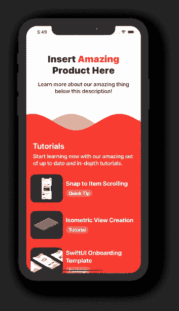
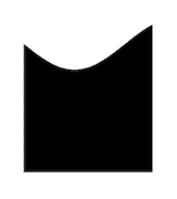

# SwiftUI 中的微交互:动画波

> 原文：<https://levelup.gitconnected.com/micro-interactions-animated-wave-14e0b74a69a4>

## 让-马克·布里安内



`ScrollView`背景中的波浪

欢迎回来！本周的帖子涵盖了我为自己的应用程序制作的各种 SwiftUI 微交互。这些交互带来的好处确实有助于让你的应用感觉更好，更容易使用。今天的微互动都是基于我定制的`Wave`造型。

> 如果你觉得这个提示有用，请考虑使用这个[链接](https://trailingclosure.com/signup/?utm_source=trailing_closure&utm_medium=blog_post&utm_campaign=mi_flowing_wave)订阅，如果你没有在[TrailingClosure.com](https://trailingclosure.com/?utm_source=trailing_closure&utm_medium=blog_post&utm_campaign=mi_flowing_wave)上阅读这篇文章，请随时来看看我们！

## SwiftUI `Wave`形状

这些动画都有一个共同点，那就是我的自定义 SwiftUI Shape struct，`Wave`。这种形状的工作方式是从帧的前端到后端画一个连续的波。`Wave`有两种属性可以改变形状的外观:

*   `phase` -波开始的阶段
*   `waveHeight` -波浪的高度(或真正的振幅)。

下面是`Wave`形状的代码:



SwiftUI `Wave`形状

```
struct Wave: Shape {

    var waveHeight: CGFloat
    var phase: Angle

    func path(in rect: CGRect) -> Path {
        var path = Path()
        path.move(to: CGPoint(x: 0, y: rect.maxY)) // Bottom Left

        for x in stride(from: 0, through: rect.width, by: 1) {
            let relativeX: CGFloat = x / 50 //wavelength
            let sine = CGFloat(sin(relativeX + CGFloat(phase.radians)))
            let y = waveHeight * sine //+ rect.midY
            path.addLine(to: CGPoint(x: x, y: y))
        }

        path.addLine(to: CGPoint(x: rect.maxX, y: rect.midY)) // Top Right
        path.addLine(to: CGPoint(x: rect.maxX, y: rect.maxY)) // Bottom Right

        return path
    }
}
```

## 我们的第一个例子！

是的，我们的第一个例子！这个`Wave`形状是我们开始为我们的应用程序创建一些惊人的交互所需要的。看看我用两个`Wave`形状放在一个`ScrollView`里面做的这个。注意当用户滚动时，波形的`phase`是如何改变的，因此它们看起来在屏幕上移动。

```
var body: some View {
    ScrollView(.vertical, showsIndicators: false) {
        VStack(spacing: 0) {

            // Other Views...

            GeometryReader { geo in
                ZStack {
                    Wave(waveHeight: 30, phase: Angle(degrees: (Double(geo.frame(in: .global).minY) + 45) * -1 * 0.7))
                        .foregroundColor(.orange)
                        .opacity(0.5)
                    Wave(waveHeight: 30, phase: Angle(degrees: Double(geo.frame(in: .global).minY) * 0.7))
                        .foregroundColor(.red)
                }
            }.frame(height: 70, alignment: .center)

            // Other Views...
        }
    }
}
```

## 使用波作为遮罩

使用`Wave`形状的另一种方法是创建一个自定义的`AnimatableModifier`，将该形状作为遮罩应用到您的视图中。您将在下面看到的一个显著变化是遮罩根据`pct`属性增大或缩小。在我们开始第二个例子之前，先看看下面的代码！

```
struct WaveMaskModifier: AnimatableModifier {

    var pct: CGFloat

    var animatableData: CGFloat {
        get { pct }
        set { pct = newValue }
    }

    func body(content: Content) -> some View {
        content
            .mask(
                GeometryReader { geo in
                    VStack {
                        Spacer()
                        ZStack {
                            Wave(waveHeight: 30, phase: Angle(degrees: (Double(pct) * 720 * -1) + 45))
                                .opacity(0.5)
                                .scaleEffect(x: 1.0, y: 1.2, anchor: .center)
                                .offset(x: 0, y: 30)
                            Wave(waveHeight: 30, phase: Angle(degrees: Double(pct) * 720))
                                .scaleEffect(x: 1.0, y: 1.2, anchor: .center)
                                .offset(x: 0, y: 30)
                        }
                        .frame(height: geo.size.height * pct, alignment: .bottom)
                    }

                }
            )
    }
}
```

## 我们的第二个例子！

对，第二个例子！我们今天进展很快。下面你会看到应用于一系列`Image`视图的动画遮罩。当用户点击屏幕时，`WaveMaskModifer`作为一个自定义的`AnyTransition`被应用来动画显示图像的变化。这种过渡对于展示这些类型内容的各种照片/视频共享应用程序非常有用。

除了示例代码之外，我将在下面提供转换代码。

## `WaveMaskModifier`作为过渡

下面是自定义转换的代码。

```
extension AnyTransition {
    static let waveMask = AnyTransition.asymmetric(insertion:
        AnyTransition.modifier(active: WaveMaskModifier(pct: 0), identity: WaveMaskModifier(pct: 1))
        , removal:
            .scale(scale: 1.1)
    )
}
```

## 示例 2 的代码

下面是上面例子的代码。

```
struct ContentView: View {

    @State var index: Int = 0

    var images: [Image] = [
        Image("stock_1"),
        Image("stock_2"),
        Image("stock_3"),
        Image("stock_4"),
    ]

    var body: some View {
        ZStack {
            ForEach(images.indices) { i in
                if i == index {
                    images[index]
                        .resizable()
                        .aspectRatio(contentMode: .fill)
                        .transition(.waveMask)
                }
            }

        }.onTapGesture {
            withAnimation(.easeOut(duration: 3)) {
                index = (index + 1) % images.count
            }

        }.edgesIgnoringSafeArea(.all)
    }
}
```

## 流动波背景

最后，我们将使用一组`Wave`形状作为我们一个视图的背景。奇妙的是，当我们等待用户与屏幕交互时，wave 将在背景中无缝地动画化，以赋予视图一些生命。请看下面的视频示例！

## 我们的第三个例子！

通过动画制作`Wave`形状的`phase`属性，我们得到了这个流动的背景，它在等待用户交互时很好地呈现出来。

## 喜欢这个教程？

## 让我们看看你做了什么！

给我们发照片！给我们一个链接！任何事！在推特 [@TrailingClosure](https://twitter.com/TrailingClosure) 、Instagram 上找到我们，或者发邮件到 howdy@TrailingClosure.com联系我们。