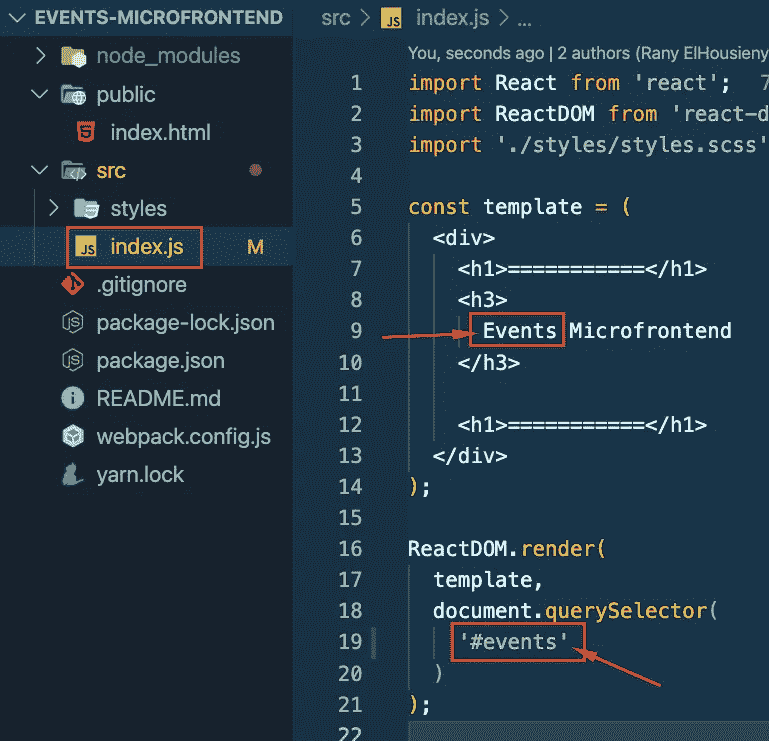

# 具有模块联合的动手项目—事件

> 原文：<https://levelup.gitconnected.com/microfrontends-hands-on-project-with-module-federation-events-microfrontend-ce8a7f8a16ad>


在本文中，我们将创建事件 Mmicrofrontend 并将其添加到门户中

# 目录

[**事件微前端**](#51e3)

*   [迎接赛事团队](#41f7)
*   [实现](#316d)
*   [向门户添加事件](#f75e)

# 事件微前端

这篇文章是以下文章的延续

[](/microfrontends-hands-on-project-with-module-federation-part-1-c4eda1ffcf10) [## 具有模块联合的微前端实践项目—第 1 部分

### 本文将介绍架构、设计、实现和部署现实生活中的微前端项目。

levelup.gitconnected.com](/microfrontends-hands-on-project-with-module-federation-part-1-c4eda1ffcf10) 

## 认识“活动”团队


事件微前端归事件团队所有。他们创建、测试、部署和共享微前端。他们有自己的回购和部署流程。此外，他们还负责后端(后端对前端— BFF)。

## 履行

事件微前端的实现与产品微前端非常相似。您可以关注以下文章:

 [## 使用 Webpack 5 模块联合创建微前端

### 创建一个 React 应用程序按照下面的文章创建一个没有 CRA 的 React 应用程序或下载/复制下面的…

www.linkedin.com](https://www.linkedin.com/pulse/create-microfrontend-using-webpack-5-module-rany-elhousieny-phd%E1%B4%AC%E1%B4%AE%E1%B4%B0) 

然后更改以下内容:

## 在 webpack.config.js 中，更改三件事，如下图所示

1.  到 8002 的服务器端口
2.  事件名称 Microfrontend
3.  “暴露”。/EventsIndex '


## 在 src/index.js 中:

1.  将 h3 标题中的“产品”一词改为事件
2.  将选择器中的 id 更改为事件



## 在 public/index.html 中将 id 更改为 events


您可以下载/克隆以下项目:

```
git clone --single-branch --branch Events-Microfrontend-Start [https://github.com/ranyelhousieny/events-microfrontend](https://github.com/ranyelhousieny/events-microfrontend)cd events-microfrontendyarn installcode .yarn start
```

将在 [**渲染 http://localhost:8002/**](http://localhost:8002/)


而这里是曝光的[**http://localhost:8002/**remote entry . js](http://localhost:8002/remoteEntry.js)


## 将事件微前端导入门户

您可以克隆/下载:

```
git clone --single-branch --branch AddingEvents [https://github.com/ranyelhousieny/partner-portal.git](https://github.com/ranyelhousieny/partner-portal.git)cd partner-portalyarn installcode .yarn run start
```

在门户***web pack . config . js***中，增加一个遥控器，如下


```
EventsMicrofrontend: 'EventsMicrofrontend@http://localhost:8002/remoteEntry.js',
```

在 ***bootstrap.js*** 中导入它


```
import 'EventsMicrofrontend/EventsIndex';
```

将其添加到**index.html*中***


```
<div *id*="events"></div>
```


在浏览器上，当您检查/network 时，您可以看到加载远程 js 文件的顺序:


=================

# 共享联邦模块

现在，在下面的文章中，让我们看看如何共享 React 作为一个单体来呈现两个微前端:

[https://ranyel . medium . com/shared-modules-in-module-Federation-micro frontends-a 547 f 77 e 7b 54](https://ranyel.medium.com/shared-modules-in-module-federation-microfrontends-a547f77e7b54)

===========

# 添加 React 渲染和微前端模式

到目前为止，我们一直使用 querySelector 渲染到屏幕上，并在独立模式下构建。让我们按照这篇[文章](https://www.linkedin.com/pulse/microntends-module-federation-standalone-vs-rany-elhousieny-phd%E1%B4%AC%E1%B4%AE%E1%B4%B0)添加 React 渲染并移动到微前端模式。

[https://www . LinkedIn . com/pulse/micro tends-module-Federation-standalone-vs-rany-elhousieny-PhD % E1 % B4 % AC % E1 % B4 % AE % E1 % B4 % B0](https://www.linkedin.com/pulse/microntends-module-federation-standalone-vs-rany-elhousieny-phd%E1%B4%AC%E1%B4%AE%E1%B4%B0)

======