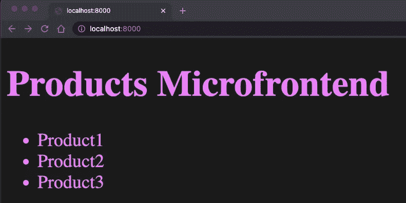

# 具有模块联合的微前端实践项目—第 1 部分

> 原文：<https://levelup.gitconnected.com/microfrontends-hands-on-project-with-module-federation-part-1-c4eda1ffcf10>


具有模块联合的 Microfrontends 实践项目

本文将介绍架构、设计、实现和部署现实生活中的微前端项目。

# 目录

*   [要求](#852a)
*   [设计](#7d07)

T [**何【产品】微前端**](#35a4)

*   [设置项目](#9d3d)
*   [认识“产品”团队](#01b1)
*   [要求](#0084)
*   [设计](#1c30)
*   [创建产品微前端](#25f5)

[**合作伙伴门户**](#78eb)

*   [给产品微前端添加一个遥控器](#bba5)
*   [将产品 Microfrontend 导入并呈现到 PartnerPortal](#920b)

[**我们在哪里**](#2737)

如果你是微前端的新手，我建议你从[这篇文章](https://www.linkedin.com/pulse/micro-frontends-what-why-how-rany-elhousieny-phd%E1%B4%AC%E1%B4%AE%E1%B4%B0)开始

## 要求:

我的一个客户想要实现一个合作伙伴门户。该公司的业务是在他们的网站上为不同的合作伙伴营销产品。他们需要一个门户来使他们的合作伙伴公司更容易选择某些产品，并在他们的营销网站上的某些活动中发布它们。例如，圣诞节活动，合作伙伴可以选择与圣诞节相关的产品，并将其添加到“圣诞节活动”中当然，我不会追求同样的复杂性，但我会采用高层次的想法，用微前端实现基础。实际上，我们从类似于本文中的概念证明开始，并在后来扩展了它。

## 设计:

对于这个项目，我们将实现以下简单的用户界面:


我们将拥有:

1.  工具栏
2.  用户配置文件和信息的组件
3.  产品清单
4.  我们将向其中添加产品的活动

我们将把其中的每一个都实现为一个独立的微前端。

# “产品”微前端

## 设置项目

我们将使用 React、Webpack 5 和模块联合来创建项目。但是，我们不会使用 create-react-app。因此，您可能会经历本文中的步骤来创建样板文件设置，

[](https://www.linkedin.com/feed/update/urn:li:ugcPost:6837477108789456896?updateEntityUrn=urn%3Ali%3Afs_feedUpdate%3A%28*%2Curn%3Ali%3AugcPost%3A6837477108789456896%29) [## 兰尼·埃尔豪斯尼，PhDᴬᴮᴰ在 LinkedIn 上:创建 React 应用程序而不创建 react 应用程序

### 创建 react 应用程序而不创建 React 应用程序(CRA)...

www.linkedin.com](https://www.linkedin.com/feed/update/urn:li:ugcPost:6837477108789456896?updateEntityUrn=urn%3Ali%3Afs_feedUpdate%3A%28*%2Curn%3Ali%3AugcPost%3A6837477108789456896%29) 

或者下载/克隆以下 Github 项目:

```
git clone --single-branch --branch Products-Microfrontend-Start [https://github.com/ranyelhousieny/Products.git](https://github.com/ranyelhousieny/Products.git)cd Productsnpm installcode .npm run start
```

您应该在 [http://localhost:8080](http://localhost:8080) 看到以下内容


这是一个非常简单的 index.js，将呈现三种产品，如上所示。


如果这对您来说是新的，请阅读下面的文章，以获得关于这个项目中使用的配置的更多细节。

[](https://www.linkedin.com/feed/update/urn:li:ugcPost:6837477108789456896?updateEntityUrn=urn%3Ali%3Afs_feedUpdate%3A%28*%2Curn%3Ali%3AugcPost%3A6837477108789456896%29) [## 兰尼·埃尔豪斯尼，PhDᴬᴮᴰ在 LinkedIn 上:创建 React 应用程序而不创建 react 应用程序

### 创建 react 应用程序而不创建 React 应用程序(CRA)...

www.linkedin.com](https://www.linkedin.com/feed/update/urn:li:ugcPost:6837477108789456896?updateEntityUrn=urn%3Ali%3Afs_feedUpdate%3A%28*%2Curn%3Ali%3AugcPost%3A6837477108789456896%29) 

======

## 认识“产品”团队


这个“产品”微前端归产品团队所有。这个团队独立于其他微前端和门户本身来创建、部署和维护它。他们有单独的回购和 CI/CD。在本例中，我将对产品微服务使用以下 repo。`Products.git`

```
[https://github.com/ranyelhousieny/Products.git](https://github.com/ranyelhousieny/Products.git)
```

他们需要单独测试它。因此，在导出远程微前端之前，我安装了 Webpack HTML 插件来独立呈现它。但是，在导出之前，他们需要建立网站。

## 要求

产品页面需要列出某个合作伙伴的所有产品。在这个例子中，我假设只有一个伙伴。所以，我会提供一份产品清单。另一个需求是搜索栏和过滤器，以限制产品的看法。

## 设计

对于这个例子，我将提供一个关注微前端集成的产品列表。随着我们的进展，我将开始从 API 获取数据，并提供搜索和过滤器。这将需要状态管理，并将使项目更有趣。

现在，我们将呈现产品列表。

## 创建产品微前端


按照下面的文章来导入模块联合和转换。微前端的产品

[](https://www.linkedin.com/feed/update/urn:li:ugcPost:6840733175652741121?updateEntityUrn=urn%3Ali%3Afs_feedUpdate%3A%28*%2Curn%3Ali%3AugcPost%3A6840733175652741121%29) [## 兰尼·埃尔豪斯尼，PhDᴬᴮᴰ在 LinkedIn 上:使用 Webpack 5 模块联盟创建微前端

### 使用 Webpack 5 模块联合创建微前端...

www.linkedin.com](https://www.linkedin.com/feed/update/urn:li:ugcPost:6840733175652741121?updateEntityUrn=urn%3Ali%3Afs_feedUpdate%3A%28*%2Curn%3Ali%3AugcPost%3A6840733175652741121%29) 

您的 webpack.config.js 应该看起来像是跟在后面的

[](https://github.com/ranyelhousieny/Products/blob/Products-Microfrontend-Step2/webpack.config.js) [## Products/webpack.config.js 位于 Products-micro frontend-step 2 ranyelhousieny/Products

### 通过在 GitHub 上创建帐户，为 ranyelhousieny/产品开发做出贡献。

github.com](https://github.com/ranyelhousieny/Products/blob/Products-Microfrontend-Step2/webpack.config.js) 

```
When you run `npm webpack` or `yarn webpack' you will notice the generation of dist/remoteEntry.js
```


现在，运行`yarn run start` 或`npm run start`并让它在 [http://localhost:8001/](http://localhost:8001/) 上运行，以便门户链接到它


如果你很好奇门户会加载什么，可以浏览[http://localhost:8001/remote entry . js](http://localhost:8001/remoteEntry.js)


当然，这里没什么可看的。Webpack 将在门户/容器端对此进行解码。

=====================

# 合作伙伴门户


具有模块联合的微前端门户/容器

“合作伙伴”团队拥有合作伙伴门户。他们拥有身份验证和基于角色的访问控制(RBAC)。他们将创建微前端主机/容器。容器是包含所有微前端的大师。

按照下面的文章配置微前端门户/容器:

[](https://www.linkedin.com/pulse/create-microfrontends-portalhostcontainer-cra-elhousieny-phd%25E1%25B4%25AC%25E1%25B4%25AE%25E1%25B4%25B0) [## 创建微前端门户/主机/容器 CRA

### 创建一个 React 应用程序按照下面的文章创建一个没有 CRA 的 React 应用程序，或者你可以下载/克隆…

www.linkedin.com。](https://www.linkedin.com/pulse/create-microfrontends-portalhostcontainer-cra-elhousieny-phd%25E1%25B4%25AC%25E1%25B4%25AE%25E1%25B4%25B0) 

您也可以下载/复制下面的分支来跟进

```
git clone --single-branch --branch Partner-Portal-Step1 [https://github.com/ranyelhousieny/partner-portal.git](https://github.com/ranyelhousieny/partner-portal.git)cd partner-portalyarn installcode .yarn run start
```

## 向 ProductsMicrofrontend Webpack 配置添加远程

```
remotes: {ProductsMicrofrontend:'ProductsMicrofrontend@http://localhost:8001/remoteEntry.js',},
```


纱线运行开始

当然，传送门还是空的。


## 在 PartnerPortal 上导入和呈现产品 Microfrontend

现在，让我们将这个 remoteEntry.js 从[http://localhost:8001/remote entry . js](http://localhost:8001/remoteEntry.js)导入到门户中(我们还没有使用 React)

1.  创建 src/bootstrap.js 并添加以下行

```
import 'ProductsMicrofrontend/ProductsIndex';
```


2.在 src/index.js 中，删除所有内容并在其中导入引导

```
import('./bootstrap');
```


现在，在 [http://localhost:8000/](http://localhost:8000/) 刷新门户页面，会看到如下内容。



这实际上是来自产品 Microfontend。

# 我们在哪里

1.  到目前为止，产品团队已经在 [http://localhost:8001/](http://localhost:8001/) 实现了基本的微前端(我们将看到如何部署到 AWS)


2.他们将其部署到[http://localhost:8001/remote entry . j](http://localhost:8001/remoteEntry.js)(我们将看到如何将其部署到 AWS S3)


3.合作伙伴团队将它添加到位于 [http://localhost:8000/](http://localhost:8000/) 的合作伙伴门户中(我们将在最后看到如何将它部署到 AWS)


在添加 CSS 之前，让我们用 public/index.html 中的头和标题来标识门户。


您将能够立即在浏览器上看到这些更改，而无需重新运行。


在 Products 微内容中，我添加了一个非 CSS 边框，如下所示。


这将使微前端可识别。


===============================

在下面的[文章](https://ranyel.medium.com/microfrontends-hands-on-project-with-module-federation-events-microfrontend-ce8a7f8a16ad)中，我们将创建事件微前端并将其添加到门户:

[https://ranyel . medium . com/micro frontends-hands-on-project-with-module-Federation-events-micro frontend-ce 8 a 7 f 8 a 16 ad](https://ranyel.medium.com/microfrontends-hands-on-project-with-module-federation-events-microfrontend-ce8a7f8a16ad)