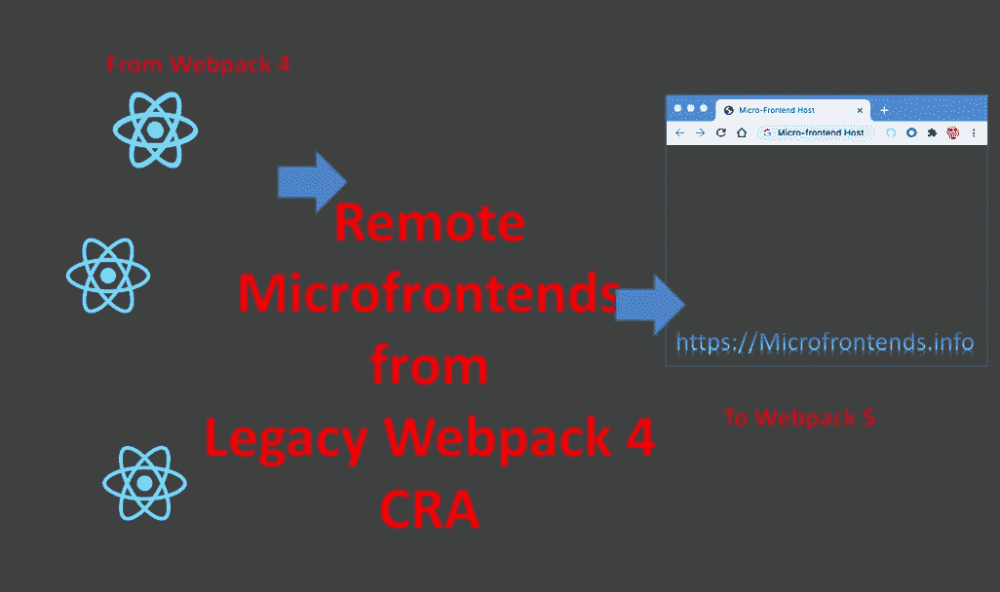
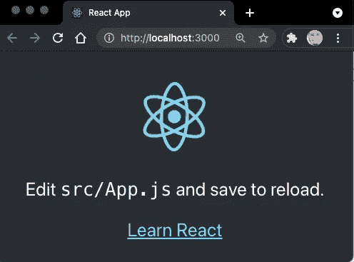
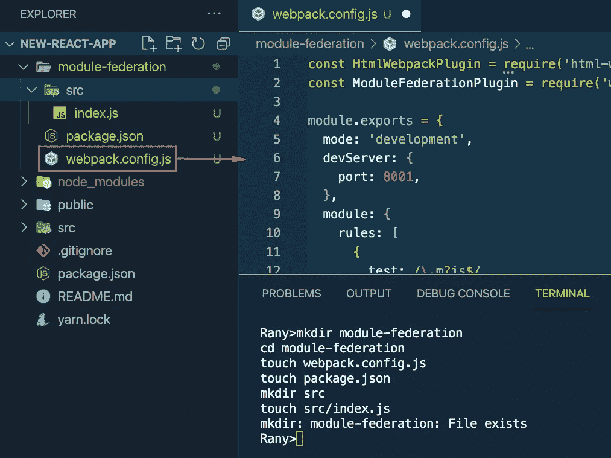
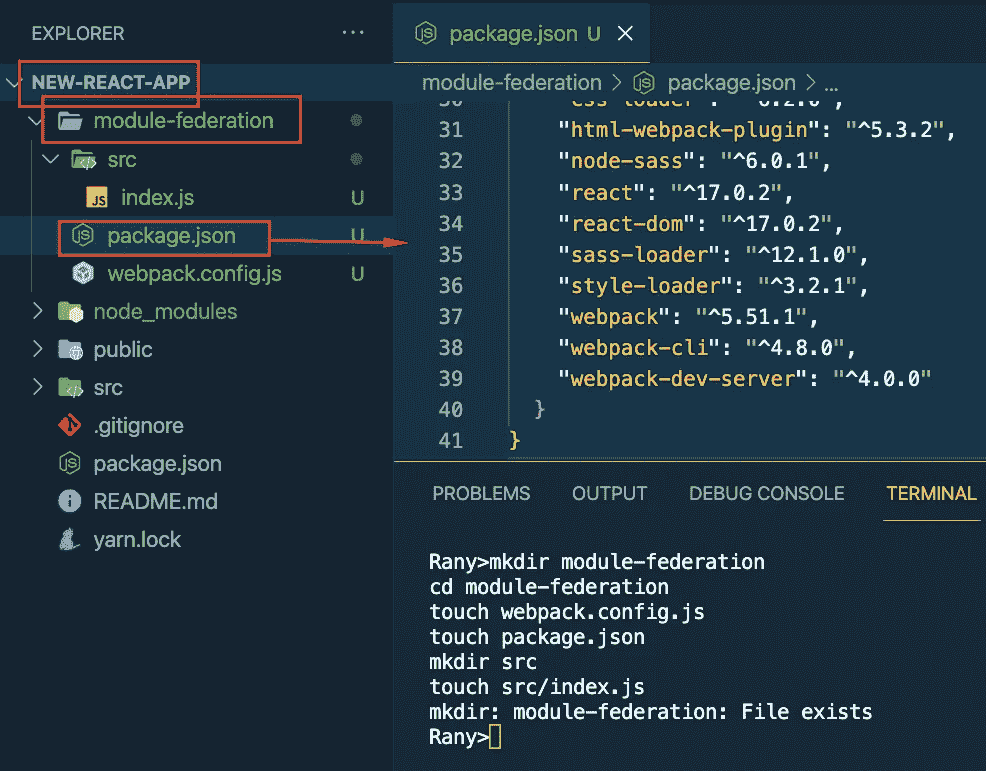
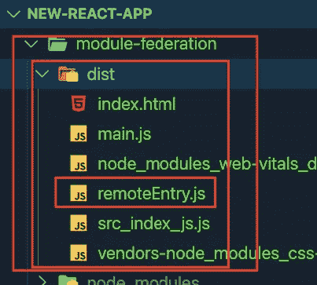
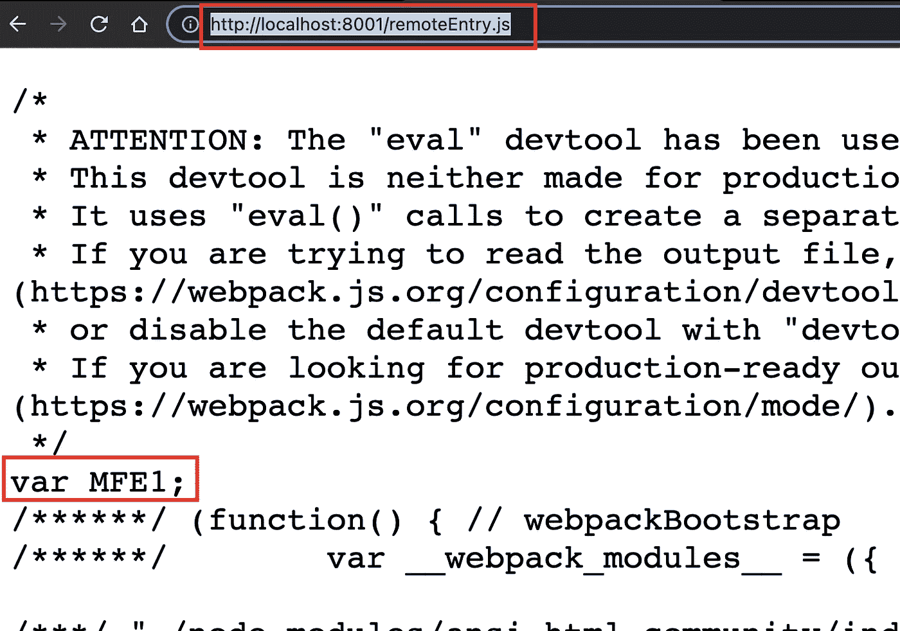
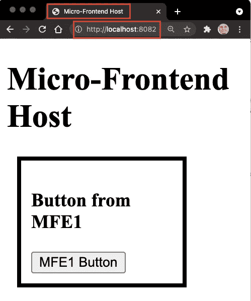
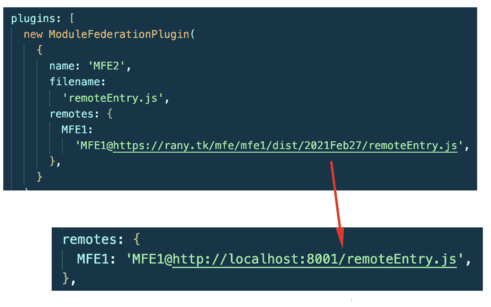
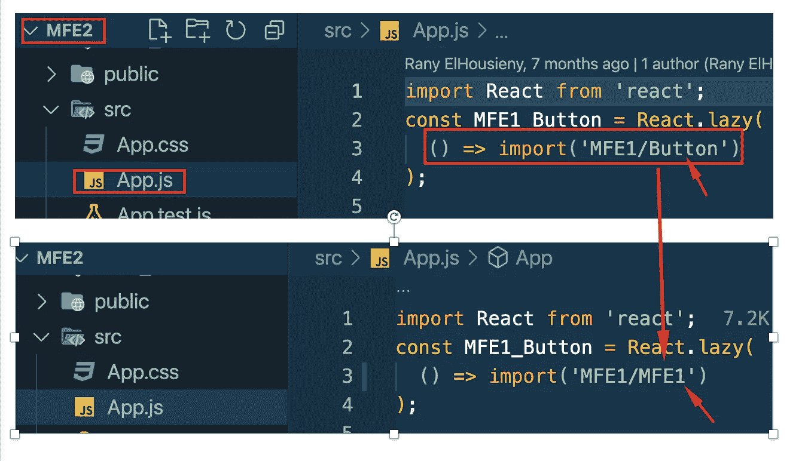

# 微前端模块联合:公开由 create-react-app 创建的遗留 React Webpack4 的远程

> 原文：<https://levelup.gitconnected.com/microfrontends-module-federation-exposing-remote-from-legacy-react-webpack4-created-by-f3753d70d34e>



在用 Webpack 5、React 和 Module Federation 构建新的门户时，我想在 Webpack 5 上的 create-react-app 创建的遗留 React 组件中包含一个组件。在本文中，我将解释我是如何在一个用 create-react-app 制作的 React-APP 上成功做到这一点的

===================

# 创建新的 react 应用程序

```
npx create-react-app new-react-appcd new-react-appmkdir module-federationcode .yarn start
```

你应该看看普通的 CRA 页面。



现在，我们需要将这个页面导入到模块联合容器中

# 作为遥控器公开

1.  请在 new-react-app 中创建一个新目录，并给它一个名字(我给它取了 module-federation)

2.创建一个名为`webpack.config.js`的文件

3.创建一个 src 目录，并在其中创建一个空的 index.js

您可以将以下步骤复制到 new-react-app 目录中的终端

```
mkdir module-federationcd module-federationtouch webpack.config.jstouch package.jsonmkdir srctouch src/index.jsyarn add webpack webpack-cli html-webpack-plugin babel-loader [@babel/plugin-transform-runtime](http://twitter.com/babel/plugin-transform-runtime) style-loader css-loader sass-loader 
```

在 module-Federation/web pack . config . js 中添加以下内容([https://github . com/ranyelhousieny/micro frontend-template/blob/main/web pack . config . js](https://github.com/ranyelhousieny/microfrontend-template/blob/main/webpack.config.js)



请确保保存该文件。

====

在 module-federation/package.json 中添加以下内容

([https://github . com/ranyelhousieny/micro frontend-template/blob/main/package . JSON](https://github.com/ranyelhousieny/microfrontend-template/blob/main/package.json))



请确保保存该文件。

=======

现在安装依赖项。从模块内部联合运行`yarn install`

构建目录，从内部模块-联邦运行`yarn webpack build`

这将在模块联邦内部创建一个包含少量文件的目录区



我们只需要 remoteEntry.js

让我们通过跑步来服务这个遥控器。`yarn webpack serve`

当您浏览到[http://localhost:8001/remote entry . js](http://localhost:8001/remoteEntry.js)时，您应该能够看到该文件。



这是您应该从微前端容器远程访问的文件。

===================

# 将遥控器添加到 Microfrontend 容器。

现在，让我们将它添加到我们之前创建的微前端主机中。您可以从[https://github.com/ranyelhousieny/react-microfrontends.git](https://github.com/ranyelhousieny/react-microfrontends.git)处获得，如下所示:

```
git clone [https://github.com/ranyelhousieny/react-microfrontends.git](https://github.com/ranyelhousieny/react-microfrontends.git)cd react-microfrontendscd mfe2yarn installcode .yarn webpack serve
```

如果您浏览到 [http://localhost:8082/](http://localhost:8082/) ，您应该会看到以下内容



现在，我们将用我们在[http://localhost:8001/remote entry . js](http://localhost:8001/remoteEntry.js)从 CRA 创建的遥控器替换 MFE1

在 mfe2/webpack.config.js 中替换远程到[http://localhost:8001/remote entry . js](http://localhost:8001/remoteEntry.js)如下。



在 mfe2/src/App.js 中，将导入从 MFE1/Button 更改为 MFE1/MFE1，如下所示:



这是总体思路。我们仍然需要添加一些依赖项和共享组件来实现这一点，我将在以后的文章中讨论。