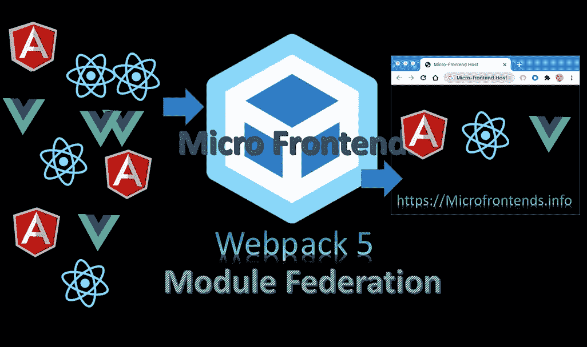
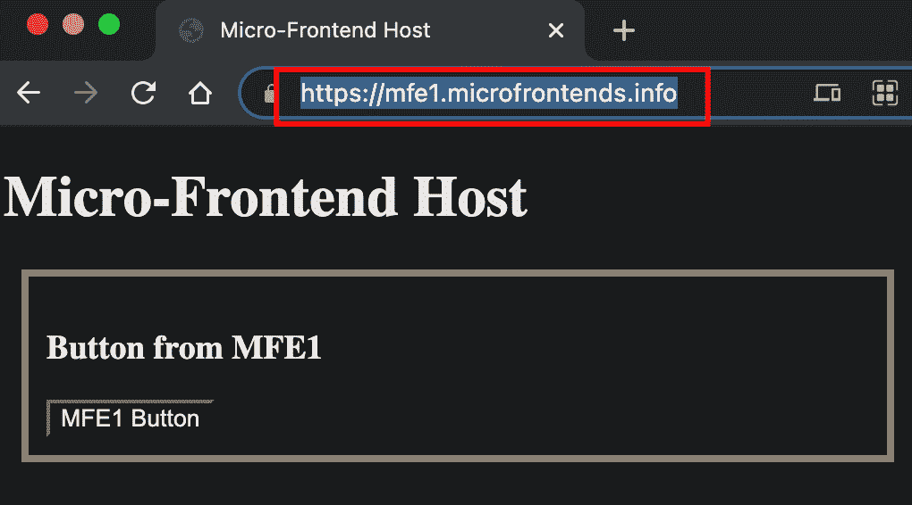
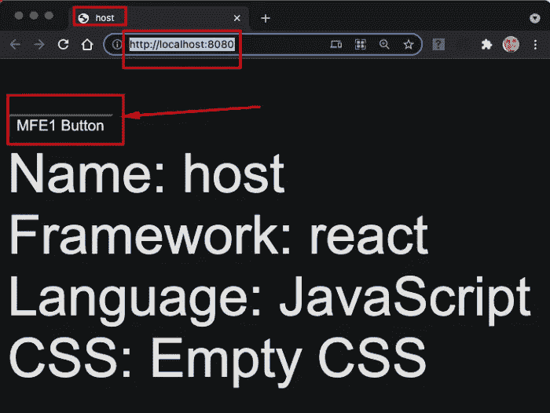
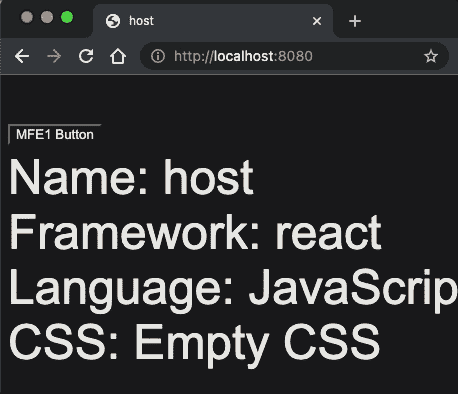
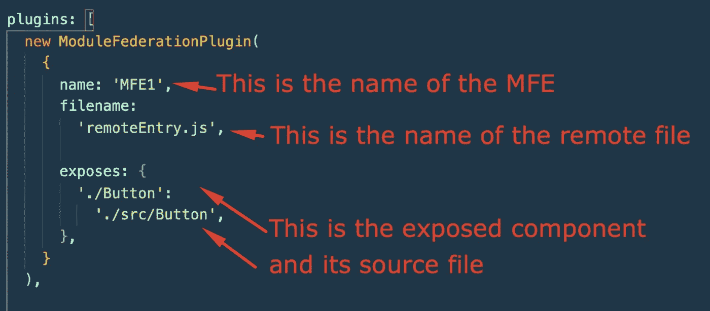
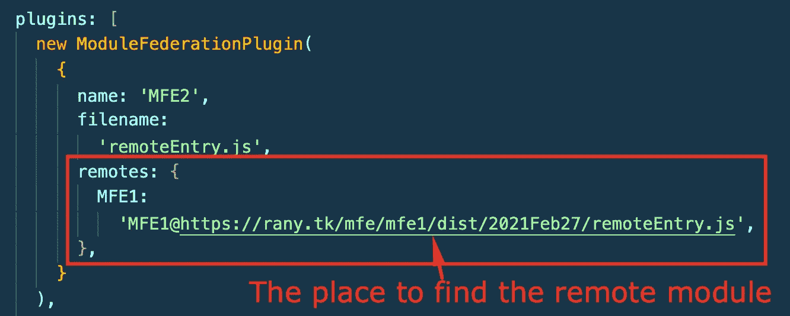
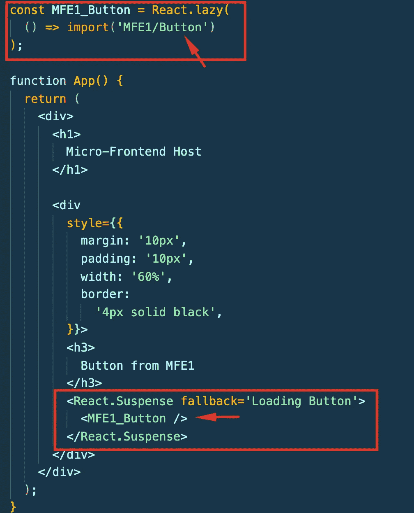
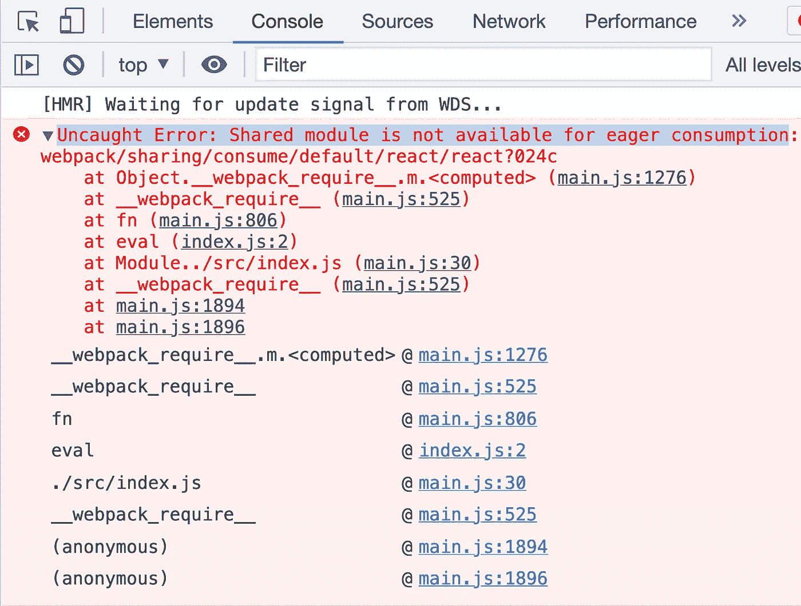

# 具有模块联邦的微前端:什么、为什么和如何

> 原文：<https://levelup.gitconnected.com/microfrontends-with-module-federation-what-why-and-how-845f06020ee1>

具有 Webpack5 模块联合的微前端

" ***模块联合为我们提供了一种在前端应用程序之间共享代码的新方法。*** ”前一句在理解模块联邦中意义重大。T4·扎克·杰克森发明模块联盟的原因是为了让代码共享更加简单和独立。如果你理解了这个概念，设计和构建你的项目将会更容易。一些人试图将微服务的架构映射到微前端。然而，前端世界不同于后端世界。为了理解模块联合的重要性，让我们探索一下替代方案。

# 节点模块

以前，我们称之为“构建时”微前端。然而，随着术语的发展，microfrontends 意味着“运行时”合成。节点模块存在很久了，也用了一段时间了。NPM(节点包管理器)是共享 Javascript 代码最常见的方式。我们已经向节点项目添加了数百次节点模块和 NPM 包。要在 NPM 发布包，您需要删除呈现代码并发布它。这种方法有四个主要缺点:

*   NPM 包没有渲染代码:如果这个包属于另一个团队，这是非常令人沮丧的。我的一个客户曾经有一个团队开发了一个组件，该组件在另一个团队拥有的门户中使用。他们过去常常盲目地开发它，等待门户团队来测试它并提供反馈。这种方法违反了自主性和解耦设计原则。
*   部署时间和工作量:这种方法的一大缺点是，随着您添加更多的包，它会增加部署时间和应用程序的大小。这是采用模块联合的最大动机之一。公司用来衡量开发运营效率的指标之一是部署时间(参见 Google 的 [DORA](https://cloud.google.com/blog/products/devops-sre/using-the-four-keys-to-measure-your-devops-performance) 指标)。从我的经验来看，这是工程师最痛苦的地方之一。
*   硬依赖:除了部署时间之外，那些 NPM 包还存在部署和构建问题。因为层级依赖，所以总是有失败。它增加了部署时间和调试。通常，随后是不同团队的来回讨论和调查。
*   版本控制:在这种方法中，传达最新的更新和版本变化是一个很大的挑战。我有两个团队，他们共享一个组件，由于管理依赖关系，这个组件在一年后成为他们的顶级重构项目。

# 运行时合成框架

随着运行时复合微前端的发展，Single-SPA 等框架开始出现。每个微前端将把它的 javascript 运行时包部署到一个容器中，比如 AWS S3 桶。然后，主机/容器应用程序将在运行时下载这些组件，并使用它们来呈现内容。这个解决方案将解决构建时依赖性。然而，这种方法的主要缺点是它依赖于一个框架来管理所有这些依赖性。依赖一个框架有它自己的缺点。这将需要改变代码和学习框架。此外，它需要对框架进行一致的更新。和往常一样，当框架过时或被废弃时，您将需要重新构建整个站点，以跟上最新的技术。我们之前用 PHP 和 Angular 来做这个反应或者 Angular2。使用 create-react-app 来构建新项目也有同样的缺点，因为我们对 react-scripts 有依赖性。

# 模块联合解决了所有这些问题:

1.  ***不是框架*** :模块联邦是添加到 Webpack 的插件。这给了你自由和灵活性，以你想要的方式构建你的项目
2.  它在 ***运行时*** 集成组件:您不必担心其他微前端的部署或依赖性。

在下面的文章中有更多关于微前端的历史:

 [## 微前端的历史

### 你有没有想过“微前端”这个术语是何时何地出现的？在这篇文章中，我将通过…

www.linkedin.com](https://www.linkedin.com/pulse/history-microfrontends-rany-elhousieny-phd%E1%B4%AC%E1%B4%AE%E1%B4%B0) 

# 如何用模块联合实现微前端

下面的文章是使用模块联邦实现微前端的很好参考

 [## 从初学者到专家的微前端

### 在这篇文章中，我将把之前所有的文章和视频以一种能帮助人们理解的方式进行整理…

www.linkedin.com](https://www.linkedin.com/pulse/micro-frontends-from-begining-expert-rany-elhousieny-phd%E1%B4%AC%E1%B4%AE%E1%B4%B0) 

# 分步示例

在下面的[文章](https://www.linkedin.com/pulse/micro-frontends-hands-on-example-using-react-webpack-rany/)中，我将解释如何使用模块联合来实现和部署微前端。我将一步一步地创建两个微前端反应组件，并呈现一个按钮组件从一个到另一个。在本文的最后，您将能够实现一个微前端组件，并将其呈现到一个微前端容器中，然后将其部署到具有安全域的 AWS。最终结果可以在[https://mfe1.microfrontends.info/](https://mfe1.microfrontends.info/)看到

 [## 微前端使用 React、Webpack 5 和模块联合逐步部署到 AWS

### 在这篇文章中，我将一步一步地创建两个微前端反应组件，并呈现一个按钮组件…

www.linkedin.com](https://www.linkedin.com/pulse/micro-frontends-hands-on-example-using-react-webpack-rany/) 

# 使用 create-mf-app 的更多示例

类似于 create-react-app，我们有 create-mf-app 来构建所有的样板文件。它将使解释更深层次的概念变得更容易。下面的文章以此为基础。

 [## 使用 create-mf-app 创建模块联合微前端

### 现在，我们有了一个简单的方法来使用 create-mf-app 创建一个不需要所有 webpack 配置的微前端应用程序。我…

ranyel.medium.com](https://ranyel.medium.com/creating-module-federation-microfrontends-with-create-mf-app-33c819b4c461) 

## 创建和共享按钮

这是理解模块联合如何工作的一个很好的开始练习。请跟随这篇[文章](https://www.linkedin.com/pulse/microfrontends-module-federation-create-mf-app-button-rany)获得以下结果

 [## 具有模块联合的微前端创建-mf-app:按钮

### 在本文中，我们将看到如何创建一个简单的按钮，从 MFE1 中公开它，并将其导入到主机中…

www.linkedin.com](https://www.linkedin.com/pulse/microfrontends-module-federation-create-mf-app-button-rany) 

# 传递道具并在其上添加动作

在这篇[文章](https://www.linkedin.com/pulse/microfrontends-module-federation-pass-props-add-them-rany)中，我将解释如何传递道具并给它们添加动作

 [## 具有模块联合的微前端:传递道具并在其上添加动作

### 在我的上一篇文章中，我解释了如何使用模块联合来公开和远程控制一个按钮

www.linkedin.com](https://www.linkedin.com/pulse/microfrontends-module-federation-pass-props-add-them-rany) 

=======

# 模块联合配置

从模块联合开始的主要事情是理解配置。模块联合有两个主要组件:

1.  远程联邦模块/微前端
2.  主机/门户/容器联合模块

主机将通过远程联邦模块消费和呈现公开的组件。在前面的示例中，MF2 是容器，MFE1 按钮是公开的远程组件。为了简单起见，我将把远程联邦模块称为 MFE(micro frontend 的简称)。remote 的主要功能是在它的`webpack.config.js`文件中公开你想要共享的组件。

## 用于远程微前端(MFE)的 webpack.config.js

这里是`webpack.config.js`中的模块联邦部分。剩下的就是之前存在的正常的 webpack。我将使用我前面解释的例子来创建 MFE1 和 MFE2。你可以从 https://github.com/ranyelhousieny/react-microfrontends.git 得到完整的文件

 [## react-micro frontends/web pack . config . js 位于 main ranyelhousieny/react-micro frontends

### 通过在 GitHub 上创建一个帐户来为 ranyelhousieny/react-micro frontends 开发做贡献。

github.com](https://github.com/ranyelhousieny/react-microfrontends/blob/main/mfe1/webpack.config.js) 

首先，导入模块联合插件

然后，在插件中创建一个新对象，如下所示:

## 主机/容器的 webpack.config.js

这里，我们将所有远程微前端定义如下:

主机中还有一个步骤来导入远程组件并在 React 代码中呈现它

====

# 逐步项目

下面这篇文章是了解模块联邦直到部署的最佳实践

 [## 微前端使用 React、Webpack 5 和模块联合逐步部署到 AWS

### 在这篇文章中，我将一步一步地创建两个微前端反应组件，并呈现一个按钮组件…

www.linkedin.com](https://www.linkedin.com/pulse/micro-frontends-hands-on-example-using-react-webpack-rany) 

==============

# 创建具有多个微前端的门户

在下面的例子中，我们将通过一个现实生活中的例子。我创建了一个可以托管两个微前端的门户。

 [## 具有模块联合的微前端实践项目—第 1 部分

### 本文将介绍架构、设计、实现和部署现实生活中的微前端项目。

levelup.gitconnected.com](/microfrontends-hands-on-project-with-module-federation-part-1-c4eda1ffcf10)  [## 具有模块联合的动手项目—事件

### 在本文中，我们将创建事件 Mmicrofrontend 并将其添加到门户中

levelup.gitconnected.com](/microfrontends-hands-on-project-with-module-federation-events-microfrontend-ce8a7f8a16ad) 

=======

# 共享模块和库

为了提高应用程序的性能和大小，您可以共享依赖项，正如我在下面的文章中所解释的:

 [## 模块联合微前端中的共享模块

### 本文将解释如何在不同的联邦微前端模块之间共享模块和库

ranyel.medium.com](https://ranyel.medium.com/shared-modules-in-module-federation-microfrontends-a547f77e7b54) 

=================================

# 添加 React 渲染和微前端模式

到目前为止，我们一直使用 querySelector 渲染到屏幕上，并在独立模式下构建。让我们按照这篇[文章](https://www.linkedin.com/pulse/microntends-module-federation-standalone-vs-rany-elhousieny-phd%E1%B4%AC%E1%B4%AE%E1%B4%B0)添加 React 渲染并移动到微前端模式。

 [## 微趋势与模块联合:独立与微前端

### 在我以前的文章中，我们创建了一个门户，它将托管两个微前端，产品和事件。然而，我们做了…

www.linkedin.com](https://www.linkedin.com/pulse/microntends-module-federation-standalone-vs-rany-elhousieny-phd%E1%B4%AC%E1%B4%AE%E1%B4%B0) 

======

# 组织 Webpack 配置文件

到目前为止，我们一直使用一个配置文件。在现实生活中，您将有一个用于生产的配置和另一个用于开发的配置。下面的文章将解释如何为公共、开发和生产组织配置文件。

 [## 用于公共、开发和生产的 Webpack

### 在本文中，我将解释如何为生产和开发创建不同的配置文件。让我们开始…

www.linkedin.com](https://www.linkedin.com/pulse/webpack-common-development-production-rany-elhousieny-phd%25E1%25B4%25AC%25E1%25B4%25AE%25E1%25B4%25B0) 

===============

# 模块联合故障排除

在这一节中，我将继续添加您在使用模块联邦创建 Microfrointends 时可能会遇到的著名错误

## 未捕获的错误:共享模块不可用于急切消费

当你使用共享模块时，这是一个著名的错误。在下面的文章中，我将详细解释如何重现错误并修复它。

 [## 未捕获的错误:共享模块不可用于急切消费

### 如果您试图在模块联邦微前端之间共享模块，您可能会面临以下奇怪的…

www.linkedin.com](https://www.linkedin.com/pulse/uncaught-error-shared-module-available-eager-rany-elhousieny-phd%25E1%25B4%25AC%25E1%25B4%25AE%25E1%25B4%25B0) 

参考:

 [## 兰尼·埃尔豪斯尼，PhDᴬᴮᴰ在 LinkedIn 上:微前端与模块联邦:什么，为什么，如何

### 具有#webpack 5 模块联合的微前端...

www.linkedin.com](https://www.linkedin.com/feed/update/urn:li:ugcPost:6849808084467101696?updateEntityUrn=urn%3Ali%3Afs_feedUpdate%3A%28*%2Curn%3Ali%3AugcPost%3A6849808084467101696%29)