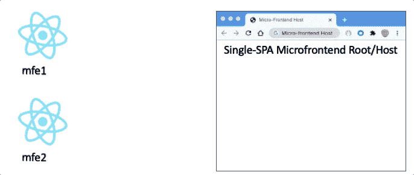

# 具有单 SPA 的微前端

> 原文：<https://levelup.gitconnected.com/microfrontends-with-single-spa-8370f1396f3a>

本文将通过一个实际操作的例子来解释如何使用 Single-SPA CLI create-single-spa 创建微前端。

# 什么是微前端？

如果您是 MicroFrontends 的新手，请从下面的文章开始。

 [## 微前端:什么、为什么和如何

### 在我以前的文章(本文末尾和这里的链接)中，我亲自展示了什么是微前端以及如何…

www.linkedin.com](https://www.linkedin.com/pulse/micro-frontends-what-why-how-rany-elhousieny-phd%E1%B4%AC%E1%B4%AE%E1%B4%B0) 

# 设置您的机器:

如果您没有安装 nodejs、npm 和 visual studio，请按照下面的文章和视频进行操作:

 [## 步骤 1:在 Mac 上安装 NodeJs 和 npm

### 在我们开始任何反应项目之前，我们需要安装节点。去 https://nodejs.org/en/download/滚动到你的…

www.linkedin.com](https://www.linkedin.com/pulse/step1-install-nodejs-npm-mac-rany-elhousieny-phd%E1%B4%AC%E1%B4%AE%E1%B4%B0) 

## 创建根配置

让我们创建编排微前端的根配置，并使用 create-single-spa 将它们粘合在一起。下面的文章将详细解释创建根配置的步骤。

 [## 使用 create-single-spa 的单 SPA 根配置微前端

### 本文将展示如何使用 create-single-spa 创建单 SPA 根配置。最终代码可以找到…

www.linkedin.com](https://www.linkedin.com/pulse/single-spa-root-config-microfrontend-using-rany-elhousieny-phd%E1%B4%AC%E1%B4%AE%E1%B4%B0/) 

## 创建第一个微前端应用程序

 [## 使用 create-single-spa 创建单 SPA 微前端应用程序

### 在前一篇文章中，我们创建了一个 root-config。在本文中，我们将创建我们的第一个微前端应用程序。

www.linkedin.com](https://www.linkedin.com/pulse/creating-single-spa-microfrontend-application-using-rany/) 

# 了解单 SPA 根/主机

单 spa 根是将挂载其他微前端的主机或容器

前一篇[文章](https://www.linkedin.com/pulse/single-spa-root-config-microfrontend-using-rany-elhousieny-phd%E1%B4%AC%E1%B4%AE%E1%B4%B0/)解释了如何构建单 spa 根。下面的文章将解释 create-single-spa 创建的文件。

 [## 了解单 SPA 根/主机

### 上一篇文章解释了如何构建单 spa 根。本文将解释由…创建的文件

www.linkedin.com](https://www.linkedin.com/pulse/understanding-single-spa-roothost-rany-elhousieny-phd%E1%B4%AC%E1%B4%AE%E1%B4%B0/) 

# 单 SPA 微前端布局

 [## 单 SPA 微前端布局

### 在前面的文章中，我们选择使用单 spa 布局。单温泉布局是一种新的配置，来自…

www.linkedin.com](https://www.linkedin.com/pulse/single-spa-microfrontends-layout-rany-elhousieny-phd%E1%B4%AC%E1%B4%AE%E1%B4%B0/) 

# 从根到微前端传递属性

将道具从容器传递到微前端在微前端架构中非常重要。单温泉布局使从根到微前端传递道具变得容易。以下文章对此进行了解释。

 [## 单 SPA 微前端:从根传递道具

### 将道具从容器传递到微前端在微前端架构中非常重要。单温泉布局…

www.linkedin.com](https://www.linkedin.com/pulse/single-spa-microfrontends-passing-props-from-root-rany/) 

# 单 SPA 微前端:Navbar 微前端

 [## 单 SPA 微前端:Navbar 微前端

### 我们将把 navbar 微前端添加到我们在以前的文章中创建的项目中，最终代码在…

www.linkedin.com](https://www.linkedin.com/pulse/single-spa-microfrontends-navbar-microfrontend-elhousieny-phd%E1%B4%AC%E1%B4%AE%E1%B4%B0/)  [## 软件工程| LinkedIn

### Rany ElHousieny，PhDᴬᴮᴰ |分享我在不同领域的软件工程经验，前端、后端、云…

www.linkedin.com](https://www.linkedin.com/newsletters/software-engineering-6892974463336501248/)