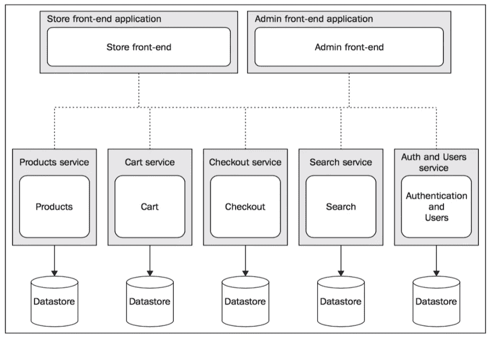

# Node.js 微服务架构

> 原文：<https://levelup.gitconnected.com/microservice-architecture-with-node-js-6a9422bd2bb6>

我过去曾使用过微服务架构，事实上， [Codeforgeek](https://codeforgeek.com/) 网站就是使用微服务架构构建的。我在各种会议上做过关于微服务的演讲，包括**数字海洋**和**微软**。在这篇文章中，我将解释微服务架构以及 Codeforgeek 是如何利用这项技术的。

# 什么是微服务架构？

> *“一种架构模式，允许你从功能上将软件分解成一个可管理的、独立的可部署单元”*

或者用一个简单的定义。

> *让每个程序/服务做好一件事*

在这种架构中，我们以一种方式划分我们的系统，即每个服务独立部署/扩展，并且彼此之间没有直接的依赖关系。

# 微服务架构的 4 I

这是我自己创造的测试微服务工作的指标。

您的微服务应该是:

*   独立部署。
*   独立代码库。
*   独立的技术堆栈。
*   独立可扩展。

# 独立部署

您的微服务应该在不依赖其他服务的情况下部署。这确保了代码库是以这样的方式编写的:如果一个服务关闭，它不会影响系统的整体工作(一个功能可能会丢失)。

# 独立代码库

每个微服务的代码库不应该局限于特定的设计模式。事实上，根据编程语言和适用性的不同，每个微服务可以使用不同的设计模式。

# 独立技术栈

这是微服务最受人喜爱的特点。您可以使用任何适合特定服务用例的技术，而不是遵循一种语言哲学。想象一下，使用 Java、Python、Node 一起构建一个坚如磐石的系统，没有任何问题。有了微服务，就有可能了。

# 独立可扩展

由于这是一项微服务，您只需扩展该服务，而无需触及其他服务。当只需要扩展少数服务时，无需扩展整个系统。节省大量资金！

# 微服务通信

微服务不执行直接通信(以避免依赖性)，而是使用两种不同的方法:

1.  对于同步请求—代理，如 Nginx、Amazon API Gateway 等。
2.  对于异步请求——如 RabbitMQ、亚马逊 SQS 等队列。

同步请求需要及时的响应，比如 API 调用，而异步请求可以等待一段时间，比如发送时事通讯电子邮件。

您可能需要在系统中同时使用代理和队列来进行这两种通信。

# Node.js 微服务

让我们用一个实际的例子来理解这一点，你现在正在阅读的文章是由运行在云服务器上的微服务提供的。

以下是我们运行的微服务数量:

1.  内容服务—提供帖子、课程。
2.  分析服务—收集页面浏览量和分析信息。
3.  站点地图服务—生成站点地图 XML 文件。
4.  浏览量服务——从谷歌分析同步浏览量。
5.  RSS 服务—生成 RSS 源。
6.  通信服务—发送系统电子邮件。

上面列出的每个微服务都是使用 Docker 的自包含容器。目前我们在所有的服务中都使用 Node.js。内容服务使用 [MongoDB](https://codeforgeek.com/caching-a-mongodb-database-with-redis/) 和 [Redis](https://codeforgeek.com/url-shortener-node-js-redis/) 来存储(缓存)和提供内容。

我们还有一个作为反向代理运行的 [Nginx](https://codeforgeek.com/load-balancing-nodejs-servers-nginx/) 实例，它将传入流量转发给内容服务。

我们使用 [**ZeroMQ**](https://zeromq.org/get-started/) 进行微服务通信。

例如:每当我发布一篇新文章时，内容服务都会在队列中生成一个事件，该事件稍后会被通信服务使用，通信服务又会发送电子邮件。

因此，要设计使用 Node 的微服务，您需要确保以这样一种方式划分您的系统，使其不相互依赖，并且可以独立部署。

并且，你不需要框架来构建微服务。是的，没错。

# 微服务监控

由于大量的服务，监控这些服务变得非常困难。对于基于 Node.js 的微服务，我强烈推荐使用 PM2 和 Keymetrics 来监控服务。

# 微服务部署

我强烈推荐使用 Docker 来部署您的微服务。您可以使用 Jenkins 或 Travis CI、Circle CI 等系统来[自动化](https://codeforgeek.com/continuous-integration-deployment-jenkins-node-js/)部署周期。

# 结论

微服务架构将允许您设计和构建可扩展的、安全的和容错的系统。它易于扩展，具有成本效益，代码所有权可以很容易地划分到团队中，并帮助您呈指数级增长。

# 需要帮助吗？

微服务需要咨询吗？我已经使用这种技术完成并部署了大型系统，并且愿意在这方面帮助您。使用此[联系页面](https://codeforgeek.com/contact/)联系我。

*原载于*[*https://codeforgeek.com*](https://codeforgeek.com/microservices-nodejs/)*。*