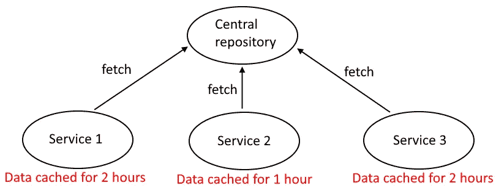
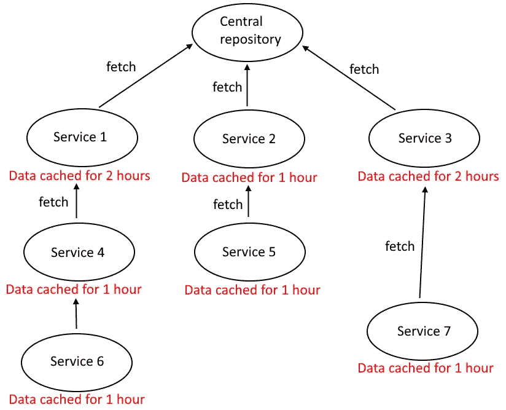
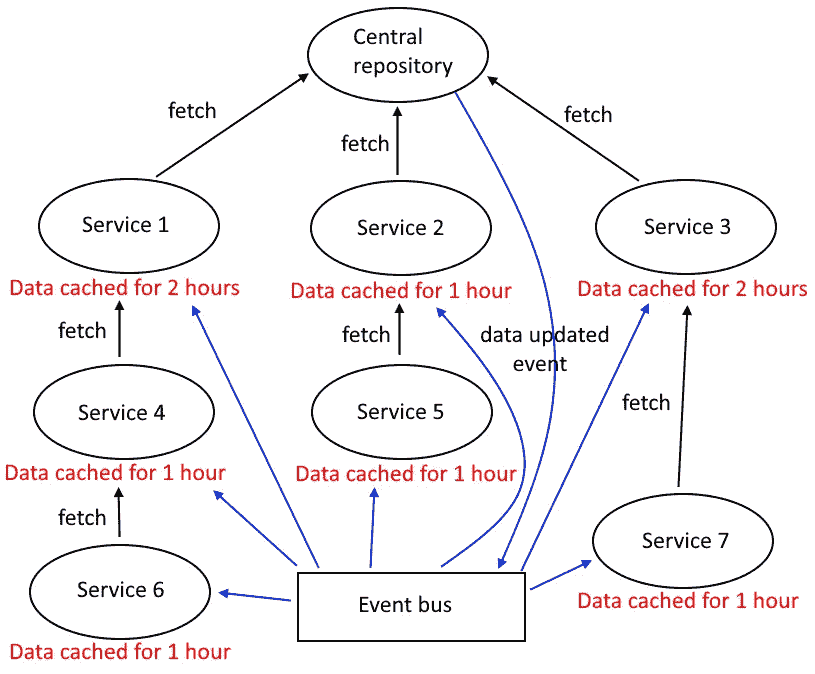
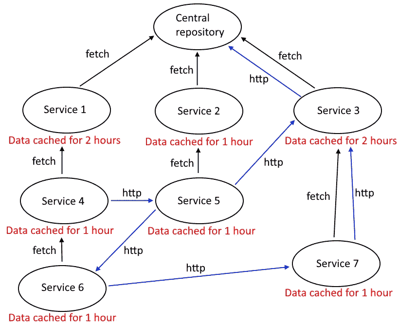

# 微服务设计错误(第 2 部分):数据缓存链

> 原文：<https://levelup.gitconnected.com/microservice-design-mistakes-part-2-data-cache-chains-1ab161867204>

## 在微服务中处理数据可能很困难，不小心使用缓存和事件总线可能会有问题

本杰明·雷曼在 [Unsplash](https://unsplash.com?utm_source=medium&utm_medium=referral) 上的照片

在微服务架构中缺乏上下文感是一个大问题。背景很重要，我在这个关于微服务设计错误的迷你系列的第一部分中写了一点。你可能想在继续之前检查一下。

 [## 微服务设计错误(第 1 部分):忽略上下文

### 微服务架构中的概念和实体应该是上下文相关的。

levelup.gitconnected.com](/microservice-design-mistakes-part-1-ignoring-context-ca5a8e2458a4) 

没有上下文意识，你可能会以上帝概念/实体告终。上帝概念是一个存在于建筑的大部分/所有部分中的概念，在所有部分中具有相同的含义，而不管它在什么上下文中使用。

# 数据复制

乍一看，让实体/概念在任何地方都表示相同的东西似乎很棒，因为你这样做是一致的。然而，一个实体的单一形式不可能轻易地覆盖所有可能的用例。试图过于一致并不总是奏效。

假设你有一个上帝实体。你如何处理实体的存储？如何在需要它们的服务中查询它们？一种常见的方法是创建一个负责分发实体的中央存储库。

在任何地方都以相同的形式处理数据，并有一个单一的中央存储库来查询数据，这是一种过于一致的方式。

假设您有一个单一的服务，它总是以相同的格式返回实体，而不管用例是什么。有两种情况可能发生:

*   你超载了负责服务上帝实体的单一服务
*   您不必总是从一个中央服务获取数据，而是将所需数据的副本存储在使用该数据的各个服务中，或者存储在数据库中，或者存储在缓存中

乍一看，哪个选项似乎更好？

很多人在处理微服务时非常关注性能，这很有道理。每个人都知道微服务应该是可扩展的，所以你不能引入任何瓶颈。

因此，考虑到性能问题，人们选择了第二个选项，即涉及数据副本的选项。

这很好，但是，数据的拷贝需要同步，保持它们的更新是一个挑战。你拥有的副本越多，它就变得越难。

> 数据同步困难。

# 缓存链

好的，假设您有一个中央存储库和 3 个其他服务，它们从中获取数据并缓存一段时间。

没那么糟吧。如果你只有 3 项服务，那么也许这还是可以接受的，我说的“只有 3 项服务”是指 100%的未来。你不知道将来会增加什么服务，如果你知道，你很可能在撒谎。如果你提前计划好了所有的服务，我有个坏消息要告诉你…你的架构太静态了。

如果总是只有 3 个服务，我们可以接受，服务可以是这样的:

图片由 [Giedrius Kristinaitis](https://medium.com/@giedrius.kristinaitis) 提供

现在，假设有更多的服务，所有这些服务也为自己缓存数据，那么您可能会有一个类似链的数据流，如下所示:

图片由 [Giedrius Kristinaitis](https://medium.com/@giedrius.kristinaitis) 提供

# 缓存链的原因

等等…为什么服务从其他服务获取数据，而不是从中心服务获取？

## 遗产

出现这种数据流的原因之一是需要支持遗留系统。

遗留系统很混乱，数据在其中流动的方式可能非常糟糕，一个组件从另一个组件获取数据，而那个组件又从另一个组件获取数据。

当您引入微服务时，让传统组件保持原样是有意义的。有时甚至创建整个代理服务作为遗留组件的包装，公开完全相同的操作。

当这样的包装器被创建时，它们复制了遗留组件的坏数据流，这就是为什么你能得到一个链状的数据流。

## 缺乏思考和设计

如果不需要支持遗留系统，缺乏真正的设计可能会导致长数据浮动链的形成。

为什么有人试图在没有任何设计的情况下实现整个系统？认为你不能在敏捷中进行设计的误解导致了这个问题。我的意思是，在敏捷中，你永远不知道需求会如何变化，所以你不做任何设计，对吗？

不完全是。这是关于敏捷的事情:与瀑布模型相比，它基本上是一种无设计哲学，敏捷没有设计阶段，然而，这并不意味着你不能在敏捷中做任何前期设计，认为你不能只是无知。

人们可能会做前期设计，但是，人们创造一个设计，然后坚持下去。一个好的设计需要迭代，如果你不迭代，不管你最初的设计有多好，你很可能会以一盘并发的意大利面条结束。

## 上帝实体

链状数据流与看不到上下文和有上帝实体有什么关系？

当你有一个上帝实体，它一直以相同的形式被传递，你鼓励把所有的东西都耦合到相同形式的数据中。

当所有东西都耦合到相同形式的数据时，正确查询数据的方式就失去了重要性，因为无论数据源是什么，它总是以相同的形式返回，所以当您可以从与您的服务密切通信的邻居服务中获取数据时，为什么还要费心去计算如何正确访问数据呢？这是一个反问句。我认为你应该努力弄清楚如何正确地访问你需要的数据，而不是从第一个想到的来源获取。

## 老一套思维模式

你不能用你在老的单体项目中使用的老思维方式来处理微服务，因为如果你这样做，你一定会重复同样的错误。

过时的思维方式也可能导致这个问题。

# 通用解决方案

这才是真正令人兴奋的地方。假设中央服务中发生了数据更改。现在所有缓存过期都要等几个小时，如果把时间加起来，数据更新在各地生效至少需要 4 个小时。没人有那么多时间，尤其是在危急情况下，这种情况最终肯定会发生。这样的解决方案一点也不能扩展。

解决等待问题的一个常见方法是引入一个事件系统，无论哪个服务需要更新的数据，都会得到通知，然后获取更新的数据。然后我们会得到这样的结果:

图片由 [Giedrius Kristinaitis](https://medium.com/@giedrius.kristinaitis) 提供

然而，即使这样也很成问题，并没有完全解决问题。如果所有的服务同时收到数据更新事件，并再次开始获取数据，那么这就是纯粹的混乱，因为有一个必须遵循的序列，当事件发生时，它就会被丢弃。

因此，如果您以这种方式做事，您别无选择，只能等待，或者创建更多不同类型的事件来通知各个服务中的数据更新，或者总是从中央服务获取数据，这可能是一个性能瓶颈。简而言之，形势看起来不太乐观。

让我们通过在服务之间引入一些通信来使情况变得更糟，以更加符合真实世界。我们可以像这样:

图片由 [Giedrius Kristinaitis](https://medium.com/@giedrius.kristinaitis) 提供

现在，它不像在事件被触发时获取数据那么简单了。通信的正确性要求数据在任何时候都保持同步，而同步需要很多时间，即使有事件的帮助也不是即时的。

我很确定没有人想在这种情况下结束，不仅仅是因为性能受到很大影响。现在，由于通信是在瞬间发生的，数据不一定是同步的，您甚至不能信任您在给定时间点拥有的数据，这造成了许多您永远无法调试的死角，更不用说修复了。

> 并发是困难的，非常困难。

# 尊重上下文

复杂的问题涉及抽象的概念，这是不可避免的。上帝实体和概念来自于糟糕的抽象，是一种试图过于字面化的方式。它们引入了大量的耦合，使整个系统成为静态的。这不是一个只针对微服务的问题，而是一个普遍的软件问题。

## 中央储存库可以被拆分

如果不应该与其他数据放在一起的数据是分离的并且是特定于上下文的，那么示例中的问题就可以最小化。

假设你的领域是汽车销售。您有两个有界的上下文:一个用于营销，另一个用于处理订单。当你需要一个汽车实体时，你不应该总是到处获取整个汽车的信息。订单处理不关心车的特性，车是黑是蓝都无所谓，那是市场部的事。

中央存储库相当于一个无所不知的上帝。

您可以将中央存储库拆分成更小的更有凝聚力的数据存储库。

同样，背景很重要。即使您将中央数据存储库分割成更具凝聚力的部分，如果您的微服务不具有凝聚力且不尊重上下文，也不会对您有任何好处。

## 限制缓存链

当您拥有更小的更具内聚性的数据存储库时，您可以减少从单个存储库访问数据的服务数量，因为并非所有服务都需要相同的信息。

使用的减少使得所有的性能问题变得不那么严重，这可以通过允许更多更小的特定于上下文的服务访问更小的存储库来帮助您消除链式数据流。

从一个服务流向另一个服务的数据缓存可能会导致需要始终保持同步的大量数据副本。这是一个您应该避免的严重的并发问题。为了帮助避免这个问题，应该优先考虑根据上下文来处理数据。