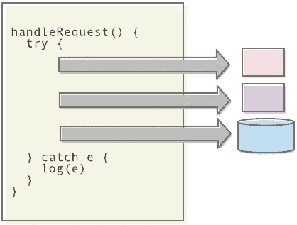
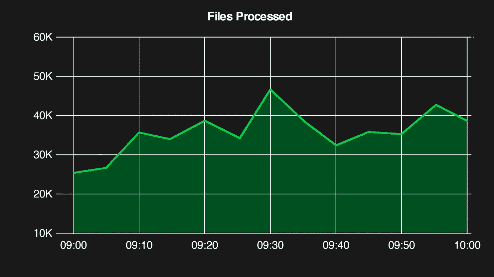
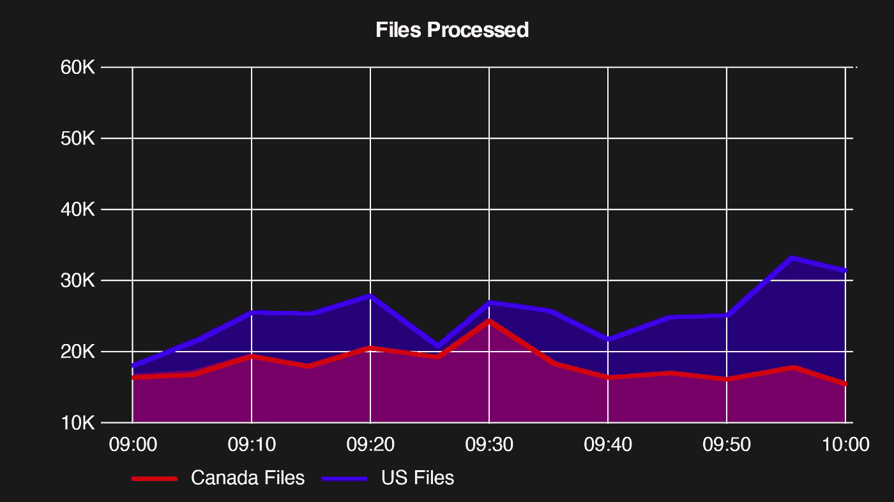
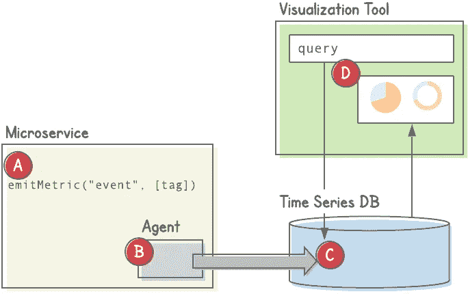
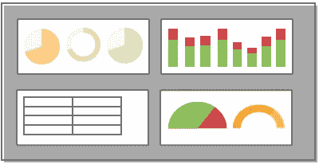
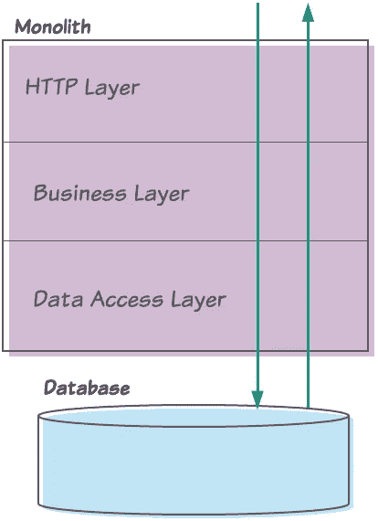
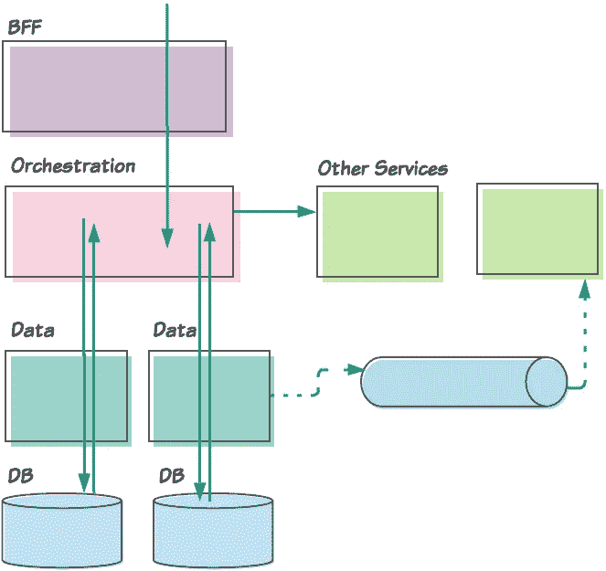
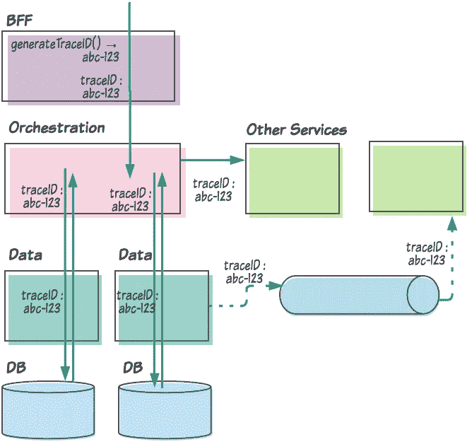
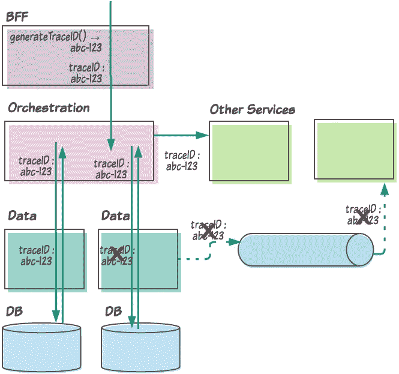

# 软件工程师的微服务监控和可观察性

> 原文：<https://levelup.gitconnected.com/microservice-monitoring-and-observability-for-software-engineers-ab47920dde12>

## 微服务领域的日志记录、指标和警报简介


亚历克斯·弗兰泽林在 [Unsplash](https://unsplash.com?utm_source=medium&utm_medium=referral) 上的照片

当我们构建微服务时，有许多概念需要理解。我们需要了解基础知识(例如每个微服务的[数据库](https://microservices.io/patterns/data/database-per-service.html))。我们应该意识到不同的微服务原型(比如 [BFFs](https://samnewman.io/patterns/architectural/bff/) )。而且我们应该在某些设计模式上很流利(比如[聚合](https://medium.com/better-programming/why-your-microservices-architecture-needs-aggregates-342b16dd9b6d))。

*可观察性*是我们工程师需要理解的另一个重要概念。可观察性描述了根据我们从服务中收集的数据，我们能够理解服务行为的程度。

人们有时会互换使用术语*可观察性*和*监控*。严格地说，*可观察性*描述了我们系统的一个特征(我们能充分理解我们服务的健康和行为吗？)而*监控*描述了我们进行观察所采取的活动。然而，在本文中，我们不会太在意术语上的差异。

与理解可观察性同样重要的是，很少有软件工程师花很多时间去学习它。这可以理解。毕竟，它远没有写代码或设计我们的架构那么有趣。但是理解和正确理解同样重要。一个低可观察性的系统在生产中会很快崩溃。

在本文中，我们将讨论从服务中收集信息的两种主要方式:

*   ***记录*** :记录离散事件作为定性数据
*   ***度量*** :将聚集事件记录为量化数据。

我们还将讨论 ***警报*** ，这是我们如何使用日志和指标来让我们了解需要我们注意的情况。

我们还将讨论 ***分布式跟踪*** ，这是一个重要的箭头，可以帮助我们调试生产问题，并了解我们的服务如何交互。

最后，我们将看到监控我们的微服务涉及一些复杂的操作。虽然我们可能会被诱惑提出自己的解决方案，但我们应该抵制这种诱惑。我们将花费太多时间来构建不合标准的解决方案。

相反，我们应该依赖现有的、经过验证的解决方案，其中许多都是免费和开源的(以及大量商业支持的解决方案)。因此，当我们讨论监控和可观察性的基本概念时，我们还将看看我们可以使用的工具。

# 记录

日志记录是将对*谨慎事件*的描述写入一个我们以后可以读取的位置的实践。日志记录给我们关于我们系统的定性数据。这与处理*聚合* *事件*和*定量*数据的指标(稍后讨论)不同。

注意，很容易说*日志*是为*人*准备的，而*度量*是为*机器*准备的。但这并不完全准确。虽然我们作为工程师确实会经常直接读取日志消息，但是我们也希望确保这些消息能够被容易地解析和查询。

## 日志记录是如何执行的？

从我们最早涉足编程开始，我们大多数人都熟悉这样或那样的日志记录。甚至像`println`语句这样简单的事情也是日志的一种形式。

然而，对于微服务，除了本地应用程序开发之外，这种日志记录几乎没有实际用途。现在大多数语言都提供了日志框架和提供者( [Log4J](https://logging.apache.org/log4j/2.x/) 和 [Logback](https://www.baeldung.com/logback) 用于 Java [Log4Net](https://logging.apache.org/log4net/) 和 [NLog](https://nlog-project.org) 为。网；[Winston](https://github.com/winstonjs/winston)for node . js；等等)。这些框架让我们能够控制以下事项:

*   日志写入的位置；例如特定文件、套接字等
*   消息的严重性(`DEBUG`、`INFO`、`WARN`、`ERROR`等)
*   日志的格式。它们应该作为原始文本输出吗？作为 JSON？

## 微服务和日志聚合

日志只有在可访问的情况下才有用。过去，通过 ssh 进入我们的服务器并跟踪日志文件是可能的。对于现代微服务架构，这种方法不再可行。我们运行的不同服务的数量，加上每个服务的实例数量，意味着 ssh 连接到任何一个服务器都可能不会产生我们想要的信息。


Jonah Pettrich 在 [Unsplash](https://unsplash.com?utm_source=medium&utm_medium=referral) 上的照片

这意味着我们的日志必须被组合(或聚合)到一个系统中，并呈现给我们，就像它们被写入单个文件一样。考虑到记录的数据量，它需要易于搜索。

出于这些目的，已经开发了许多日志聚合解决方案。这些工具收集我们记录的所有事件，对它们进行索引以便于查询，并提供一个允许我们搜索和过滤日志的 UI。您可能遇到的流行日志聚合器包括:

*   [麋](https://www.elastic.co/webinars/introduction-elk-stack) which(分别代表****E****lasticsearch*、***L****ogstash*，以及***K****ibana*)。这个解决方案结合了基于 Lucene 的搜索引擎 Elasticsearch *Logstash* ，一个管道系统，摄取并转换数据，存储在 Elasticsearch 中；以及位于 Elasticsearch 之上的 GUI 搜索和可视化应用程序。*
*   *[流体](https://www.fluentd.org/)。这是一个数据收集器，它收集、解析和转换日志数据，并将其发送到数据存储解决方案。*
*   *[Graylog](https://www.graylog.org/) 提供一套完整的日志数据聚合功能，并提供开源和商业版本。*
*   *Splunk 是最流行、最强大的商业日志聚合解决方案之一。Splunk 不仅提供日志聚合，还提供一般“大数据”的收集和分析。但是，大多数工程师都熟悉与日志聚合相关的 Splunk。*

## *我们要记录什么？*

*关于什么该记录，什么不该记录的争论永无止境。日志记录得太少，我们将无法获得系统所需的可见性。记录太多，我们最终会得到难以筛选的杂乱信息(根据我们使用的聚合器，更多的日志很容易意味着我们的组织花费更多的钱)。*

****错误条件***
然而，几乎没有什么争论，任何错误条件都应该被记录。这通常意味着我们的服务和应用程序应该允许异常冒泡并在顶层被捕获。例如，ReST 服务应该包装它们的端点(例如在 try/catch 块中),这些端点可以捕获和记录异常。注意，一些框架，比如 Spring，提供了[异常处理程序](https://howtodoinjava.com/spring-core/spring-exceptionhandler-annotation/)来实现这个目的。*

**

*我们服务的端点调用另外两个微服务，然后写入数据库。这些操作中的任何一个都可能出错，所以我们将整个事情包装在一个 try/catch 块中，并记录我们捕捉到的任何错误。*

*关于记录错误的一个注意事项:捕捉异常，记录它们，然后再抛出异常是很诱人的。通常，该异常将被再次捕获(如果不是更早的话，也是在顶层)并被再次记录。这可能会在我们的日志中人为地给出大量错误消息。相反，我们应该在顶层做一次错误记录。*

****成功案例***
然而，关于我们是否应该记录那些成功的或者其他常见的案例，还存在很多争论。一般来说，我们不应该用这样的语句来混淆我们的日志。然而，当我们正在开发全新的功能或应用程序时，使用日志来验证某个特定的新功能正在工作是很有帮助的。*

*例如，大多数公司(正确地)不允许工程师访问生产数据库。这使得很难验证我们的新数据库表实际上已经被填充了。虽然我们可能看不到记录的数据库错误，但我们对生产中发生的保存有多大把握？将信息级日志放在我们的数据库持久性代码块旁边可能会给我们这种信心。*

*然而，一旦我们的新功能通过审查，我们将想要隐藏或删除这样的日志记录。*

****只有安全的数据***
最后一点，也是重要的一点，在考虑要记录什么内容时会涉及到安全方面的考虑。通常，我们不希望记录敏感信息。这当然包括像密码这样的东西，但也可能包括像 PII(个人身份信息)这样的数据。日志往往会持续一段时间，如果它们包含敏感数据，就可能成为攻击媒介。*

## *我们该如何记录？*

*基本上，日志消息只是一个字符串。我们写入日志的任何消息都没有要求的格式(即没有*结构*)。然而，我们希望写出尽可能有用的信息。这意味着我们应该致力于以下日志消息:*

*   *跨服务和跨团队看起来相似*
*   *很容易搜索和过滤*
*   *隐式包含有用的信息或*属性*(时间戳、交易标识符等)，无需工程师手动包含它们*
*   *可以组合在一起，或者在适当的时候*关联**

****结构化日志***
为了实现这一点，许多组织都采用了*结构化日志*。结构化日志记录是以通用格式编写日志的实践，这种格式容易被机器解析(也容易被人阅读)。例如，我们的服务可能会编写如下所示的日志消息:*

*`24-Jul-2020-08:30:25 [error] No ID provided`*

*然而，另一个服务可能已经这样写了相同的日志:*

*`[ERROR] 07/24/20 8:30:25 No ID provided 192.168.0.1`*

*为了采用结构化日志记录，我们的首要任务是统一日志的书写格式。但是应该选择什么格式呢？我们想要一种容易解析的格式，现在，这意味着 XML 或(更常见的)JSON 之类的格式。*

*因此，我们可以对所有服务和应用程序编写的所有日志采用如下格式:*

```
*{
  "level": "ERROR"
  "timestamp": "2020-07-24T08:30:25.397-07:00"
  "host": "192.168.0.1"
  "message": "No ID provided"
}*
```

*我们的日志聚合器可以很容易地解析这些消息，并根据提供的字段对它们进行索引。这意味着，例如，我们可以轻松地搜索所有级别为“ERROR”的日志和主机为“192.168.0.1”的日志。*

*我们可以手工编写结构化日志，但这并不特别可行。因此，我们将让我们的日志框架为我们工作。例如，我们的 Java 服务可以利用 *Logback* 的`CompositeJsonEncoder`(下面显示的`LogstashEncoder`是一个子类，如果我们使用 *Logstash* 作为我们的聚合器的话，这个子类很有用):*

```
*<appender name="JSON" class="ch.qos.logback.core.ConsoleAppender">
  <encoder class="net.logstash.logback.encoder.LogstashEncoder" />
</appender>

<root level="INFO">
  <appender-ref ref="${JSON}"/>
</root>*
```

*现在，我们所有的日志都将以结构化 JSON 的形式打印出来。*

*但是同样重要的是，我们希望所有的日志都自动包含相同的字段。如果工程师需要记住在他们的日志消息中包括所有的公共字段，那么这些工程师有时会忘记。*

*不同的语言和框架有自己的机制来实现这一点。大多数基于 Java 的框架利用[映射诊断上下文(MDC)](https://www.baeldung.com/mdc-in-log4j-2-logback) 在日志消息中包含上下文数据。本质上，MDC 允许我们将数据存储在一个 threadlocal 结构中，该结构将被[包含在每个日志消息](https://github.com/logstash/logstash-logback-encoder#mdc-fields)中。*

*要包含的实际字段将根据我们的用例而有所不同。但是公共字段可能包括一个 *customerId* (用于处理客户请求的系统)，一个 *transactionId* 用于事务上下文，等等。我们稍后将讨论另一个公共字段， *traceId* 。重要的是，这些字段应该在框架级别隐式地添加到 MDC 中，而不是让工程师记住去做这些工作。*

****制作日志消息***
虽然我们的工具将为我们处理大部分繁重的工作，但是我们仍然需要制作我们的日志消息。*

*我们希望我们的信息对任何阅读它们的开发者来说都是清晰的。但是我们也希望我们的信息能够被容易地解析和搜索。所以我发现最好避免冗长或巧妙的散文。相反，应该从键/值对的角度来考虑。对于我们创建的每条信息，我们应该问自己:“有没有我可以轻松搜索的关键词？”*

*例如，类似以下的消息:*

*`"Could not find a session id in the response!!!"`*

*最好写成:*

*`"event=user-service-response result=no-session-id"`*

*(我发现的一个经验法则是，如果你发现自己在错误信息中添加了感叹号，你可能需要重写它。)*

# *韵律学*

*指标代表我们的微服务所执行的某些活动的度量。日志允许我们观察离散的事件，而指标允许我们观察服务的总体活动。*

*换句话说，当*测井*给我们*定性*数据时，*度量*提供*定量*数据。*

*此外，尽管我们经常直接读取单个日志消息，但我们几乎从不直接读取单个指标。取而代之的是，我们使用图形、图表、表格等工具来可视化我们的度量。*

*我们希望在给定时间段内观察的指标示例包括:*

*   *每个服务端点处理的请求总量*
*   *端点的错误率(即错误数除以总请求数)*
*   *请求的平均响应时间和异常响应时间(例如 99 %)*

## *标签*

*除了记录已经发生的事件，我们还可以将**标签**(有时称为**标签**)分配给我们的指标。标签是为特定指标提供上下文的元数据，允许我们沿着额外的维度分解它们。*

*例如，假设我们的服务从不同的来源获取文件。我们可能希望记录每次服务收到新文件的时间。这允许我们显示服务在给定时间段内处理的文件数量，如下所示:*

**

*我们还可以说，文件可以由来自不同国家的来源接收。所以我们可能希望我们的图表沿着那个维度分解，就像这样:*

**

*将“国家”标签与我们的*数据摄取吞吐量*指标相关联，使我们能够做到这一点。当然，如何做到这一点取决于具体的实现。但是通常情况下，我们会有一些上下文变量(姑且称之为 *originCountry* )可以在我们发出指标时引用。然后，我们可以将它作为一个标记，如下面的伪代码所示:*

*`metrics.emit(metric = FILE_RECEIVED, tags = [$originCountry])`*

## *我们如何生成和使用指标？*

*有几个不同的组件协同工作来生成和显示指标。它们的交互可以根据所选的具体实现而变化，但通常包括以下内容:*

*   ****代码声明*** :我们需要在代码中指定何时发出什么度量*
*   ****数据收集和发布代理*** :我们将使用一个小的库或应用程序来收集我们的度量，并将它们发布到一个中央数据库*
*   ****一个时间序列数据库*** :我们的指标将被存储在一个专门的数据库中，并由该数据库索引*
*   ****可视化工具*** :我们需要一个应用程序——通常是基于网络的——来查询指标数据库并显示结果*

**

*我们首先在代码中标出(A)我们想要发出度量的地方。代理(B)——通常是图书馆或边车服务——收集这些指标，并将它们发送到时间序列数据库(C)。最后，我们使用可视化工具(D)来查询时间序列数据库并显示结果。*

****代码声明*** 就像写日志一样，我们必须编写代码来发出我们想要收集的指标。我们通常会使用一个框架来完成繁重的工作，这样我们只需要写一行代码，或者注释一个方法，就可以得到一个给定的度量。*

****代理收集指标并将其发送到中央数据库*** 当我们的服务生成指标时，我们需要一个代理将这些指标发送到中央聚合器。代理可以使用推模型(即，它向聚合器发送度量)或拉模型(聚合器定期向代理请求度量)。它也可以嵌入到我们的应用程序中，或者，如果我们使用基于容器的解决方案，如 Docker 和 Kubernetes，它可以作为 sidecar 服务来实现。*

*常用的开源代理有[普罗米修斯](https://prometheus.io/docs/instrumenting/clientlibs/)、 [Telegraf](https://www.influxdata.com/time-series-platform/telegraf/) 和 [StatsD](https://www.datadoghq.com/blog/statsd/) 。此外， [New Relic](https://newrelic.com/) 是一个强大的商业工具，它提供了一个嵌入到我们应用程序中的代理(事实上，这个代理足够聪明，可以隐式地生成自己的指标)。*

****时间序列数据库*** 因为可视化指标涉及查询给定时间段内的定量数据，所以指标通常存储在[时间序列数据库](https://en.wikipedia.org/wiki/Time_series_database)中。与典型的关系数据库不同，时序数据库是专门为存储表示数据随时间变化的事件而设计的。*

*InfluxDB 可能是最常用的度量时间序列数据库；其他还有[普罗米修斯](https://github.com/prometheus/prometheus)和[时光流](https://aws.amazon.com/timestream/)。[石墨](https://graphite.readthedocs.io/en/stable/)的*耳语*又是一例。或者，如果我们的组织正在使用新的遗物，我们的数据很可能会使用 [NRDB](https://blog.newrelic.com/product-news/nrdb-design-principles/) 存储。*

****一个可视化工具*** 如果我们看不到度量标准，那么这些度量标准都是无用的。为此，我们需要一个可视化工具。这些工具使我们能够:*

*   **查询*指标数据*
*   **展示结果*以供查看*

*这些工具允许我们创建仪表板，由一系列面板组成，以图形、图表、表格等形式显示我们的指标。Grafana 可能是最受欢迎的开源解决方案(大体上已经取代了[Graphite](https://graphite.readthedocs.io/en/stable/)visualization web app)。商业解决方案包括[新遗迹](https://newrelic.com/)和[数据狗](https://www.datadoghq.com/)。*

*值得注意的是，虽然可视化工具提供了一种编写查询的机制，但我们将配置该工具来读取时间序列数据库。所以我们最终将查询底层的时间序列数据库。当我们自己混合搭配我们的工具时，这可能会变得令人困惑。*

*例如，我们可以将度量数据存储在 InfluxDB 中，并使用 Grafana 作为可视化工具。在这种情况下，我们将登录 Grafana 来创建我们的仪表板并编写我们的查询，但是我们将使用 InfluxDB 的查询语言 [InfluxQL](https://docs.influxdata.com/influxdb/v1.8/query_language/) 编写我们的查询。例如:*

```
*select sum("db-write-fail") / (sum("db-write-success") + sum("db-write-fail") ) from "user-service" WHERE $timeFilter GROUP BY time(1m) fill(0)*
```

*上面的查询是用 InfluxQL 编写的(看起来类似于 SQL)。这个特定的查询计算我们的用户服务向其数据库写入的失败率。我们将在 Grafana 中创建查询。因为我们已经将 Grafana 实例配置为从 InfluxDB 数据库中读取数据，所以 Grafana 实际上会将查询传递给 InfluxDB。*

*如果我们以后要切换到 Prometheus 来存储我们的指标，我们需要使用 [PromQL](https://prometheus.io/docs/prometheus/latest/querying/basics/) 来重写我们的查询。*

## *仪表盘有什么用？*

*曾几何时，在线组织的站点操作团队坐在一起，周围都是监视器。这些监视器包含显示公司 web 服务器实时健康状况的仪表板。天气好的时候，仪表盘会显示大部分绿线。当红线开始出现时，团队知道出了问题。*

*当时，用这种方式监控我们的网站是可行的。首先，我们通常要监控一个单一的整体网站。此外，部署、维护和故障排除一个单一的应用程序无论如何都需要一个专门的团队，那么为什么不在团队周围放置仪表板来帮助他们监视服务器的健康状况呢？*

**

*我们不再真的坐着盯着这些了*

*如今，查看仪表盘并不是了解服务器运行状况的好方法。为什么？有几个原因，包括:*

*   **微服务和分布式系统的爆发。*如今，我们通常会部署更多的服务和应用。试图将所有这些服务的仪表板安装到显示器上，然后将所有这些显示器安装到一个房间中，这在今天并不奏效。*
*   **德沃普斯的崛起。*如今，通常是我们的软件工程师——而不是专门的运营团队——负责保持我们的服务在生产中运行。由于我们倾向于开发下一个服务或功能，我们很快就会忘记看我们的仪表盘。*

*因此，如果我们不再使用它们来监视我们的服务，仪表板还有什么用呢？*

****查明错误原因***
有时，我们会发现我们的服务器在生产中出现故障。这将由我们来找出原因。这就是我们的仪表板发挥作用的地方。鉴于故障是*症状*，我们的仪表板可以帮助我们查明*根本原因*。*

*例如，我们可能有一个公开端点的服务。假设对该端点的调用导致对另外三个微服务的 RPC 调用，外加一个数据库操作。因此，我们应该创建面板来描述这三个 RPC 调用以及数据库操作的成功率和错误率，以及延迟。*

*现在，假设我们收到报告称，对此端点的调用失败率很高。我们可以访问我们的仪表板来尝试隔离原因。如果我们的数据库突然变得不可访问，那么我们的仪表板应该显示数据库操作的高错误率。或者如果对其他三个服务之一的调用超时，我们的延迟图应该会立即告诉我们这是问题所在。*

****高风险时期的监控***
当我们不再定期盯着仪表盘时，我们会希望在失败风险较高的事件中关注它们。这样，如果我们发现任何问题，我们可以立即做出响应。*

*向生产环境发布服务的新版本就是这样一个事件。虽然自动化已经使发布变得不那么正式，但在发布后立即关注我们的服务指标仍然是明智的，这样如果出现任何问题，我们可以立即回滚并通知感兴趣的利益相关者。*

*另一种情况可能是当我们预期流量会急剧增加时。举个例子，我曾经在一家小型初创公司工作，该公司的首席执行官接受了一档早间电视节目的采访。由于预计节目播出时会有大量的流量，我们的团队密切关注我们的两台 web 服务器，准备在需要时增加容量。同样，现代自动扩展解决方案已经降低了这种风险，但是仪表板仍然可以帮助我们识别任何需要的手动干预。*

## *我们应该获取和显示哪些指标？*

*如果我们正在收集指标，并通过充满图形、图表和表格的仪表板来可视化它们，那么我们对哪些数据最感兴趣呢？*

*我们可以将收集的指标分为两种类型:*平台级*指标和*应用级*指标。*

****平台级指标***
平台级指标度量常见的服务组件，如 API 端点、数据库查询、RPC 客户端等。我们应该努力收集公共服务中的公共平台级指标。换句话说，所有读写 SQL 数据库的服务都应该围绕它们的数据库操作发出相同的指标。*

*此外，我们应该确保工程师不需要编写代码来做到这一点。否则，几乎不可能确保所有公共服务都发出公共的度量标准。例如，如果我们的工程组织在一个库中分发一个数据库客户机，那么这个库本身应该发出度量。*

*我们应该发布什么样的平台级指标？首先，我们应该查看我们的服务所涉及的任何“边缘”操作。例如，每个服务都应该围绕以下方面生成指标:*

*   *我们的服务公开的端点(ReST、Thrift、gRPC、SOAP 等)*
*   *数据库读取和数据库写入*
*   *对其他服务的同步调用*
*   *缓存读取和写入*
*   *发布到事件日志(如 Kafka)或消息队列(如 RabbitMQ)*
*   *事件日志或消息队列的消耗*

*这些操作中的每一个都应该发出如下数据:*

**总吞吐量*
我们服务的指标应该能够告诉我们在给定的时间段内发生了多少种类型的操作。例如，在过去的一个小时里，有多少请求通过了我们服务的端点？或者昨天总共发生了多少次数据库读取？*

**成功和失败*
除了记录操作总数，我们还应该发出成功和失败的指标。例如，在一次成功的数据库写入之后，我们应该发出一个数据库写入成功度量。如果我们在 DB 写入期间捕获到一个异常，我们应该发出一个数据库写入失败度量。*

**等待时间*
我们还应该记录每次操作的等待时间。例如，我们应该记录任何给定的数据库读取所花费的时间长度，并将该数字作为度量发出。此外，我们还应该努力记录异常值——即最高的 90%(或 95%，或 99%，等等)——因为这最终可以让我们更好地了解可能实际发生的问题(诚然，[这有点难以正确做到](https://www.circonus.com/2018/11/the-problem-with-percentiles-aggregation-brings-aggravation/))。)*

**尺寸*
这些操作中有很多都会涉及到数据传输。因此，我们通常希望将每个操作的大小作为一个度量标准。*

*最后，我们应该配置我们的服务来定期报告运行时统计数据，如 *CPU 使用率*和*内存使用率*。*

****应用级指标***
应用级指标是那些特定于我们个人服务的指标。它们通常代表特定于业务或领域的度量。*

*例如，如果我们的团队拥有一个认证服务，那么我们可能想要跟踪成功和失败的认证尝试的次数。或者，如果我们的服务验证它通过 POST 端点接收的数据，那么我们可能希望记录特定字段通过或未通过验证的时间。*

*与平台级指标不同，服务工程师应该期望明确地编写代码来发出这些指标。*

## *创建仪表板*

*正如我们前面所讨论的，我们使用可视化工具，如 Grafana 或 Graphite(或者使用商业解决方案，如 Datadog 或 New Relic)来创建仪表板。*

**

*图片由 [Ash Edmonds](https://unsplash.com/@badashphotos?utm_source=medium&utm_medium=referral) 在 [Unsplash](https://unsplash.com?utm_source=medium&utm_medium=referral) 上拍摄*

*第一步是针对底层时序数据库编写查询。我们的可视化工具应该为我们提供这样做的机制。之后，我们定义如何显示数据。比如应该显示为图形还是表格？轴应该如何标注？数据应该精确到什么程度？*

*当我们第一次开始构建仪表板时，我们可能会使用可视化工具的 UI 手工构建它们。这在我们最初的几次服务中运行良好。但是我们可能会开始注意到一些事情，比如:*

*   *我们正在为多个服务重新创建相同的仪表板。*
*   *当我们对这些仪表板进行更改时，我们需要为每个服务手动进行更改。*
*   *几乎不可能跟踪对我们的仪表板的更改，或者在做出不正确的更改时回滚。*

*事实上，更好的解决方案是将“[配置作为代码](https://rollout.io/blog/configuration-as-code-everything-need-know/)”的思想应用到我们的仪表板上。也就是说，我们应该将仪表板定义为文本文件，并将这些文件签入版本控制。*

*我们该怎么做？*

*首先，大多数工具都为其仪表板提供了导入/导出功能。例如，Grafana 允许我们将仪表板作为 JSON 导出和导入。因此，我们可以从手动创建一个仪表板开始，然后将其导出为 JSON。为了跨服务重用它，我们将通过标记变量，然后编写一个脚本来替换这些标记，将它复制到一个新的服务中，从而将它转换成一个模板。*

*或者，我们可以利用为此设计的现有工具之一。Hashicorp 的 [Terraform](https://www.terraform.io/) 或许是最受欢迎的解决方案。*

*在上一节中，我们已经讨论了我们应该发出的度量的种类。在大多数情况下，我们将拥有显示平台级指标的仪表板:总吞吐量、成功率和失败率，以及所有边缘操作的请求延迟/大小。我们的仪表板还应该显示 CPU/内存/etc 的使用情况。*

*每个服务的仪表板还应该显示我们决定收集的特定于应用程序的指标。这又回到了我们之前关于创建仪表板模板的观点。模板应该包含跨应用程序通用的仪表板，即平台级仪表板。由于应用程序级仪表板特定于服务，因此我们可以考虑为每个服务创建两组仪表板:*

*   *一个用于特定于平台的指标，它由模板生成，以及*
*   *一个用于特定于应用程序的指标，它是定制的(但是仍然应该被签入源代码控制)*

# *警报*

*我们用监视器包围自己，显示我们的仪表板和日志，并观察任何需要我们注意的异常情况的日子已经一去不复返了。现在，我们让我们的服务器替我们看着。*

*具体来说，我们创建了当满足*特定条件*时将触发的警报。然后我们将这些警报配置为*通过一个或多个通道*通知我们条件已经满足，需要我们注意。让我们仔细看看这两个方面。*

## *满足条件时触发警报*

*创建警报时，我们需要做的第一件事是定义触发警报的条件。例如，我们可能希望当我们的服务的错误率超过某个阈值时执行警报——比方说，在 10 分钟内超过 25%。*

*那么，我们如何设置这些阈值呢？为此，我们回到我们的 UI 工具。*

****针对指标的警报***
我们的许多警报将由我们收集的指标触发。这是因为我们通常希望基于总体数字而不是单个事件获得警报。例如，如果一个客户端请求需要很长时间才能完成，这可能不值得发出警报。然而，如果某个百分比的请求花费的时间太长，那么这可能表明我们需要解决一个问题。*

*通常，我们将编写与生成仪表板相同的查询来生成警报。例如，我们可以重用之前查看过的 InfluxDB 查询:*

```
*select sum("db-write-fail") / (sum("db-write-success") + sum("db-write-fail") ) from "user-service" WHERE $timeFilter GROUP BY time(1m) fill(0)*
```

*在 Grafana 中，我们可以将警报与查询关联起来。例如，我们可以将警报配置为在十分钟内平均故障率超过 5%时触发。*

*随着我们越来越熟悉我们的服务，越来越熟悉哪些情况实际上构成了错误，我们也可能会调整这些数字。我们也可以添加额外的条件。例如，我们可能需要满足某个流量阈值；否则，在低流量期间(通常在午夜),一个短暂的错误就可能引发警报。*

*警报触发时会发生什么？我们需要告诉警报如何通知我们。同样，这是在可视化工具中配置的。我们的组织可以使用事件管理系统，如 [Opsgenie](https://www.atlassian.com/software/opsgenie) 或 [PagerDuty](https://www.pagerduty.com/) ，通过它我们可以整合我们的警报。或者，我们可以简单地配置我们的提醒，向我们的电子邮件地址发送电子邮件。*

****针对日志记录的警报***
大多数日志聚合器也允许我们创建警报。如果我们希望在特定事件发生时得到通知，我们可以根据日志创建警报；例如:*

*   *试图使用特定用户名登录*
*   *特定产品出现错误*

*我们还可以使用我们的日志聚合器根据聚合数据创建警报，就像我们使用指标一样。然而，创建这些警报通常更有效(因为我们的指标存储在时间序列数据库中)，并且通常为我们提供更多的灵活性。*

## *先测试警报！*

*关于创建警报的最后一点说明。就像我们在将软件发布到产品中之前对其进行测试一样，我们应该在发布之前首先测试我们的警报。否则，很容易编写出错误的查询，从而产生误报，潜在地向我们可怜的随叫随到的工程师发送垃圾邮件。*

*那么我们该怎么做呢？*

*一些可视化和聚合工具提供了测试警报的机制。但我发现最好的方法之一是简单地配置新的提醒，向我们自己的电子邮件地址发送电子邮件。一旦我们对警报基本起作用感到满意(并且我们恢复了我们调整过的任何阈值)，我们就可以将警报路由到适当的通道。*

# *分布式跟踪*

*使用 monolith 时，跟踪执行流程相对简单。一个典型的请求将进入某个地方的整体代码库(比如一个 ReST 端点)，流经应用程序的各个层(比如我们的 HTTP、业务逻辑和数据访问层)，执行一些操作(可能将数据保存到数据库)，然后通过相同的路径返回。*

**

*换句话说，应用程序流保留在我们的整体代码库中。*

*在使用微服务时，情况并非如此。在这种情况下，执行流程通常会跨越多个应用程序和服务。例如，一个请求可能通过前端(BFF)应用程序的[后端进入我们的系统，流经编排服务，然后通过一个或多个数据服务。可能会向更多的微服务发出同步请求。此外，该流程还可能涉及与其他服务的异步通信。](https://samnewman.io/patterns/architectural/bff/)*

**

*这对作为开发者的我们来说意味着什么？*

*首先，用 monolith 来推理整个执行流程要容易得多。通常，只需将完整的代码库加载到 IDE 中，然后点击方法调用即可。*

*当使用微服务时，这变得更加困难。当然，我们可以在 IDE 中打开微服务的代码库，并遵循它的流程。但是一旦流离开了微服务(通过对另一个服务的 RPC 调用，向事件总线发布消息，等等)，我们就失去了流。我们能做的最好的事情是找到下一个服务的代码库，尝试确定流在哪里进入那个服务，并且继续直到流退出那个服务，等等。*

*其次，用 monolith 生成完整的堆栈跟踪要容易得多。通常，在 monolith 中，只是简单地捕获一个异常并记录该异常的堆栈跟踪。因此，识别异常的根本原因很简单。*

*使用微服务架构，我们经常会遇到错误，这些错误的根源不在这里。我们可能会注意到我们自己的服务正在记录错误，但是这些错误的根本原因可能是一个完全不同的服务。*

## *关联请求*

*这就是*分布式跟踪*发挥作用的地方。概念比较简单。当一个请求进入我们的系统时——比方说，在一个 web 应用程序的 ReST 端点——为该请求生成一个惟一的标识符(称为*跟踪 ID* 或*相关 ID* )。通常，这是一个 UUID 或类似的东西。这个 ID 在请求的整个生命周期中都存在。使用上述机制(例如 MDC ),任何日志消息都隐式地包括作为属性的跟踪 ID。*

**

*当请求进入后端 For Frontend (BFF)服务时，上下文中没有 traceId，因此 BFF 会生成一个(此处为“*ABC-123”*)。此后，“abc-123”在所有其他服务之间传播，以便可以关联该单个请求的所有部分。*

*请注意，traceId 不仅跨同步调用传播，还跨异步调用传播。在上面的例子中，第二个数据服务向 Kafka 发布消息；traceId 包含在这些消息中，因此会传播给任何消息使用者。*

*我们还可以进一步使用*span id*。一个*跟踪*代表一个请求的整个生命周期，而一个*跨度*代表一个请求的一小部分。如果有一个请求的特定部分——比方说，对另一个微服务的调用——我们有兴趣深入研究，我们可以将我们代码库的那个部分定义为一个跨度。这意味着使用 spans 需要一些手工工作，如果仅仅是划分代码块的话。*

*所有这些让我们可以做两件事:*

*   *轻松关联与单个错误或事件相关的日志消息。例如，如果我们的服务发出一个错误日志，我们可以简单地查询日志的跟踪 ID 来查找所有其他日志——从涉及的任何其他服务中——以收集相关的上下文来确定错误的根本原因。*
*   *生成我们的微服务拓扑图。虽然浏览我们的代码库来查看请求如何流经我们的服务可能不可行，但是我们可以使用分布式跟踪来自动生成流图。此外，它还可以向我们显示负载量不成比例的资源，从而揭示潜在的性能瓶颈或单点故障。*

## *分布式跟踪工具*

*请注意，分布式跟踪需要一点纪律和跨组织服务的协调。所有服务必须参与我们的分布式跟踪工作；否则，流程会中断。*

**

*如上所述，第二个数据服务没有被检测以参与分布式跟踪工作。结果，不仅数据服务将无法记录跟踪 ID，而且其 Kafka 消息的任何消费者也将无法记录。*

*因此，与微服务环境中的大多数流程一样，我们应该尽可能地依赖工具。*

*   *首先，我们不应该要求工程师显式生成跟踪 id，将它们添加到服务的请求上下文中，或者将它们传播到他们调用的任何其他服务。*
*   *在日志消息中包含跟踪 id 也应该“自动”发生。*
*   *如上所述，定义 span IDs 需要一些手工工作，但是应该不比注释方法更费力。*
*   *最后，为了可视化我们的微服务请求拓扑并深入我们的范围，我们需要一些机制来自动将我们的数据发送到中央聚合器。*

*如果我们的组织使用标准框架或 sidecar，那么构建我们自己的机制来生成和传播跟踪 id 并不太困难。我们还看到了如何在日志消息中自动包含跟踪 id 的例子。因此，如果我们愿意，可以很容易地自行开发工具来关联日志。*

*然而，定义跨度需要更多的工作。如果我们想要在一个集中位置收集我们的轨迹和跨度，以便可视化我们的拓扑，那么，这将需要花费更多的努力来构建。*

*幸运的是，有许多开源工具可以处理所有这些问题。其中包括:*

*   *Zipkin :这是第一个广泛应用的解决方案之一，来自 Twitter。Zipkin 提供了一些工具来引导您的应用程序生成和传播跟踪 id 和其他数据，还提供了一个 UI 工具来可视化服务之间的执行流。*
*   *[**Jaeger**](https://www.jaegertracing.io/) : Jaeger 在功能上与 Zipkin 类似，最早由优步开发。Jaeger 属于[云原生计算基金会](https://www.cncf.io/)。*
*   *[**OpenCensus**](https://opencensus.io/) 、 [**OpenTracing**](https://opentracing.io/) 和[**OpenTelemetry**](https://opentelemetry.io/):open census 和 OpenTracing 是两个独立的项目，最近联合起来形成了 open telemetry。OpenTelemetry 提供了一组 API 和底层实现，不仅可以创建和可视化分布式跟踪，还可以创建和可视化日志和指标。这样，我们可以将 OpenTelemetry 视为 Zipkin 和 Jaeger 所提供的超集。事实上，Jaeger 实际上是 OpenTelemetry 的一个组件。*

# *最后意见*

*虽然可观察性和监控可能不像编写代码和构建系统那样有趣或性感，但这是软件工程师需要理解的事情，尤其是在使用微服务时。幸运的是，只需要记住一些重叠的组件:*

*   ****记录*** 帮助我们意识到*谨慎的*事件；它为我们提供了定性的数据。*
*   ****度量*** 帮助我们看到*聚合*事件；它为我们提供了定量的数据。*
*   ****警报*** 通知我们需要解决的问题。我们可以根据我们的指标或(在较小程度上)我们的日志生成警报。*
*   ****分布式跟踪*** 让日志记录变得更加有用，尤其是当我们调试孤立请求的问题时。它还帮助我们了解我们的服务在生产中是如何交互的。*

# *参考*

*   *[https://thenewstack . io/the-hows-whys-and-whats-of-monitoring-micro services/](https://thenewstack.io/the-hows-whys-and-whats-of-monitoring-microservices/)*
*   *[https://medium . com/@ copy construct/distributed-tracing-we ve-be-do-it-wrong-39fc 92 a 857 df](https://medium.com/@copyconstruct/distributed-tracing-weve-been-doing-it-wrong-39fc92a857df)*
*   *[https://stack ify . com/monitoring-micro services-a-5-step-guide/](https://stackify.com/monitoring-microservices-a-5-step-guide/)*
*   *【https://www.sumologic.com/glossary/structured-logging/ *
*   *[https://medium . com/@ theflyingmantis/what-is-99-percentile-response-time-f 23 c 09 C3 b 54a](https://medium.com/@theflyingmantis/what-is-99th-percentile-response-time-f23c09c3b54a)*
*   *[https://documentation . solarwinds . com/en/Success _ Center/app optics/Content/kb/custom _ metrics/intro . htm](https://documentation.solarwinds.com/en/Success_Center/appoptics/Content/kb/custom_metrics/intro.htm)*
*   *[https://medium . com/swlh/building-an-AWS-cloud watch-dashboard-using-terraform-15-minute-guide-c 404 a 128 F2 F8](https://medium.com/swlh/building-an-aws-cloudwatch-dashboard-using-terraform-15-minute-guide-c404a128f2f8)*

*觉得这个故事有用？想多读点？只需[在这里订阅](https://dt-23597.medium.com/subscribe)就可以将我的最新故事直接发送到你的收件箱。*

*你也可以支持我和我的写作——并获得无限数量的故事——通过今天[成为媒体会员](https://dt-23597.medium.com/membership)。*