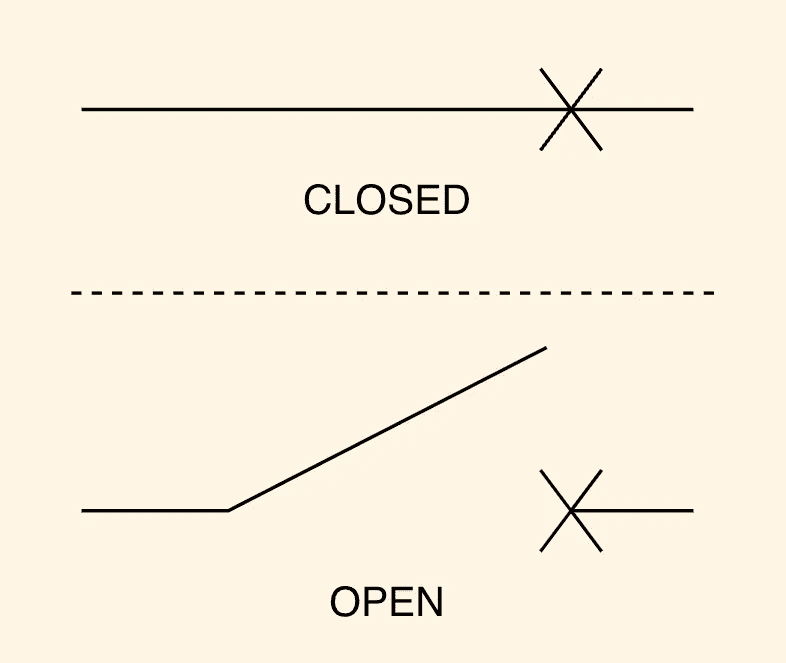
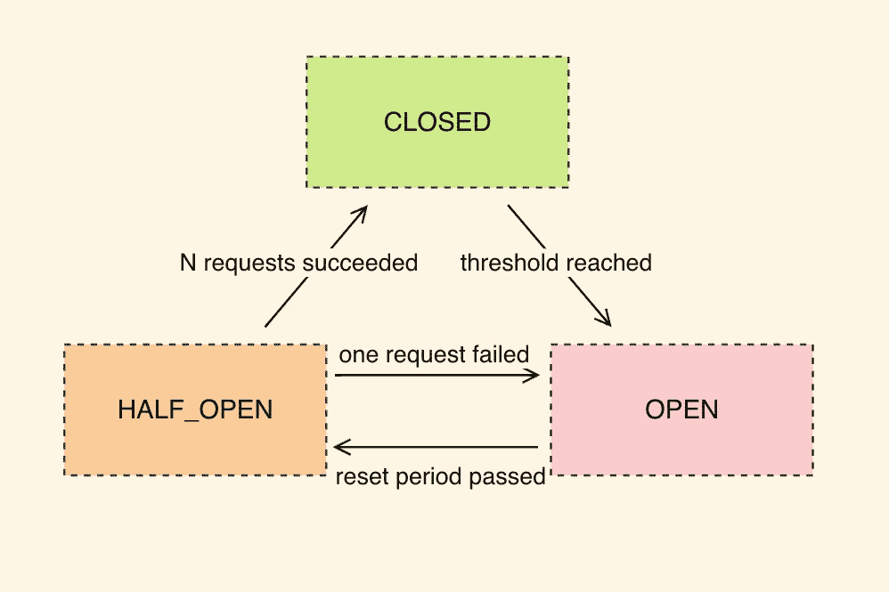

# 微服务。断路器。节点. js

> 原文：<https://levelup.gitconnected.com/microservices-circuit-breaker-node-js-c2062af14e47>

## 为什么要用，如何在 Node.js 中实现

微服务是构建可扩展系统的现代方式，但与任何方法一样，它也有自己的挑战。尤其是当我们谈论你的软件的可靠性和可用性的时候。

## 什么是断路器？

在我们谈论软件之前，让我们看看这个想法来自哪里。在电子产品中，当电源/电压出现尖峰时，我们需要切断设备的电源，否则它们可能会被损坏。断路器执行这样的动作。

它有两种状态，关闭和打开。在闭合状态下，电可以接触到设备，而在打开状态下，电不能接触到设备。那么断路器需要由人手动复位到闭合状态。

## 我们为什么需要它？

与电子产品类似，有时我们的软件中会出现请求高峰或错误高峰，这可能会导致我们的服务器出现故障，因此要帮助我们的服务器进行自我修复(例如，进行自动伸缩，杀死不健康的实例等。)我们需要调用此服务器的客户端给它一些时间，并停止向它发送流量。

通过这种方式，我们可以帮助我们的系统更好地适应“暂时性”错误，这些错误可以在短时间内自我修复。

## Node.js 中的断路器

断路器可以表示为以下状态机。

如您所见，与基本断路器相比，我们增加了第三种状态 HALF_OPEN。我们的断路器将通过从客户端传递的大量请求来测试我们的服务器，以验证我们可以将所有流量传递回服务器。除此之外，与电动断路器相比，我们不需要手动将断路器从断开状态复位到闭合状态，我们可以在一段时间后进行复位。

你可以安装我的包含测试的 npm 包[axios-断路器](https://www.npmjs.com/package/axios-circuit-breaker)，现在就开始使用 Node.js 中的断路器模式！尽管断路器可以用于任何类型的传输层。

让我们看一下使用示例。您需要为每个 Axios 实例定义断路器，以区分不同服务器的状态。

现在，每个 Axios 实例都有一个单独的断路器实例与之相连。您可以深入配置每个实例，并指定记录器实例和策略来定义请求是否应该被视为故障。我要说的是，定义一个记录器是在运行时了解断路器状态的必要条件。

在到达`threshold`的`thresholdPeriodMs`期间，多次请求失败后，断路器将切换到`OPEN`状态。断路器将使用`isFault` a 方法确定请求失败。在`OPEN`状态下，它会拒绝任何对服务器的请求。

然后在`ressetPeriodMs`之后，它将切换到`HALF_OLPEN`并以最大值`numRequestToCloseCircuit`进入，其他请求将被拒绝。如果所有请求成功，它们将再次进入`CLOSED`状态。如果至少有一个请求失败，它将返回到`OPEN`状态。

## 摘要

断路器有助于使您的后端更加可靠，因为它为服务器提供了更多的时间进行自我修复，从而使您的整个分布式系统更具弹性。

Axios 是 Node.js 的一个很棒的可扩展的 HTTP 客户端，允许您更改 HTTP 客户端的行为。

## 接下来呢？

爱 Node.js？你可以看看我关于它的其他文章:

*   [流以及它们如何适应 Node.js 的异步特性。](/streams-and-how-they-fit-into-node-js-async-nature-a08723055a67)
*   [如何处理 Node.js 中的拦截器？](/how-to-handle-blockers-in-node-js-1966d0399703)