# 使用 Java、Maven 和 Spring Boot 实践微服务设计模式:步骤 1:构建微服务

> 原文：<https://levelup.gitconnected.com/microservices-design-patterns-in-practice-using-java-maven-and-sprint-boot-step-1-building-a-dfe18c6a1206>

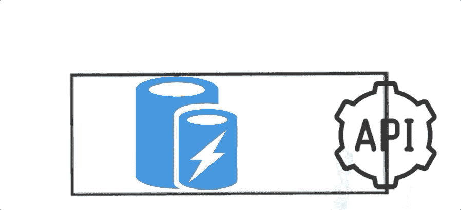

作者兰尼·埃尔豪斯尼

本文是系列文章的一部分:

# 首先:为 Java Spring Boot 微服务项目准备你的 Mac:安装 JDK、Brew、Maven 和 IntelliJ

 [## 为 Java Spring 微服务项目准备您的 Mac:安装 JDK、Brew、Maven 和 IntelliJ

### 我想创建一个移动友好的技术系列，以便在上下班时间在公共汽车上或…

medium.com](https://medium.com/microservices-architectures/prepare-your-mac-for-java-spring-microservice-projects-install-jdk-brew-maven-and-intellij-7ccb0207ca04) 

# 1.(本文)步骤 1:构建微服务:

 [## 使用 Java、Maven 和 Spring Boot 实践微服务设计模式:步骤 1:构建一个

### 作者 Rany ElHousieny(https://Rany . ElHousieny。

www.linkedin.com](https://www.linkedin.com/pulse/microservices-design-patterns-practice-using-java-1-rany/) 

# 2.添加模型视图控制器(MVC)

 [## 步骤 2:将 MVC 添加到微服务中:实践中的微服务设计模式使用 Java、Maven…

### 本文是解释使用 Java、Maven 和 Spring 实践微服务设计模式的系列文章的一部分…

www.linkedin.com](https://www.linkedin.com/pulse/step2-adding-mvc-microservice-microservices-design-rany/) 

完整项目可在以下网址找到:

 [## ranyelhousieny/电子商务服务项目

### 使用 Spring Boot、Maven 和 Java 的电子商务微服务项目

github.com](https://github.com/ranyelhousieny/ECommerceMicroservicesProject) 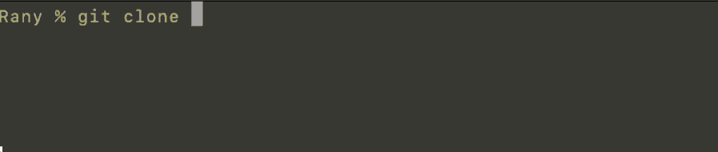

=======================

我想写一个很好的文档来解释微服务设计模式。我一直在工作中更多地使用这些模式来构建微服务，我发现留下一些蓝图是有益的，人们可以在较小的范围内实践和尝试。

在这个项目中，我将使用微服务构建一个电子商务网站，并将其部署在云上。我将在这里使用的所有模式和技术都来自现实生活实践。我会试着把它们放到每周一集的剧集里，这样更容易写，也便于读者跟进。此外，我将为实现的所有代码提供 git hub repo，以便更容易理解(https://github . com/ranyelhousieny/ECommerceMicroservicesProject)。

在用 Java 完成这个项目后，我将展示如何用无服务器方法在同一个项目中实现它，以展示使用无服务器的简易性。这个项目将需要多次会议。

==========

# 第一步:创建微服务

第一步是使用 Spring Boot 构建微服务。Spring boot 让构建微服务变得如此简单。

# 正在安装来自[https://start.spring.io/](https://start.spring.io/)的依赖项

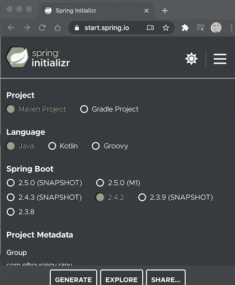

1.  去 https://start.spring.io/[的](https://start.spring.io/)

您将看到以下屏幕

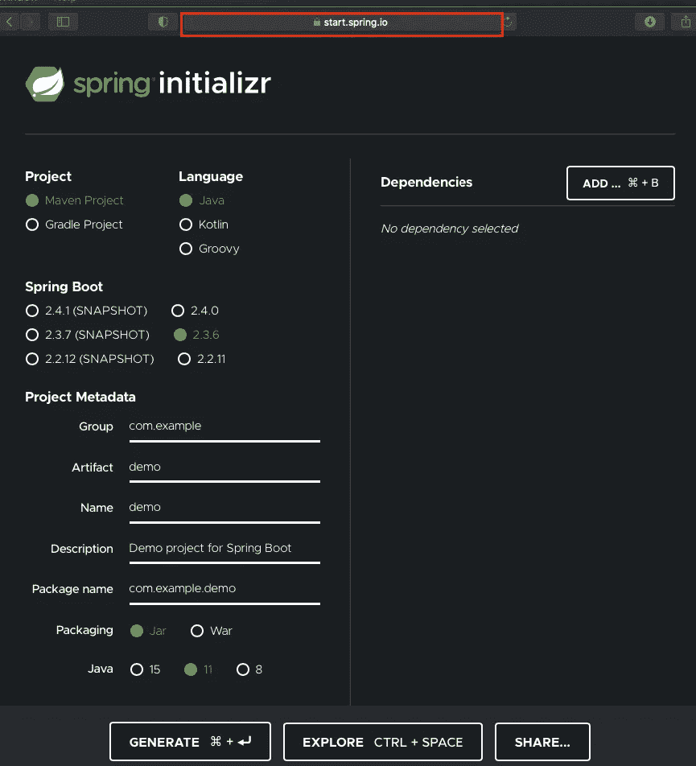

2.让我们选择 Maven，Java，Spring Boot 2.3.6(稳定)，Packaging = Jar，Java = 11。此外，您可以更改服务的名称和项目元数据，如下图所示

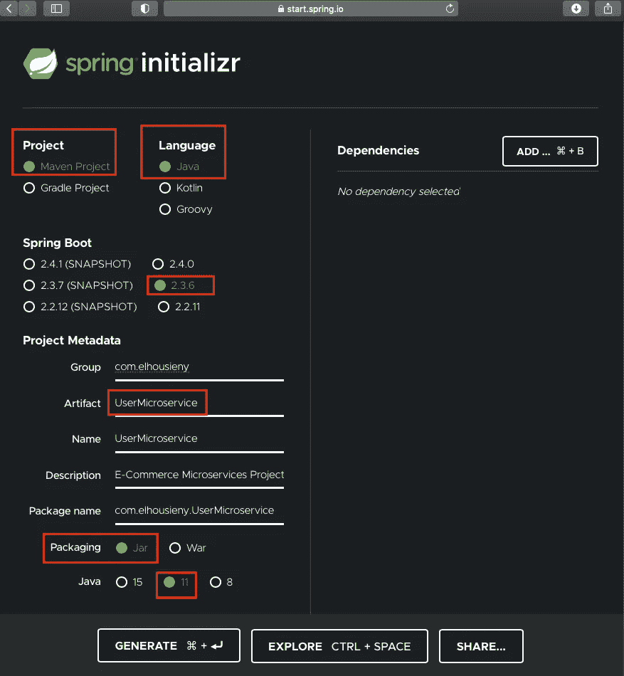

# 3.添加依赖项:

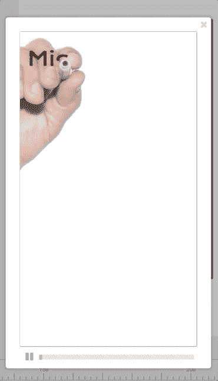

最小的有意义的微服务可以包括能够与其他服务对话的 API 接口、数据库持久性和缓存。以下是使用 Spring Boot 添加的步骤。

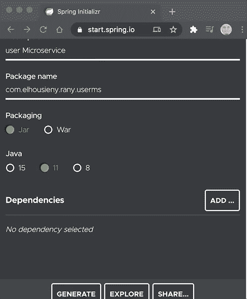

# a.为 rest APIs 添加 Spring Web

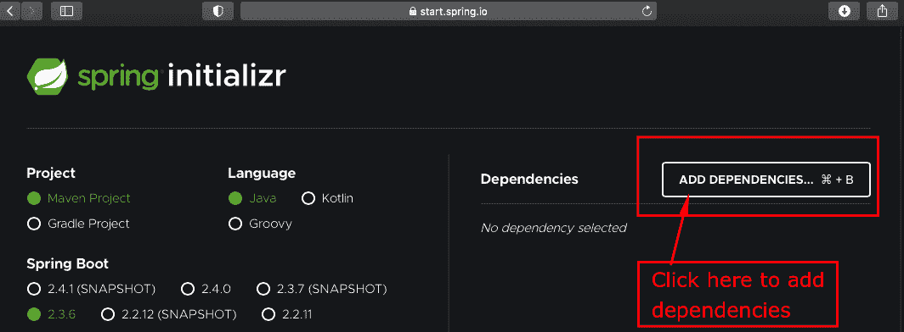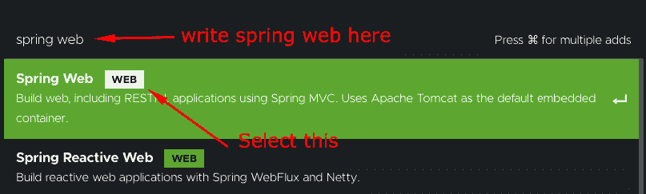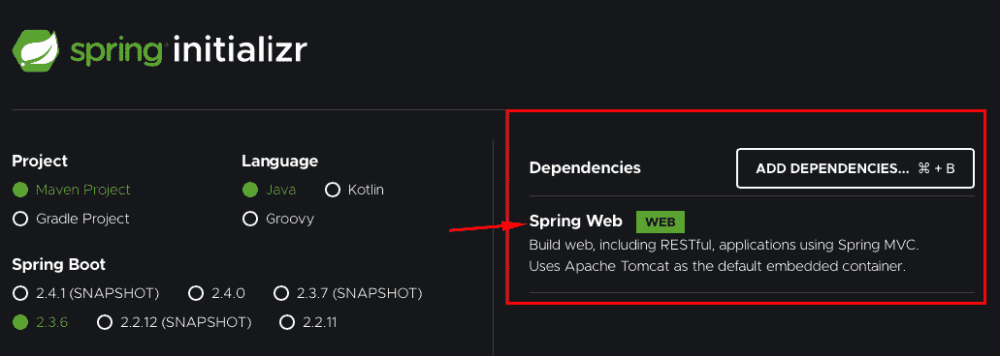

# b.为 SQL 数据持久性存储添加 Spring 数据 JPA

# c.添加内存缓存 H2

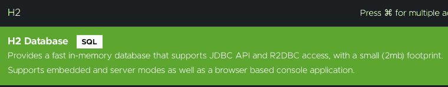

# d.添加 Lombok 以减少代码编写

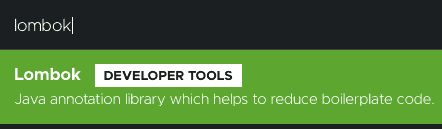

添加完所有依赖项后，单击“生成”以生成包

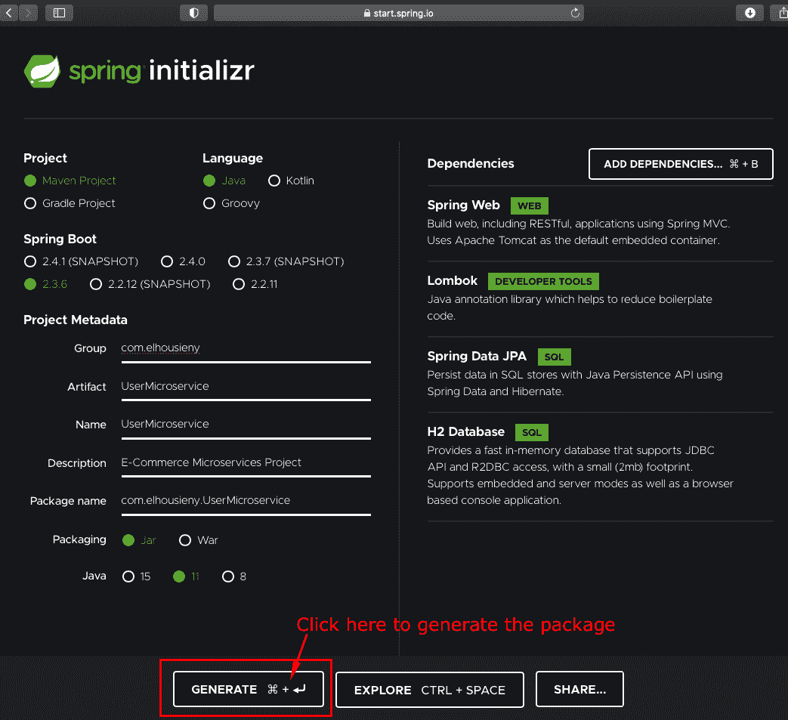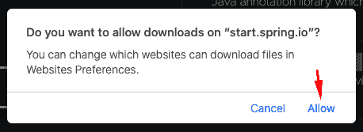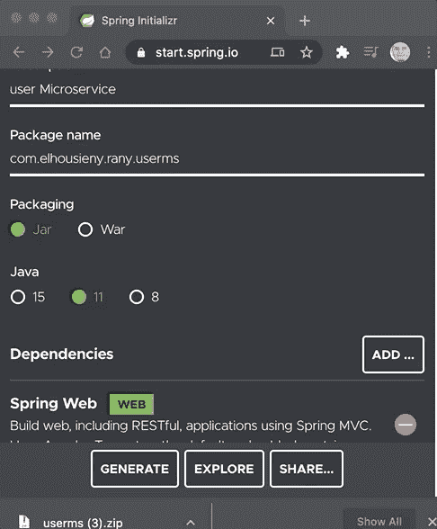

Zip 包将被下载到您的下载文件夹中。您可以将其移动到另一个文件夹或保留在那里。我建议把它移到另一个文件夹。双击 zip 文件来提取它。

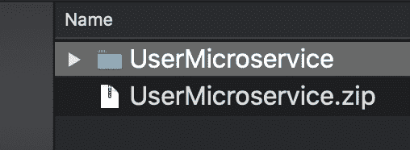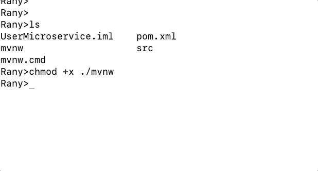

从您的终端，您可以转到您有软件包的文件夹，并运行以下命令。作为软件包的一部分，SprintBoot 将添加一个名为“mvnw”的文件，运行以下命令来安装我们为依赖项添加的所有库。

chmod +x ./mvnw

。/mvnw 全新安装-Dmven.test.skip=true

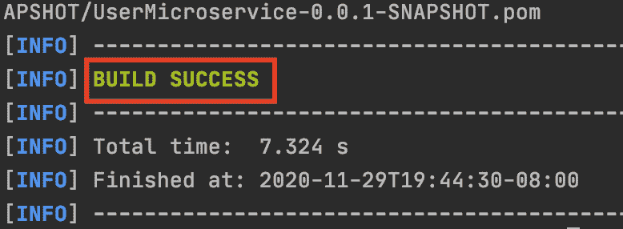

如果您使用的是 windows，只需运行

mvnw.cmd 全新安装-Dmven.test.skip=true

现在让我们创建一个快速 rest API 来测试我们的微服务

在 IntelliJ 中打开代码，将 SDK 更改为已安装的版本(这里是 11)

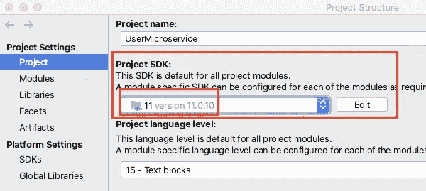

在 Spring Boot 提供的代码中，添加红框中的项目，我稍后会解释它们。这只是返回微服务的名称

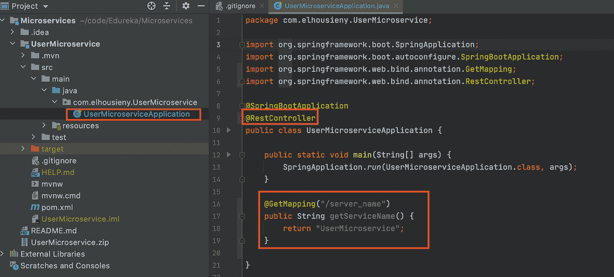

运行程序

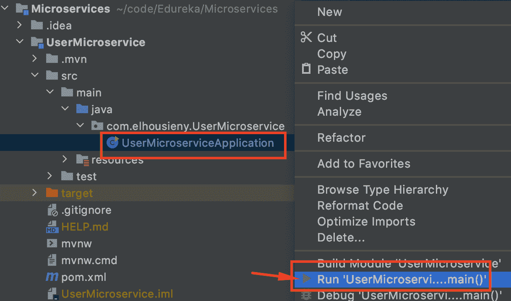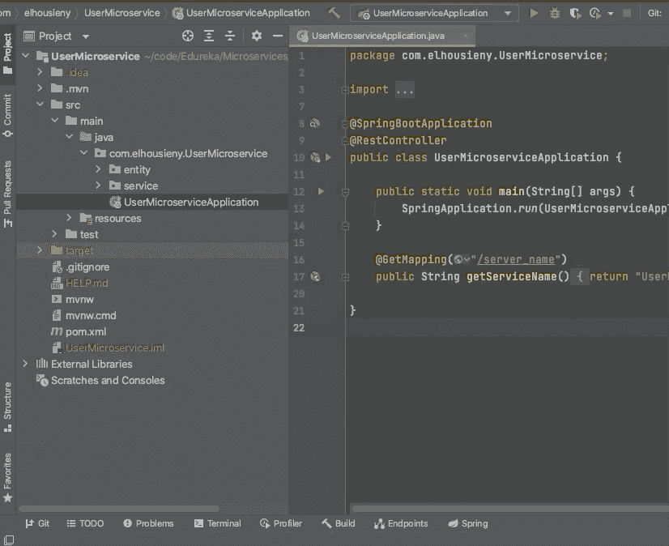

您将在终端上注意到，它将在端口 8080 上启动 TomCat(我将在后面解释这一切)

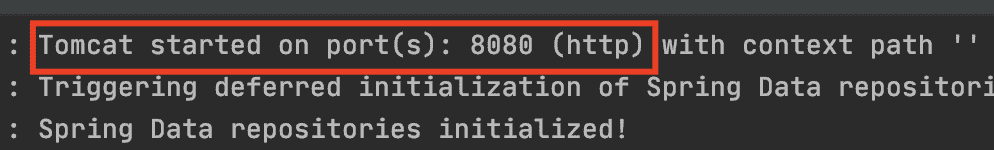

现在，您可以从位于[http://localhost:8080/server _ name](http://localhost:8080/server_name)的浏览器访问 API

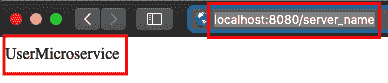

现在，让我们添加一个用户实体:

首先，我们用默认的 getters 创建一个简单的类

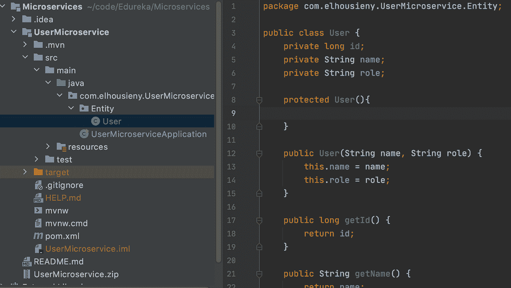

现在我们给它添加@Entity 注释(https://spring.io/projects/spring-data-jpa)

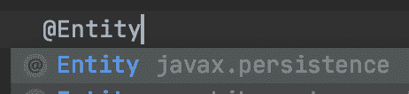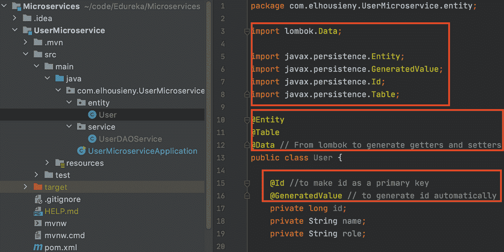

更多关于龙目岛【https://projectlombok.org/features/Data 的信息

这就是你如何在几秒钟内创建一个简单的微服务。在下一个会话中，我将创建另一个微服务，添加一些数据，并开始两个微服务之间的通信

谢谢

兰尼·埃尔豪斯尼

【https://www.linkedin.com/in/ranyelhousieny 

 [## 兰尼·埃尔豪斯尼简历

### Rany ElHousieny Zulily 与一个了不起的团队合作，使用 MongoDB、Elastic Search、AWS、React……

rany.tk](https://rany.tk)