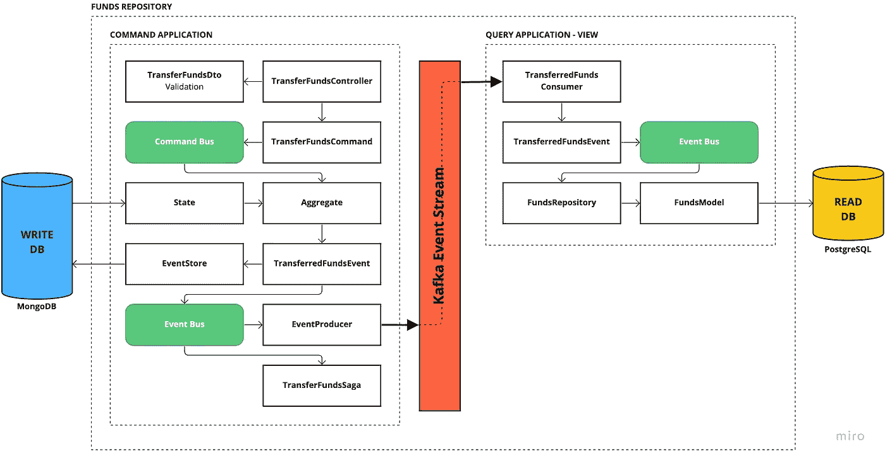
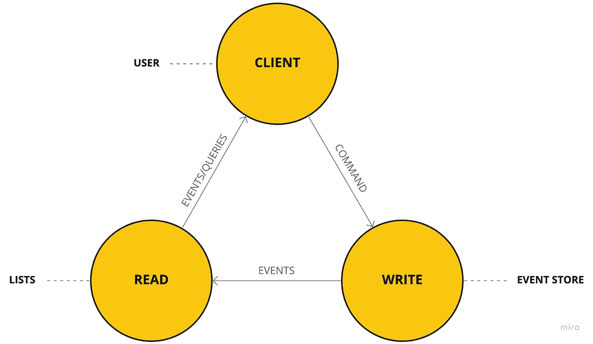
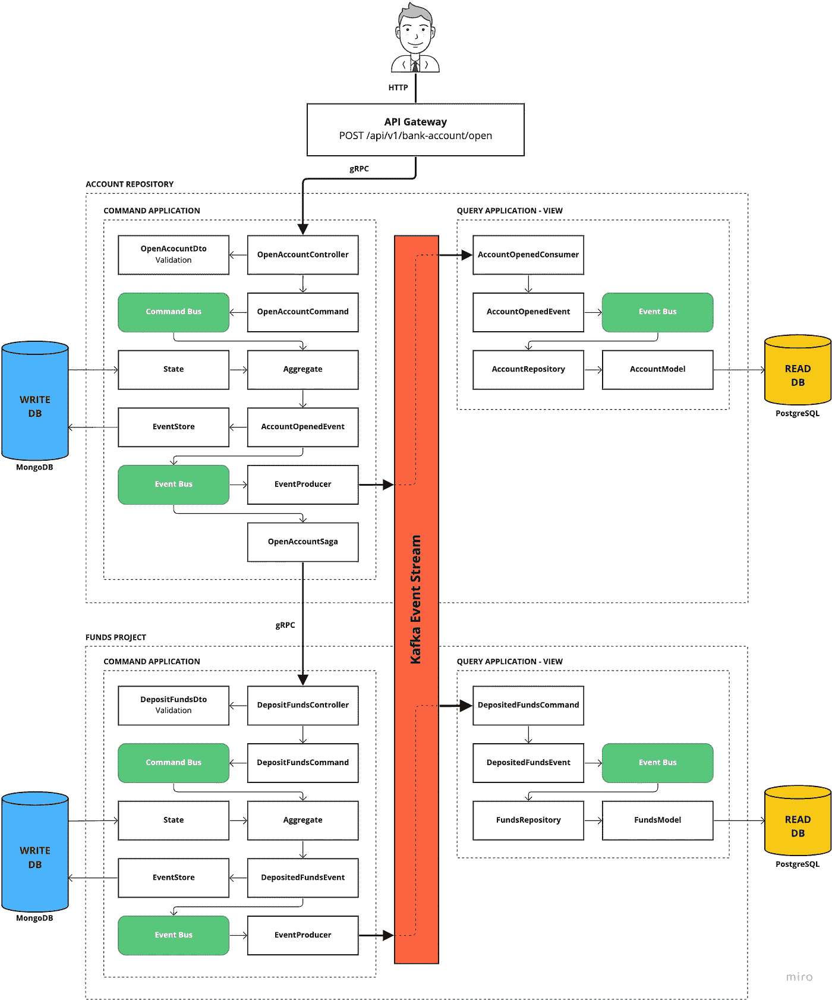

# CQRS 微服务和 NestJS 类型脚本中的事件源

> 原文：<https://levelup.gitconnected.com/microservices-with-cqrs-in-typescript-and-nestjs-5a8af0a56c3a>

## 基于领域驱动设计、CQRS 和事件源的简单银行 API

最近，我发表了三篇文章，分别关于领域驱动设计(DDD)、CQRS 和事件源。在每篇文章中，我都清楚地表明，虽然这些概念和架构是独立的，但它们**完美地互补**，尤其是在微服务和 API 的**环境中。**

然而，今天我想更深入地探讨一下这种互动。我**为此创建了一个简单的开源应用**，主要是用 TypeScript 编写的。

我写了一个由两个微服务和一个 API 网关组成的银行账户 API。我用 TypeScript 和 NestJS 实现了微服务。但是，我在 Go 中编写 API Gateway 只是为了好玩。

在这个项目中，我无缝地结合了 DDD、CQRS 和活动采购。由于 NestJS 没有官方的事件源模块，我自己写了一个，并在 NPM 上提供了。最好别用。没有经过实地测试。

# 技术特性表

*   领域驱动设计、CQRS 和事件源相结合
*   2 个 NestJS 微服务作为 Monorepo，在命令和查询之间拆分
*   Go 中的 API 网关(HTTP 到 gRPC)
*   为 NestJS 生态系统中的事件采购创建了一个 NPM 包
*   使用 Kafka 作为异步事件流
*   使用 gRPC 作为同步传输协议
*   每个服务模式的数据库
*   由于最终的一致性，确保幂等性
*   使用 MongoDB 作为写数据库的 NoSQL 方法(事件源)
*   以 PostgreSQL 为读数据库的 SQL 方法
*   将原型文件存储在共享存储库中
*   除了申请之外，一切都有记录
*   传说的简化用法

在我们开始真正的文章之前:我建议你先阅读前面提到的文章，因为我不会在本文中再次详述每个概念。

*   [深入领域驱动设计](/domain-driven-design-in-software-development-f92c3f58d012)
*   [CQRS 解释](/what-is-cqrs-8ddd74ca05bb)
*   [什么是(为什么)事件采购](/basics-of-event-sourcing-12ebe0b86788)

此外，在我们讨论应用程序本身之前，让我们快速地**更新一下**关于 DDD、CQRS 和事件源的知识。

# CQRS DDD 和理论上的事件采购

众所周知，CQRS 的一切都是从一个**命令**开始的。命令是在系统中带来变化的**意图**。这非常符合 DDD 中的术语“命令”。DDD 的一个司令部也差不多有同样的意图要做出改变。DDD 的一个命令是一个聚合的**触发器，最终目标是改变。**

在 CQRS 和 DDD 之间的交互中，CQRS 集成了所谓的**队列**(在本例中，是命令队列或命令总线)，因此我们创建了一个**命令，**将它传输到**命令队列**，从而产生了一个**集合**。

为了处理这个命令，这个集合需要一个内部**状态**。所以你需要事物的当前状态，大部分来自数据库。但这正是**事件采购**发挥作用的地方。因为有了事件源，这种状态可以用过去的**数据恢复。**

出于**可追溯性和一致性**的原因，事件源非常适合银行账户 API，例如，能够随时跟踪银行账户的余额，因为有了事件源，您可以在所谓的事件存储中保存每个更改。有了事件源，可以说，你可以在任何时候**回到过去**。

然后**命令导致新的域事件**生成，然后这些域事件被添加到**事件存储器**中，从而成为这种类型的后续命令的内部状态的一部分。所以你可以想象一个循环。

这个集合也可以看作是几个任务的一种容器，也可以将域事件转发给事件 API，这样这些域事件也可以用其他方式处理。考虑向客户端推送通知，以通知客户端命令的结果或其他进一步的处理，例如，通过内部应用程序基础架构的其他微服务。没有限制，并且它因应用而异。

然而，结合 CQRS 和事件源，聚集的另一个基本任务是将结果存储在查看/读取数据库中或启动该过程。该结果或该数据库随后通过查询被访问。

视图无非是预先计算好的视图或者**计算出来的数据**。每次领域事件发生时，也就是说，如果业务逻辑中发生了技术事件，它通常会影响一个或另一个视图，从而影响 CQRS 的部分查询。

换句话说，当命令发生时，产生的域事件存储在写数据库中，但是该事件的结果最终在查看/读取数据库中更新。

然后，这个更新过程遵循我们熟悉的 **CRUD 逻辑**，即，在发生特定事件时，会有需要添加新条目的视图，会有需要删除条目的视图，会有需要更新条目的视图。然而，如前所述，这仅发生在 CQRS 的查询部分，在该部分标准中不使用事件源。

举个简单的例子，如果用户发送一个*“TransferFundsCommand”*将资金转移到另一个账户，它将变成一个*“FundsTransferredEvent”*，并且该事件将被存储在事件存储中。这个事件现在也被传递到查看/读取数据库，在那里这个事件被相应地解释。

视图中初始化的银行账户余额减少。与此同时，另一个银行账户必须接收这笔钱，因此必须触发另一个命令。通常还会触发其他日志。

由此创建了以下任务的**映射**，这些任务被逐渐解释和处理。当然，查看/读取端的这个**业务逻辑**因应用程序而异。这在 CQRS 有一些组成部分，这些被称为投影。

此时，必须决定哪个域事件与哪个视图相关。然而，这里应该注意的是，视图是**而不是唯一的真实来源**，即事件存储，因为命令的当前状态可以在任何时候**在那里再现**。

这是必要的，您必须注意的是，这种投影自然会将写入事件存储区与写入视图存储区的操作分离开来，之后将从视图存储区中读取数据。

这意味着这些写入过程会稍有延迟，从技术角度来看，写入和读取之间的数据不会立即保持一致。这被称为**最终一致性**。因此建立了一致性，但仅**稍微延迟了**。这一开始听起来可能很奇怪，但是在 99%的用例中这都不是问题。

在标准中，事件源不发生在 CQRS 查询部分，这就是为什么这种交互主要指的是命令部分。

# 项目描述

正如我提到的，它是分布式应用程序上的一个小型银行帐户 API。这个想法就是开立和关闭一个银行账户，存入、提取和转移资金。因此，应用程序的想法再简单不过了。

然而，这个项目背后的方法、概念和实现是焦点。我选择了领域驱动设计、CQRS 和事件源的结合。这三个不同又独立的概念结合起来很棒。

DDD 和 CQRS 在使用微服务时并不罕见，尤其是在 Java 领域。如果您想获得数据的历史记录，那么事件源是有意义的，因为在事件源中，您保存了每个请求及其结果。

想想 Github 或者你的银行账户。在那里你有每一个变化的历史。这个概念有助于保证一致性，尤其是对于与金钱相关的应用程序。

对于这样一个简单而小的应用程序来说，这种方法势不可挡。然而，创建这个应用程序是为了演示在 TypeScript 和 NestJS 中可能实现的功能。

# 开立银行账户流程图

该流程图说明了开立银行账户的 POST 请求。你会在流程图下面找到详细的解释。

> *过账*/API/v1/银行账户/打开

开户流程图

首先，API 网关将获取 HTTP 请求，并将该请求作为 gRPC 协议转发给帐户微服务。每个微服务被拆分成一个**命令**和一个**查询**应用。由于我们将发出一个**写请求**，这个请求将到达命令应用程序。

在那里，*openaccountdo***验证**传入的请求。命令 *OpenAccountCommand* 将由**命令总线**创建和处理。执行的命令将创建聚合，它可以被视为一个事件容器。很多事情都可能发生。例如，我们可以重放这个集合以前的事件。

然而，这不是必须的，因为一个账户只能开一次。相反，我们只创建一个 *AccountOpenedEvent* 并将该事件及其事件数据保存在 **MongoDB** 数据库中。

然后，我们**生成一条保存**事件数据**的消息**，并通过 **Kafka** 事件流将这条消息发送到**查询应用程序**，在那里**消费者**监听来电。

我们**向**事件总线**发布**我们从**命令应用**接收到的事件*opened account*。该事件随后将在其执行过程中在 **PostgreSQL** 数据库中创建一个**新条目**。最终的一致性被存档，因为写和读数据库在这一级是同步的。

同时， *OpenAccountSaga* 向第二微服务 *bank-funds-svc* 发送 gRPC 请求，以**存放**初始期初余额。同样，这是一个写请求，因此 *bank-funds-svc* 的**命令应用程序**将获取这个请求。

从这里开始，过程与最初的请求非常相似。命令将被创建和执行，聚集调用事件，创建读写数据库的条目，等等。

# 代码片段

为了更好地理解变通办法，我想与您分享一些代码片段。不要忘记这个项目是开源的。您可以在下面找到存储库。

## 控制器

[命令]从 API 网关接收 gRPC 请求。由于收到此请求，同时请求主体将由 DTO 进行验证。将创建一个命令并执行到命令总线。

## 命令处理程序

[命令]命令处理器将从命令总线接收刚刚创建的命令。将创建一个聚合。在这个聚合中，我们创建事件，并在最终提交聚合之前将该事件保存在事件存储中。

## 事件处理程序

[command]事件处理程序将捕获事件并将其生成到 Kafka 事件流。因此查询应用程序上等待的消费者可以接管这个事件。

## 消费者

[查询]消费者将通过 Kafka 异步接收该事件，并将该事件转发到事件总线。

## 事件处理程序

[query]事件处理程序(这次是在查询应用程序上)将从事件总线中提取事件，并最终使用 TypeORM 将其保存到读取的数据库中。最终一致性已存档。

# 仓库

*   [银行账户微服务](https://github.com/hellokvn/bank-account-svc)
*   [银行资金微服务](https://github.com/hellokvn/bank-funds-svc)
*   [API 网关](https://github.com/hellokvn/bank-api-gateway)
*   [事件源模块](https://github.com/hellokvn/nestjs-event-sourcing)
*   [原型文件的共享存储库](https://github.com/hellokvn/bank-shared-proto)

感谢您阅读我用 TypeScript 和 Go 编写的关于我的开源项目的文章。我希望你能带走一些东西。请留下一些反馈，并关注我。

干杯！

# 接下来阅读

 [## 为什么我从打字稿转向 Go

### 以及为什么我不会放弃使用 TypeScript

levelup.gitconnected.com](/why-did-i-move-from-typescript-to-go-1d9f92ef882a)  [## 如何领导技术团队的 5 个技巧

### 从软件开发人员的角度来看

javascript.plainenglish.io](https://javascript.plainenglish.io/5-tips-on-how-to-lead-a-tech-team-dffa080c0183)  [## 立即记录您的技术决策

### 如何记录您的技术团队决策

blog.bitsrc.io](https://blog.bitsrc.io/document-your-tech-decisions-now-76cd781707fe)