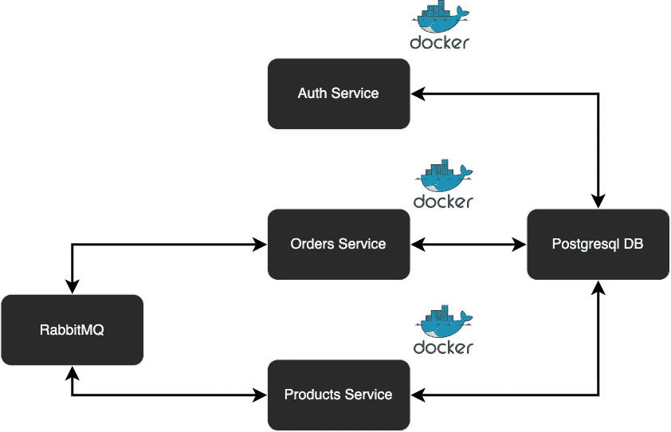

# Node.js、Kubernetes 和 RabbitMQ 的微服务

> 原文：<https://levelup.gitconnected.com/microservices-with-node-js-kubernetes-and-rabbitmq-c52091464c5d>

# 介绍

微服务是一个独立的单元，它与许多其他单元一起构成了一个大型应用程序。通过将你的应用分成小单元，它的每一部分都可以独立部署和扩展，可以由不同的团队用不同的编程语言编写，并且可以单独测试。

微服务架构意味着您的应用程序由许多较小的独立应用程序组成，这些应用程序能够在自己的内存空间中运行，并且可以在潜在的许多单独的机器上相互独立地扩展。

# Kubernetes 概述

kubernetes(“K8s”)是一个用于自动化和管理容器编排的开源系统，它源于谷歌的 Borg，现在由 T2 云计算基金会维护。

凭借专注于开发人员和 DevOps 工程师的流畅用户体验，以及一套令人印象深刻的编排功能，包括自动推出和回滚、服务发现、负载平衡以及秘密和配置管理，Kubernetes 在短时间内获得了大量支持。与所有主要云提供商的集成使 Kubernetes 可移植到一系列基础设施。

# 库伯内特建筑

Kubernetes 基于主节点的架构有助于实现快速的水平扩展。网络功能有助于促进 Kubernetes 各种元素之间的快速通信。

以下是 Kubernetes 架构的核心组件:

*   **Pod:** 由 Kubernetes 创建和管理的最小可部署单元，Pod 是一组一个或多个容器。Pod 中的容器共享一个 IP 地址，可以通过本地主机相互访问，并共享对卷的访问。
*   **节点:**Kubernetes 中的一个工作机。可能是虚拟机或物理机，并附带运行 *Pods* 所需的服务。
*   **服务:**一个抽象，它定义了一组逻辑 pod 和访问它们的策略。为 Pod 副本分配固定的 IP 地址，允许其他 Pod 或服务与其通信。
*   **ReplicaSet:** 确保指定数量的 Pod 副本在任何给定时间运行。K8s 建议使用部署而不是直接操作 ReplicaSet 对象，除非您需要自定义更新编排或者根本不需要更新。
*   **部署:**为 pod 和副本集提供声明性更新的控制器。
*   **命名空间:**由同一个物理集群支持的虚拟集群。在多个用户之间划分集群资源的方法，以及将授权和策略附加到给定集群的子部分的机制。

# 应用架构



该应用程序是一个迷你电子商务后端，能够购买和创建产品。可以一次购买多种产品，并生成相应的订单。

该应用程序将由三个独立的服务组成:验证用户的 Auth 服务，创建和购买产品的 Products 服务，以及用户可以通过其访问订单的 Order 服务。

# 开始

products/index.js 将由两条路径组成，一条从数据库获取所有产品，另一条购买产品。后者将触发 order 微服务创建一个新的 order 对象，并将其保存到数据库中，同时通过响应将其发送给客户端。

```
const express = require('express');
require('express-async-errors');
const sequelize = require('./database');
const isAuthenticated = require('./isAuthenticated');
const Product = require('./product.model');
const amqp = require('amqplib');
const Sequelize = require('sequelize');

let channel;

async function connect() {
  const amqpServer = process.env.RABBITMQ_URL;
  const connection = await amqp.connect(amqpServer);
  channel = await connection.createChannel();
  await channel.assertQueue('PRODUCT');
}

connect().catch(error => {
  console.error('Unable to connect to the Rabbit MQ:', error);
  process.exit(1);
});

const app = express();

app.use(express.json());

const port = +process.env.PORT ?? 3002;

app.listen(port, () => {
  console.log(`Products Service at ${port}`);
});

app.get('/products', async (req, res) => {
  const results = await Product.findAll();

  res.status(200).json(results);
});

app.post('/products', isAuthenticated, async (req, res) => {
  const { name, price, description, imageURL } = req.body;

  const product = await Product.create({
    name,
    price,
    description,
    imageURL,
    creator: req.user.email,
  });

  res.status(200).json(product);
});

app.post('/products/buy', isAuthenticated, async (req, res) => {
  const { ids } = req.body;
  const products = await Product.findAll({
    where: {
      id: {
        [Sequelize.Op.in]: ids,
      },
    },
  });
  let order;

  channel.sendToQueue(
    'ORDER',
    Buffer.from(
      JSON.stringify({
        products,
        userEmail: req.user.email,
      })
    )
  );
  await channel.consume('PRODUCT', data => {
    order = JSON.parse(data.content);
  });
  res.json(order);
});

sequelize.sync();
```

orders/index.js 将侦听“order”消息，一旦收到该消息，它将获取买方提供的电子邮件 ID 和所有产品 ID，并使用该数据生成一个 ORDER 对象。然后，订单服务将通过 RabbitMQ 将这些数据发送回产品服务。

```
const express = require('express');
require('express-async-errors');
const sequelize = require('./database');
const isAuthenticated = require('./isAuthenticated');
const Order = require('./order.model.js');
const amqp = require('amqplib');

let channel;

async function createOrder(products, userEmail) {
  let total = 0;
  for (let t = 0; t < products.length; ++t) {
    total += +products[t].price;
  }

  products = products.map(product => {
    return product.id;
  });

  const newOrder = await Order.create({
    products,
    creator: userEmail,
    totalPrice: total,
  });

  return newOrder;
}

async function connect() {
  const amqpServer = process.env.RABBITMQ_URL;
  const connection = await amqp.connect(amqpServer);
  channel = await connection.createChannel();
  await channel.assertQueue('ORDER');
}

connect()
  .then(() => {
    channel.consume('ORDER', data => {
      console.log('Consuming ORDER service');
      const { products, userEmail } = JSON.parse(data.content);
      createOrder(products, userEmail)
        .then(newOrder => {
          channel.ack(data);
          channel.sendToQueue(
            'PRODUCT',
            Buffer.from(JSON.stringify({ newOrder }))
          );
        })
        .catch(err => {
          console.log(err);
        });
    });
  })
  .catch(error => {
    console.error('Unable to connect to the Rabbit MQ:', error);
    process.exit(1);
  });

const app = express();

app.use(express.json());

const port = +process.env.PORT ?? 3003;

app.listen(port, () => {
  console.log(`Orders Service at ${port}`);
});

app.get('/orders', async (req, res) => {
  const results = await Order.findAll();

  res.status(200).json(results);
});

sequelize.sync();
```

如您所见，这些服务是完全相互独立的。微服务架构可能是一个有用的工具，但是，在较小的项目中，这种架构的应用可能会引入某些复杂性，如代码重复和不必要的复杂性。因此，这种架构经常被推荐给大型项目，在这些项目中有一个庞大的工程师团队在工作。您可以在下面查看上述代码的完整存储库。

[](https://github.com/ArjanAswal/nodejs-kubernetes-microservices) [## GitHub-ArjanAswal/nodejs-kubernetes-micro services:Sample node . js 项目展示了如何创建…

### 示例 Node.js 项目展示了如何使用 Kubernetes 的微服务架构创建节点应用程序。- GitHub …

github.com](https://github.com/ArjanAswal/nodejs-kubernetes-microservices) 

感谢您成为我们社区的一员！在你离开之前:

*   👏为故事鼓掌，跟着作者走👉
*   📰更多内容请查看[升级编码刊物](https://levelup.gitconnected.com/?utm_source=pub&utm_medium=post)
*   🔔关注我们:[推特](https://twitter.com/gitconnected) | [LinkedIn](https://www.linkedin.com/company/gitconnected) | [时事通讯](https://newsletter.levelup.dev)

🚀👉 [**加入升级人才集体，找到一份神奇的工作**](https://jobs.levelup.dev/talent/welcome?referral=true)