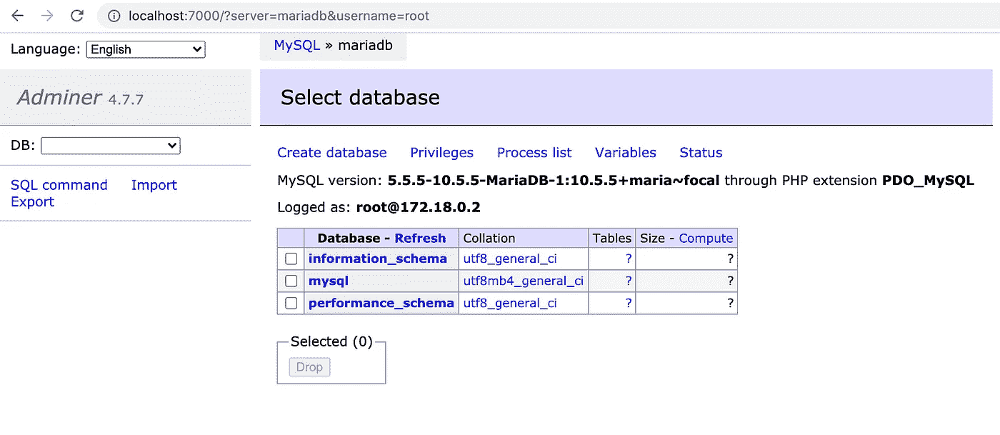
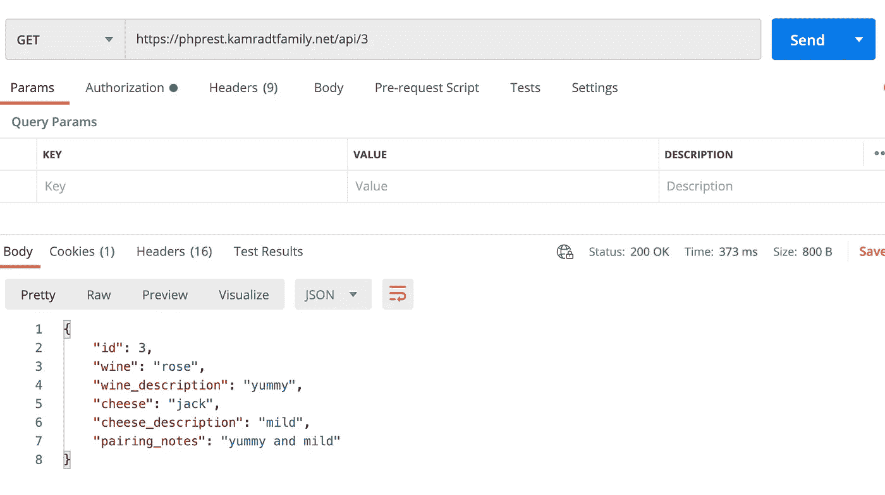

# 使用 PHP 和 Lumen 的微服务

> 原文：<https://levelup.gitconnected.com/microservices-with-php-and-lumen-d9af0b915a71>

## 与 PHP 的过去决裂，而不破坏现有的应用程序


在 [Unsplash](https://unsplash.com/s/photos/laptop?utm_source=unsplash&utm_medium=referral&utm_content=creditCopyText) 上由[米米·蒂安](https://unsplash.com/@mimithian?utm_source=unsplash&utm_medium=referral&utm_content=creditCopyText)拍摄的照片

PHP 是由拉斯马斯·勒德尔夫在 1994 年开发的，作为一种混合在服务器上执行的代码和标准 HTML 的简单方法。它在服务器上被翻译成纯 HTML，并作为对 HTTP 请求的响应发送出去。它在早期网络中被广泛采用，是脸书的原始语言。随着时间的推移，开发了许多框架来形式化模型视图控制器(MVC)系统，以允许表达现代 web 应用程序的更可控的方式。

我以前的系列文章，从[现代 PHP](/modern-php-df3d3bf343f8) 开始，在 Symfony 框架中使用了这种方法。我能够在相对较短的时间内运行一个不错的 web 应用程序，甚至将其部署到 web 上。但是这种方法并不是没有缺点。最大的问题是其他应用程序无法以受控的方式使用这些数据。

在本文中，我将把我创建的应用程序的一些后端部分用 PHP 重写为一个微服务。这将使其与前端完全分离，并允许其他实体(比如移动设备)使用相同的数据。我并不是说 PHP 是编写微服务的最佳语言(我不会去争论什么是微服务)。我用 PHP 写这篇文章是因为很多开发人员在 PHP 上投入了很多知识，这可能会帮助他们从 MVC 的世界过渡到微服务的世界。

由于本文将建立在我在文章 [Modern PHP](/modern-php-df3d3bf343f8) 和后续两篇文章(所有链接都在文章末尾)中所做的工作之上，所以您应该回去通读并理解它们。他们将设置部署框架、数据库，并创建我们将在这里使用的数据库对象。因为许多服务可能使用同一个数据库，所以必须将数据库初始化从服务中分离出来。在本文结束时，您将拥有一个部署到 Google 云平台(或任何具有基本虚拟机的云平台)的部分 REST API

那么什么是微服务，为什么你会想使用它们呢？顾名思义，它们是最小的、集中的服务，只处理一小部分后端逻辑。为什么要将服务分解到这个层次？这是我们使用数据的本质；我们倾向于读取现有数据，而不是写入新数据。因此，我们可能希望增加十几个读服务，而只有几个写服务。我们可能还想在写入服务之前添加一个消息队列缓冲区来处理峰值负载。

另一个原因是脱钩。我们可能需要一个读取服务来获取一些存在于不同数据库中的数据。我们可以调用另一个读取服务来处理数据，而不是在一个读取服务中添加多个数据库。这也将保留数据如何存储在一个被调用的单一读取服务中的细节，而不是直接的数据库访问，并允许可能的流行数据的缓存。

我们将使用 [Lumen](https://lumen.laravel.com/) ，它是 Laravel 框架的一个子集。Lumen 使用 Compose 作为依赖管理器。如果你还没有安装 Compose，再次回到我的文章 [Modern PHP](/modern-php-df3d3bf343f8) ，它会帮助你安装你需要的东西。完成创作后，您可以开始一个新项目:

```
composer create-project --prefer-dist laravel/lumen phprest
```

您可以使用测试服务器启动它:

```
php -S localhost:8000 -t public
```

浏览到 [http://localhost:8000](http://localhost:8000) ，您应该可以在浏览器中看到 Lumen 版本。

该服务处理的所有路由都将在 routes/web.php 中定义。目前它有一个用于打印版本的`/`的路由。我们的微服务只是读取一个已经存在的数据库。将有两个端点，`/api`和`/api/{id}`。我们不会在服务级别将对象名称添加到路径中，这可以由反向代理来完成。编辑`routes/web.php`并添加两条路线(替换现有路线)

```
$router->get('/api', function () {
    return 'Get All';
});$router->get('/api/{id}', function ($id) {
  return 'Get '.$id;
});
```

启动和停止服务器，您应该能够浏览到[http://localhost:8000/API/](http://localhost:8000/)和[http://localhost:8000/API/1](http://localhost:8000/1)，并在浏览器中看到“Get All”和“Get 1”。

我将在这里评论一下，看看项目树，它看起来不像是所有的流明都是轻量级的。在很多目录中有很多文件，我希望我们不会有很多未使用的功能。所有这些额外的代码让我紧张，它增加了本该如此简单的东西的攻击面吗？也许有另一个更紧凑的框架，但我将把它留到以后再说。

让我们将数据库添加到组合中。我们将使用[雄辩的 ORM](https://laravel.com/docs/5.0/eloquent) 处理数据库。在`bootstrap/app.php`中，您可以在创建了`$app`对象之后取消 Facades 和雄辩行的注释

```
$app = new Laravel\Lumen\Application(
    dirname(__DIR__)
);$app->withFacades();$app->withEloquent();
```

现在我们可以创建模型了。因为我们已经有了将要读取的数据库，所以我们知道模式。该数据库是葡萄酒和奶酪配对的数据库之一。编辑`app/Models/WinePairing.php`

```
<?phpnamespace App\Models;use Illuminate\Database\Eloquent\Model;class WinePairing extends Model
{    
   protected $table = 'wine_pairing';
   protected $fillable = [
        'id', 
        'wine', 
        'wine_description', 
        'cheese', 
        'cheese_description', 
        'pairing_notes'
   ]; protected $hidden = [];
}
```

如果不设置`$table`变量，它将使用类名的复数。因为在这个服务中，我们将使用一个已经定义的数据库，我们需要专门定义它来匹配。此外，您可能会在同一个目录中删除`User.php`模型。我们绝对不想在我们的数据库中存储用户和密码。如果我们决定添加身份验证，我们将使用无状态身份验证方法。

现在我们可以在文件`app/Http/Controllers/WinePairingController.php`中创建控制器:

```
<?phpnamespace App\Http\Controllers;use App\Models\WinePairing;
use Illuminate\Http\Request;class WinePairingController extends Controller
{ public function showAllWinePairings()
  {
    return response()->json(WinePairing::all());
  } public function showOneWinePairing($id)
  {
    return response()->json(WinePairing::find($id));
  }}
```

最后，我们可以重写路线以使用控制器:

```
$router->group(['prefix' => 'api'], function () use ($router) {
  $router->get('/',  ['uses' =>
    'WinePairingController@showAllWinePairings']); $router->get('/{id}', ['uses' =>
    'WinePairingController@showOneWinePairing']);});
```

我们的服务端点是完整的。您可以再次启动它，但是您得到的只是错误消息，因为没有数据库。那么我们如何得到一个数据库呢？我们会用 Docker Compose 提出来。创建一个`docker-compose.yml`并添加这个:

```
version: '3.1'
services:
  mariadb:
    image: mariadb
    restart: always
    environment:
      MYSQL_ROOT_PASSWORD: example
    ports:
      - 3306:3306
  adminer:
    image: adminer
    restart: always
    ports:
      - 7000:8080
```

接下来，我们需要告诉应用程序。环境文件:

```
APP_NAME=WinePairing
APP_ENV=local
APP_KEY=
APP_DEBUG=true
APP_URL=[http://localhost](http://localhost)
APP_TIMEZONE=UTCLOG_CHANNEL=stack
LOG_SLACK_WEBHOOK_URL=DB_CONNECTION=mysql
DB_HOST=mariadb
DB_PORT=3306
DB_DATABASE=winelist
DB_USERNAME=root
DB_PASSWORD=exampleCACHE_DRIVER=file
QUEUE_CONNECTION=sync
```

密码只是用于测试，我们将在部署的应用程序中使用真实的密码。现在我们可以启动数据库了:

```
docker-compose up -d
```

如果您不使用-d，您可以看到所有的日志记录，但是您必须打开一个新的终端来运行其他命令。

数据库中还没有任何东西，但是`docker-compose.yml`包含了`adminer`应用程序，它将允许您设置数据库。要访问它，请浏览到 [http://localhost:7000/。](http://localhost:7000/.)当出现登录屏幕时，您可以使用服务器名`mariadb` (Docker Compose 使用自己的网络并将服务名设置为主机名)和用户名/密码 root/example。这应该会将您带到以下屏幕:



使用“SQL 命令”链接，执行以下代码:

```
CREATE DATABASE IF NOT EXISTS winelist;
USE winelist;
CREATE TABLE IF NOT EXISTS wine_pairing
  (id INT AUTO_INCREMENT NOT NULL,
   wine VARCHAR(255) NOT NULL,
   wine_description VARCHAR(255) NOT NULL,
   cheese VARCHAR(255) NOT NULL,
   cheese_description VARCHAR(255) NOT NULL,
   pairing_notes VARCHAR(255) NOT NULL,
   PRIMARY KEY(id))
   DEFAULT CHARACTER SET utf8mb4
   COLLATE `utf8mb4_unicode_ci`
   ENGINE = InnoDB;
```

现在，您的数据库应该有 wine_pairing 表，它与我们将在最终应用程序中读取的表完全相同。点击它，你可以使用“新项目”链接来添加一个项目。现在您可以启动应用程序，并且 [http://localhost:8000/](http://localhost:8000/) 和[http://localhost:8000/1](http://localhost:8000/1)将作为 JSON 显示您添加的新项目。如果是的话，那么恭喜你，你的 REST API 成功了！

现在，我们可以创建一个 Docker 映像，并将其部署在我们的原始应用程序旁边，作为读取其他服务、不同前端或移动设备可能使用的数据的一种方式。因为它只是一个 read 应用程序，没有个人数据，所以我们不用担心身份验证。任何人都可以阅读我们的葡萄酒搭配清单。

要创建 Docker 映像，我们需要确保它拥有所有的依赖项。我将从`phpapp`存储库中复制我之前使用的 Dockerfile 文件。这是:

## 部署到 GCP

本节再次假设您已经阅读了我在本系列中的前几篇文章，并且已经设置了 GCP 来托管主应用程序。基本上，我们用最小的 CPU 在 GCP 上创建了一个 VM，安装了 git 和 Docker Compose，并克隆了`phpappprod`库。我们还将必需的证书和配置文件复制到主目录中，该目录是`phpappprod`存储库的父目录，这样 Docker Compose 就可以从那里挂载所有必需的文件。要继续，您需要让该虚拟机运行并可以从 SSH 访问。

首先，我们必须构建和部署映像，以便它可以在生产中使用:

```
docker build -t <yourdockerhubname>/phprest .
docker push <yourdockerhubname>/phprest
```

这将创建一个可以在容器中运行的映像，并将其推送到 Docker Hub，以便您的云虚拟机可以使用它。但是数据库密码呢？我们不能在我们的云虚拟机中使用“example ”(尽管我们没有公开数据库，但为了安全起见)。我们要去。env 文件，并将其添加到虚拟机的安全目录中，特别是存储库目录的父目录。打开虚拟机的 SSH 终端，运行`vi phprest.env`并将`.env`文件的内容复制到其中。然后编辑数据库密码，使其与虚拟机上现有的`phpapp.env`文件中的密码相匹配。

接下来，让我们将新服务添加到现有的生产服务中，并添加一个反向代理路由。我有一个生产脚本的特定存储库，`phpappprod`，我将修改它们。这里是新的`docker-compose.yml`:

```
version: '3.1'
services:
  nginx:
    image: nginx
    restart: always
    volumes:
     - ./nginx.conf:/etc/nginx/nginx.conf
     - ..:/etc/certs
    ports:
     - "443:443"
  mariadb:
    image: mariadb
    restart: always
    volumes:
     - ./data:/var/lib/mysql
     - ./init:/docker-entrypoint-initdb.d
    env_file:
      - ../phpapp.env
    ports:
      - 3306:3306
  phpapp:
    image: rlkamradt/phpapp
    env_file:
      - ../phpapp.env
    ports:
      - 8000:8000
  phprest:
    image: rlkamradt/phprest
    env_file:
      - ../phprest.env
    ports:
      - 8001:8000
  vouch:
    image: voucher/vouch-proxy
    volumes:
      - ..:/config
    ports:
      - 9090:9090
```

我将在我的`nginx.conf`中添加一个新的虚拟主机:

```
server {
    listen 443 ssl;
    server_name phprest.yourdomain.com;
    ssl_certificate /etc/certs/yourdomain.com.pem;
    ssl_certificate_key /etc/certs/yourdomain.com.key;
    ssl_protocols TLSv1 TLSv1.1 TLSv1.2;
    ssl_ciphers HIGH:!aNULL:!MD5;
    location / {
        proxy_pass [http://phprest:8000](http://phprest:8000);
    }
}
```

这里假设您从[现代 PHP(第 2 部分)](/modern-php-part-2-4973f48a90c0)中创建了证书和密钥。注意，`proxy_pass`行使用容器端口 8000，而不是主机端口 8001。

现在确保您的主机`phprest.yourdomain.com`存在，并指向您的 VM 的 IP 地址，再次遵循现代 PHP(第 2 部分)的说明。

最后，提交并推送`phpappprod`存储库中的所有更改，以便它们对云 VM 可用。回到云虚拟机 SSH 终端，在`phpappprod`存储库克隆中，运行`git pull`将所有更改上传到虚拟机。然后运行`sudo docker-compose up -d`将启动一切，包括你的新微服务。你可以用 Postman 来测试它。



现在您有了一个微服务，它将从您的主应用程序返回所有数据。也许在我的下一篇文章中，我会创建一个使用这些数据的 Android 应用程序。

我真诚地希望这将帮助所有 PHP 开发人员了解微服务的方法和原因。您不必仅仅为了创建可能赋予您的应用程序新生命的新端点而干扰您现有的应用程序。最终，您可能希望替换您的应用程序，并使用 React 这样的现代前端，但是您可以一部分一部分地完成，而不是试图一次重写所有内容。感谢您的阅读！

本文中使用的存储库:

[](https://github.com/rkamradt/phprest/tree/v0.1) [## rkamradt/phprest

### Laravel Lumen 是一个速度惊人的 PHP 微框架，用于构建具有丰富、优雅语法的 web 应用程序…

github.com](https://github.com/rkamradt/phprest/tree/v0.1) [](https://github.com/rkamradt/phpappprod/tree/v0.3) [## rkamradt/PHP pprod

### 此时您不能执行该操作。您已使用另一个标签页或窗口登录。您已在另一个选项卡中注销，或者…

github.com](https://github.com/rkamradt/phpappprod/tree/v0.3) 

提到的其他文章:

[](/modern-php-df3d3bf343f8) [## 现代 PHP

### 使用 Upstart 上最需要的项目语言之一开始你的自由职业生涯。

levelup.gitconnected.com](/modern-php-df3d3bf343f8) [](/modern-php-part-2-4973f48a90c0) [## 现代 PHP(第 2 部分)

### 部署到 web

levelup.gitconnected.com](/modern-php-part-2-4973f48a90c0) [](/modern-php-part-3-1f5b78b3371d) [## 现代 PHP(第 3 部分)

### 所有 web 应用程序的单点登录。

levelup.gitconnected.com](/modern-php-part-3-1f5b78b3371d)