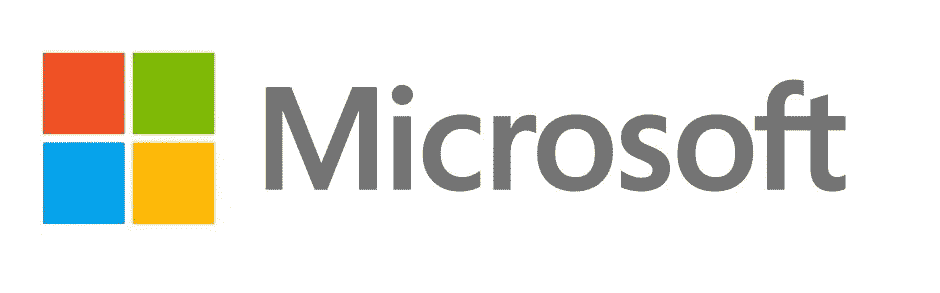
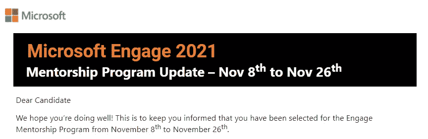
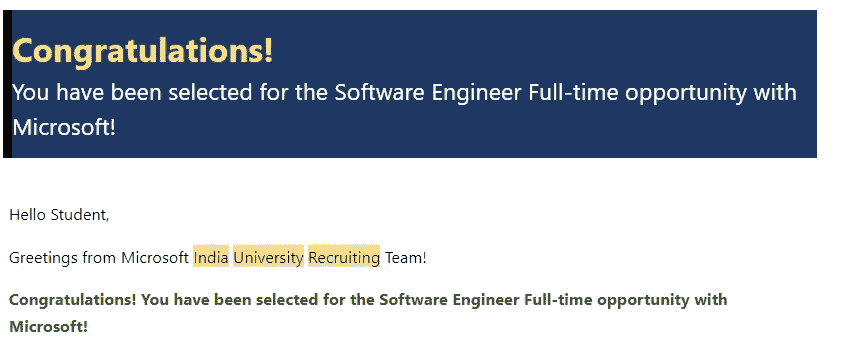

# 从微软 Engage 到微软全职软件工程师

> 原文：<https://levelup.gitconnected.com/microsoft-engage-to-full-time-software-engineer-at-microsoft-e906f02a6f85>



嘿大家好！今天，我将分享我从微软 Engage 导师计划到获得微软全职软件工程职位的旅程:)

## 我们开始吧

2021 年 10 月，一个晴朗的早晨，我收到了一封来自微软的直接邮件，其中提到我的个人资料已根据我的简历入围申请 2021 年微软参与导师计划。我被要求填写一份表格来分享我的接受并接收一个在线评估链接。

## 什么是微软参与导师计划？

Microsoft Engage 是一个为期 3 周的导师计划，面向印度各地的工程专业毕业班和预科班学生，通过微软软件工程师的指导来学习和提高技能。这是一个专门为技术爱好者策划的项目，旨在加速他们的成长，培养他们成功所需的行业相关技能。在导师制项目中的出色表现可能会为这位全职软件工程师带来一次面试机会以及在印度微软实习的机会。

很快，我收到了测试链接，并能够完全解决所有三个编码问题。这些问题难度很高，基于数组、树、图和动态编程。一个星期后，我终于被选为微软 Engage 2021 的学员。



## 导师计划

在此期间，我有机会与微软的不同领导和软件工程师互动。我还和微软的人一起参加了各种 AMA(问我任何问题)会议。在为期 3 周的指导期间，所有学员都需要在给定的问题陈述下完成一个项目，并且还会被指派一名微软软件工程师作为导师，在整个制作过程中提供帮助和指导。我们今年的主题是**建立一个平台的功能原型，为学生提供一系列数字学术和社交工具，以便在疫情**期间与他们的学习、同龄人和更广泛的大学社区保持联系，在这个[*网站*](https://microsoft.acehacker.com/fte2021/) 上找到这项任务的更多细节。

两周后，我收到了微软的一封邮件，提到考虑到我在导师项目中的出色表现，他们想把我的申请提前到面试阶段。

## 面试阶段

总共为我举行了三轮面试。面试主要关注你解决问题的能力。在每次面试中，我都会被问到两到三个基于数组、字符串、二分搜索法、堆栈、堆、树等主题的编码问题，以及一些基于计算机科学基础知识的问题、基本系统设计问题和基于行为情境的问题。总的来说，面试对我来说很顺利，特别是最后一次面试，我非常喜欢与我的面试官讨论与我在这个领域的兴趣和工作相关的技术。

## 要约

两天后，我终于收到了微软全职软件工程职位的遴选邮件🎉。得到这个机会，我真的无法表达我的感受。当我把结果告诉我的家人时，我高兴得热泪盈眶。我对❤️.的每一天和每一件事都感激不尽



感谢您的宝贵时间！欢迎在评论中提出你的疑问。请 ***拍拍*，*跟着*** ， ***分享*** 给你的朋友如果你觉得这很有帮助。

你也可以在 [**LinkedIn**](https://www.linkedin.com/in/taniya-gupta-675645180/) ❤️.上联系我

# 分级编码

```
Thanks for being a part of our community! More content in the [Level Up Coding publication](https://levelup.gitconnected.com/).
Follow: [Twitter](https://twitter.com/gitconnected), [LinkedIn](https://www.linkedin.com/company/gitconnected), [Newsletter](https://newsletter.levelup.dev/)
```

**升一级正在改造理工大招募➡️** [**加入我们的人才集体**](https://jobs.levelup.dev/talent/welcome?referral=true)