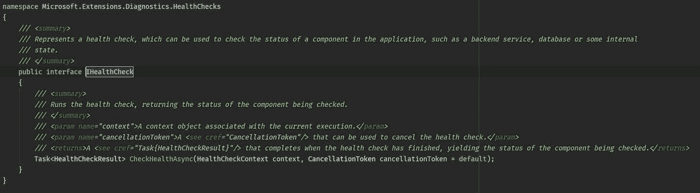
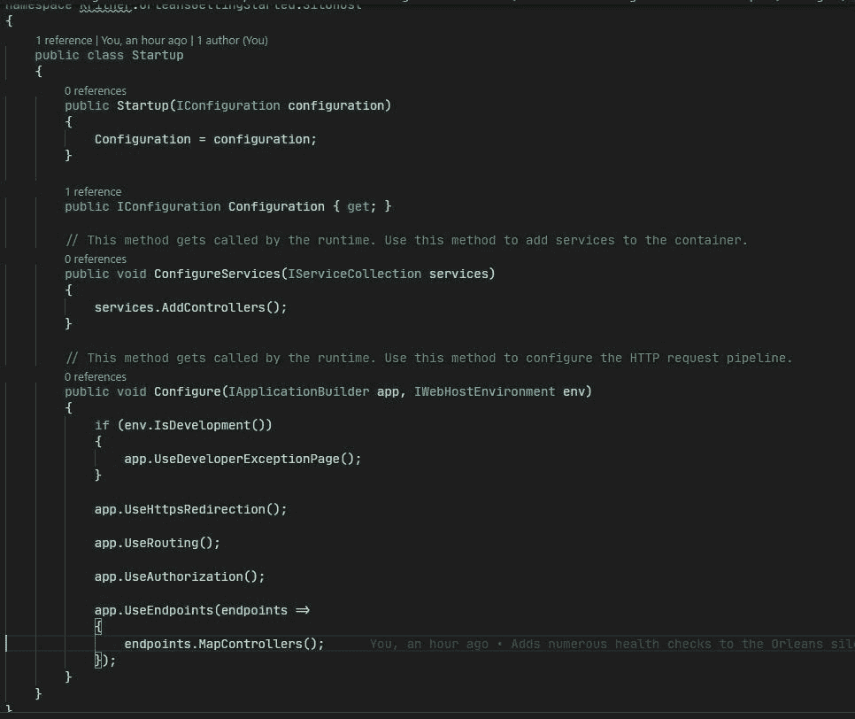
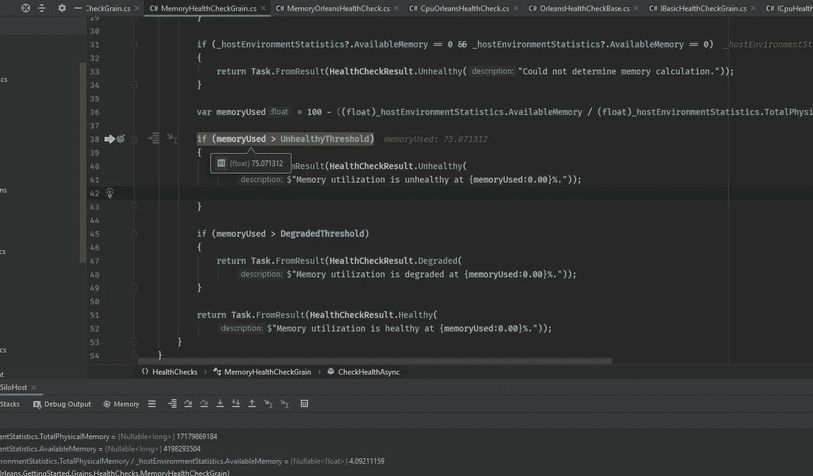
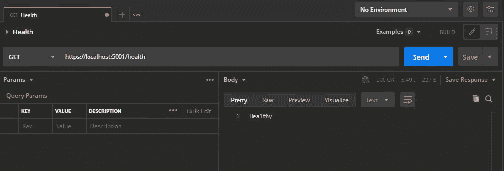

# 微软奥尔良—健康检查

> 原文：<https://levelup.gitconnected.com/microsoft-orleans-health-checks-b8a305096bc7>



健康检查界面

运行状况检查是查看系统在执行检查时运行情况的一种方式。让我们看看如何将它们应用到奥尔良！

[健康检查](https://docs.microsoft.com/en-us/aspnet/core/host-and-deploy/health-checks?view=aspnetcore-3.1)通常通过 HTTP 端点公开，当被击中时(通常在“/hc”或“/health”端点)，它们能够报告当前系统的“健康状况”。

健康检查，至少在。net land 由 enum [HealthStatus](https://docs.microsoft.com/en-us/dotnet/api/microsoft.extensions.diagnostics.healthchecks.healthstatus?view=dotnet-plat-ext-3.1) 组成，它指示健康、降级或不健康。健康检查本身是通过实现 [IHealthCheck](https://docs.microsoft.com/en-us/dotnet/api/microsoft.extensions.diagnostics.healthchecks.ihealthcheck?view=dotnet-plat-ext-3.1) 接口的具体化创建的。

任何系统都可以包含一个或多个健康检查，而“健康检查”的含义完全取决于您作为实施者。例如，您可以进行一次健康检查，即“检查”:

*   富（中国姓氏）
*   酒吧
*   巴兹

所有这些都包含在一个名为“muhSystem”(或其他名称)、*或*的“单一”健康检查中，您可以将上述三个“检查”作为各自的健康检查来实施；所以一张支票 vs 多张支票，都代表“同一件事”。为什么你会选择其中一个？好吧，走单一检查路线允许你检查`Foo`、`Bar`和`Baz` es 健康，而不会“泄露”任何关于正在检查的信息。如果您需要小心泄露系统内部工作的一些信息，这种检查可能会很有用。

在“三次单独检查”的场景中，如果您泄漏了一些关于您系统的信息，您可能并不在乎，您希望向您的用户(或者您的[看门狗](https://docs.microsoft.com/en-us/dotnet/architecture/microservices/implement-resilient-applications/monitor-app-health#use-watchdogs))提供更详细的信息。

我们将从我的 OrleansGettingStarted 存储库上的 [v0.58](https://github.com/Kritner-Blogs/OrleansGettingStarted/releases/tag/v0.58) 标签开始这篇文章的代码部分。

我没有写一篇关于在 v0.58 标签更新中执行的更改的博文，但是其中一个更改是让 silo 主机在下一个`UseOrleans`扩展方法下运行。在的较新版本中。net core 和 Orleans，您可以从同一个`IHostBuilder`托管多个“进程”。这允许我们托管一个小的 API，它将通过 http 请求服务于健康检查端点。

我们要做的第一件事是向我们的 host builder 添加一个默认的 web 主机——更改后，它将同时托管我们的 silo 主机和 api:

```
hostBuilder.ConfigureWebHostDefaults(builder => { builder.UseStartup<Startup>(); })
```

(请注意，还会有其他变化，我可能不会特别指出，但结束代码是这里的[和帖子底部的参考资料。)](https://github.com/Kritner-Blogs/OrleansGettingStarted/releases/tag/v0.60.1)

我们还将介绍一个`Startup`类:

```
public class Startup
{
    public Startup(IConfiguration configuration)
    {
        Configuration = configuration;
    }public IConfiguration Configuration { get; }// This method gets called by the runtime. Use this method to add services to the container.
    public void ConfigureServices(IServiceCollection services)
    {
        services.AddControllers();
    }// This method gets called by the runtime. Use this method to configure the HTTP request pipeline.
    public void Configure(IApplicationBuilder app, IWebHostEnvironment env)
    {
        if (env.IsDevelopment())
        {
            app.UseDeveloperExceptionPage();
        }app.UseHttpsRedirection();app.UseRouting();app.UseAuthorization();app.UseEndpoints(endpoints =>
        {
            endpoints.MapControllers();
        });
    }
}
```

当从模板创建一个新的 web API 项目时，上面的类应该或多或少是“default”`Startup`类。

## 基本健康检查

我们要做的第一次健康检查将是一次基本的检查——事实上这就是我们要给它取的名字。对于这个健康检查，我们将使用一个`IClusterClient`,并确保它可以获得一个颗粒的实例，并从该颗粒获得一个结果。如果可以从谷物中得到结果，健康检查应该返回“健康”，否则返回“不健康”。

一如既往，我们首先需要我们的奥尔良谷物界面:

```
public interface IBasicHealthCheckGrain : IHealthCheck, IGrainWithGuidKey
{    
}
```

上面很简单，我们正在创建一个实现了`IHealthCheck`和`IGrainWithGuidKey`的类。`IGrainWithGuidKey`应该从我的一些[其他奥尔良帖子](https://blog.kritner.com/categories/programming/microsoft-orleans/)中熟悉，并且`IHealthCheck`颗粒在这篇帖子的前面提到过，它是一个描述健康检查的界面。我们不会向这个接口添加任何没有通过`IHealthCheck`或`IGrainWithGuidKey`提供的东西。

我们的基本健康检查粒度实现如下所示:

```
[StatelessWorker(1)]
public class BasicHealthCheckGrain : Grain, IBasicHealthCheckGrain
{
    public Task<HealthCheckResult> CheckHealthAsync(HealthCheckContext context, CancellationToken cancellationToken = new CancellationToken())
    {
        return Task.FromResult(new HealthCheckResult(HealthStatus.Healthy));
    }
}
```

就是这样！只需返回一个健康的结果。如果我们实际的`IHealthCheck`实现无法获得这个粒度的实例，并且遇到了异常，异常处理程序将为我们返回“不健康”。

现在我们有了健康检查颗粒，我们将需要一个实际的`IHealthCheck`实现，它将利用我们新创建的“健康检查颗粒”。我知道我们将在这里创建几个健康检查，它们都做“很多相同的事情”，所以这似乎是引入抽象类`OrleansHealthCheckBase`的绝佳机会:

```
public abstract class OrleansHealthCheckBase : IHealthCheck
{
    protected readonly IClusterClient _client;protected OrleansHealthCheckBase(IClusterClient client)
    {
        _client = client;
    }

    /// <summary>
    /// Entry into health check, ensures the client is initialized, if it is not returns a healthy status.
    /// </summary>
    /// <param name="context">The health check context.</param>
    /// <param name="cancellationToken">The cancellation token.</param>
    /// <returns><see cref="Task"/> of <see cref="HealthCheckResult"/></returns>
    public virtual async Task<HealthCheckResult> CheckHealthAsync(HealthCheckContext context, CancellationToken cancellationToken = new CancellationToken())
    {
        if (!_client.IsInitialized)
        {
            return HealthCheckResult.Healthy($"{nameof(_client)} not yet initialized.");
        }return await CheckHealthGrainAsync(context, cancellationToken);
    }/// <summary>
    /// Perform the actual health check work within this implemented method.
    /// </summary>
    /// <param name="context">The health check context.</param>
    /// <param name="cancellationToken">The cancellation token.</param>
    /// <returns><see cref="Task"/> of <see cref="HealthCheckResult"/></returns>
    protected abstract Task<HealthCheckResult> CheckHealthGrainAsync(HealthCheckContext context, CancellationToken cancellationToken);
}
```

我们所有的运行状况检查都将依赖于到集群的连接，因此上面的内容将包含一个`IClusterClient`，并确保集群在进行要实现的实际检查之前被初始化。

正如我前面提到的，对于我们的“基本”健康检查，我们只是检查我们是否可以获得一个颗粒的实例，并返回一个值。这样的健康检查看起来像:

```
public class BasicOrleansHealthCheck :  OrleansHealthCheckBase
{
    public BasicOrleansHealthCheck(IClusterClient client) : base(client)
    {

    }

    protected override async Task<HealthCheckResult> CheckHealthGrainAsync(HealthCheckContext context, CancellationToken cancellationToken)
    {
        try
        {
            return await _client.GetGrain<IBasicHealthCheckGrain>(Guid.Empty)
                .CheckHealthAsync(context, cancellationToken);
        }
        catch (Exception e)
        {
            return HealthCheckResult.Unhealthy($"Health check failed.", e);
        }
    }
}
```

# 性能运行状况检查

既然基本的健康检查已经完成，我们可以实现一些更有意义的检查。以下健康检查需要注册`IHostEnvironmentStatistics`(你可以在这里找到关于[的更多信息)。](https://blog.kritner.com/2019/02/25/microsoft-orleans-dashboard-update-cpu-memory-stats/)

这些运行状况检查对于测量 Orleans 节点随时间推移的利用率特别有用，这将允许您对诸如“我是否应该为此集群增加或减少额外的节点？”之类的问题做出决策。当您通过健康检查端点公开了性能指标并使用了监视程序时，对这些问题的回答会简单得多，尤其是在 k8s 环境中运行 Orleans 集群时。

我将快速浏览这些内容，它们应该基本上是不言自明的，但是您可以查看我没有特别介绍的任何内容的完整代码。

## CPU 运行状况检查

```
public interface ICpuHealthCheckGrain : IHealthCheck, IGrainWithGuidKey
{

}[StatelessWorker(1)]
public class CpuHealthCheckGrain : Grain, ICpuHealthCheckGrain
{
    private const float UnhealthyThreshold = 90;
    private const float DegradedThreshold = 70;

    private readonly IHostEnvironmentStatistics _hostEnvironmentStatistics;public CpuHealthCheckGrain(IHostEnvironmentStatistics hostEnvironmentStatistics)
    {
        _hostEnvironmentStatistics = hostEnvironmentStatistics;
    }

    public Task<HealthCheckResult> CheckHealthAsync(HealthCheckContext context, CancellationToken cancellationToken = new CancellationToken())
    {
        if (_hostEnvironmentStatistics.CpuUsage > UnhealthyThreshold)
        {
            return Task.FromResult(HealthCheckResult.Unhealthy(
                $"CPU utilization is unhealthy at {_hostEnvironmentStatistics.CpuUsage}%."));

        }

        if (_hostEnvironmentStatistics.CpuUsage > DegradedThreshold)
        {
            return Task.FromResult(HealthCheckResult.Degraded(
                $"CPU utilization is degraded at {_hostEnvironmentStatistics.CpuUsage}%."));
        }

        return Task.FromResult(HealthCheckResult.Healthy(
            $"CPU utilization is healthy at {_hostEnvironmentStatistics.CpuUsage}%."));
    }
}
```

新的粒度接口，用于 CPU 健康检查的新粒度实现。如果超过 90%的 CPU，我们将返回不健康，如果超过 70%将返回降级，否则返回健康。

## 内存健康检查

同样的内存健康检查的基本思想，再次使用我们注册的`IHostEnvironmentStatistics`:

```
public interface IMemoryHealthCheckGrain : IHealthCheck, IGrainWithGuidKey
{

}[StatelessWorker(1)]
public class MemoryHealthCheckGrain : Grain, IMemoryHealthCheckGrain
{
    private const float UnhealthyThreshold = 95;
    private const float DegradedThreshold = 90;

    private readonly IHostEnvironmentStatistics _hostEnvironmentStatistics;public MemoryHealthCheckGrain(IHostEnvironmentStatistics hostEnvironmentStatistics)
    {
        _hostEnvironmentStatistics = hostEnvironmentStatistics;
    }

    public Task<HealthCheckResult> CheckHealthAsync(HealthCheckContext context, CancellationToken cancellationToken = new CancellationToken())
    {
        if (_hostEnvironmentStatistics?.AvailableMemory == null || _hostEnvironmentStatistics?.TotalPhysicalMemory == null)
        {
            return Task.FromResult(HealthCheckResult.Unhealthy("Could not determine memory calculation."));
        }

        if (_hostEnvironmentStatistics?.AvailableMemory == 0 && _hostEnvironmentStatistics?.AvailableMemory == 0)
        {
            return Task.FromResult(HealthCheckResult.Unhealthy("Could not determine memory calculation."));
        }

        var memoryUsed = 100 - ((float)_hostEnvironmentStatistics.AvailableMemory / (float)_hostEnvironmentStatistics.TotalPhysicalMemory * 100);

        if (memoryUsed > UnhealthyThreshold)
        {
            return Task.FromResult(HealthCheckResult.Unhealthy(
                $"Memory utilization is unhealthy at {memoryUsed:0.00}%."));

        }

        if (memoryUsed > DegradedThreshold)
        {
            return Task.FromResult(HealthCheckResult.Degraded(
                $"Memory utilization is degraded at {memoryUsed:0.00}%."));
        }

        return Task.FromResult(HealthCheckResult.Healthy(
            $"Memory utilization is healthy at {memoryUsed:0.00}%."));
    }
}
```

在这种情况下，我走了一条稍微不同的路线，如果无法确定内存信息，则返回“不健康”,这可能应该在此和 CPU 健康检查之间一致完成，但我想展示作为实施者的*您*如何能够选择“健康”与“不健康”的含义。对于这种内存健康检查，如果内存利用率超过 95%,则我们不健康；如果超过 90 %,则我们降级；否则，我们健康。

# 连接健康检查

现在我们有了健康检查颗粒，我们将引入新的`IHealthChecks`，它与扩展了`OrleansHealthCheckBase`的`BasicOrleansHealthCheck`非常相似。

```
public class CpuOrleansHealthCheck : OrleansHealthCheckBase
{
    public CpuOrleansHealthCheck(IClusterClient client) : base(client)
    {
    }

    protected override async Task<HealthCheckResult> CheckHealthGrainAsync(HealthCheckContext context, CancellationToken cancellationToken)
    {
        try
        {
            return await _client.GetGrain<ICpuHealthCheckGrain>(Guid.Empty)
                .CheckHealthAsync(context, cancellationToken);
        }
        catch (Exception e)
        {
            return HealthCheckResult.Unhealthy($"Health check failed.", e);
        }
    }
}public class MemoryOrleansHealthCheck : OrleansHealthCheckBase
{
    public MemoryOrleansHealthCheck(IClusterClient client) : base(client)
    {
    }

    protected override async Task<HealthCheckResult> CheckHealthGrainAsync(HealthCheckContext context, CancellationToken cancellationToken)
    {
        try
        {
            return await _client.GetGrain<IMemoryHealthCheckGrain>(Guid.Empty)
                .CheckHealthAsync(context, cancellationToken);
        }
        catch (Exception e)
        {
            return HealthCheckResult.Unhealthy($"Health check failed.", e);
        }
    }
}
```

现在，我们需要将所有这些健康检查连接到 webhost 中的“/health”端点。幸运的是，这很简单。早先的`Startup`:



变成了:

```
public class Startup
{
    public Startup(IConfiguration configuration)
    {
        Configuration = configuration;
    }public IConfiguration Configuration { get; }// This method gets called by the runtime. Use this method to add services to the container.
    public void ConfigureServices(IServiceCollection services)
    {
        services.AddControllers();
        services.AddHealthChecks()
            .AddCheck<BasicOrleansHealthCheck>("basicOrleans")
            .AddCheck<CpuOrleansHealthCheck>("cpuOrleans")
            .AddCheck<MemoryOrleansHealthCheck>("memoryOrleans");
    }// This method gets called by the runtime. Use this method to configure the HTTP request pipeline.
    public void Configure(IApplicationBuilder app, IWebHostEnvironment env)
    {
        if (env.IsDevelopment())
        {
            app.UseDeveloperExceptionPage();
        }app.UseHttpsRedirection();app.UseRouting();app.UseAuthorization();app.UseEndpoints(endpoints =>
        {
            endpoints.MapHealthChecks("/health").WithMetadata(new AllowAnonymousAttribute());
            endpoints.MapControllers();
        });
    }
}
```

不同之处在于，我们在`ConfigureServices`中添加了健康检查(并给它们命名)，并将健康检查映射到`Configure`中的“/health”端点。

让我们点燃发射井，测试这东西！



嗯，这是相当虎头蛇尾…我们将不得不看到美化健康检查的回应，希望在另一个职位，我会完全写真的很快！

# 参考资料:

*   [帖子开头的代码](https://github.com/Kritner-Blogs/OrleansGettingStarted/releases/tag/v0.58)
*   [帖子末尾的代码](https://github.com/Kritner-Blogs/OrleansGettingStarted/releases/tag/v0.60.1)
*   [我的其他奥尔良帖子](https://blog.kritner.com/categories/programming/microsoft-orleans/)
*   [微软奥尔良—仪表板更新—CPU/内存统计](https://blog.kritner.com/2019/02/25/microsoft-orleans-dashboard-update-cpu-memory-stats/)
*   [健康检查](https://docs.microsoft.com/en-us/aspnet/core/host-and-deploy/health-checks?view=aspnetcore-3.1)
*   [健康状态](https://docs.microsoft.com/en-us/dotnet/api/microsoft.extensions.diagnostics.healthchecks.healthstatus?view=dotnet-plat-ext-3.1)
*   [健康检查](https://docs.microsoft.com/en-us/dotnet/api/microsoft.extensions.diagnostics.healthchecks.ihealthcheck?view=dotnet-plat-ext-3.1)
*   [看门狗](https://docs.microsoft.com/en-us/dotnet/architecture/microservices/implement-resilient-applications/monitor-app-health#use-watchdogs)

*原载于 2020 年 10 月 14 日 https://blog.kritner.com**[*。*](https://blog.kritner.com/2020/10/14/microsoft-orleans-health-checks/)*