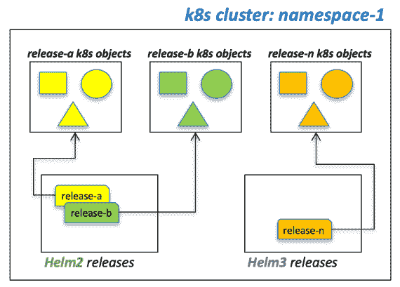

# 从 2 号舵无舵转向 3 号舵

> 原文：<https://levelup.gitconnected.com/migrate-from-helm-2-tillerless-to-helm-3-8221284cb891>

如果你和其他人一样，你至少在 3.1 版本发布之前不会迁移到 Helm 3。2 月初，它终于发布了。从那以后，我最近对 Helm 2 版本([和无蒂勒插件](https://github.com/rimusz/helm-tiller))到 Helm 3.x 的迁移做了一些分析，我想分享一些我的发现。

你要做的第一件事实际上是测试你所有的图表实际上是否会像 Helm 3 预期的那样工作。在很大程度上，我在这个特定领域没有看到任何问题，但是这完全取决于你使用的实际图表。所以为了有效地验证这一点，我建议让您的本地开发机器以干净的方式运行 helm2 和 helm3。

下面这些提示是在 Mac 上完成的，假设你使用 Helm 2 w/使用 Brew 的[无蒂勒插件](https://github.com/rimusz/helm-tiller)。您可以根据您选择的操作系统/软件包管理器的需要进行适当的修改。

我想分享的关键概念是，您可以在集群上同时使用 helm2 和 helm3，但是您只需要知道 helm 版本是如何(以及在哪里)存储在您的集群上的。Helm“发布”只不过是指向集群上部署的 k8s 对象的指针，意识到这一点有助于避免一些严重的混乱。

我强烈推荐你也阅读这篇关于迁移到 helm3 的文章

# 清洁本地舵 2 和舵 3 设置

让我们先把本地的 helm 二进制文件整理好。注意:您需要更改下面的特定版本，使其适合您在执行此操作时安装的版本。

```
brew uninstall helm 
brew uninstall helm@2 
brew uninstall helm@3 
brew install helm@3 cd /usr/local/bin 
rm helm ln -s ../Cellar/helm/3.1.1/bin/helm helm3 
brew install helm@2 
ln -s ../Cellar/helm\@2/2.16.3/bin/helm helm # helm2 init helm init --client-only helm plugin install [https://github.com/rimusz/helm-tiller](https://github.com/rimusz/helm-tiller)
```

验证您的版本

```
$ helm version Client: &version.Version{SemVer:"v2.16.3", GitCommit:"1ee0254c86d4ed6887327dabed7aa7da29d7eb0d", GitTreeState:"clean"} 
Error: could not find tiller$ helm3 version version.BuildInfo{Version:"v3.1.1", GitCommit:"afe70585407b420d0097d07b21c47dc511525ac8", GitTreeState:"clean"}
```

至此，您已经对 helm2 和 helm3 命令有了一个清晰的设置。

# 示例起点

让我们假设您正在使用一个名为*“myapp”*的掌舵图，并且您在 k8s 集群上的名称空间*“名称空间-1”(tiller 的名称空间和已部署的工件名称空间)中有 3 个现有版本(A、B 和 N)。*您用 helm2 列出这些对象，如下所示:

```
helm tiller run namespace-1 -- helm list --all
```

它看起来像下面这样:


tiller 将其已知 helm2 版本的“数据库”存储在同一个名称空间中。

# 用 helm3 测试您的图表

让我们先通过 helm2 删除“release-n”

```
helm tiller run namespace-1 -- helm delete --purge release-n
```

现在让我们使用 helm3 安装图表

```
helm3 install release-n myapp --namespace namespace-1
```

假设您的图表在 helm3 下运行良好，您现在的情况如下:


如果您的 helm3 安装命令不起作用，这可能是由于许多问题…最有可能的一个问题是，您可能会在生成的 k8s YAML 发送到 Kubernetes 之前遇到新的 Helm3 开放 API 验证。这通常是我在使用 Helm3 安装/升级现有图表时遇到的问题。这里有一个快速禁用它的方法

```
helm3 install --help 
... 
--disable-openapi-validation if set, the installation process will not validate rendered templates against the Kubernetes OpenAPI Schema 
...
```

你的星盘可能会遇到其他问题，你必须单独调查每一个问题。也就是说，根据我的经验，Helm3 在向后兼容方面做得非常好。

这里还有一个你可能会遇到的令人讨厌的问题:

```
is invalid: spec.clusterIP: Invalid value: "": field is immutable
```

其他几个人也经历过这种情况，他们的图表在 Helm2 上运行良好(见这里的和这里的和这里的等等)。Helm3 的*-force "*标志似乎存在行为差异。如果你正在使用*-force "*，试着省略它。

# Helm2 和 Helm3 版本可以共存，但也有危险

在上一节中，在使用 Helm3 测试我们的图表之前，我们强行删除了 Helm2 版本*“release-n”*。实际上，在使用 helm3 进行安装/升级之前，您不必删除 helm2 版本……您当然可以执行以下操作:

```
helm3 upgrade --install release-n myapp --namespace namespace-1
```

这将产生一个类似这样的情况:


…这可能会很糟糕

现在我们这里有什么？嗯，我们对预先存在的 k8s 对象执行了相同的图表(因为它们最初是通过 helm2 安装的)，并通过新创建的 Helm3 版本创建了一组指向它们的新指针。所以现在我们有多个发布指针指向同一组 k8s 对象…这些指针是两个独立的舵发布…一个用于 helm2，另一个用于 helm3。

理论上，这可以让你用 helm2 或 helm3 管理 k8s 对象…但是这非常危险，显然不推荐，因为它会导致极大的混乱。想象一下，有人删除了 helm2 版本，却发现 helm3 版本仍然在那里，并指向孤立的对象。这里的要点是，当在一个共享系统上同时使用相同的图表来试验 Helm2 和 Helm3 时，您需要小心。

# 将您的 Helm2 版本迁移到 Helm3，无需停机

在解决了问题并使用 Helm3 在本地或测试集群上测试了您的图表之后，您将需要制定一个计划来将您的 Helm2 版本迁移到 Helm3，最好不要停机。在生产环境中，为了升级部署工具而删除 Helm2 版本，然后通过 Helm3 安装它们是不切实际的，也是不可接受的。

那么我们如何做到这一点呢？理想情况下，我们希望能够将 Helm2“发布”数据库转换为 Helm3“发布”数据库，而无需实际安装/升级任何图表…让我们只转换发布数据库。你很幸运，因为有一个[伟大的工具可以实现这个目的，叫做 helm-2to3](https://github.com/helm/helm-2to3)

这个工具很棒，因为它允许您将 Helm2 版本转换为 Helm3 版本，然后让您有选择地清除 Helm2 版本引用，而不会破坏底层的 Kubernetes 对象。

首先，让我们安装它:

```
helm3 plugin install [https://github.com/helm/helm-2to3](https://github.com/helm/helm-2to3)
```

试运行转换*“释放-n”:*

```
helm3 2to3 convert --tiller-out-cluster --dry-run --tiller-ns namespace-1 release-n
```

做一个*“release-n”的真实转换:*

```
helm3 2to3 convert --tiller-out-cluster --tiller-ns namespace-1 release-n
```

验证 Helm3 中的版本:

```
helm3 list --all --namespace namespace-1
```

验证释放仍在 Helm2 中:

```
helm tiller run namespace-1 -- helm list --all
```

然而，在这一点上，您现在又处于这种情况(两个版本指向同一组 k8s 对象):


因此，让我们来解决这个问题，我们想摆脱 Helm2 发布指针，我们也可以这样做的工具！

```
helm3 2to3 cleanup --name release-n --tiller-ns namespace-1 --tiller-out-cluster
```

这将使我们进入期望的状态:



太好了！现在让我们在剩余的版本中重复这一点

`helm3 2to3 convert --tiller-out-cluster --tiller-ns namespace-1 release-a`

`helm3 2to3 cleanup --name release-a --tiller-ns namespace-1 --tiller-out-cluster`

`helm3 2to3 convert --tiller-out-cluster --tiller-ns namespace-1 release-b`

`helm3 2to3 cleanup --name release-b --tiller-ns namespace-1 --tiller-out-cluster`

…现在我们有了我们想要的状态:


现在看起来好多了。

# 摘要

归根结底，从 Helm2 迁移到 Helm3 并不是什么大事。你绝对需要测试你的图表，了解舵“释放”是如何管理的，并观察什么指向什么，以避免混淆。同样重要的是，在开始迁移时，您要与整个团队进行沟通，并确保每个人都安装了正确的工具集，并且在迁移之前对上述版本概念有重要的理解。

*原载于 2020 年 3 月 10 日 http://bitsofinfo.wordpress.com*[](https://bitsofinfo.wordpress.com/2020/03/10/migrate-from-helm-2-tillerless-to-helm-3/)**。**