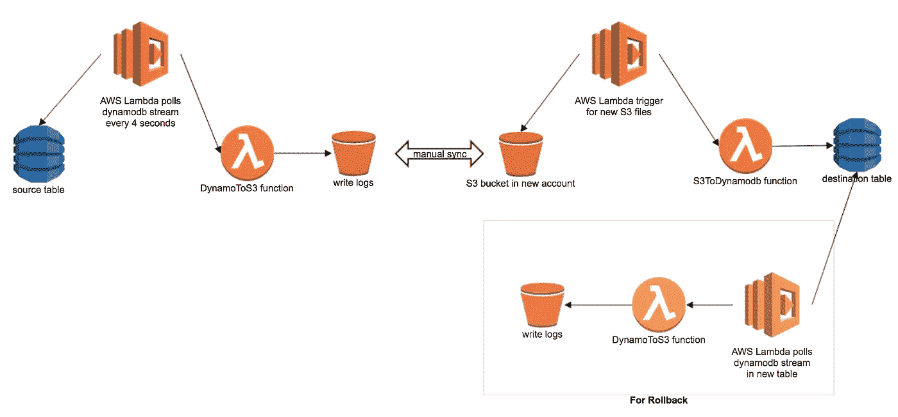

# 将 DynamoDB 从一个 AWS 帐户迁移到另一个帐户，零宕机

> 原文：<https://levelup.gitconnected.com/migrating-dynamodb-from-one-aws-account-to-another-with-zero-downtime-40826157844c>

Intuit 正在快速从私有数据中心转移到 AWS，所有新服务都是为 AWS 编写的，并托管在 AWS 中。最初，团队创建他们自己的 AWS 帐户并部署他们的服务，后来我们决定将他们全部迁移到中央 AWS 帐户，原因很明显(易于维护，减少 VPC 内部的流量等)。).

其中一个服务使用 DynamoDB 作为其持久层，因此我们需要将 DynamoDB 表从一个 AWS 帐户移动到另一个 AWS 帐户。

# 服务迁移

迁移服务有两个重要方面

## **应用迁移**

这是比较容易的部分，你只需要在另一个 AWS 帐户中启动新的服务器，测试它们，并在你准备好的时候进行 DNS 切换。根据您的流量和使用模式，您可以考虑基于%的拨号与大爆炸切换。

## **数据迁移**

在您可以拨流量到新的 AWS 帐户之前，您需要将您的数据从旧数据库移动到新数据库。在这种情况下，我们的服务处于生产状态，并且需要一次性批量数据迁移和增量迁移(在批量数据迁移期间用于新数据)。

## **批量数据迁移**

我们评估了以下选项

**=>dynamo db Backups**:AWS 提供了一个通过 AWS 控制台备份表的选项，但是这个备份在同一个 AWS 区域和 AWS 帐户中可用，因此在我们的例子中无法使用。

**=>:AWS 数据管道:** AWS 数据管道提供预定义的模板，将 DynamoDB 表转储到 S3，另一个模板从 S3 恢复到 DynamoDB。

./bin/dynamo-backup-to-s3 -i $table_name --read-percentage 0.5 --bucket $bucket_name --aws-region us-west-2 --backup-path $table_name **--global-table true**#Restore the table from s3 to a table
./bin/dynamo-restore-from-s3 -s $s3_path -t $table_name --partitionkey partitionkey —sortkey sortkey --aws-region us-west-1 --overwrite true -c 20 -sf true

## **三角洲迁移**

更棘手的部分来了:根据数据大小，批量迁移可能需要一些时间(备份和恢复都需要几个小时),我们不想在此期间停止服务，因此，我们还需要处理增量记录。

我们可以通过双写/双读来处理这个问题，可以有多种选择，最简单的一种是

> 在开始备份之前，从旧帐户向新帐户进行双重写入，但是在恢复批量数据时需要小心，它可能会覆盖最近的数据。

通常，您可以修改您的应用程序代码以写入两个帐户，但我们在 AWS 中，我们可以在 DynamoDB 流上使用 AWS Lambda 将新数据复制到 S3，然后在 S3 上将另一个 AWS Lambda 作为事件通知写入新帐户中的 DynamoDB 表。

这使您的应用程序代码保持干净——无需更改已经很复杂的代码，迁移后也无需清理，只需在完成迁移后切断 lambda 触发器。

这是它的样子

AWS Lambda 在 DynamoDB 和 S3 上触发，在两个表之间复制数据

**割接日**

1.  在源表上添加 Lambda 触发器以写入 S3
2.  开始完整数据库备份
3.  将转储还原到目标表
4.  使用 lambda 事件在新帐户中创建 S3 存储桶，以写入 DynamoDB 表
5.  将源 S3 文件同步到目标 S3。
6.  在这里，您可能希望让 cron 作业每分钟进行一次同步，或者修改源上的 lambda 函数，以便直接写入目标帐户中的 S3
7.  为回滚在目标表上添加 Lambda 触发器
8.  测试新设置并交换流量
9.  喝杯咖啡，监控日志
10.  几天后——清理 S3 桶、兰姆达斯等。

**几件重要的事情**

1.  DynamoToS3 函数(DynamoDB 表上的触发器)没有并行执行问题，因为 DynamoDB 流会解决这个问题。但是 S3ToDynamoDB 可能有并行执行的问题——只要你在 S3 中放置一个新对象，它就会立即被触发，而不是等待前一个 lambda 完成。因此，您应该有一种方法来决定是否要用新事件覆盖表中的数据，我们是基于时间戳这样做的。
2.  您可能需要修改 lambda 设置、批处理大小、并行执行速率、超时等。
3.  我们没有删除用例，如果你有删除，你需要考虑一下。

下面是 DynamoToS3 和 S3ToDynamo lambda 函数，供大家参考。

DynamoToS3 lambda 函数，在参数中传递 S3 桶名

S3ToDynamo lambda 函数，传递表名、散列键和范围键，参数中的 last_modified_key

# 在 Intuit 创新

Intuit 正在全球招聘多个[职位](https://careers.intuit.com/job-search)。

# 跟我来

在 [LinkedIn](https://www.linkedin.com/in/avinash-singhal-36a2936/)

# 分级编码

感谢您成为我们社区的一员！在你离开之前:

*   👏为故事鼓掌，跟着作者走👉
*   📰查看[升级编码出版物](https://levelup.gitconnected.com/?utm_source=pub&utm_medium=post)中的更多内容
*   💰免费编码面试课程[查看课程](https://skilled.dev/?utm_source=luc&utm_medium=article)
*   🔔关注我们:[Twitter](https://twitter.com/gitconnected)|[LinkedIn](https://www.linkedin.com/company/gitconnected)|[时事通讯](https://newsletter.levelup.dev)

🚀👉 [**加入升级达人集体，找到一份惊艳的工作**](https://jobs.levelup.dev/talent/welcome?referral=true)