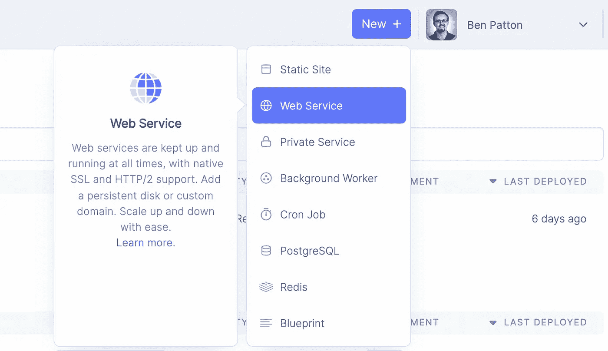
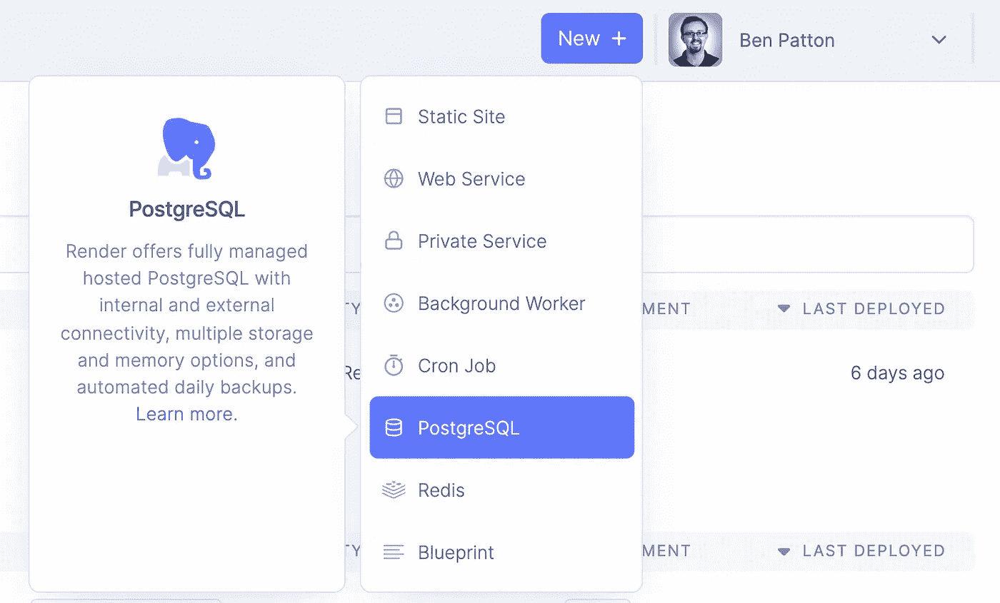
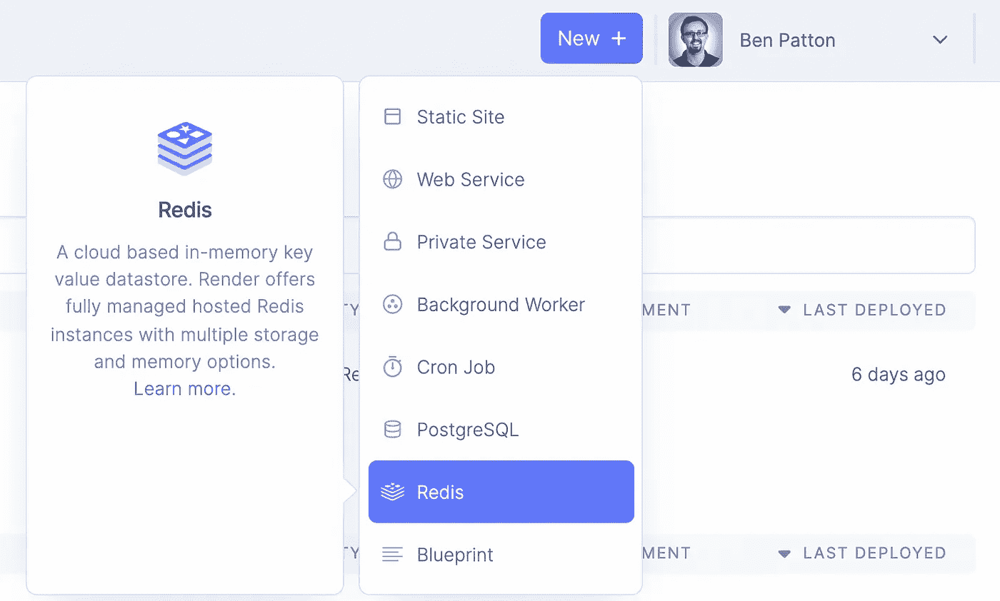
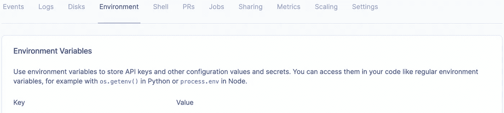
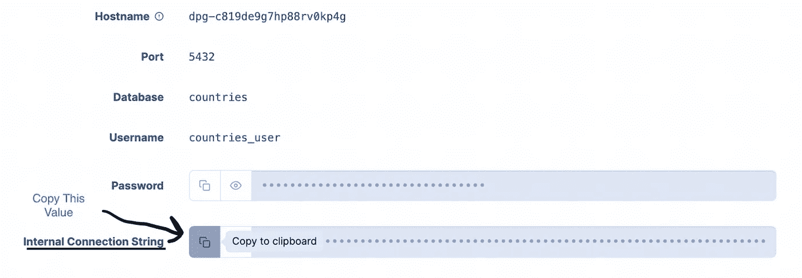
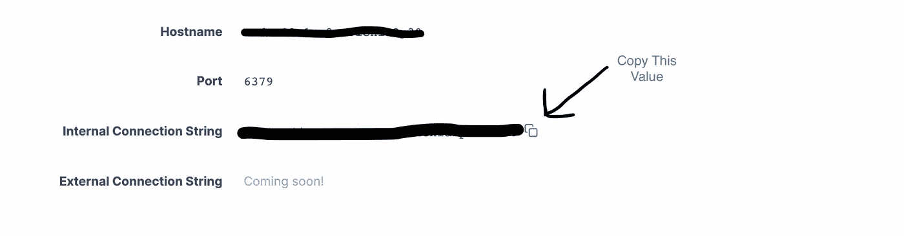
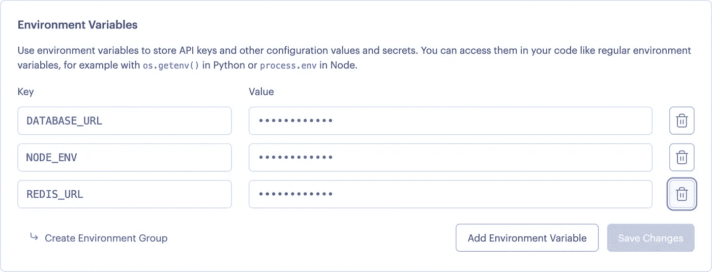
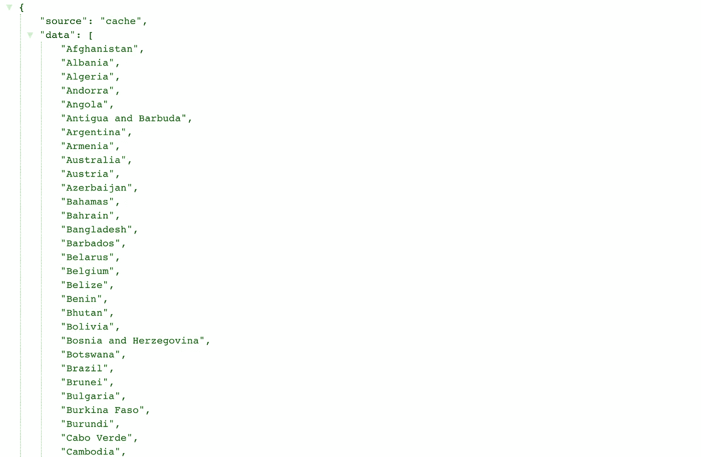

# 从 Heroku 迁徙到 Render

> 原文：<https://levelup.gitconnected.com/migrating-from-heroku-to-render-ea4e3bd709a5>


弗雷德里克·索利·万登在 [Unsplash](https://unsplash.com/s/photos/migrating-birds?utm_source=unsplash&utm_medium=referral&utm_content=creditCopyText) 上拍摄的照片

时不时地，我会听到一些单词或短语被重复出现，以至于我最终会想，“嗯，我应该看看这个。”渲染是其中一个词。

在 Twitter 上，我看到了各种各样的对话，人们希望从 Heroku 迁移到另一个服务。人们提出的一些问题包括:

*   费用
*   缺少持久存储选项
*   不适合托管静态网站
*   最近产品开发的放缓

在其中的一些对话中，我看到过这样的问题:“渲染怎么样？”

那么，渲染呢？从 Heroku 转移到 Render 有多难？我想弄清楚。我从一个简单的 web 应用程序开始，我已经将它部署到 Heroku，并完成了将它迁移到 Render 的过程。总之，我花了大约 10 分钟。在这篇文章中，我将回顾我所采取的步骤。

你需要的只是一个 GitHub 账户。

# 我的 Node.js 应用程序的简要概述

目前，我在 Heroku 上运行了一个简单的 Node.js 应用程序。我还安装了 Heroku Postgres 和 Heroku Redis 作为这个应用程序的附加组件。

这个应用程序很简单。当我向/countries 发送“GET”请求时，我得到一个响应体，它 1)告诉我数据的来源(数据库或缓存), 2)给我一个国家列表。

还有一个端点(/clear_cache ),我可以用“POST”请求点击它来清除 Redis 缓存。

# 步骤 1:在 Render 中设置我们的应用程序

首先，去 render.com 的[登录或者注册 GitHub。登录后，点击你的账户头像旁边顶部栏中的**新**按钮。然后，选择 **Web 服务**。](https://render.com/)



接下来，选择您想要部署的 GitHub 存储库。为您的应用程序提供一个名称，并给出适当的启动命令。对于这个演示——因为这是一个 Node.js 项目——我的应用程序设置为运行 npm install 和 npm start。

也在这里选择免费计划。目前，这足以满足我们的演示需求。随着应用的扩展，您可以随时升级您的计划。

# 步骤 2:在渲染时设置 Postgres

在 Render 上设置 Postgres 很简单。同样，在顶部菜单栏中，您所要做的就是点击 **New** ，然后点击 **PostgreSQL** 。



接下来，为您的 [Postgres 数据库](https://render.com/docs/databases)提供一个名称。对于这个演示，我保留了其余的默认值，并使用了免费计划。

然后，点击**创建数据库**。

你会在下面看到一个**配置环境变量**的步骤，但是我们一会儿再回来。现在，我们将继续设置 Redis。

# 步骤 3:在渲染时设置 Redis

Redis 是一个快速灵活的键值存储，我们将在演示应用程序中使用它进行缓存。不断地查询数据库会变得很昂贵，尤其是当您的应用程序扩展时。当后续查询返回相同的结果时，缓存这些结果以防止对数据库的不必要的访问是有意义的。Redis 让我们这样做。

直到最近，Render 还没有提供托管 Redis 服务。你不得不在别的地方主持 Redis。但是好消息！在几个月的早期访问之后，Render 最近发布了其[托管 Redis 服务](https://render.com/docs/redis)，其中包括一个免费层！

因此，就像之前一样，点击 **New** 并从下拉列表中选择 **Redis** 。确保命名您的 Redis 实例，选择免费计划，然后点击 **Create Redis** 。



既然 Redis 和 Postgres 都已经设置好了，我们可以继续设置我们的环境变量了。

# 步骤 4:配置环境变量

我们的 web 应用程序依赖于某些环境变量。特别是，我们希望能够灵活地动态指定 Postgres 数据库位置和 Redis 位置，而不是将这些位置硬连接到代码中。让我们来看看如何在 Render 中指定这些环境变量。

转到您的仪表板，单击您在第一步中创建的 Web 服务。

点击页面子导航菜单中的**环境**。



现在，您可以选择创建附加到 web 服务的单个环境变量，也可以创建一个环境组并将其附加到您的 web 服务。对于我们的应用程序来说，这两种方法都可以很好地工作。

我们需要创建三个环境变量:

- DATABASE_URL:将其设置为您在步骤 2 中设置的 Postgres 实例的配置页面中的内部连接字符串值。



- REDIS_URL:将其设置为您在步骤 3 中设置的 REDIS 实例的配置页面中的内部连接字符串值。



- NODE_ENV:将其设置为“生产”。

您的 Web 服务的环境变量应该如下所示:



# 测试我们的应用

设置好环境变量后，我们就可以测试我们的应用程序了。我使用“curl”命令向我的渲染应用程序发送请求。

首先，我们向[https://redis-postgres-demo.onrender.com/countries](https://redis-postgres-demo.onrender.com/countries`)发送一个“GET”请求。在我的终端窗口中，命令如下所示:

```
curl -X GET [https://redis-postgres-demo.onrender.com/countries](https://redis-postgres-demo.onrender.com/countries`)
```

以下是我收到的回复:


来源描述了我们从哪里获取数据，而数据只是所有国家的数据。从上面的响应中我们可以看到，对于第一个请求，数据的来源是数据库。

接下来，我们向同一个端点发送第二个“GET”请求。回应如下:



正如所料，第二个请求的数据源是 Redis 缓存，而不是数据库。

接下来，我们发送一个“POST”请求来清除缓存:

```
curl -X POST [https://redis-postgres-demo.onrender.com/clear_cache](https://redis-postgres-demo.onrender.com/clear_cache`)
```

清空缓存后，我们发送另一个“GET”请求来检索我们的国家列表。正如所料，由于没有缓存可供使用，返回数据的来源是数据库。


因此，我们的小应用程序已经无缝迁移到渲染。Render 使得设置 Postgres 和 Redis 变得轻而易举！

# 结论

总之，我们在 Heroku 上运行了一个使用 Postgres 和 Redis 的应用程序。只需将 GitHub 帐户连接到 Render，我们就可以使用 Render 来:

*   部署我们的 Web 服务
*   设置 Postgres 和 Redis
*   设置环境变量，将我们的 Web 服务指向我们的 Postgres 数据库和 Redis 实例。

我们只需点击几下鼠标，就能完成这一切，大概只需要煮一壶咖啡的时间。

所以，让我们回到原来的问题。如果你想离开 Heroku，你可能会问，“Render 怎么样？”我得说这绝对值得考虑。

下面是一个视频，走过我的整个过程:【https://youtu.be/dambnfHv6fU】