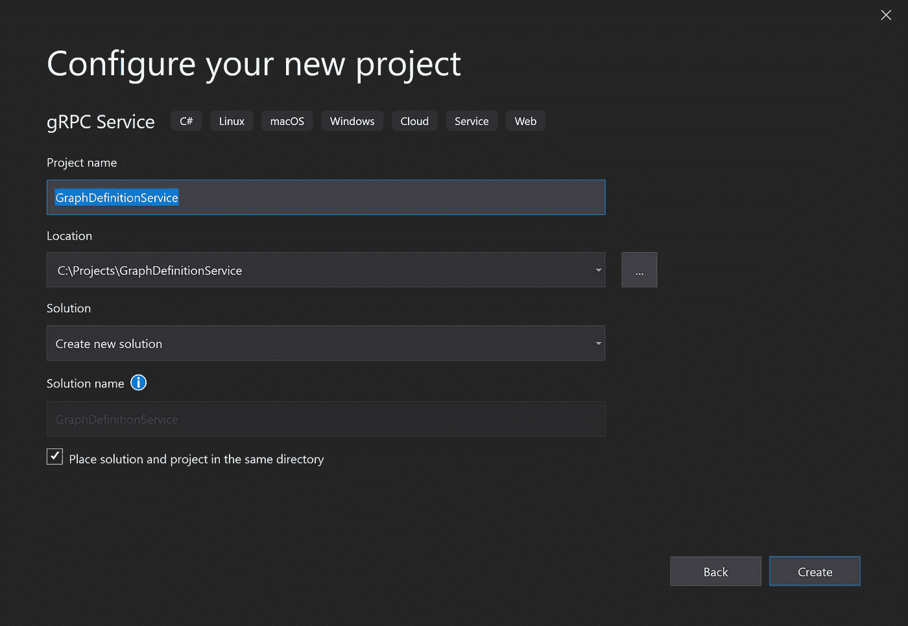
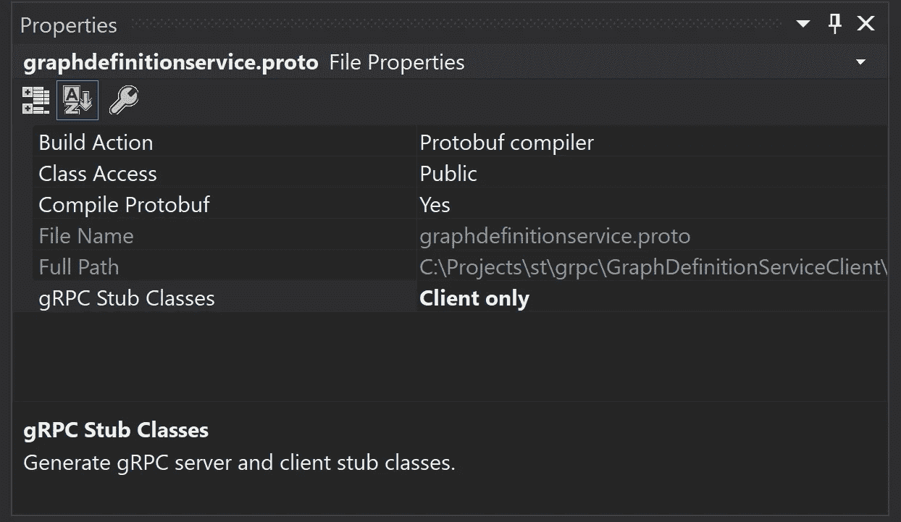

# 从 WCF 迁移到 gRPC

> 原文：<https://levelup.gitconnected.com/migrating-from-wcf-to-grpc-69464adc8140>

## 并在 Node.js 客户端和 C# Windows 服务之间进行跨平台通信

加里·本迪格在 [Unsplash](https://unsplash.com/s/photos/migrate?utm_source=unsplash&utm_medium=referral&utm_content=creditCopyText) 上的照片

微软 Windows 通信基金会(WCF)一直是我在 Windows 上的首选通信框架。

我喜欢通过配置来改变协议和格式。

*   您是否需要与其他系统和语言的最广泛的互操作性？您使用 WsHttpBinding。
*   同一台机器上的两个进程之间需要最高速度吗？您使用 NetNamedPipeBinding。

但是，令我遗憾的是，微软没有将 WCF 迁移到。Net 核心平台。的。Net 核心平台是跨平台的，微软将 WCF 与 Windows 操作系统紧密耦合。这种紧密的耦合使它们很难迁移 WCF。

在本文中，我将描述我如何以及为什么从 WCF 迁移到 gRPC。由于 gRPC 是跨平台的，我将展示一个在. Net 核心服务和 Node.js 客户端之间通信的例子。

我使用 Visual Studio 2019 来创建 ASP.Net 核心 gRPC 服务和 Node.js 客户端的 Visual Studio 代码。

在文章的最后，我将列出 gRPC 的替代方案。

# 你为什么要移民？

离开 WCF 的原因很简单。[微软推荐](https://docs.microsoft.com/en-us/dotnet/standard/choosing-core-framework-server)使用。Net 核心为所有新的应用程序开发。作为微软。Net Core 不支持 WCF，你必须迁移。

您可以决定根本不迁移，继续使用 Microsoft。Net 框架。一个有效的选择，但你不会帮你自己。微软在未来的投资。网会在。网芯。

微软[推荐](https://devblogs.microsoft.com/dotnet/net-core-is-the-future-of-net/) gRPC 作为 WCF 的替代品。网芯。

有其他选择吗？是的，您可以使用 HTTP APIs 或 Websockets。但是请注意，HTTP APIs 的性能较差，Websockets 需要手动进行消息序列化。

# WCF 和 gRPC 有什么区别？

WCF 和 gRPC 之间最显著的区别在于以下几个方面:

*   接口定义
*   协议和格式
*   错误处理
*   安全性

## 接口定义

使用 WCF，你可以通过一个 C#接口来描述你的服务接口。WCF 服务器在运行时通过反射生成 WSDL。客户端生成器使用 WSDL 为服务创建客户端。

gRPC 使用协议缓冲区来描述接口。所以，你必须使用这个协议缓冲定义语言来定义你的通信接口。你必须将它存储在一个`.proto`文件中。有各种各样的生成器可以使用`.proto`文件来生成客户机和服务器存根。

协议缓冲区是一种自定义语言。这使得 gRPC 独立于一个平台和语言。每个平台和语言都可以开发生成器来生成客户端和服务存根。

## 协议和格式

通过 WCF，您可以使用配置来选择不同的通信协议和格式。例如，HTTP、TCP、MSMQ 或命名管道。使用绑定来指定协议和格式，例如 NetTcp 绑定。

gRPC 使用 HTTP/2 作为网络协议和二进制消息格式。gRPC 提供与 WCF NetTcp 绑定相同的速度和效率。在某些情况下，甚至更高的速度。

## 错误处理

使用 WCF，您可以使用`FaultException<TDetail>`来提供符合 SOAP 错误标准的错误信息。

gRPC 没有这种扩展的错误处理。gRPC 使用状态代码和元数据。下表显示了最常用的状态代码。

*   `GRPC_STATUS_UNIMPLEMENTED`该方法尚未实施
*   `GRPC_STATUS_UNAVAILABLE`服务出现一般性问题，不可用。
*   `GRPC_STATUS_INTERNAL`服务在编码/解码消息时出现问题。
*   `GRPC_STATUS_UNAUTHENTICATED`服务器上的认证失败
*   `GRPC_STATUS_PERMISSION_DENIED`客户端无权执行请求的操作
*   `GRPC_STATUS_CANCELLED`客户取消了通话

## 安全性

有了 WCF，你有很多安全选项。您希望使用消息级加密还是值加密？您想要哪种身份验证？活动目录集成、Kerberos、LDAP 等。

gRPC 使用 HTTP/2。尽管可以在 HTTP/2 上使用未加密的数据，但所有主流浏览器都只支持 TLS 上的 HTTP/2。所以 HTTP/2 将总是使用 TLS 加密。gRPC 也会。

您可以使用客户端和服务器证书进行身份验证。如果想使用调用级授权，可以使用令牌，例如 JSON Web 令牌(JWT)。

现在我们来看看什么是 gRPC。

# gRPC 是什么？

通用远程过程调用(gRPC)是 Google 最初开发的一个[开源](https://github.com/grpc)通信框架。不，g 不代表谷歌。它使用 Google 的协议缓冲区来描述通信接口。

协议缓冲区是一种用于序列化数据的跨平台机制。

您必须在. proto 文件中描述通信接口。的。proto 文件包含所有消息类型的定义。gRPC 包括许多不同语言的生成器，例如:

*   Java 语言(一种计算机语言，尤用于创建网站)
*   计算机编程语言
*   目标-C
*   C++
*   镖
*   去
*   红宝石
*   C#

# gRPC 示例

照片由 [Pavan Trikutam](https://unsplash.com/@ptrikutam?utm_source=unsplash&utm_medium=referral&utm_content=creditCopyText) 在 [Unsplash](https://unsplash.com/s/photos/communication?utm_source=unsplash&utm_medium=referral&utm_content=creditCopyText) 上拍摄

让我们看一个例子。的。下面的 proto 文件定义了一个名为 Graph DefinitionService 的服务。该服务包含两种方法。一个用于检索单个图形定义，另一个用于读取所有图形定义。

GraphDefinitionService.proto

第一行定义了您想要使用的原型的`syntax` 。有两个版本可用，“proto2”和“proto3”。我推荐使用版本 3，因为它支持更多的语言。

第三行包含一个`option`语句。这些陈述是特定于一种语言的。在这种情况下，对于 C#，所以当使用 java 生成器时，`charp_`选项被忽略。

第五行中的`package` 定义是必不可少的。它定义了服务的名称。

## 服务方法

第七行的`service`语句启动了将在您的服务中可用的方法。每种方法都以`rpc`开头。您可以将此与 WCF 服务的 OperationContract 进行比较。

gRPC 服务上的每个方法都接受一条消息并返回一条消息。不可能只有一个整数参数或返回一个空值。

## 消息定义

消息定义以关键字 message 开始。例如，在第 12 行中，定义了消息 GetRequest。该消息包含一个名为 int32 类型的 graphDefinitionId 的字段。

协议缓冲区支持多种本机数据类型，如 int32、double 和 string。没有可用的 UUID 数据类型的本机 GUID，我经常将它用作 ID 字段。解决这个问题的最好方法是使用字符串。

在消息定义中的每个字段之后，都有一个唯一的编号。这个数字标识二进制消息中的字段。因此，如果您的消息类型正在使用中，您应该分配一个号码，并且永远不要更改它。

即使不再需要某个字段，也可以删除该字段，但不应该重用字段号。留空隙就好。

## 创建 gRPC 服务

虽然可以使用 Visual Studio 代码创建 gRPC 服务，但我将使用 Visual Studio 2019。Visual Studio 2019 让这个过程变得简单多了。

Visual Studio 包含一个用于创建 gRPC 服务的项目模板。此模板生成 ASP.NET 核心 3.1 项目。它包含一个服务和一个示例`.proto`文件。

Visual Studio 在构建期间用虚方法将`.proto`文件翻译成 C #分部类。您可以从这些分部类派生，并通过重写来实现服务方法。有关 GraphDefinitionService 的示例实现，请参见下文。

图形定义服务. cs

完整的解决方案可在 [GitHub](https://github.com/PatrickKalkman/WCF2gRPC) 上获得。

## 创建. Net 核心 gRPC 客户端

我先用 Visual Studio 2019 创建一个 gRPC 客户端。我使用一个. Net 核心控制台项目。

然后使用 Visual Studio 中的包管理器控制台安装以下 Nuget 包。

*   安装包 Grpc。Net 客户端
*   安装包谷歌。原蟾蜍
*   安装包 Grpc。工具

将 GraphDefinitionService.proto 复制或链接到客户端程序。选择原型文件并设置正确的编译属性。确保 gRPC 子类属性仅适用于客户端。

下面的程序连接到 GraphDefinitionService gRPC 服务并调用`GetAsync` 方法。

GraphDefinitionService 的 C# gRPC 客户端

## 创建 Node.js gRPC 客户端

为了展示跨平台能力，我还实现了一个 Node.js gRPC 客户端。

Node.js 客户端需要以下两个 NPM 包。

`npm install grpc @grpc/proto-loader`

它还需要访问`graphdefinitionservice.proto`文件，以便能够生成存根类。

Node.js gRPC 客户端

与 C#不同，Node.js gRPC 库在运行时生成通信存根。在第 16 行，加载了 proto 文件，Node.js 生成了一个存根。客户机在第 18 行创建了到服务的实际连接。

在第 23 行，客户端实际调用服务。完整的源代码可以在 [Github](https://github.com/PatrickKalkman/WCF2gRPC) 上找到。

# 从 WCF 迁移到 gRPC

gRPC 可以是 WCF 的一个很好的替代品。但是由于你可能在 WCF 服务上投入了大量的时间和精力。您可能对自动迁移您的 WCF 服务的可能性感兴趣。

[Visual ReCode](http://www.visualreco.com/) 是一个商业 Visual Studio 插件，可以帮助您将 WCF 服务迁移到 gRPC。Visual ReCode 扫描解决方案中的项目，并通过扫描`[OperationContract]`属性来搜索所有 WCF 接口。

然后，您可以选择要迁移的 WCF 接口。选择后，它为每个接口创建:

*   基于原始 WCF 接口的原型文件
*   实现原型文件并调用原始代码的 gRPC 服务
*   能够调用 gRPC 服务的所有方法的 gRPC 客户端。

尽管如此，你还是需要做一些手工工作。但是如果你需要迁移大量的 WCF 服务，我建议你去看看 Visual ReCode。有试用版。

# 结论和替代方案

在这篇文章中，我们看到微软不支持 WCF。网芯。您可以使用 gRPC，它是创建高速服务的有效替代方法。其他选项有基本的 HTTP APIs 和 Websockets。

我们实现了一个 gRPC ASP。NET 核心服务和 Node.js 客户端。该源代码可在 [Github](https://github.com/PatrickKalkman/WCF2gRPC) 上获得。

如果您想将 WCF 服务迁移到 gRPC，您可以手动完成或使用工具。尤其是如果你有很多 WCF 服务，像 Visual ReCore 这样的工具会有所帮助。

我之前没有提到的 WCF 的另一个选择是 T2 核心 WCF T3。核心 WCF 是 Windows 通信框架(WCF)的一个开源端口。网芯。目前，它还不能用于生产。但在未来，它可能是一个可以运行 WCF 服务的替代品。网芯。

在您开始将您的 WCF 服务转换为 gRPC 之前，我想分享两件事。在撰写本文时，还不能在 IIS 中运行 gRPC。IIS 不支持 HTTP/2。

Azure App 服务也是如此。他们使用 IIS，所以还不支持 gRPC。我怀疑微软会在今年晚些时候增加支持。

感谢您的阅读，并保持安全。