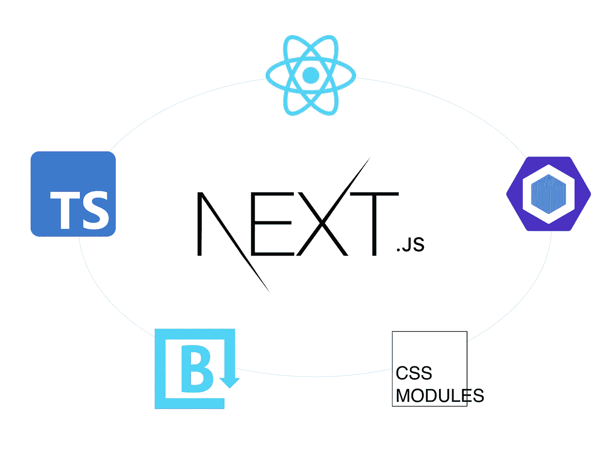
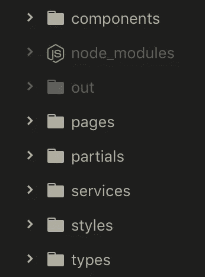
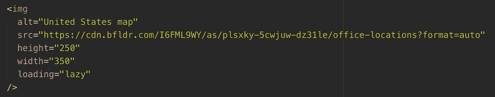
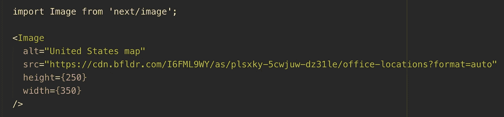
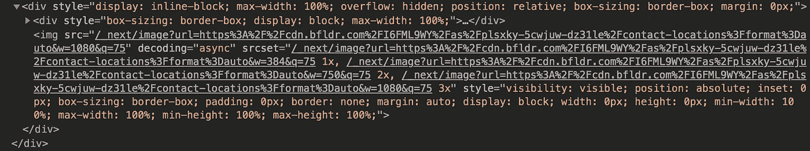
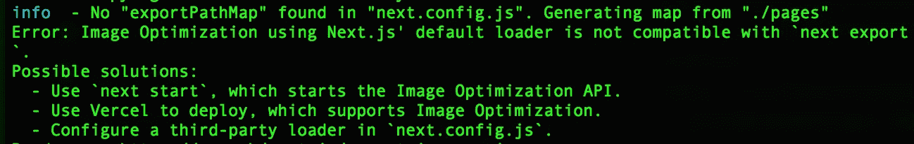
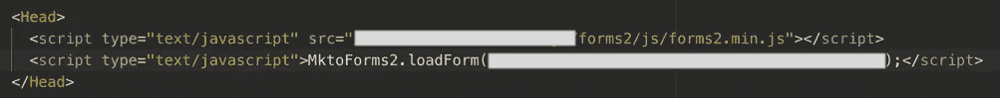
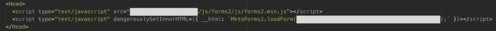
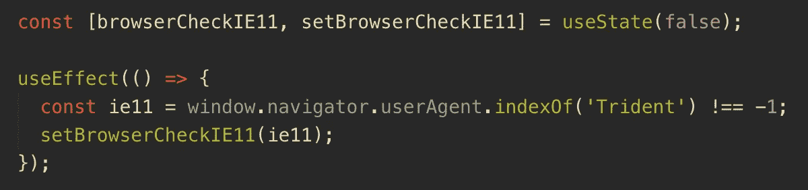
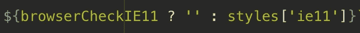

# 将站点从 Rails 迁移到 Next.js 应用——如何添加 TypeScript、ESLint、CSS 模块、IE11 检测和内容丰富的集成

> 原文：<https://levelup.gitconnected.com/migrating-site-from-rails-to-next-js-bb8f7632a3ef>



我们希望将我们的营销网站从我们的 Rails 应用中分离出来的那一天已经到来。我们知道我们想要使用一个 React 框架，这归结为 [Next.js](https://nextjs.org/) 或 [Gatsby。最终，Next.js 胜出，因为它具有混合静态和服务器渲染能力。目前，我们网站的大部分内容是静态的，只有几个动态页面。此外，新的](https://www.gatsbyjs.com/) [Next.js 10](https://nextjs.org/blog/next-10) 功能包括国际化和一个`Image`组件，该组件通过延迟加载、WebP 格式和响应式大小调整来自动优化图像，这些都是我们计划纳入我们网站的迷人功能。

当迁移所有的 Rails `erb`文件以作出反应时，有许多需要改变。我将记录我将 Rails 文件转换成新创建的 Next.js 应用程序的过程。我将添加 **TypeScript、ESLint、CSS 模块、IE11 检测、**和**内容丰富的集成**。我还将讨论我如何使用 Next.js `Head`组件和由 Next.js `Link`组件制成的**路由组件**来制作一个可重用的 **SEO 组件**。

首先，我练习创建 [Next.js 教程博客应用](https://nextjs.org/learn/basics/create-nextjs-app?utm_source=next-site&utm_medium=nav-cta&utm_campaign=next-website)。这帮助我熟悉了 Next.js 组件和 Next.js 应用程序的一般配置。对于我们新的营销网站 repo，我使用了 [Next.js 样板文件](https://nextjs.org/docs/api-reference/create-next-app)。下面的命令将为您生成样板代码。

```
npx create-next-appyarn create next-app
```

此外，确保您已经安装了 [Node.js](https://nodejs.org/en/) 。您需要 10.13 版或更高版本。要启动服务器，运行`npm run dev`或`yarn dev`并在浏览器中通过 [http://localhost:3000](http://localhost:3000/contact) 访问您的开发服务器。

为了将 Rails `erb`文件引入 Next.js，我从视图中复制了 HTML。我保留了我们文件夹的大致结构。在 Next.js 中，所有页面都是 React 组件，存放在`pages`目录中。知道页面路由是基于它们的文件名是很重要的。



文件夹层次结构

当从 Rails 迁移代码时，会立即出现一些错误并需要更新。`erb`文件的语法抛出错误，因为`class`需要改为`className`。我们所有的营销网站图片都使用我们的 CDN 来支持我们的网站。因为 Next.js 的`Image`组件的[图像优化](https://nextjs.org/docs/basic-features/image-optimization)，我们想把它用于我们的图像。用组件替换``标签非常简单。下面的``标签:



 HTML 标签

变成了这个`Image`组件:



Next.js 图像组件

然而，这对于绝对定位的图像来说并不理想，因为外部的`<div>`环绕着实际的图像。下面是使用`Image`组件的输出示例。



图像组件 HTML

此外，我们没有在 Vercel 上部署我们的应用程序，因此我们不会自动配置全局 CDN 或访问图像优化 API。当用`Image`组件构建应用程序时，出现了这个错误。当我移除组件并返回到``标签时，构建成功了。



图像组件出现终端错误

但是，我们能够为托管在外部站点上的图像启用图像优化。为此，您需要在项目的根目录下创建一个`next.config.js`文件。该文件用于为您的 Next.js 应用程序定制高级行为。在这里，您将陈述图像`src`的绝对 url，并指出允许优化哪些域。

```
module.exports = {
  images: {
    domains: ['external.domain.com'],
  }
}
```

在为我们的表单复制 Marketo 脚本时，我想我可以像这样在`Head`组件中添加脚本:



Head 组件中的 Marketo 脚本

但是，这导致了控制台错误“未捕获的语法错误:意外的标记' & '”我可以通过在 Marketo `loadForm`函数周围添加`dangerouslySetInnerHTML`来解决这个错误。这允许您直接从 React 向 [set HTML 传递一个对象，在本例中是表单。](https://reactjs.org/docs/dom-elements.html)



用 dangerouslySetInnerHTML 在脚本中包装 HTML

对于接下来的部分，由于每个部分都有多个步骤，我将分解我是如何添加的:

*   打字稿
*   **ESLint**
*   **CSS 模块**
*   **IE11 检测**
*   **徐老头组件**
*   **外部链接组件**
*   **内容丰富的整合**

# 以打字打的文件

开箱即用，Next.js 可以与 TypeScript 集成。首先创建一个`tsconfig.json`文件。重新启动服务器，您将在终端中收到一条消息，提示您安装 TypeScript。

```
npm install --save-dev typescript @types/react @types/node

yarn add --dev typescript @types/react @types/node
```

现在，安装完软件包后，重启您的服务器，`tsconfig.json`文件已经被填充。此外，还创建了`next-env.d.ts`文件，以便为 TypeScript 编译器识别类型。一定不要删除！现在您可以将您的`.js`和`.jsx`文件更改为`.ts`和`.tsx`。

# 埃斯林特

有多个 [ESLint](https://eslint.org/) 包可以分析你的代码的一致性并帮助防止错误。这实际上是基于您的偏好、您安装的组件以及您的团队同意的内容。我安装的软件包是:

*   `eslint`
*   `babel-eslint`
*   `eslint-plugin-import`
*   `eslint-plugin-jsx-a11y`
*   `eslint-plugin-react`
*   `eslint-plugin-react-hooks`

另一个很多团队常用的是`[eslint-config-airbnb](https://www.npmjs.com/package/eslint-config-airbnb)`。

```
npm install --save-dev babel-eslint eslint eslint-plugin-import eslint-plugin-jsx-a11y eslint-plugin-react eslint-plugin-react-hooksyarn add --dev babel-eslint eslint eslint-plugin-import eslint-plugin-jsx-a11y eslint-plugin-react eslint-plugin-react-hooks
```

一旦你安装了这些包，你会想要在你的项目的根目录下创建一个`.eslintrc.js`或者`.eslintrc.json`文件。在这个文件中，您将指定您的林挺规则。

```
module.exports = {
  env: {
    commonjs: true,
    node: true,
    browser: true,
    es6: true,
    jest: true,
  },
  extends: [
    "eslint:recommended",
    "plugin:jsx-a11y/recommended",
    "plugin:react/recommended",
    "plugin:[@typescript](http://twitter.com/typescript)-eslint/recommended"
  ],
  globals: {
    "React": true
  },
  parser: "[@typescript](http://twitter.com/typescript)-eslint/parser",
  parserOptions: {
    ecmaFeatures: {
      jsx: true,
    },
    ecmaVersion: 2018,
    sourceType: "module",
  },
  plugins: [
    "react",
    "import",
    "jsx-a11y",
    "react-hooks"
  ],
  ignorePatterns: [
    "node_modules/",
    "out/"
  ],
  rules: {
    "jsx-a11y/anchor-is-valid": 0,
    "react/react-in-jsx-scope": "off",
    "react/no-unescaped-entities": 0,
    "semi": [1, "always"]
  },
  settings: {
    "import/resolver": {
      "node": {
        "extensions": [
          ".js",
          ".jsx",
          ".ts",
          ".tsx"
        ]
      }
    },
    react: {
      version: "latest",
    },
  }
};
```

当您执行`yarn export`命令时，会生成一个`out`文件夹，其中包含您提供的所有页面。你会想忽略林挺这个文件夹。

```
ignorePatterns: [
  "node_modules/",
  "out/"
]
```

如果你正在使用 TypeScript，我建议添加这些[包](https://www.npmjs.com/package/@typescript-eslint/eslint-plugin):

```
npm install --save-dev typescript @typescript-eslint/parser
npm install --save-dev @typescript-eslint/eslint-pluginyarn add -D typescript @typescript-eslint/parser
yarn add -D @typescript-eslint/eslint-plugin
```

此外，你需要覆盖`react/prop-types`，否则 linter 会大叫“道具验证中缺少 X”

```
overrides: [
  {
    "files": ["**/*.ts", "**/*.tsx"],
    "rules": {
      "react/prop-types": "off"
    }
  }
]
```

# CSS 模块

有了 Next.js，就没有设置 [CSS 模块](https://nextjs.org/docs/basic-features/built-in-css-support)的配置了，万岁！它自动基于文件命名约定。

您将希望使用这个约定来命名您的组件文件:`[component].module.css`。如果你用 Sass，那就是`[component].module.scss`。

当用 [CSS 模块](https://github.com/css-modules/css-modules)确定组件样式的范围时，你需要在元素类后面加上`styles`。然后，您必须将样式表导入 React 组件。

```
import styles from './component.module.scss'
```

在声明类名时，有多种方法可以编写 CSS 模块。首先是点符号:

```
className={styles.blog}
```

然而，如果你的类中有一个连字符呢？你可以用括号符号使类 camelCase 或 kebab case 工作。

```
className={styles.blogTitle}className={styles['blog-title']}
```

假设您有一个全局样式，您想在一个组件中专门针对它，并对它稍作更改。我发现你可以声明全局类名，但是为了在一个组件中定位它，你必须使用 CSS 模块。例如，我的目标是我的类`flex-half`。有一个全球风格，使这个类的宽度为 50%。在我的组件中，我想给这个类添加特定的填充。除了使全局类成为 CSS 模块之外，我还可以通过添加全局类来实现这一点:

```
className={`flex-half ${styles['flex-half']}`}
```

当我们谈到样式时，Sass 在 Next.js 中很容易设置，并且可以在 CSS 模块中使用。支持`scss`和`sass`扩展。你只需要安装`sass`。

```
npm install sassyarn add sass
```

# **IE11 检测**

令我惊讶的是，当我试图设置这个变量时，我收到了一个控制台错误消息`window is not defined`。

```
const ie11 = window.navigator.userAgent.indexOf('Trident') !== -1;
```

没有定义`window`,因为 Node.js 呈现应用程序，并且`window`对象不能通过 Node.js 访问。我看到了这篇[文章](https://morioh.com/p/f7b08fe33a67)以了解更多关于此的详细信息。

我可以通过使用 React `useEffect`钩子来访问`window`对象。



因为我想在 IE11 中为特定样式添加 CSS 回退，所以我能够检查状态以确定浏览器是否是 IE11 并添加一个`class`。



# SEO 组件

非常重要的是，创建这个新的 Next.js 应用程序不会影响我们的 SEO。有一个叫做 [next-seo](https://www.npmjs.com/package/next-seo) 的通用包，它将带有 seo 属性的对象传递给页面。然而，我决定自己定制 SEO 组件。Next.js 有一个`Head`组件，它将元素追加到页面的`head`中。然后，可以在每个页面上重用该组件，并且可以传递特定的元数据。

```
import Head from 'next/head';interface MetaProps {
  canonical: string,
  desc: string,
  image: string,
  title: string,
}const Meta: React.FunctionComponent<MetaProps> = ({
  canonical,
  desc,
  image,
  title,
}) => {
  return (
    <Head>
      <title>{title}</title>
      <meta name="description" content={desc} />
      <meta name="author" content="Brandfolder" />
      <meta property="og:locale" content="en_US" />
      <meta property="og:type" content="website" />
      <meta name="og:title" property="og:title" content={title} />
      <meta name="og:description" property="og:description" content={desc} />
      <meta property="og:site_name" content="Brandfolder" />
      <meta property="og:url" content={canonical} />
      <meta property="og:image" content={image} />
      <meta name="twitter:card" content="summary_large_image" />
      <meta name="twitter:title" content={title} />
      <meta name="twitter:description" content={desc} />
      <meta name="twitter:site" content="Brandfolder" />
      <meta name="twitter:image" content={image} />
      <link rel="canonical" href={canonical} />
      <link rel="icon" type="image/png" href="[https://cdn.bfldr.com/I6FML9WY/at/pglude-85mvp4-f59eh1/favicon-32x32](https://cdn.bfldr.com/I6FML9WY/at/pglude-85mvp4-f59eh1/favicon-32x32)" />
    </Head>
  );
};export default Meta;
```

# 路由组件

当在页面之间传送时，需要`Link`组件。在`pages`目录中创建的任何文件都有一个可用的路径。嵌套路由还依赖于您在`pages`目录中的文件结构，因此要明确您的命名。我们的网站上有几个链接，看起来像链接到其他内部页面的按钮，所以我想创建一个可重用的链接组件。使用`Link`组件的典型页面路由如下所示:

```
<Link href="/contact">
  <a>Contact</a>
</Link>
```

由于我想将我的锚标记设计成按钮的样式，并向其传递其他属性，所以我创建了这个`LinkButton`组件。

```
import { forwardRef, HTMLProps } from 'react';
import Link from 'next/link';
import styles from './LinkButton.module.scss';type AnchorLinkProps = HTMLProps<HTMLAnchorElement>const AnchorLink = forwardRef<HTMLAnchorElement, AnchorLinkProps>((props, ref) => (
  <a {...props} ref={ref}>
    {props.children}
  </a>
));
AnchorLink.displayName = 'AnchorLink';interface LinkButtonProps {
  href: string,
  link: string,
  buttonStyle?: string,
  size?: string,
  styleClass?: string
}export const LinkButton: React.FunctionComponent<LinkButtonProps> = ({
  href,
  link,
  buttonStyle,
  download,
  size,
  styleClass,
  target
}) => {
  return (
    <Link href={href} passHref>
      <AnchorLink className={`${styleClass} ${styles.button} ${styles[buttonStyle]} ${styles[size]}`} download={download}>{link}</AnchorLink>
    </Link>
  );
};
```

# 令人满意的整合

由于内容丰富的集成需要多个设置步骤，我写了一个单独的博客来记录我的过程。

# **结论**

*   从 Rails 迁移到 Next.js 是一个漫长的过程，但是如果您了解 React，并且已经从以前的代码中构建了视图、部分和组件，那么这是您的 Next.js 应用程序结构的一个很好的起点。📂
*   有一些问题，特别是使用`Image`组件时。我会密切关注何时可以轻松地对这些图像进行绝对定位。🖼此外，路由有一些新的细微差别。就像你的文件在`pages`文件夹中的命名惯例一样，你的 slug 和客户端路由需要使用包裹在你的锚标签周围的`Link`组件。
*   喜欢 CSS 模块🎨开箱即用，不需要在`next.config.js`文件中进行配置。
*   总的来说，Next.js 有很好的文档和很大的开发者社区，所以有很多例子和资源。这是一个易于使用的框架，可以快速设置。接下来，我期待着更多地了解他们的国际化路由！🌎