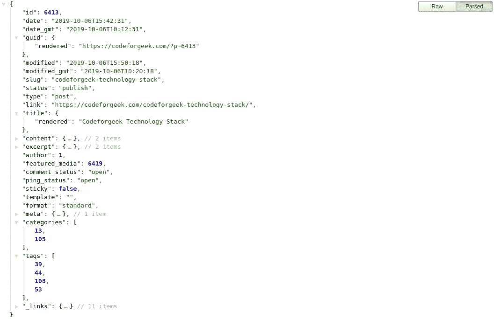

# 用 Node.js 将 WordPress 内容迁移到 MongoDB

> 原文：<https://levelup.gitconnected.com/migrating-wordpress-content-to-mongodb-with-node-js-d106ee7e846f>

WordPress 使用 MySQL 作为主要数据库来存储其内容，包括帖子、类别、标签、用户、媒体和其他元细节。WordPress 还有一个非常棒的导入/导出功能，可以生成包含内容信息的通用 XML 文件。

> *本文是 Codeforgeek 重新设计系列的一部分。*

当我们选择分离 WordPress 并使用我们的定制 Node.js 服务器提供内容时，我们需要做出一个重要的设计决定:

1.  每当用户请求时，使用 WordPress API 获取内容信息。
2.  将 WordPress 内容迁移到本地数据库。

我们选择了第二个选项。根据我们的计划和目标，为每个访问者使用 WordPress JSON API 是不可扩展的。

# 这个计划

我们需要一种简单的方法，并以有效的方式执行迁移。当我们做了一点研究时，没有简单的即插即用解决方案，特别是对于像 [MongoDB](https://codeforgeek.com/mongodb-basics-tutorial/) 这样的 NoSQL 数据库。

一种流行的方法是导出 WordPress 内容并将其提供给定制程序，定制程序依次读取、解析并注入解析后的数据到 MongoDB 中。

那似乎是太多的工作。所以我们尝试了一种新方法。

WordPress 以 API 的形式提供内容信息，也称为 WPJSON API。这非常适合我们的用例。我们所要做的就是调用 WordPress API，为 [MongoDB](https://codeforgeek.com/node-mongodb-tutorial/) 准备数据并上传到数据库。简单有效。

# WordPress API

WordPress API 很牛逼。您可以在 JSON 有效负载中查看与帖子、用户、类别、标签、媒体等相关的信息。你自己看看。

您可以使用每个对象的 ID 来获取特定的细节。很简单，真的很有用。

查看官方 WordPress API 文档。

# 迁移内容

为了迁移内容，我们在 [Node.js](https://codeforgeek.com/codeforgeek-technology-stack/) 中编写了一个简单的程序，它调用 WordPress API，格式化内容，并将其推入 MongoDB 集合。到目前为止，我们的 MongoDB 数据库中有 5 个集合。它们是:

我们迁移了用户、标签、类别、文章和课程。

让我向您展示我们在 MongoDB 集合中推送帖子的代码。

正如你在代码中看到的，我们首先调用 WordPress API 来得到 100 条记录，然后我们循环这些记录来获取标签 ID、类别 ID 和特色图片链接。一旦获取了所有内容，我们就为 MongoDB 准备了 JSON，并将其添加到集合中。

脚本运行后，我将 URL 中的页码改为 **2** ，并再次运行脚本，直到所有的帖子都添加到数据库中。我们也可以实现自动化。

标签、类别和用户也采用了类似的方法。您可能想知道媒体的详细信息在哪里？它不在数据库中，我们将图像存储在一个**亚马逊 S3 桶**中，并使用 Cloudfront CDN 提供，因此没有必要存储这些信息。

# 摘要

我希望你会发现我们的方法有趣且易于使用。这肯定比从文件中解析 XML 要好得多。如果你对此感兴趣，并且你想为此创建一个开源项目，给这篇文章一些赞，我肯定会考虑的。

【https://codeforgeek.com】最初发表于**。**